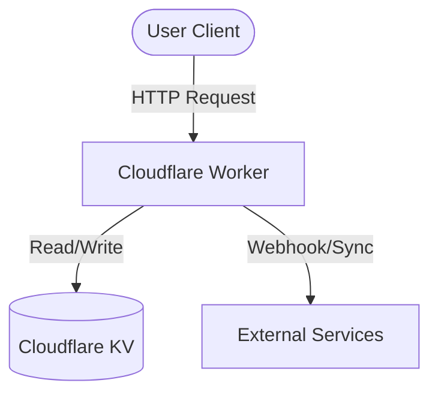

# PDP: [System/Feature Name] [New/Replace/Migrate/Fix]

*Author: Antigravity (Principal Engineer)*  
*Status: Draft / Proposed*  
*Date: [Current Date]*

---

## 1. Executive Summary & Objectives

### Problem Statement
[Briefly describe the current problem, pain points, or new opportunities.]

### Goals (In-Scope)
- [ ] Goal 1: Description of what must be achieved.
- [ ] Goal 2: Latency/performance/reliability thresholds.

### Non-Goals (Out-of-Scope)
- [ ] Non-Goal 1: What is explicitly excluded.

---

## 2. Context & Current Architecture

[Describe how the system currently works. Reference existing code/files.]
- Existing entry point: [worker.js](file:///absolute/path/to/worker.js)
- Relevant database/KV structure: [e.g., KV binding `ORDER_STATE`]

---

## 3. Proposed Architecture

[High-level overview of the new design.]

### System Architecture Diagram


### Detailed Design
#### Data Model & Storage Updates
- New KV Key Format: `order:v2:<order_id>`
- JSON Schema / Types:
```json
{
  "$schema": "http://json-schema.org/draft-07/schema#",
  "type": "object",
  "properties": {
    "id": { "type": "string" }
  }
}
```

#### API Contracts
- **POST `/api/v2/feature`**
  - **Request Body**:
    ```json
    {
      "param": "value"
    }
    ```
  - **Response**: `200 OK` or `400 Bad Request`

---

## 4. Migration & Rollout Strategy

### Rollout Strategy
[Strangler Fig Pattern, Shadow Writing, Feature Flags, etc.]

### Step-by-Step Cutover Plan
1. **Phase 1: Dual Writing**: Write to both old and new data stores; read only from the old.
2. **Phase 2: Data Backfill**: Backfill historical data to the new data store.
3. **Phase 3: Dark Launch**: Read from new data store, compare results with old, log discrepancies, but serve old.
4. **Phase 4: Full Cutover**: Read and write to new; stop writing to old.

### Rollback Plan
- **Rollback Trigger**: Discrepancy rate > 0.1%, or API error rate > 0.5% for 5 mins.
- **Rollback Procedure**: Revert DNS/feature-flag pointing to old endpoints.

---

## 5. Alternatives Considered & Trade-offs

| Alternative Option | Pros | Cons |
| :--- | :--- | :--- |
| **Option A (Status Quo)** | Zero effort, no code changes | Pain points persist, scaling issues |
| **Option B (Proposed)** | Highly scalable, clean architecture | High upfront refactoring/migration effort |
| **Option C (Alternative Tech)** | Quick initial prototype | Vendor lock-in, higher cost |

*Why Proposed was chosen:* [Rationale]

---

## 6. Cross-Cutting Concerns

- **Security**: [Auth, input validation, role checks]
- **Observability**: [Logs, metrics, trace IDs]
- **Performance**: [Caching, response size optimization]

---

## 7. Step-by-Step Execution Plan

- [ ] **Milestone 1: Infrastructure & DB Schemas**
  - [ ] Add new configuration bindings.
- [ ] **Milestone 2: Backend Changes**
  - [ ] Implement new service layer.
- [ ] **Milestone 3: Verification & Staging Testing**
  - [ ] Verify staging endpoints.
- [ ] **Milestone 4: Deployment & Cutover**

---

## 8. Verification & Test Plan

### Automated Tests
```bash
# Run local tests
npm run test
```

### Manual Verification
```bash
curl -X POST https://localhost:8787/api/v2/feature \
  -H "Content-Type: application/json" \
  -d '{"param": "value"}'
```
