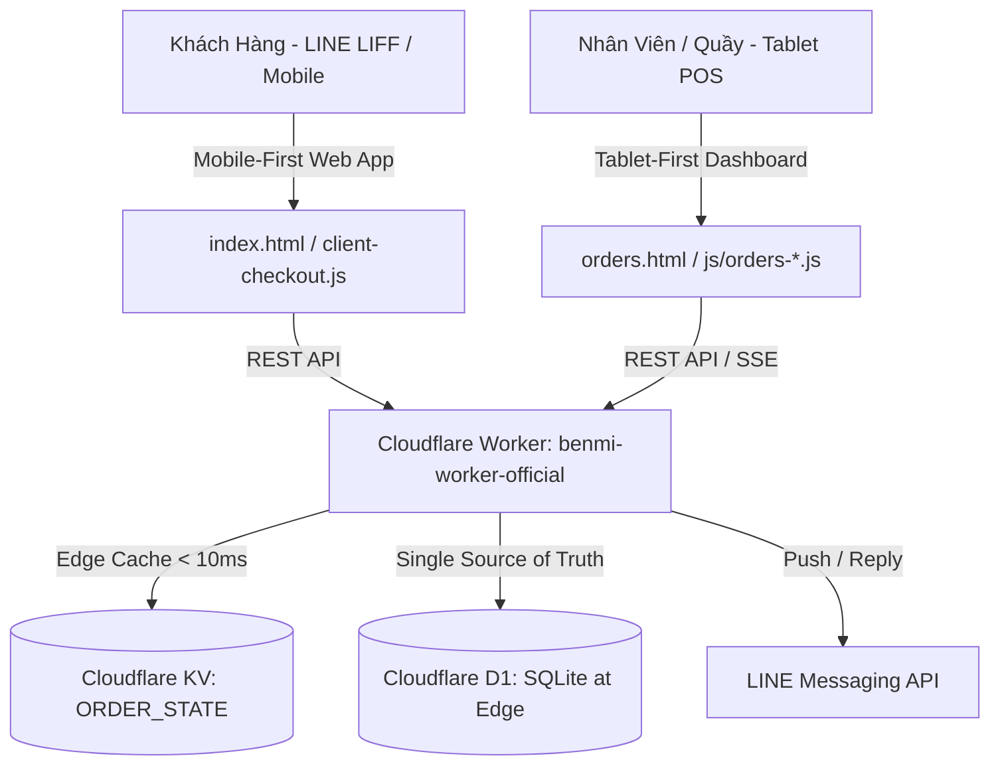

# Benmi Multi-Tenant Order Platform - AI Agent Instructions

Welcome to the **Benmi Multi-Tenant Order Platform** codebase. This document outlines the core architecture, rules, design principles, and development workflows for AI agents working in this repository.

---

## 1. System Architecture Overview

Benmi Order is a serverless, multi-tenant F&B ordering and POS platform built on the Cloudflare ecosystem:

### Directory Structure:
- **`index.html` & `index.css` & `js/client-checkout.js`**: Customer Menu web app, optimized for LINE LIFF In-App Browser (Mobile-First).
- **`orders.html` & `css/orders.css` & `js/orders-*.js`**: Real-time POS Dashboard for store staff (Tablet/iPad-First).
- **`benmi-worker-official/`**: Cloudflare Workers backend (TypeScript, D1 migrations, KV edge cache, LINE bot webhook).
- **`docs/proposals/`**: Principal Design Proposals (PDP) for major feature architectures.
- **`.agents/`**: Repository-specific AI Agent Rules and Skills.

---

## 2. Non-Negotiable Architectural Rules

### A. 1,000+ Multi-Tenant Scalability (Zero Hardcoding)
- **CẤM**: Tuyệt đối không viết code hardcode theo tên quán (VD: `if (tenantId === 'benmi')`, `if (tenantId === 'zhadantongxue')`) hoặc theo slug danh mục (VD: `if (slug === 'drinks')`).
- **BẮT BUỘC**:
  - Mọi khác biệt giữa các quán phải được cấu hình qua `tenant_config` (`features`, `allow_dine_in`, `operating_hours`...) hoặc schema CSDL.
  - Danh mục món và tùy biến phải đọc động từ `allow_customization` và `applied_modifiers` trong D1 CSDL.
  - Xem chi tiết tại: [multi-tenant-scalability.md](file:///.agents/rules/multi-tenant-scalability.md).

### B. UI/UX Design Principles
- **Bảng Quản Lý POS (`orders.html` / `css/orders.css` / `js/orders-*.js`)**:
  - **Ưu tiên 1 (Tablet / iPad First)**: Mọi nút bấm, checkbox, chip tùy biến phải có kích thước tối thiểu **48px**, dễ thao tác nhanh bằng ngón tay tại quầy.
  - **Chuẩn Đa Ngôn Ngữ (I18N)**: Bắt buộc khai báo đầy đủ key trong cả 2 từ điển `I18N["zh-TW"]` (tiếng Trung phồn thể thuần túy) và `I18N["vi"]` (tiếng Việt chuẩn POS). Tuyệt đối không pha trộn ngôn ngữ.
- **Trang Thực Đơn Khách Hàng (`index.html` / `index.css` / `js/client-checkout.js`)**:
  - **Ưu tiên 1 (Mobile / LINE LIFF First)**: Tối ưu hiển thị 1 cột, thao tác 1 tay thuận tiện, thanh toán và giỏ hàng cố định dưới đáy màn hình.
  - Xem chi tiết tại: [ui-design-principles.md](file:///.agents/rules/ui-design-principles.md).

---

## 3. Database & Caching Architecture

1. **Cloudflare D1 (SQLite at Edge)**:
   - **Production DB**: `blab-db-production` (`48479f91-eec7-4da2-b044-edaaf622f195`)
   - **Staging/Test DB**: `blab-db-test` (`c0152835-7d42-4545-8cb4-6658dfc7e97d`)
   - File migrations nằm tại `benmi-worker-official/migrations/`.
2. **Cloudflare Workers KV (`ORDER_STATE`)**:
   - `tenant:{tenant_id}:bootstrap`: Cache toàn bộ Catalog, Modifiers, Branding phục vụ khách tải menu < 10ms.
   - Khi cập nhật menu qua POS hoặc API, bắt buộc gọi `invalidateBootstrapCache(tenantId, env)` để làm mới cache.

---

## 4. Development & Deployment Workflow

| Môi Trường | Git Branch | Cloudflare Worker URL | D1 Database |
| :--- | :--- | :--- | :--- |
| **Staging** | `staging` | `https://platform-worker-staging.thuanmnc.workers.dev` | `blab-db-test` |
| **Production** | `main` | `https://benmi-worker-official.thuanmnc.workers.dev` | `blab-db-production` |

### Quy trình Release:
1. Phát triển và kiểm thử trên nhánh `staging`.
2. Deploy backend lên Staging: `npx wrangler deploy --env test`.
3. Kiểm thử tự động & thực tế trên staging API.
4. Chạy migration trên Production: `npx wrangler d1 migrations apply blab-db-production --remote`.
5. Hợp nhất `staging` vào `main` (Fast-forward) và deploy Production: `npx wrangler deploy`.
