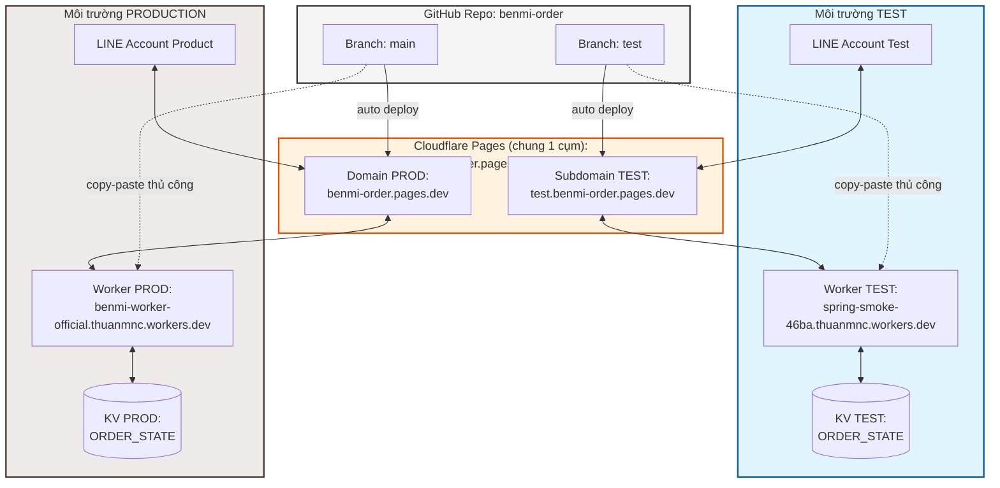
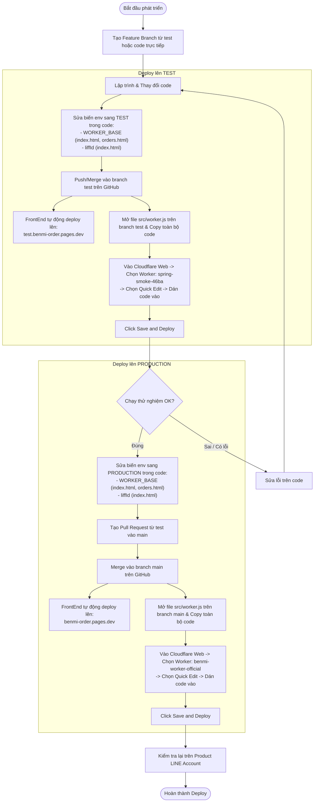

# Guideline Phát Triển & Quy Trình Deploy - Bánh Mì Order (Benmi)

Tài liệu này hướng dẫn chi tiết về cấu trúc hệ thống và quy trình triển khai (deploy) ứng dụng đặt bánh mì Benmi. Mục đích của guideline này là giúp các thành viên (kể cả không có chuyên môn sâu về kỹ thuật) có thể thực hiện deploy mà không bị nhầm lẫn giữa môi trường **Test** và **Production**.

---

## 1. Cấu Trúc Deploy Hệ Thống (System Overview)

Hệ thống của chúng ta gồm 3 thành phần chính:
1. **FrontEnd (Trang web giao diện):**
   * `index.html`: Trang bán hàng dành cho Khách hàng (Customer) để đặt món qua LINE LIFF.
   * `orders.html`: Trang nhận và xác nhận đơn hàng dành cho Nhân viên (Staff).
   * **Cách deploy:** Tự động thông qua liên kết giữa GitHub và Cloudflare Pages.
2. **BackEnd (API và xử lý dữ liệu):**
   * `benmi-worker-official/src/worker.js`: Cloudflare Worker cung cấp API cho FrontEnd và tiếp nhận Webhook từ LINE.
   * **Cách deploy:** Thủ công (Manual) bằng cách copy-paste mã nguồn trực tiếp vào Cloudflare Web Dashboard.
3. **Database (Lưu trữ):**
   * Cloudflare KV (`ORDER_STATE`): Lưu trữ thực đơn (menu), trạng thái đơn hàng, và cấu hình cửa hàng.

### Sơ đồ thành phần (Component Diagram)



---

## 2. Bảng Tra Cứu Giá Trị Môi Trường (Environment Quick Reference)

Các biến môi trường như `WORKER_BASE` và `LIFFID` hiện đang được **hardcode** (ghi trực tiếp) trong code FrontEnd. Khi deploy lên môi trường nào, bạn cần đảm bảo sửa các giá trị này cho đúng.

| Tên biến & File cần sửa | Môi trường TEST | Môi trường PRODUCTION |
| :--- | :--- | :--- |
| **WORKER_BASE**<br>*(trong `index.html` & `orders.html`)* | `https://spring-smoke-46ba.thuanmnc.workers.dev` | `https://benmi-worker-official.thuanmnc.workers.dev` |
| **liffId**<br>*(trong `index.html`)* | `2009555608-DMioljsI` | `2009560906-c5taZfiY` |
| **Branch trên GitHub** | `test` | `main` |
| **Domain FrontEnd tương ứng** | [test.benmi-order.pages.dev](https://test.benmi-order.pages.dev) | [benmi-order.pages.dev](https://benmi-order.pages.dev) |

---

## 3. Chiến Lược & Quy Trình Triển Khai (Deployment Strategy)

Quy trình phát triển và deploy tuân theo các bước sau:
1. Lập trình tính năng mới trên một nhánh phụ (feature branch) hoặc sửa trực tiếp.
2. Kiểm tra trên môi trường **TEST** (FrontEnd tự động deploy khi push/merge vào `test`, BackEnd deploy thủ công).
3. Sau khi test thành công, tạo Pull Request để merge vào `main` (PRODUCTION).
4. Kiểm tra trên môi trường **PRODUCTION**.

### Sơ đồ quy trình deploy (Deployment Flowchart)



---

## 4. Hướng Dẫn Deploy Chi Tiết Từng Bước

### Bước 1: Deploy và Kiểm thử trên môi trường TEST

1. **Cập nhật FrontEnd:**
   * Mở file `index.html` và `orders.html`.
   * Tìm dòng định nghĩa `WORKER_BASE` và sửa thành:
     ```javascript
     const WORKER_BASE = "https://spring-smoke-46ba.thuanmnc.workers.dev";
     ```
   * Mở file `index.html`, tìm hàm `initApp()` và sửa `liffId` thành:
     ```javascript
     await liff.init({ liffId: '2009555608-DMioljsI' });
     ```
   * Thực hiện commit và push/merge code vào branch `test`. Cloudflare Pages sẽ tự động nhận biết và deploy giao diện web.
2. **Cập nhật BackEnd (Worker):**
   * Mở file `benmi-worker-official/src/worker.js` trên branch `test` và copy toàn bộ nội dung file này.
   * Truy cập vào trang quản trị Cloudflare của bạn.
   * Đi tới **Workers & Pages** > Chọn Worker **`spring-smoke-46ba`**.
   * Nhấn nút **Quick Edit** ở góc trên cùng bên phải.
   * Xóa toàn bộ code cũ trong khung soạn thảo, dán code mới vừa copy vào.
   * Nhấn **Save and Deploy** (Lưu và triển khai).
3. **Thử nghiệm:**
   * Truy cập [test.benmi-order.pages.dev](https://test.benmi-order.pages.dev) bằng tài khoản LINE Test để đặt thử bánh mì và kiểm tra trang nhận đơn tại [test.benmi-order.pages.dev/orders.html](https://test.benmi-order.pages.dev/orders.html).

---

### Bước 2: Deploy lên môi trường PRODUCTION (Chạy thật)

Chỉ thực hiện bước này sau khi môi trường TEST đã hoạt động hoàn toàn ổn định và không còn lỗi.

1. **Cập nhật FrontEnd:**
   * Sửa các biến trong code trở lại giá trị Production:
     * `WORKER_BASE` trong `index.html` và `orders.html` sửa thành:
       ```javascript
       const WORKER_BASE = "https://benmi-worker-official.thuanmnc.workers.dev";
       ```
     * `liffId` trong `index.html` sửa thành:
       ```javascript
       await liff.init({ liffId: '2009560906-c5taZfiY' });
       ```
   * Tạo một **Pull Request (PR)** từ branch `test` vào branch `main`.
   * Kiểm duyệt PR (đảm bảo các biến env đã được đổi thành Production) và **Merge** vào branch `main`.
   * Cloudflare Pages sẽ tự động deploy code của branch `main` lên [benmi-order.pages.dev](https://benmi-order.pages.dev).
2. **Cập nhật BackEnd (Worker):**
   * Mở file `benmi-worker-official/src/worker.js` trên branch `main` và copy toàn bộ nội dung.
   * Truy cập vào trang quản trị Cloudflare.
   * Đi tới **Workers & Pages** > Chọn Worker **`benmi-worker-official`**.
   * Nhấn nút **Quick Edit**.
   * Xóa code cũ, dán code mới vào và nhấn **Save and Deploy**.
3. **Kiểm tra cuối cùng:**
   * Mở ứng dụng LINE Official Account thật, thử đặt món để chắc chắn hệ thống vận hành trơn tru.

---

> [!IMPORTANT]  
> **Lưu ý cực kỳ quan trọng:** Luôn luôn kiểm tra kỹ các biến `WORKER_BASE` và `liffId` trước khi push/merge code. Việc nhầm lẫn biến TEST sang PRODUCTION có thể làm gián đoạn quá trình nhận đơn hàng của cửa hàng thật, hoặc làm đơn hàng thử nghiệm nhảy vào dữ liệu thật.
