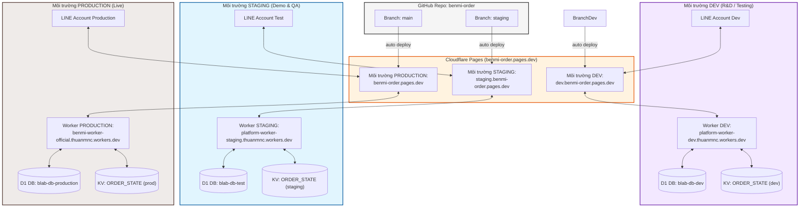
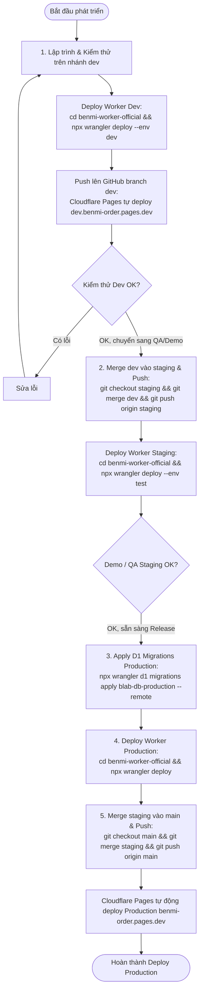

# Benmi & Multi-Tenant Order Platform Architecture & Deployment Guide

Tài liệu này mô tả chi tiết kiến trúc đa môi trường (**STAGING** và **PRODUCTION**), cấu trúc multi-tenant, cơ chế tự động nhận diện biến môi trường (Zero Manual Hardcode Config), và quy trình deploy cho hệ thống đặt món qua LINE LIFF & POS Dashboard.

---

## 1. Kiến Trúc Tổng Quan (System Architecture)

Hệ thống bao gồm 2 tầng chính:
- **FrontEnd (Cloudflare Pages):** Gồm trang đặt món khách hàng (`index.html`) và Bảng quản lý đơn hàng POS (`orders.html`), phân tách logic thành các module JS tinh gọn (`js/client-checkout.js`, `js/orders-core.js`, `js/orders-live.js`, `js/orders-menu.js`, v.v.).
- **BackEnd (Cloudflare Workers, D1 & KV):** Xử lý API, xác thực LINE Webhook, đồng bộ đơn hàng theo thời gian thực (ETag & Cache Optimization) và quản lý cấu hình từng quán (Multi-tenant).



---

## 2. Bảng Tra Cứu Môi Trường & Tự Động Nhận Diện

Hệ thống sử dụng cơ chế **Tự động nhận diện môi trường (Dynamic Environment Resolution)**, lập trình viên và quản trị viên **không cần chỉnh sửa hardcode bất kỳ biến nào trong code** khi chuyển đổi giữa Dev, Staging và Production.

| Thông số | Môi trường DEV | Môi trường STAGING | Môi trường PRODUCTION |
| :--- | :--- | :--- | :--- |
| **Mục đích** | Phát triển, thử nghiệm tính năng mới | Kiểm thử hoàn thiện & Demo quán mới | Vận hành kinh doanh thực tế |
| **Domain FrontEnd** | [dev.benmi-order.pages.dev](https://dev.benmi-order.pages.dev) | [staging.benmi-order.pages.dev](https://staging.benmi-order.pages.dev) | [benmi-order.pages.dev](https://benmi-order.pages.dev) |
| **Worker API URL (`WORKER_BASE`)** | `https://platform-worker-dev.thuanmnc.workers.dev` | `https://platform-worker-staging.thuanmnc.workers.dev` | `https://benmi-worker-official.thuanmnc.workers.dev` |
| **Default Fallback LIFF ID** | `2011224566-kLLdMjkq` | `2009555608-DMioljsI` | `2009560906-c5taZfiY` |
| **Cơ sở dữ liệu D1** | `blab-db-dev` | `blab-db-test` | `blab-db-production` |
| **Branch GitHub tương ứng** | `dev` | `staging` | `main` |

### Cơ chế Tự Động:
1. **`WORKER_BASE`**: Tự động trỏ sang `platform-worker-dev` khi chạy trên `localhost`, `127.0.0.1`, hoặc domain có chứa `dev`. Trỏ sang `platform-worker-staging` khi domain chứa `staging`/`test`. Ngược lại tự động trỏ về `benmi-worker-official` trên Production.
2. **`liffId`**: Được nạp động trực tiếp từ cấu hình của từng tenant (`tenant_config` / `/api/tenant/bootstrap`). Nếu chưa có, tự động dùng fallback LIFF ID tương ứng với môi trường.
3. **Tenant Routing**: Hỗ trợ qua tham số URL `?tenant_id=<id>` (ví dụ `?tenant_id=benmi`, `?tenant_id=zhadantongxue`, `?tenant_id=weiweibao`).

---

## 3. Quy Trình Triển Khai Chuẩn (Standard Deployment Workflow)



---

## 4. Hướng Dẫn Lệnh Deploy Chi Tiết

### A. Deploy lên STAGING:
```bash
# 1. Apply migration D1 Test / Staging (nếu có migration mới):
cd benmi-worker-official
npx wrangler d1 migrations apply blab-db-test --remote --env test

# 2. Deploy Worker Staging:
npx wrangler deploy --env test

# 3. Deploy FrontEnd Staging:
git add .
git commit -m "feat/fix: mô tả thay đổi"
git push origin staging
```

### B. Deploy lên PRODUCTION:
```bash
# 1. Apply migration D1 Production:
cd benmi-worker-official
npx wrangler d1 migrations apply blab-db-production --remote

# 2. Deploy Worker Production:
npx wrangler deploy

# 3. Merge & Deploy FrontEnd Production:
git checkout main
git merge staging
git push origin main
git checkout staging
```
