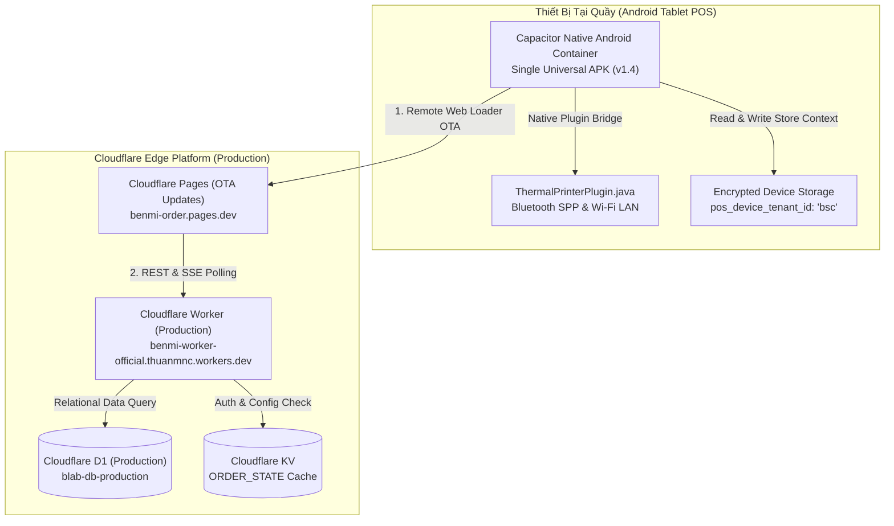

# Blab POS - Universal Multi-Tenant Android POS Tablet App

Ứng dụng POS chuyên dụng dành cho máy tính bảng (Tablet/iPad) và điện thoại Android đặt tại quầy thu ngân và khu vực bếp/pha chế F&B, được xây dựng theo kiến trúc **Universal Multi-Tenant POS Platform** phục vụ mở rộng không giới hạn cho hàng nghìn quán (1,000+ Tenants).

Ứng dụng kết hợp sức mạnh của **Cloudflare Edge Platform** (Pages + Workers + D1) với **Capacitor Native Bridge**, cho phép cập nhật tính năng tức thì qua đám mây (Over-The-Air) đồng thời duy trì khả năng in hóa đơn ESC/POS và in tem nhãn decal TSPL **chạy ngầm (silent printing)** siêu tốc qua Bluetooth Classic SPP và Mạng LAN/Wi-Fi.

---

## 1. Tính Năng Nổi Bật

- **1 Bản APK Phổ Quát Duy Nhất (Single Universal POS App)**: Chỉ build 1 file APK duy nhất cài đặt cho tất cả các quán đối tác (`benmi`, `bsc`, `zhadantongxue`, `weiweibao`...). Không cần build riêng APK cho từng quán.
- **Cập Nhật Tức Thì Không Cần Cài Lại App (Over-The-Air OTA Updates)**: App Android đóng vai trò Native Shell, nạp trực tiếp giao diện từ Cloudflare Pages Production. Khi có tính năng mới hay sửa giao diện, mọi máy tính bảng tại quầy tự động cập nhật ngay khi mở lại app.
- **Kích Hoạt Điểm Bán Tinh Giản & Bảo Mật (Store Activation & Device Pairing)**:
  - Mở app lần đầu: Nhập **Mã Quán (Tenant ID)** (ví dụ: `bsc`, `benmi`) + **Mã PIN Quản Lý** (mặc định: `12345678`).
  - Xác thực bảo mật qua API `/api/auth` của Cloudflare Worker, lưu trữ bền vững trên thiết bị (`pos_device_tenant_id`).
  - Tự động mở đúng thực đơn, đơn hàng và cấu hình máy in của quán đó ở mọi lần mở app tiếp theo.
  - Quản lý hủy ghép đôi / đổi quán được bảo vệ bằng mã PIN trong mục Cài Đặt.
- **Màn hình POS tối ưu Tablet-First**: Thao tác chạm nhanh, nút bấm lớn tối thiểu 48px, lưới đơn hàng trực quan, hỗ trợ đa ngôn ngữ (**Tiếng Việt** & **繁體中文**).
- **In hóa đơn siêu tốc (ESC/POS)**: Hỗ trợ các dòng máy in bill nhiệt 58mm và 80mm thông dụng (Xprinter, Rongta, Epson, Star Micronics, Sunmi...) qua **Mạng LAN/Wi-Fi (TCP Socket Port 9100)** hoặc **Bluetooth Classic (SPP RFCOMM)**. Hỗ trợ tự động cắt giấy (auto-cut).
- **In tem nhãn decal ly/món (TSPL)**: Hỗ trợ các dòng máy in tem nhãn mã vận đơn/decal (Aimo D520BT, Xprinter XP-365B, XP-420B, Phomemo, Munbyn...) để dán ly trà sữa, hộp thức ăn hoặc dán túi giao hàng.
- **Bộ căn chỉnh nhãn chuyên sâu (TSPL Calibration)**:
  - Tùy chỉnh lề ngang `X-Offset (mm)` và lề dọc `Y-Offset (mm)` giúp xử lý triệt để hiện tượng lệch lề, cắt chữ trên các dòng máy in ngàm kéo cân 2 bên vào giữa như Aimo D520BT.
  - Tùy chọn độ phân giải **203 DPI** (8 dots/mm) và **300 DPI** (11.8 dots/mm) giúp con tem căng đầy 100% diện tích, không bị co nhỏ.
  - Giao diện tem không viền tối giản (Borderless), đường kẻ phân cách thanh lịch theo đúng chuẩn F&B hiện đại.
- **In tự động ngầm (Auto-Print on New Order)**: Tự động in hóa đơn thu ngân và phiếu order bếp ngay khi có đơn hàng mới từ khách đặt qua LINE LIFF.
- **Cơ chế chống in trùng (Deduplication)**: Ngăn chặn in lặp lại cùng một mã đơn hàng.

---

## 2. Kiến Trúc Universal Multi-Tenant POS Platform



---

## 3. Cấu Trúc Thư Mục Dự Án

```
apps/android-pos/
├── android/                             # Dự án Android Studio gốc
│   ├── app/
│   │   ├── build.gradle                 # Cấu hình build APK, versionCode 5 & versionName 1.4
│   │   └── src/main/
│   │       ├── AndroidManifest.xml      # Khai báo quyền Bluetooth & Network
│   │       └── java/com/benmi/pos/
│   │           ├── MainActivity.java    # Khởi tạo WebView & đăng ký Plugin
│   │           ├── ThermalPrinterPlugin.java # Native Bridge kết nối Bluetooth & TCP
│   │           ├── EscPosBitmapConverter.java # Biên dịch bitmap sang mã ESC/POS
│   │           └── TsplBitmapConverter.java   # Biên dịch bitmap sang mã TSPL
│   └── local.properties                 # Đường dẫn Android SDK (gitignored)
├── dist/                                # Thư mục web assets được sync từ root repo
├── build.sh                             # Script tự động copy HTML, CSS, JS sang dist/
├── capacitor.config.ts                  # Cấu hình Capacitor App (Remote Cloud Loader OTA)
├── package.json                         # Scripts build:apk, sync:prod, sync:dev
├── benmi-pos-universal-v1.4.apk         # File cài đặt APK Universal mới nhất
└── README.md                            # Tài liệu hướng dẫn này
```

---

## 4. Hướng Dẫn Cài Đặt & Phát Triển (Development Setup)

### A. Yêu Cầu Môi Trường (Prerequisites)
- **Node.js**: Phiên bản 18.x hoặc 20.x trở lên
- **Java Development Kit (JDK)**: JDK 17 hoặc JDK 21
- **Android SDK**: Android API 34 / 35, Command-line Tools và Build-Tools
- **Android Studio** (Tùy chọn, khuyến nghị cho việc debug Native)

### B. Cài Đặt Thư Viện
Tại thư mục gốc dự án hoặc thư mục `apps/android-pos`:
```bash
cd apps/android-pos
npm install
```

### C. Đồng Bộ Web Assets & Cấu Hình Môi Trường
Mỗi khi chỉnh sửa giao diện hoặc logic tại `orders.html`, `js/`, `css/`:
* Đồng bộ bản **Production**:
  ```bash
  npm run sync:prod
  ```
* Đồng bộ bản **Dev**:
  ```bash
  npm run sync:dev
  ```

### D. Build File Cài Đặt APK
1. Tạo file `android/local.properties` chỉ định đường dẫn Android SDK (nếu chưa có):
   ```properties
   sdk.dir=/Users/<username>/Library/Android/sdk
   ```
2. Build file APK Universal Production:
   ```bash
   cd apps/android-pos
   npm run build:apk
   ```
3. File APK xuất ra tại:
   `android/app/build/outputs/apk/debug/app-debug.apk`
   Đã được copy sẵn thành `apps/android-pos/benmi-pos-universal-v1.4.apk`.

### E. Cài Đặt Lên Thiết Bị Thật Qua Cáp USB (ADB)
```bash
adb install -r benmi-pos-universal-v1.4.apk
```

---

## 5. Hướng Dẫn Kích Hoạt & Cấu Hình Máy In Trong Ứng Dụng

### A. Kích Hoạt Điểm Bán Lần Đầu (Store Activation)
1. Mở ứng dụng lần đầu trên máy tính bảng POS. Màn hình **Kích Hoạt Điểm Bán** sẽ tự động hiển thị.
2. Nhập **Mã Quán (Tenant ID)**:
   - Quán BSC: `bsc`
   - Quán Benmi: `benmi`
   - Quán Khác: Nhập đúng mã định danh tenant đã đăng ký.
3. Nhập **Mã PIN Quản Lý**: Nhập mã PIN (mặc định ban đầu trong CSDL: `12345678`).
4. Bấm **Kích Hoạt Điểm Bán & Bắt Đầu**. Hệ thống sẽ xác thực và tự động mở đúng Dashboard của quán đó.

### B. Cấu Hình Máy In Hóa Đơn Bill (ESC/POS)
Vào biểu tượng **⚙️ Cài đặt (Settings) > Xuất Đơn & Máy In**:
1. **Giao thức in**: Chọn `🧾 ESC/POS (Hóa đơn cuộn 58-80mm)`.
2. **Kênh kết nối**:
   - **Mạng LAN/Wi-Fi**: Nhập địa chỉ IP máy in (ví dụ: `192.168.1.100`) và cổng Port `9100`.
   - **Bluetooth**: Ghép đôi máy in trong Cài đặt Bluetooth của Android trước, sau đó bấm biểu tượng làm mới và chọn tên máy in từ danh sách thả xuống.
3. **Khổ giấy**: Chọn `80mm` hoặc `58mm`.
4. Bấm **🖨️ In Thử Nghiệm (Test Print)** để kiểm tra.

### C. Cấu Hình Máy In Tem Nhãn Decal (TSPL) - Ví dụ máy Aimo D520BT / Xprinter
1. **Giao thức in**: Chọn `🏷️ TSPL (Máy in tem nhãn/decal)`.
2. **Kích thước nhãn**: Chọn khổ tem phù hợp (ví dụ: `40 x 30 mm` cho tem ly trà sữa, hoặc `自訂尺寸 (Custom)`).
3. **Chế độ in**: Chọn `🥤 Tem dán từng ly/từng món (1 tem/mỗi món)` hoặc `📦 Tem tổng đơn hàng`.
4. **Căn chỉnh nâng cao (Khắc phục lệch lề / cắt chữ)**:
   - **Lề ngang X (mm)**: Với máy in có ngàm cân giữa như Aimo D520BT, nhập giá trị từ `3` đến `5` mm để dịch nội dung sang phải, giúp chữ không bị cắt lẹm mép trái.
   - **Độ phân giải (DPI)**: Nếu tem in ra bị co bé chỉ chiếm 1 phần con tem, đổi từ `203 DPI` sang `300 DPI` để nội dung căng đầy toàn bộ mặt tem.
5. Bấm **🖨️ In Thử Nghiệm** và kiểm tra độ vừa vặn của con tem.
6. Bấm **💾 Lưu Cấu Hình Máy In**.

### D. Đổi Quán / Hủy Ghép Đôi Thiết Bị (Unlink Store)
1. Vào **⚙️ Cài Đặt (Settings)**, cuộn xuống mục **Điểm Bán & Thiết Bị**.
2. Bấm **Đổi Quán / Hủy Ghép Đôi**.
3. Nhập mã PIN quản lý của quán để xác nhận. Ứng dụng sẽ xóa trạng thái liên kết và đưa máy về màn hình kích hoạt ban đầu.

---

## 6. Lịch Sử Các Phiên Bản (Changelog)

| Phiên Bản | Ngày Phát Hành | Điểm Nâng Cấp Chính |
| :--- | :--- | :--- |
| **v1.4** | 03/09/2026 | - **Kiến Trúc Universal Multi-Tenant POS**: 1 bản APK chung cho 1,000+ quán.<br>- **Remote Cloud Loader (OTA)**: Nạp trực tiếp từ Cloudflare Pages Production, cập nhật tức thì không cần cài lại app.<br>- **Store Activation Flow**: Màn hình kích hoạt điểm bán (Tenant ID + PIN quản lý).<br>- **Store Pairing & Unlink Management**: Quản lý và bảo vệ đổi quán bằng mã PIN trong mục Cài Đặt.<br>- Hỗ trợ môi trường phân tách bằng build flavors (`sync:prod` vs `sync:dev`). |
| **v1.3** | 02/09/2026 | - Bổ sung bộ căn chỉnh tem nhãn TSPL chuyên sâu: Lề ngang `X-Offset`, lề dọc `Y-Offset`.<br>- Tùy chọn Độ phân giải `203 DPI` vs `300 DPI`.<br>- Bỏ khung viền chữ nhật bao quanh tem, chuyển sang phong cách Borderless tối giản. |
| **v1.2** | 30/08/2026 | - Tích hợp giao thức in nhãn nhiệt TSPL (`TsplBitmapConverter.java`).<br>- Hỗ trợ in tem ly/món riêng lẻ (`item_stickers`) cho quầy pha chế/bếp.<br>- Hỗ trợ các kích thước tem chuẩn 40x30mm, 50x30mm, 76x130mm, 100x150mm. |
| **v1.1** | 29/08/2026 | - Bổ sung in nhiệt không dây qua Bluetooth Classic SPP RFCOMM.<br>- Tự động tìm kiếm và hiển thị danh sách thiết bị Bluetooth đã ghép đôi.<br>- Hỗ trợ cấu hình độc lập 2 trạm (Quầy Thu Ngân & Khu Vực Bếp). |
| **v1.0** | 28/08/2026 | - Phiên bản nền tảng đầu tiên đóng gói POS qua Capacitor.<br>- Hỗ trợ in hóa đơn ESC/POS ngầm qua mạng TCP Socket (Port 9100).<br>- Tự động cắt giấy và chống in trùng đơn hàng. |
