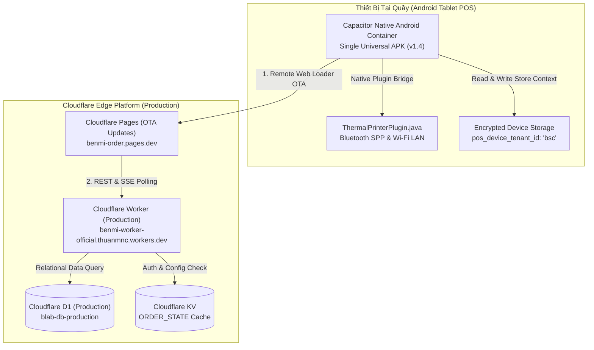

# Blab POS - Universal Multi-Tenant Android POS Tablet App

Ứng dụng POS chuyên dụng dành cho máy tính bảng (Tablet/iPad) và điện thoại Android đặt tại quầy thu ngân và khu vực bếp/pha chế F&B, được xây dựng theo kiến trúc **Universal Multi-Tenant POS Platform** phục vụ mở rộng không giới hạn cho hàng nghìn quán (1,000+ Tenants).

Ứng dụng kết hợp sức mạnh của **Cloudflare Edge Platform** (Pages + Workers + D1) với **Capacitor Native Bridge**, cho phép cập nhật tính năng tức thì qua đám mây (Over-The-Air) đồng thời duy trì khả năng in hóa đơn ESC/POS và in tem nhãn decal TSPL **chạy ngầm (silent printing)** siêu tốc qua Bluetooth Classic SPP và Mạng LAN/Wi-Fi.

---

## 1. Tính Năng Nổi Bật

- **1 Bản APK Phổ Quát Duy Nhất (Single Universal POS App)**: Chỉ build 1 file APK duy nhất cài đặt cho tất cả các quán đối tác (`benmi`, `bsc`, `zhadantongxue`, `weiweibao`...). Không cần build riêng APK cho từng quán.
- **Cập Nhật Tức Thì Không Cần Cài Lại App (Over-The-Air OTA Updates)**: App Android đóng vai trò Native Shell, nạp trực tiếp giao diện từ Cloudflare Pages Production. Khi có tính năng mới hay sửa giao diện, mọi máy tính bảng tại quầy tự động cập nhật ngay khi mở lại app.
- **Kích Hoạt Điểm Bán Tinh Giản & Bảo Mật (Store Activation & Device Pairing)**:
  - Mở app lần đầu: Nhập **Mã Quán (Tenant ID)** (ví dụ: `bsc`, `benmi`) + **Mã PIN Quản Lý** (mặc định: `12345678`).
  - Xác thực bảo mật qua API `/api/auth` của Cloudflare Worker, lưu trữ bền vững trên thiết bị (`pos_device_tenant_id`).
  - Tự động mở đúng thực đơn, đơn hàng và cấu hình máy in của quán đó ở mọi lần mở app tiếp theo.
  - Quản lý hủy ghép đôi / đổi quán được bảo vệ bằng mã PIN trong mục Cài Đặt.
- **Màn hình POS tối ưu Tablet-First**: Thao tác chạm nhanh, nút bấm lớn tối thiểu 48px, lưới đơn hàng trực quan, hỗ trợ đa ngôn ngữ (**Tiếng Việt** & **繁體中文**).
- **In hóa đơn siêu tốc (ESC/POS)**: Hỗ trợ các dòng máy in bill nhiệt 58mm và 80mm thông dụng (Xprinter, Rongta, Epson, Star Micronics, Sunmi...) qua **Mạng LAN/Wi-Fi (TCP Socket Port 9100)** hoặc **Bluetooth Classic (SPP RFCOMM)**. Hỗ trợ tự động cắt giấy (auto-cut).
- **In tem nhãn decal ly/món (TSPL)**: Hỗ trợ các dòng máy in tem nhãn mã vận đơn/decal (Aimo D520BT, Xprinter XP-365B, XP-420B, Phomemo, Munbyn...) để dán ly trà sữa, hộp thức ăn hoặc dán túi giao hàng.
- **Bộ căn chỉnh nhãn chuyên sâu (TSPL Calibration)**:
  - Tùy chỉnh lề ngang `X-Offset (mm)` và lề dọc `Y-Offset (mm)` giúp xử lý triệt để hiện tượng lệch lề, cắt chữ trên các dòng máy in ngàm kéo cân 2 bên vào giữa như Aimo D520BT.
  - Tùy chọn độ phân giải **203 DPI** (8 dots/mm) và **300 DPI** (11.8 dots/mm) giúp con tem căng đầy 100% diện tích, không bị co nhỏ.
  - Giao diện tem không viền tối giản (Borderless), đường kẻ phân cách thanh lịch theo đúng chuẩn F&B hiện đại.
- **In tự động ngầm (Auto-Print on New Order)**: Tự động in hóa đơn thu ngân và phiếu order bếp ngay khi có đơn hàng mới từ khách đặt qua LINE LIFF.
- **Cơ chế chống in trùng (Deduplication)**: Ngăn chặn in lặp lại cùng một mã đơn hàng.

---

## 2. Kiến Trúc Universal Multi-Tenant POS Platform



---

## 3. Cấu Trúc Thư Mục Dự Án

```
apps/android-pos/
├── android/                             # Dự án Android Studio gốc
│   ├── app/
│   │   ├── build.gradle                 # Cấu hình build APK, versionCode 18 & versionName 1.9.0
│   │   └── src/main/
│   │       ├── AndroidManifest.xml      # Khai báo quyền Bluetooth & Network
│   │       └── java/com/benmi/pos/
│   │           ├── MainActivity.java    # Khởi tạo WebView & đăng ký Plugin
│   │           ├── ThermalPrinterPlugin.java # Native Bridge kết nối Bluetooth & TCP
│   │           ├── EscPosBitmapConverter.java # Biên dịch bitmap sang mã ESC/POS
│   │           └── TsplBitmapConverter.java   # Biên dịch bitmap sang mã TSPL
│   └── local.properties                 # Đường dẫn Android SDK (gitignored)
├── dist/                                # Thư mục web assets được sync từ root repo
├── build.sh                             # Script tự động copy HTML, CSS, JS sang dist/
├── capacitor.config.ts                  # Cấu hình Capacitor App (Hỗ trợ dev-local, pilot, prod)
├── package.json                         # Scripts build:apk, build:apk:dev, build:apk:pilot, sync:dev
├── blab-pos-dev-v0.9.3.apk              # File cài đặt APK Dev mới nhất (v0.9.3)
├── blab-pos-pilot-v0.9.3.apk            # File cài đặt APK Pilot mới nhất (v0.9.3)
└── README.md                            # Tài liệu hướng dẫn này
```

---

## 4. Hướng Dẫn Cài Đặt & Phát Triển (Development Setup)

### A. Yêu Cầu Môi Trường (Prerequisites)
- **Node.js**: Phiên bản 18.x hoặc 20.x trở lên
- **Java Development Kit (JDK)**: JDK 17 hoặc JDK 21
- **Android SDK**: Android API 34 / 35, Command-line Tools và Build-Tools
- **Android Studio** (Tùy chọn, khuyến nghị cho việc debug Native)

### B. Cài Đặt Thư Viện
Tại thư mục gốc dự án hoặc thư mục `apps/android-pos`:
```bash
cd apps/android-pos
npm install
```

### C. Đồng Bộ Web Assets & Cấu Hình Môi Trường
Mỗi khi chỉnh sửa giao diện hoặc logic tại `orders.html`, `js/`, `css/`:
* Đồng bộ bản **Production**:
  ```bash
  npm run sync:prod
  ```
* Đồng bộ bản **Dev**:
  ```bash
  npm run sync:dev
  ```

### D. Build File Cài Đặt APK
1. Tạo file `android/local.properties` chỉ định đường dẫn Android SDK (nếu chưa có):
   ```properties
   sdk.dir=/Users/<username>/Library/Android/sdk
   ```
2. Build file APK:
   * **Bản Dev (Remote Cloud Loader OTA qua Cloudflare Pages Dev)**:
     ```bash
     cd apps/android-pos
     npm run build:apk:dev
     ```
     Gradle xuất APK tại `android/app/build/outputs/apk/debug/app-debug.apk`.
     Được sao chép thành `blab-pos-dev-v1.8.5.apk` và `blab-pos-dev.apk`. Nạp trực tiếp từ `https://dev.benmi-order.pages.dev/orders.html`. **Khi có thay đổi CSS/JS/HTML chỉ cần push lên nhánh dev, máy POS mở lại app là tự cập nhật ngay lập tức (không cần cài lại APK)!**
   * **Bản Offline Local (Bundled Web Assets trong APK)**:
     ```bash
     cd apps/android-pos
     npm run build:apk:local
     ```
   * **Bản Production (Universal OTA Remote Loader)**:
     ```bash
     cd apps/android-pos
     npm run build:apk
     ```
     Xuất ra tại: `apps/android-pos/benmi-pos-universal-v1.8.1.apk` (hoặc `benmi-pos-universal.apk`).

### E. Cài Đặt Lên Thiết Bị Thật Qua Cáp USB (ADB)
```bash
adb install -r blab-pos-dev-v1.8.5.apk
# Hoặc cài bản universal production:
adb install -r benmi-pos-universal-v1.8.1.apk
```

---

## 5. Hướng Dẫn Kích Hoạt & Cấu Hình Máy In Trong Ứng Dụng

### A. Kích Hoạt Điểm Bán Lần Đầu (Store Activation)
1. Mở ứng dụng lần đầu trên máy tính bảng POS. Màn hình **Kích Hoạt Điểm Bán** sẽ tự động hiển thị.
2. Nhập **Mã Quán (Tenant ID)**:
   - Quán BSC: `bsc`
   - Quán Benmi: `benmi`
   - Quán Khác: Nhập đúng mã định danh tenant đã đăng ký.
3. Nhập **Mã PIN Quản Lý**: Nhập mã PIN (mặc định ban đầu trong CSDL: `12345678`).
4. Bấm **Kích Hoạt Điểm Bán & Bắt Đầu**. Hệ thống sẽ xác thực và tự động mở đúng Dashboard của quán đó.

### B. Cấu Hình Máy In Hóa Đơn Bill (ESC/POS)
Vào biểu tượng **⚙️ Cài đặt (Settings) > Máy in & xuất vé**:
1. **Giao thức in**: Chọn `🧾 ESC/POS (Hóa đơn cuộn 58-80mm)`.
2. **Kênh kết nối**:
   - **Mạng LAN/Wi-Fi**: Nhập địa chỉ IP máy in (ví dụ: `192.168.1.100`) và cổng Port `9100`.
   - **Bluetooth**: Ghép đôi máy in trong Cài đặt Bluetooth của Android trước, sau đó bấm biểu tượng làm mới và chọn tên máy in từ danh sách thả xuống.
3. **Khổ giấy**: Chọn `80mm` hoặc `58mm`.
4. Bấm **🖨️ In Thử Nghiệm (Test Print)** để kiểm tra.

### C. Cấu Hình Máy In Tem Nhãn Decal (TSPL) - Ví dụ máy Aimo D520BT / Xprinter
1. **Giao thức in**: Chọn `🏷️ TSPL (Máy in tem nhãn/decal)`.
2. **Kích thước nhãn**: Chọn khổ tem phù hợp (ví dụ: `40 x 30 mm` cho tem ly trà sữa, hoặc `自訂尺寸 (Custom)`).
3. **Chế độ in**: Chọn `🥤 Tem dán từng ly/từng món (1 tem/mỗi món)` hoặc `📦 Tem tổng đơn hàng`.
4. **Căn chỉnh nâng cao (Khắc phục lệch lề / cắt chữ)**:
   - **Lề ngang X (mm)**: Với máy in có ngàm cân giữa như Aimo D520BT, nhập giá trị từ `3` đến `5` mm để dịch nội dung sang phải, giúp chữ không bị cắt lẹm mép trái.
   - **Độ phân giải (DPI)**: Nếu tem in ra bị co bé chỉ chiếm 1 phần con tem, đổi từ `203 DPI` sang `300 DPI` để nội dung căng đầy toàn bộ mặt tem.
5. Bấm **🖨️ In Thử Nghiệm** và kiểm tra độ vừa vặn của con tem.
6. Bấm **💾 Lưu Cấu Hình Máy In**.

### D. Đổi Quán / Hủy Ghép Đôi Thiết Bị (Unlink Store)
1. Vào **⚙️ Cài Đặt (Settings)**, cuộn xuống mục **Điểm Bán & Thiết Bị**.
2. Bấm **Đổi Quán / Hủy Ghép Đôi**.
3. Nhập mã PIN quản lý của quán để xác nhận. Ứng dụng sẽ xóa trạng thái liên kết và đưa máy về màn hình kích hoạt ban đầu.

---

## 6. Lịch Sử Các Phiên Bản (Changelog)

| Phiên Bản | Ngày Phát Hành | Điểm Nâng Cấp Chính |
| :--- | :--- | :--- |
| **v0.9.3** | 13/09/2026 | - **Phiên bản v0.9.3 (Code 21)**: Build đồng thời bản **Dev** (`com.benmi.pos.dev`) và **Production Pilot** (`com.benmi.pos.pilot`).<br>- **Bổ sung Đếm Ngược Đơn Đặt Giờ trong Chi Tiết Đơn (Tab Live)**: Bổ sung Card Giờ Hẹn & Đếm Ngược Số Phút Còn Lại (`review-timing-card` và `review-meta-pickup`) với cơ chế cập nhật thời gian thực không cần đóng mở lại modal, phân biệt màu cảnh báo theo độ khẩn cấp (cam `<= 15m`, đỏ `quá giờ`), tuân thủ chuẩn SVG tối giản không icon trẻ con.<br>- **Biên Tập Tùy Chọn & Món 2 Cấp (Tầng 1 & Tầng 2)**: Tách biệt hoàn toàn `sec-flavor` khỏi Catalog, hỗ trợ toàn diện thêm/sửa/xóa nhóm tùy chọn, chuyển đổi linh hoạt `Đơn tuyển` / `Đa tuyển`, và thêm sửa nhanh các lựa chọn và nhánh phụ không dùng popup prompt. |
| **v0.9.2** | 12/09/2026 | - **Phiên bản v0.9.2 (Code 20)**: Build đồng thời bản **Dev** (`com.benmi.pos.dev`) và **Production Pilot** (`com.benmi.pos.pilot`).<br>- **Khắc phục triệt để căn giữa nút thẻ đơn hàng (`.tile-action-btn`)**: Loại bỏ `padding-left: 26px !important` gây lệch chữ sang phải; chuẩn hóa padding đối xứng đều 2 bên `padding: 6px 8px !important;` giúp các nút Đã xong, Đã lấy (`已取餐`), Đã TT canh giữa hoàn hảo 100%. |
| **v0.9.1** | 12/09/2026 | - **Phiên bản v0.9.1 (Code 19)**: Build đồng thời bản **Dev** (`com.benmi.pos.dev`) và **Production Pilot** (`com.benmi.pos.pilot`).<br>- **Tối ưu hóa In Bill & Xuất Vé**: Tính tổng giá dòng cho món xSố lượng (`qty * unitPrice + modifiers`); canh cùng dòng `#order.key` và `外帶自取` sang phải; thụt dòng đồng bộ `  ↳ ` cho toàn bộ các phần (phần 1, 2, 3); in kèm tùy biến khẩu vị toàn menu (`口味與客製設定`).<br>- **Tối ưu hóa UI POS**: Đồng bộ tiêu đề mục con Cài đặt; đưa ghi chú khách hàng lên cùng dòng với `顧客備註`; cân bằng thị giác nút "Đã chuẩn bị xong". |
| **v1.9.0** | 10/09/2026 | - **Phiên bản Dev 1.9**: Nâng cấp `versionCode: 18`, `versionName: "1.9.0"`.<br>- Tích hợp toàn bộ tối ưu hóa mới nhất từ commit `2f248c7`: Tối ưu giao diện menu POS và xem lại đơn hàng (Order review UI), hỗ trợ tùy chỉnh món của Jiangjiejie.<br>- Đóng gói trực tiếp web assets chạy độc lập cho môi trường Dev với `appId: com.benmi.pos.dev`, tiêu đề `Blab POS Dev` và trỏ API về Cloudflare Worker Dev. |
| **v1.8.5** | 08/09/2026 | - **Bản Dev hỗ trợ Remote Cloud Loader OTA toàn diện**: Cấu hình `APP_ENV=dev` nạp trực tiếp giao diện từ Cloudflare Pages Dev (`https://dev.benmi-order.pages.dev/orders.html`). Khi cập nhật CSS/JS/HTML chỉ cần push lên nhánh `dev`, máy tính bảng mở hoặc reload lại app là tự động nhận giao diện mới nhất 100% mà không cần build hay cài lại APK.<br>- Bổ sung lệnh `build:apk:local` và `sync:local` cho trường hợp muốn đóng gói web assets offline nội bộ. |
| **v1.8.4** | 08/09/2026 | - **Tối ưu toàn diện nút thao tác đơn hàng trên Tablet**: Khắc phục hiện tượng nhảy dòng, tăng khoảng cách cột `order-detail-grid`, padding `6px 8px`, chống rớt/tràn chữ trên màn hình cảm ứng POS.<br>- **Sửa lỗi cuộn modal**: Tự động đưa vị trí cuộn về đầu trang (top) khi mở bất kỳ modal nào.<br>- **Chuẩn hóa I18N tiếng Trung phồn thể thuần túy**: Chuyển nút xem đơn hàng sang "查看訂單" (thay cho "Review 訂單").<br>- **Tối ưu bộ lọc Lịch sử đơn hàng**: Khắc phục sự kiện click trùng lặp trên các tab trạng thái. |
| **v1.8.1** | 06/09/2026 | - **Sửa triệt để độ rộng ô đơn giá & hiển thị trọn vẹn tên món ăn**: Khóa cứng kích thước ô nhập giá tiền (`width: 60px !important`, căn giữa) và ô nhãn phụ (`width: 76px !important`), loại bỏ hoàn toàn sự can thiệp của class form toàn cục; giải phóng không gian tối đa cho ô Tên món (`flex: 2 1 200px !important`), hiển thị trọn vẹn 100% không bị che khuất chữ. |
| **v1.8** | 06/09/2026 | - **Đồng bộ toàn diện UI/UX trang Lịch sử & Quản lý thực đơn**: Chuẩn hóa phong cách tối giản, sử dụng icon SVG Lucide nét mảnh.<br>- **Công cụ tìm kiếm & lọc nâng cao cho Lịch sử đơn hàng**: Tìm kiếm đa trường (món ăn, số bàn, mã đơn, ghi chú) không dấu tiếng Việt (`removeVietnameseDiacritics`), tự động mở nhóm ngày có kết quả khớp, bộ lọc trạng thái linh hoạt (Tất cả, Hoàn tất, Đã hủy).<br>- **Tối ưu hiển thị danh sách món thực đơn**: Thu gọn ô nhập đơn giá (52px), tổ chức cụm trường chính `.menu-item-main-fields` và tự động xuống hàng linh hoạt, xử lý triệt để hiện tượng tràn nút/chữ trên màn hình hẹp/tablet ngang dọc. |
| **v1.7** | 06/09/2026 | - **Hiển thị trạng thái máy in độc lập theo từng trạm**: Tách riêng pill trạng thái kết nối cho Quầy thu ngân & Khu bếp trong cài đặt máy in.<br>- **Tối ưu Trung tâm Hỗ trợ (Support Center)**: Thiết kế lại modal liên hệ theo từng chủ đề (Hỗ trợ kỹ thuật, Nâng cấp gói, Lịch sử dữ liệu > 30 ngày) với giao diện chuẩn UI/UX, phân cấp thị giác hiện đại và icon SVG thương mại.<br>- **Thống nhất Cài đặt cửa hàng**: Gộp thông tin cửa hàng vào tab Thông tin & Khách hàng, ẩn các nút hành động dư thừa khi ở tab máy in.<br>- Đổi tiêu đề cài đặt thành "Máy in & xuất vé" chuẩn hóa ngữ nghĩa POS. |
| **v1.6** | 05/09/2026 | - Bộ chuyển đổi giao diện UI Mode Switcher (Sidebar navigation) & KDS Module.<br>- Cập nhật toàn diện icon SVG thương mại Lucide thay thế emoji trên POS. |
| **v1.4** | 03/09/2026 | - **Kiến Trúc Universal Multi-Tenant POS**: 1 bản APK chung cho 1,000+ quán.<br>- **Remote Cloud Loader (OTA)**: Nạp trực tiếp từ Cloudflare Pages Production, cập nhật tức thì không cần cài lại app.<br>- **Store Activation Flow**: Màn hình kích hoạt điểm bán (Tenant ID + PIN quản lý).<br>- **Store Pairing & Unlink Management**: Quản lý và bảo vệ đổi quán bằng mã PIN trong mục Cài Đặt.<br>- Hỗ trợ môi trường phân tách bằng build flavors (`sync:prod` vs `sync:dev`). |
| **v1.3** | 02/09/2026 | - Bổ sung bộ căn chỉnh tem nhãn TSPL chuyên sâu: Lề ngang `X-Offset`, lề dọc `Y-Offset`.<br>- Tùy chọn Độ phân giải `203 DPI` vs `300 DPI`.<br>- Bỏ khung viền chữ nhật bao quanh tem, chuyển sang phong cách Borderless tối giản. |
| **v1.2** | 30/08/2026 | - Tích hợp giao thức in nhãn nhiệt TSPL (`TsplBitmapConverter.java`).<br>- Hỗ trợ in tem ly/món riêng lẻ (`item_stickers`) cho quầy pha chế/bếp.<br>- Hỗ trợ các kích thước tem chuẩn 40x30mm, 50x30mm, 76x130mm, 100x150mm. |
| **v1.1** | 29/08/2026 | - Bổ sung in nhiệt không dây qua Bluetooth Classic SPP RFCOMM.<br>- Tự động tìm kiếm và hiển thị danh sách thiết bị Bluetooth đã ghép đôi.<br>- Hỗ trợ cấu hình độc lập 2 trạm (Quầy Thu Ngân & Khu Vực Bếp). |
| **v1.0** | 28/08/2026 | - Phiên bản nền tảng đầu tiên đóng gói POS qua Capacitor.<br>- Hỗ trợ in hóa đơn ESC/POS ngầm qua mạng TCP Socket (Port 9100).<br>- Tự động cắt giấy và chống in trùng đơn hàng. |


### Build v1.8.6 (09/09/2026)

- `versionCode 15`, sửa lệnh tiến giấy trước khi cắt bill ESC/POS.
- Canvas bill tự tăng chiều cao theo số dòng; thêm hướng dẫn Việt/Trung và minh hoạ căn chỉnh trong hướng dẫn máy in.
- `blab-pos-dev-v1.8.6.apk`: tải giao diện từ `https://dev.benmi-order.pages.dev/orders.html`. Phần hướng dẫn và canvas mới chỉ xuất hiện khi web dev được cập nhật.
- `blab-pos-local-v1.8.6.apk`: đóng gói giao diện hiện tại để kiểm tra ngay toàn bộ thay đổi, không cập nhật giao diện qua OTA.
- Hai bản cùng application ID `com.benmi.pos`; chỉ cài một bản trên thiết bị.
- Muốn cài đè v1.8.5 và giữ dữ liệu phải ký bằng cùng keystore của bản cũ. Không gỡ ứng dụng đang sử dụng chỉ để vượt lỗi chữ ký.

Bản build trên máy này dùng khóa debug mới (lưu cục bộ, không commit: `android/local-signing/debug-v1.8.6.keystore`), khác chữ ký v1.8.5. Hai APK v1.8.6 đã build không cài đè v1.8.5; cần ký lại bằng khóa cũ để cập nhật tại chỗ.
