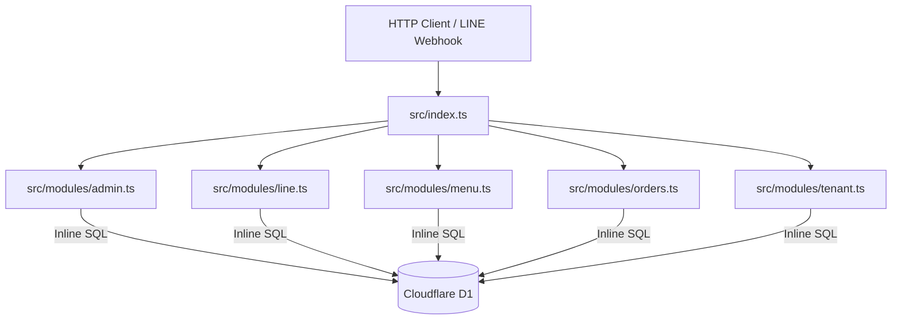
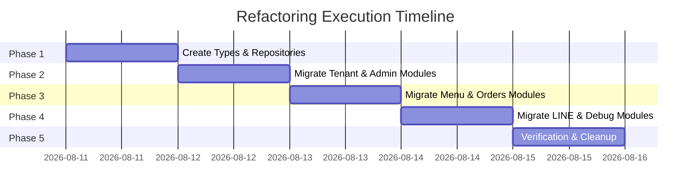

# PDP: Refactoring Data Access Layer (DAL) for benmi-worker-official

- **Status**: Proposal / Draft for Review
- **Author**: Principal Engineer (Antigravity AI)
- **Target System**: `benmi-worker-official` (Cloudflare Workers + D1 Database)
- **Date**: 2026-08-11

---

## 1. Executive Summary & Objectives

### Problem Statement
Currently, `benmi-worker-official` performs database operations by writing raw SQL queries with `env.DB.prepare(...)` directly inside HTTP route handlers and business logic files (`src/modules/menu.ts`, `src/modules/orders.ts`, `src/modules/line.ts`, `src/modules/tenant.ts`, `src/modules/admin.ts`, `src/modules/debug.ts`). 

This pattern leads to several architectural problems:
1. **Tight Coupling**: Business logic is tightly coupled with D1 SQL syntax, table schemas, and row-level mapping logic.
2. **Duplicate Code**: SQL queries and type casting (`.first<any>()`, `.all()`) are duplicated across multiple endpoints and modules (e.g. `orders` table queried in both `orders.ts` and `line.ts`).
3. **Low Maintainability & Testability**: Mocking `env.DB` for unit tests requires mocking `.prepare().bind().first()` strings everywhere. Modifying database schema requires updating multiple scattered files.

### Objectives (In-Scope)
- **Extract a clean Data Access Layer (DAL)**: Introduce domain-driven Repositories (`TenantRepository`, `MenuRepository`, `OrdersRepository`, `PendingActionsRepository`).
- **Zero Runtime Dependencies**: Use native D1 query execution to preserve `< 5ms` worker startup and 0KB bundle bloat.
- **Strict Typing**: Provide strong TypeScript interfaces and DTOs for all database inputs and query results.
- **Encapsulate Batch & Transactions**: Encapsulate multi-statement D1 batch operations (`env.DB.batch(...)`) inside atomic repository methods (e.g., `replaceFullMenu`).
- **100% Backward Compatibility**: Ensure zero regressions or API changes for external clients (LINE Webhook, LIFF, Admin Portal).

---

## 2. Context & Current Architecture

### Current Module Breakdown
Currently, 6 files interact directly with Cloudflare D1 (`env.DB`):

| File | DB Tables Accessed | Direct Operations |
|---|---|---|
| [`tenant.ts`](file:///Users/duccao/Documents/benmi-order/benmi-worker-official/src/modules/tenant.ts) | `tenant_config` | `SELECT * FROM tenant_config WHERE tenant_id = ?` |
| [`admin.ts`](file:///Users/duccao/Documents/benmi-order/benmi-worker-official/src/modules/admin.ts) | `tenants`, `tenant_config` | `SELECT JOIN`, `INSERT/UPDATE ON CONFLICT`, `UPDATE is_active` |
| [`menu.ts`](file:///Users/duccao/Documents/benmi-order/benmi-worker-official/src/modules/menu.ts) | `menu_categories`, `menu_items` | `SELECT`, `UPDATE stock`, `DELETE` + `INSERT` batch |
| [`orders.ts`](file:///Users/duccao/Documents/benmi-order/benmi-worker-official/src/modules/orders.ts) | `orders` | `SELECT`, `INSERT`, `UPDATE status`, `COUNT` |
| [`line.ts`](file:///Users/duccao/Documents/benmi-order/benmi-worker-official/src/modules/line.ts) | `pending_actions`, `orders` | `SELECT/DELETE pending_actions`, `SELECT/UPDATE orders` |
| [`debug.ts`](file:///Users/duccao/Documents/benmi-order/benmi-worker-official/src/modules/debug.ts) | `orders`, `tenants` | `SELECT COUNT(*)` |



---

## 3. Proposed Architecture

### High-Level Design
We introduce a Repository layer organized under `src/db/`. A central `Repositories` container object will be created from `env.DB` and passed or accessed cleanly.

```mermaid
graph TD
    Client[HTTP Client / LINE Webhook] --> Index[src/index.ts]
    
    subgraph Service / Module Layer
        AdminModule[src/modules/admin.ts]
        LineModule[src/modules/line.ts]
        MenuModule[src/modules/menu.ts]
        OrdersModule[src/modules/orders.ts]
        TenantModule[src/modules/tenant.ts]
    end

    subgraph Data Access Layer (DAL)
        Repos[createRepositories env.DB]
        TenantRepo[TenantRepository]
        MenuRepo[MenuRepository]
        OrdersRepo[OrdersRepository]
        ActionsRepo[PendingActionsRepository]
        
        Repos --> TenantRepo
        Repos --> MenuRepo
        Repos --> OrdersRepo
        Repos --> ActionsRepo
    end

    AdminModule --> Repos
    LineModule --> Repos
    MenuModule --> Repos
    OrdersModule --> Repos
    TenantModule --> Repos
    
    TenantRepo -- Prepared SQL & Batch --> D1[(Cloudflare D1)]
    MenuRepo -- Prepared SQL & Batch --> D1
    OrdersRepo -- Prepared SQL & Batch --> D1
    ActionsRepo -- Prepared SQL & Batch --> D1
```

### File & Directory Layout

```
benmi-worker-official/src/
├── db/
│   ├── index.ts                     # Container function createRepositories(db: D1Database)
│   ├── types.ts                     # Database entity definitions & DTOs
│   └── repositories/
│       ├── tenant.repository.ts     # Tenant & TenantConfig queries
│       ├── menu.repository.ts       # Menu Categories & Menu Items queries + Batch
│       ├── orders.repository.ts     # Orders CRUD & status updates & counts
│       └── pendingActions.repository.ts # Line Webhook pending state operations
```

### Domain Repositories Specification

#### 1. `TenantRepository` (`src/db/repositories/tenant.repository.ts`)
- `findByTenantId(tenantId: string): Promise<TenantConfigRow | null>`
- `listAllTenants(): Promise<TenantWithConfigRow[]>`
- `findTenantWithConfig(tenantId: string): Promise<{ tenant: TenantRow; config: TenantConfigRow } | null>`
- `upsertTenantAndConfig(tenantData: UpsertTenantDTO): Promise<void>`
- `deactivateTenant(tenantId: string): Promise<void>`

#### 2. `MenuRepository` (`src/db/repositories/menu.repository.ts`)
- `getMenuCategoriesAndItems(tenantId: string): Promise<{ categories: MenuCategoryRow[]; items: MenuItemRow[] }>`
- `updateItemStockStatus(tenantId: string, itemId: string, outOfStockUntil: string | null): Promise<boolean>`
- `replaceFullMenu(tenantId: string, categories: MenuCategoryInput[], items: MenuItemInput[]): Promise<void>` (Uses `env.DB.batch(...)`)

#### 3. `OrdersRepository` (`src/db/repositories/orders.repository.ts`)
- `createOrder(orderData: CreateOrderDTO): Promise<OrderRow>`
- `getOrdersByTenant(tenantId: string, limit?: number): Promise<OrderRow[]>`
- `getOrderById(tenantId: string, orderId: string): Promise<OrderRow | null>`
- `updateOrderStatus(tenantId: string, orderId: string, status: string, note?: string): Promise<boolean>`
- `getWaitingOrdersCount(tenantId: string): Promise<number>`
- `countTotalOrders(): Promise<number>`

#### 4. `PendingActionsRepository` (`src/db/repositories/pendingActions.repository.ts`)
- `getPendingAction(tenantId: string, userId: string): Promise<PendingActionRow | null>`
- `savePendingAction(tenantId: string, userId: string, actionType: string, payload: any): Promise<void>`
- `deletePendingAction(tenantId: string, userId: string): Promise<void>`

---

## 4. Migration & Rollout Strategy

To achieve **Zero-Downtime** and **Zero-Regression**, we will execute the refactoring in non-breaking incremental steps:



### Cutover Plan
1. **Phase 1: DAL Foundation**
   Create `src/db/types.ts`, `src/db/index.ts`, and repository classes. Existing code continues running unchanged.
2. **Phase 2: Module-by-Module Refactoring**
   Refactor each module to replace `env.DB.prepare` calls with calls to `repos.<domain>.<method>`.
3. **Phase 3: Automated & Manual Verification**
   Verify all build targets, unit tests, and API endpoints using `wrangler dev`.

---

## 5. Alternatives Considered & Trade-offs

| Alternative | Description | Pros | Cons | Recommendation |
|---|---|---|---|---|
| **Option A (Chosen)** | Native D1 Repository Pattern | 0KB bundle overhead, ultra-fast cold starts, clean abstraction, total control over D1 batching. | Requires writing raw SQL inside repository methods. | **Selected** |
| **Option B** | Drizzle ORM (`drizzle-orm/d1`) | Auto-generated types, type-safe query builder, no raw SQL strings. | Adds bundle size (~30-50KB), increases Worker init time slightly, requires schema sync. | Rejected |
| **Option C** | Kysely Query Builder (`kysely-d1`) | Type-safe SQL builder without full ORM weight. | Extra dependency, learning curve for team. | Rejected |
| **Option D** | Status Quo | No refactoring work needed. | High technical debt, duplicate SQL, hard to test. | Rejected |

---

## 6. Cross-Cutting Concerns

- **Type Safety**: All DB rows returned as strongly-typed interfaces instead of `any`.
- **Prepared Statement Efficiency**: Parameter binding `?` used consistently across all repositories to prevent SQL injection and enable D1 query cache optimization.
- **Error Handling**: Database errors caught and wrapped with contextual diagnostic logs in repositories before re-throwing or returning clean results.
- **Observability**: Structured error logging formatted with `[RepositoryName:MethodName]`.

---

## 7. Step-by-Step Execution Plan

- [ ] **PR 1: DAL Core Infrastructure**
  - Create `src/db/types.ts` containing D1 row entity interfaces & DTOs.
  - Create `src/db/repositories/*.ts` and `src/db/index.ts`.
- [ ] **PR 2: Migrate Tenant & Admin Modules**
  - Update `src/modules/tenant.ts` to use `TenantRepository`.
  - Update `src/modules/admin.ts` to use `TenantRepository`.
- [ ] **PR 3: Migrate Menu & Orders Modules**
  - Update `src/modules/menu.ts` to use `MenuRepository`.
  - Update `src/modules/orders.ts` to use `OrdersRepository`.
- [ ] **PR 4: Migrate LINE Webhook & Debug Modules**
  - Update `src/modules/line.ts` to use `PendingActionsRepository` and `OrdersRepository`.
  - Update `src/modules/debug.ts` to use `OrdersRepository` and `TenantRepository`.
- [ ] **PR 5: Build & System Verification**
  - Run `npx tsc --noEmit` and `wrangler dev` to verify clean compilation and API responses.

---

## 8. Verification & Test Plan

### Automated Verification
1. **TypeScript Typecheck**:
   ```bash
   cd benmi-worker-official && npx tsc --noEmit
   ```
2. **Wrangler Dev Build & Dry Run**:
   ```bash
   cd benmi-worker-official && npx wrangler dev --dry-run
   ```

### Manual Verification Matrix

| Endpoint | Method | Expected Result |
|---|---|---|
| `/api/health` | GET | `200 OK` with active tenant |
| `/api/menu` | GET | `200 OK` returns category & items array |
| `/api/orders` | GET | `200 OK` returns order list for tenant |
| `/api/orders/waiting-count` | GET | `200 OK` returns `{ count: N }` |
| `/api/admin/tenants` | GET | `200 OK` with `X-Admin-Key` header |
