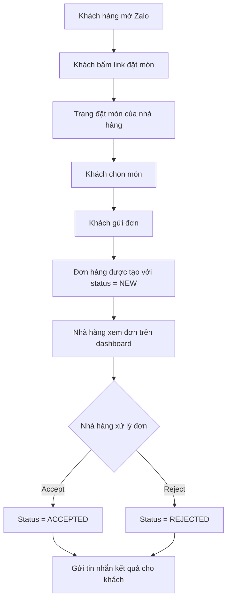
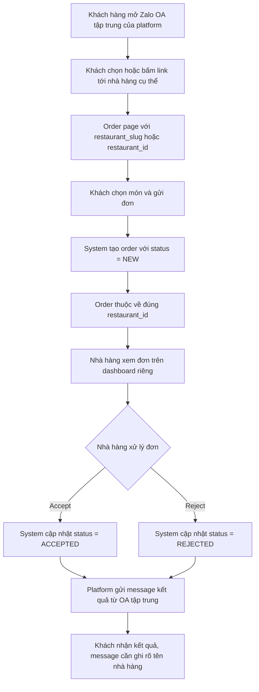
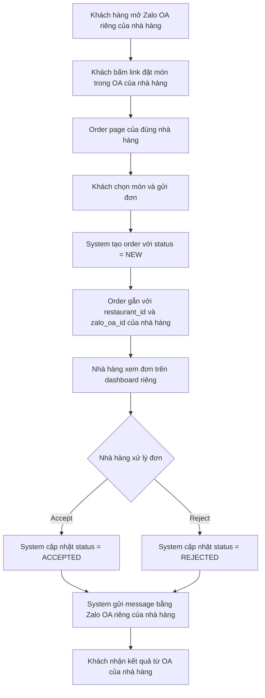
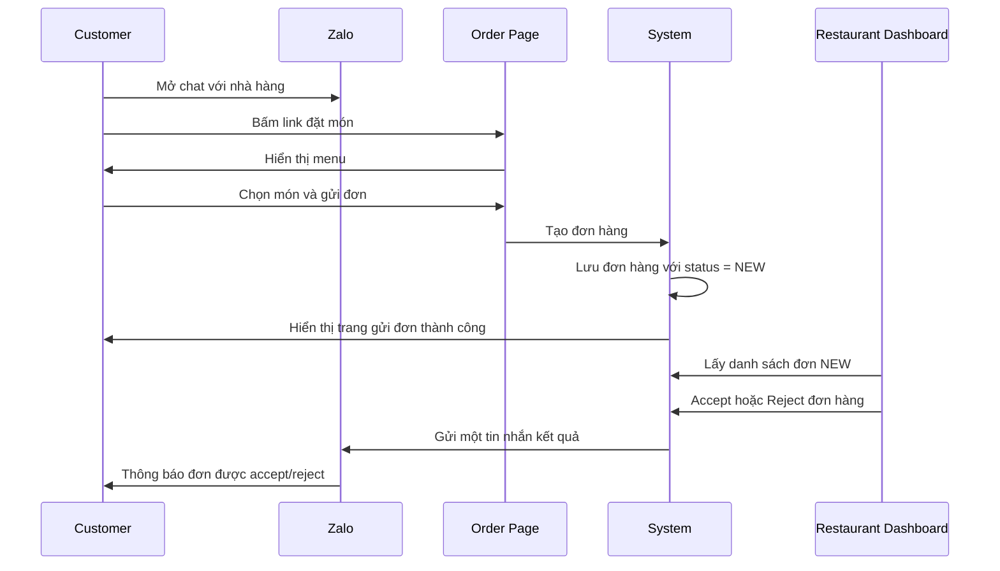
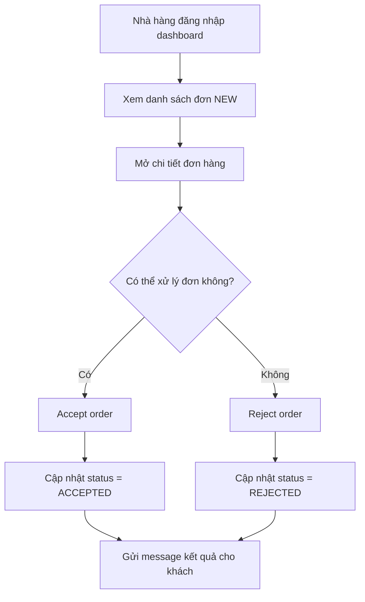
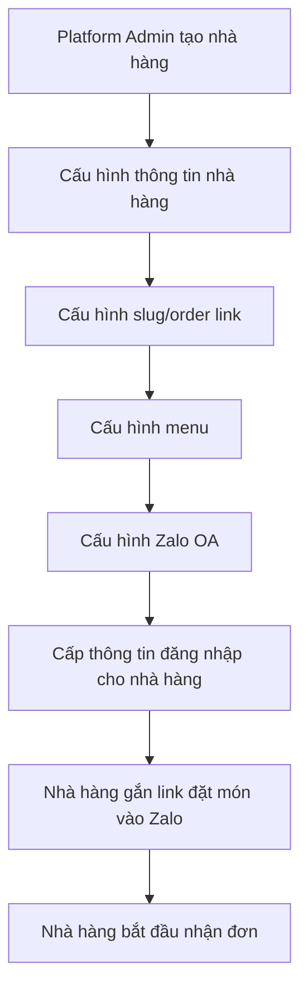
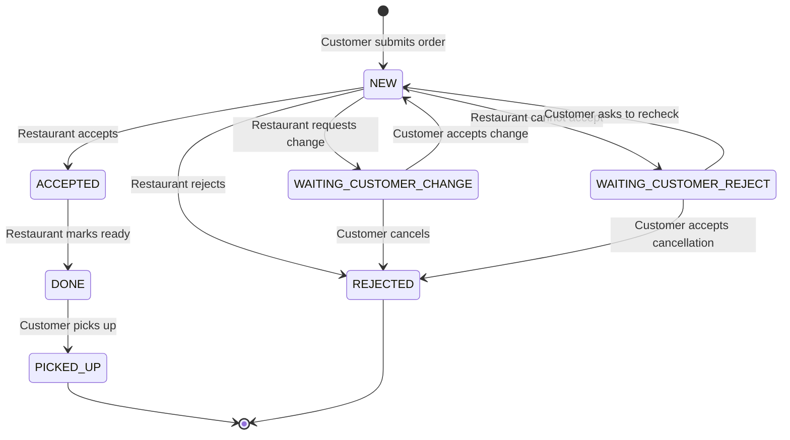

# 02-product-flow.md

# Product Flow / Luồng sản phẩm

## 1. Mục đích tài liệu

Tài liệu này mô tả cách người dùng tương tác với hệ thống đặt món multi-tenant cho nhà hàng/quán ăn.

Tài liệu tập trung vào **luồng sản phẩm và trải nghiệm người dùng**, chưa đi sâu vào chi tiết kỹ thuật như database schema, API design hoặc CI/CD. Các chi tiết kỹ thuật sẽ được mô tả trong `03-technical-design.md`.

Mục tiêu của tài liệu này là làm rõ:

- Ai là người sử dụng hệ thống?
- Mỗi người dùng sẽ thao tác theo flow nào?
- Những màn hình nào cần có trong MVP?
- Trạng thái đơn hàng thay đổi như thế nào?
- Khi nào hệ thống gửi tin nhắn cho khách hàng?
- Những edge cases nào cần được xử lý từ góc nhìn sản phẩm?

MVP là Zalo-first. LINE chỉ được nhắc tới như một kênh có thể hỗ trợ sau này hoặc để so sánh với hệ thống hiện tại.

---

## 2. Tổng quan flow sản phẩm

Flow chính của sản phẩm là:

1. Khách hàng mở Zalo của nhà hàng hoặc của platform.
2. Khách hàng được dẫn tới trang đặt món của đúng nhà hàng.
3. Khách hàng chọn món và gửi đơn.
4. Đơn hàng được lưu với trạng thái `NEW`.
5. Nhà hàng xem đơn hàng mới trên dashboard.
6. Nhà hàng xác nhận hoặc từ chối đơn.
7. Hệ thống gửi **một tin nhắn duy nhất** cho khách hàng để thông báo kết quả.



Nguyên tắc quan trọng trong MVP:

- Không gửi tin nhắn nội dung đơn hàng ngay sau khi khách tạo đơn.
- Chỉ gửi một tin nhắn sau khi nhà hàng accept hoặc reject đơn hàng.
- Nội dung chi tiết đơn hàng nên được hiển thị trên web/app thay vì gửi qua message.
- Đơn hàng phải được lưu thành công ngay cả khi việc gửi tin nhắn thất bại.

---

## 2.1 Sub-flow A: Nhà hàng sử dụng chung một Zalo OA tập trung

Trong mô hình này, Zalo OA được quản lý bởi platform. Các nhà hàng không cần tự tạo hoặc vận hành Zalo OA riêng ở giai đoạn đầu.

Platform sẽ dùng một Zalo OA tập trung để:

- Dẫn khách hàng tới trang đặt món của từng nhà hàng.
- Gửi tin nhắn kết quả sau khi nhà hàng accept hoặc reject đơn.
- Quản lý cấu hình messaging, token, template và message policy tập trung.

Flow này phù hợp nếu mục tiêu là onboarding nhà hàng nhanh, giảm effort setup cho từng chủ quán, và kiểm soát tốt chi phí/message quota ở giai đoạn MVP.



### Đặc điểm chính

- Zalo OA thuộc platform.
- Nhà hàng không cần tự quản lý OA.
- Mỗi order vẫn phải gắn với `restaurant_id` rõ ràng.
- Message gửi cho khách nên ghi rõ tên nhà hàng để tránh nhầm lẫn.
- Platform kiểm soát message format và quota.
- Nhà hàng chỉ cần sử dụng dashboard để xử lý đơn.

### Ưu điểm

- Onboarding nhà hàng nhanh hơn.
- Ít phụ thuộc vào việc từng chủ quán biết cấu hình Zalo OA.
- Token, webhook, message template được quản lý tập trung.
- Phù hợp cho MVP hoặc giai đoạn thử nghiệm.

### Nhược điểm / Rủi ro

- Branding của nhà hàng yếu hơn vì message được gửi từ OA của platform.
- Khách hàng có thể không cảm thấy đang tương tác trực tiếp với nhà hàng.
- Cần routing chính xác để tránh gửi nhầm link/order giữa các nhà hàng.
- Nếu OA tập trung gặp vấn đề, nhiều nhà hàng có thể bị ảnh hưởng cùng lúc.

---

## 2.2 Sub-flow B: Nhà hàng sử dụng Zalo OA riêng

Trong mô hình này, mỗi nhà hàng/chủ quán có Zalo OA riêng. Platform sẽ tích hợp với OA của từng nhà hàng để nhận context và gửi message.

Flow này phù hợp nếu nhà hàng muốn giữ branding riêng, muốn khách hàng tương tác trực tiếp với OA của mình, hoặc về sau cần vận hành độc lập hơn.



### Đặc điểm chính

- Mỗi nhà hàng có Zalo OA riêng.
- Message gửi cho khách đến từ OA của chính nhà hàng.
- Platform cần lưu và quản lý cấu hình tích hợp của từng OA.
- Mỗi order cần gắn với cả `restaurant_id` và thông tin messaging account tương ứng.
- Khi gửi message, system phải chọn đúng OA/token của nhà hàng đó.

### Ưu điểm

- Branding tốt hơn vì khách nhận message từ OA của nhà hàng.
- Phù hợp hơn với nhà hàng đã có Zalo OA và tệp khách hàng riêng.
- Một OA gặp lỗi sẽ ít ảnh hưởng tới nhà hàng khác hơn.
- Dễ mở rộng theo hướng mỗi nhà hàng tự quản lý kênh giao tiếp của mình.

### Nhược điểm / Rủi ro

- Onboarding phức tạp hơn vì từng nhà hàng cần có OA riêng.
- Cần cấu hình token, webhook hoặc quyền gửi message cho từng OA.
- Cần xử lý refresh token / token không còn hợp lệ theo từng nhà hàng.
- Platform phải đảm bảo không dùng nhầm OA/token giữa các tenant.
- Việc support kỹ thuật cho chủ quán có thể tốn effort hơn.

---

## 2.3 So sánh hai mô hình Zalo OA

| Tiêu chí | OA tập trung do platform quản lý | OA riêng của từng nhà hàng |
|---|---|---|
| Tốc độ onboarding | Nhanh hơn | Chậm hơn |
| Branding nhà hàng | Yếu hơn | Tốt hơn |
| Vận hành token/webhook | Đơn giản hơn | Phức tạp hơn |
| Rủi ro ảnh hưởng dây chuyền | Cao hơn nếu OA tập trung lỗi | Thấp hơn, lỗi tách theo từng OA |
| Phù hợp cho MVP | Rất phù hợp | Phù hợp nếu nhà hàng đã có OA |
| Tenant isolation | Cần routing bằng `restaurant_id` thật chặt | Cần routing bằng `restaurant_id` + `zalo_oa_id` |
| Chi phí/support ban đầu | Thấp hơn | Cao hơn |

Khuyến nghị cho MVP:

- Nếu muốn test nhanh: ưu tiên **OA tập trung do platform quản lý**.
- Nếu nhà hàng đã có OA và muốn giữ branding riêng: hỗ trợ **OA riêng của nhà hàng** như một option.
- Dù dùng mô hình nào, order vẫn phải được lưu theo `restaurant_id` và dashboard của nhà hàng chỉ được xem dữ liệu của chính nhà hàng đó.

---

## 3. User Roles / Vai trò người dùng

## 3.1 Customer / Khách hàng

Khách hàng là người đặt món.

Khách hàng không cần tạo tài khoản riêng trong MVP. Danh tính của khách hàng được lấy từ Zalo nếu có thể.

Khách hàng có thể:

- Mở trang đặt món từ Zalo.
- Xem menu của nhà hàng.
- Chọn món.
- Gửi đơn hàng.
- Xem trạng thái đơn hàng trên trang web.
- Nhận tin nhắn kết quả sau khi nhà hàng accept hoặc reject đơn.

Khách hàng không thể:

- Xem đơn hàng của người khác.
- Truy cập dashboard của nhà hàng.
- Tự thay đổi trạng thái đơn hàng sau khi đã gửi.

---

## 3.2 Restaurant / Chủ quán hoặc nhân viên vận hành

Trong MVP, hệ thống chưa cần phân biệt từng nhân viên riêng lẻ. Một nhà hàng có thể sử dụng một tài khoản hoặc một cơ chế đăng nhập chung cho quán.

Nhà hàng có thể:

- Đăng nhập vào dashboard của quán.
- Xem danh sách đơn hàng đang chờ xử lý.
- Mở chi tiết đơn hàng.
- Accept đơn hàng.
- Reject đơn hàng.
- Xem lịch sử đơn hàng cơ bản.

Nhà hàng không thể:

- Xem dữ liệu của nhà hàng khác.
- Xử lý đơn hàng không thuộc nhà hàng của mình.
- Thay đổi cấu hình platform-level.

---

## 3.3 Platform Admin

Platform Admin là người vận hành hệ thống.

Platform Admin có thể:

- Tạo nhà hàng mới.
- Cấu hình thông tin cơ bản của nhà hàng.
- Cấu hình menu ban đầu.
- Cấu hình Zalo OA tập trung hoặc Zalo OA riêng cho nhà hàng.
- Cấp thông tin đăng nhập cho nhà hàng.
- Kiểm tra log cơ bản khi có lỗi.

Trong MVP, Platform Admin có thể quản lý menu thủ công cho nhà hàng nếu chưa xây dựng tính năng để chủ quán tự quản lý menu.

---

## 4. Customer Flow / Luồng khách hàng

## 4.1 Mục tiêu

Khách hàng có thể đặt món nhanh chóng từ Zalo mà không cần nhắn tin thủ công cho nhà hàng.

## 4.2 Flow chi tiết

1. Khách hàng mở Zalo của nhà hàng.
2. Khách hàng bấm vào link hoặc menu item “Đặt món”.
3. Hệ thống mở trang đặt món của nhà hàng.
4. Khách hàng xem danh sách món ăn.
5. Khách hàng chọn món và số lượng.
6. Khách hàng xem lại giỏ hàng.
7. Khách hàng gửi đơn.
8. Hệ thống hiển thị màn hình “Đơn hàng đã được gửi”.
9. Đơn hàng chuyển sang trạng thái `NEW`.
10. Khách hàng chờ nhà hàng xác nhận.
11. Sau khi nhà hàng accept hoặc reject, khách hàng nhận một tin nhắn kết quả qua Zalo.



## 4.3 Trải nghiệm sau khi gửi đơn

Sau khi khách hàng gửi đơn, hệ thống nên hiển thị rõ:

- Đơn hàng đã được gửi thành công.
- Nhà hàng đang kiểm tra đơn.
- Khách hàng sẽ nhận thông báo sau khi nhà hàng xác nhận hoặc từ chối.
- Mã đơn hàng hoặc thông tin nhận diện đơn hàng.
- Link để xem lại trạng thái đơn hàng nếu cần.

Ví dụ nội dung hiển thị:

```text
Đơn hàng của bạn đã được gửi.
Nhà hàng đang kiểm tra và sẽ phản hồi trong thời gian sớm nhất.
Vui lòng chờ thông báo xác nhận qua Zalo.
```

## 4.4 Message policy cho khách hàng

Trong MVP, hệ thống chỉ gửi message trong trường hợp sau:

- Nhà hàng đã accept đơn hàng.
- Nhà hàng đã reject đơn hàng.

Hệ thống không gửi message ngay sau khi khách hàng tạo đơn, nhằm giảm số lượng push message và tránh vượt giới hạn miễn phí của nền tảng messaging.

Ví dụ message khi accept:

```text
Đơn hàng của bạn đã được nhà hàng xác nhận.
Vui lòng đến nhận món hoặc chờ hướng dẫn tiếp theo từ nhà hàng.
```

Ví dụ message khi reject:

```text
Rất tiếc, đơn hàng của bạn chưa thể được xác nhận.
Vui lòng kiểm tra lại với nhà hàng hoặc thử đặt món khác.
```

Nội dung chi tiết đơn hàng không nên gửi qua message trong MVP. Chi tiết đơn hàng nên được hiển thị trên order status page.

---

## 5. Restaurant Flow / Luồng nhà hàng

## 5.1 Mục tiêu

Nhà hàng có thể xem và xử lý đơn hàng mới một cách đơn giản, không cần đọc từng tin nhắn thủ công từ khách.

## 5.2 Flow chi tiết

1. Nhà hàng đăng nhập vào dashboard của quán.
2. Dashboard hiển thị danh sách đơn hàng `NEW`.
3. Nhà hàng mở chi tiết đơn hàng.
4. Nhà hàng kiểm tra món, số lượng, ghi chú của khách.
5. Nhà hàng chọn `Accept` nếu có thể xử lý đơn.
6. Nhà hàng chọn `Reject` nếu không thể xử lý đơn.
7. Hệ thống cập nhật trạng thái đơn hàng.
8. Hệ thống gửi một tin nhắn kết quả cho khách hàng qua Zalo.



## 5.3 Dashboard behavior

Dashboard của nhà hàng nên tập trung vào đơn hàng cần xử lý ngay.

Màn hình chính nên hiển thị:

- Danh sách đơn hàng `NEW`.
- Thời gian tạo đơn.
- Mã đơn hàng.
- Tổng số món.
- Tổng tiền nếu có.
- Ghi chú ngắn nếu có.
- Nút mở chi tiết đơn.

Dashboard có thể sử dụng polling trong MVP.

Nguyên tắc polling:

- Không polling quá nhanh để tránh tốn request.
- Chỉ polling khi dashboard đang mở.
- Có thể polling mỗi 5–10 giây trong MVP.
- Sau khi nhà hàng accept/reject, dashboard nên refresh ngay.

## 5.4 Order detail behavior

Trang chi tiết đơn hàng nên hiển thị:

- Mã đơn hàng.
- Thời gian tạo đơn.
- Danh sách món.
- Số lượng từng món.
- Tổng tiền.
- Ghi chú của khách nếu có.
- Trạng thái hiện tại.
- Nút `Accept`.
- Nút `Reject`.

Nếu đơn hàng không còn ở trạng thái `NEW`, hệ thống không nên cho phép accept/reject lại.

---

## 6. Platform Admin Flow / Luồng platform admin

## 6.1 Mục tiêu

Platform Admin có thể onboarding một nhà hàng mới vào hệ thống và chuẩn bị để nhà hàng bắt đầu nhận đơn.

## 6.2 Flow chi tiết

1. Platform Admin tạo nhà hàng mới.
2. Platform Admin nhập thông tin cơ bản của nhà hàng.
3. Platform Admin cấu hình slug hoặc đường dẫn đặt món.
4. Platform Admin cấu hình menu ban đầu.
5. Platform Admin cấu hình thông tin Zalo OA hoặc messaging integration.
6. Platform Admin tạo/cấp thông tin đăng nhập cho nhà hàng.
7. Platform Admin gửi link đặt món cho nhà hàng để gắn vào Zalo.
8. Nhà hàng bắt đầu nhận đơn.



## 6.3 Onboarding information

Thông tin tối thiểu cần có khi tạo nhà hàng:

- Tên nhà hàng.
- Restaurant slug.
- Trạng thái hoạt động.
- Menu ban đầu.
- Thông tin liên hệ nếu cần.
- Zalo OA hoặc messaging account liên quan.
- Tài khoản đăng nhập cho nhà hàng.

Có hai mô hình onboarding messaging cần được cân nhắc: dùng Zalo OA tập trung do platform quản lý, hoặc dùng Zalo OA riêng của từng nhà hàng. Với MVP, OA tập trung giúp onboarding nhanh hơn; OA riêng phù hợp hơn nếu nhà hàng muốn giữ branding và đã có OA sẵn.

---

## 7. Screens / Danh sách màn hình MVP

## 7.1 Customer screens

### Order Page

Màn hình chính để khách hàng xem menu và chọn món.

Nội dung chính:

- Tên nhà hàng.
- Danh sách món.
- Giá tiền.
- Trạng thái món còn/hết nếu có.
- Nút thêm vào giỏ hàng.

### Cart Page / Order Review

Màn hình để khách hàng kiểm tra lại đơn trước khi gửi.

Nội dung chính:

- Danh sách món đã chọn.
- Số lượng.
- Tổng tiền.
- Ghi chú nếu có.
- Nút gửi đơn.

### Order Submitted Page

Màn hình hiển thị sau khi khách gửi đơn thành công.

Nội dung chính:

- Thông báo đơn đã được gửi.
- Mã đơn hàng.
- Trạng thái `NEW`.
- Hướng dẫn chờ nhà hàng xác nhận.
- Link xem trạng thái đơn hàng nếu cần.

### Order Status Page

Màn hình để khách hàng xem lại trạng thái đơn hàng.

Nội dung chính:

- Mã đơn hàng.
- Trạng thái hiện tại.
- Thông tin món đã đặt.
- Thông báo nếu đơn được accept/reject.

---

## 7.2 Restaurant screens

### Restaurant Login Page

Màn hình đăng nhập riêng cho từng nhà hàng/quán.

Trong MVP, chưa cần đăng nhập riêng cho từng nhân viên.

### Pending Orders Dashboard

Màn hình chính của nhà hàng.

Nội dung chính:

- Danh sách đơn hàng `NEW`.
- Thời gian tạo đơn.
- Tổng tiền hoặc số món.
- Nút mở chi tiết đơn.

### Order Detail Page

Màn hình xem và xử lý một đơn hàng.

Nội dung chính:

- Chi tiết món.
- Ghi chú của khách.
- Trạng thái đơn.
- Nút accept.
- Nút reject.

---

## 7.3 Platform Admin screens

### Restaurant List Page

Màn hình danh sách các nhà hàng trên platform.

### Restaurant Settings Page

Màn hình cấu hình thông tin cơ bản của nhà hàng.

### Menu Management Page

Màn hình tạo và chỉnh sửa menu cho nhà hàng.

Trong MVP, platform admin có thể quản lý menu thủ công cho nhà hàng nếu muốn giảm scope.

### Basic Logs Page

Màn hình kiểm tra log cơ bản, đặc biệt là lỗi gửi message.

## 7.4 Maybe-after-first-restaurant screens

Các màn hình sau hữu ích nhưng không bắt buộc cho first validation:

- Order History Page: xem lịch sử đơn hàng cơ bản.
- Messaging Integration Settings Page: cấu hình Zalo OA hoặc thông tin messaging integration nâng cao.
- Staff Management Page: quản lý nhiều nhân viên trong cùng một nhà hàng.
- Reporting Page: báo cáo vận hành đơn giản.

---

## 8. Order Status Flow / Luồng trạng thái đơn hàng

## 8.1 Trạng thái đơn hàng

Các trạng thái trong MVP dùng cùng vocabulary với technical architecture:

- `NEW`: đơn hàng đã được tạo, đang chờ nhà hàng xử lý.
- `ACCEPTED`: nhà hàng đã accept đơn hàng.
- `DONE`: đơn đã chuẩn bị xong, đang chờ khách nhận.
- `PICKED_UP`: khách đã nhận món.
- `WAITING_CUSTOMER_CHANGE`: nhà hàng cần khách xác nhận thay đổi, ví dụ đổi giờ hoặc đổi món.
- `WAITING_CUSTOMER_REJECT`: nhà hàng không thể nhận đơn và đang chờ khách xác nhận hủy hoặc phản hồi lại.
- `REJECTED`: đơn bị từ chối hoặc đã hủy.

## 8.1.1 Action to status mapping

| Product action | Technical status | Ghi chú |
|---|---|---|
| Customer submits order | `NEW` | Đơn mới chờ nhà hàng xử lý |
| Restaurant accepts order | `ACCEPTED` | Gửi message xác nhận cho khách |
| Restaurant rejects order | `REJECTED` | Gửi message từ chối cho khách |
| Restaurant marks order ready | `DONE` | Optional cho MVP nếu cần theo dõi món đã chuẩn bị xong |
| Customer picks up order | `PICKED_UP` | Optional cho MVP nếu cần đóng vòng vận hành tại quán |
| Restaurant asks customer to change | `WAITING_CUSTOMER_CHANGE` | Optional nếu MVP có flow đổi giờ/đổi món |
| Restaurant asks customer to confirm cancellation | `WAITING_CUSTOMER_REJECT` | Optional nếu MVP có flow xác nhận hủy |

## 8.2 State transition



## 8.3 Quy tắc xử lý trạng thái

- Chỉ đơn hàng `NEW` mới có thể được accept hoặc reject trực tiếp.
- Sau khi đơn hàng đã `ACCEPTED` hoặc `REJECTED`, nhà hàng không nên xử lý lại cùng một đơn.
- Nếu hai người trong nhà hàng cùng thao tác trên một đơn, hệ thống chỉ chấp nhận thao tác đầu tiên.
- First validation có thể chỉ cần `NEW`, `ACCEPTED`, và `REJECTED`.
- `DONE` và `PICKED_UP` là operational statuses optional nếu MVP cần theo dõi chuẩn bị xong và khách đã nhận món.
- `WAITING_CUSTOMER_CHANGE` và `WAITING_CUSTOMER_REJECT` là optional nếu MVP cần flow xác nhận lại với khách.

---

## 9. Message Flow / Luồng tin nhắn

## 9.1 Nguyên tắc gửi message

Do các nền tảng messaging có thể giới hạn số lượng tin nhắn miễn phí hoặc tính phí theo số lượng message, MVP cần tối giản việc gửi message.

Nguyên tắc:

- Không gửi message sau khi khách hàng vừa tạo đơn.
- Chỉ gửi message sau khi nhà hàng accept hoặc reject đơn.
- Không gửi toàn bộ nội dung đơn hàng qua message.
- Nếu gửi message thất bại, đơn hàng vẫn phải được lưu và trạng thái vẫn phải được cập nhật.
- Lỗi gửi message cần được log lại để kiểm tra sau.

## 9.2 Message cases

| Case | Có gửi message không? | Ghi chú |
|---|---:|---|
| Customer tạo đơn | Không | Chỉ hiển thị order submitted page |
| Restaurant accept đơn | Có | Gửi tin xác nhận đơn được chấp nhận |
| Restaurant reject đơn | Có | Gửi tin báo đơn bị từ chối |
| Message gửi thất bại | Không retry vô hạn | Log lỗi và cho phép kiểm tra sau |
| Customer xem trạng thái | Không | Hiển thị trên order status page |

---

## 10. Edge Cases / Trường hợp cần lưu ý

## 10.1 Khách gửi đơn nhưng message không gửi được

Hệ thống vẫn phải lưu đơn hàng thành công.

Khách hàng sẽ thấy trạng thái trên web/app. Việc gửi message chỉ là notification, không phải source of truth.

## 10.2 Nhà hàng accept/reject cùng một đơn nhiều lần

Hệ thống chỉ cho phép xử lý đơn khi trạng thái hiện tại là `NEW`.

Nếu đơn đã được xử lý, dashboard nên hiển thị thông báo:

```text
Đơn hàng này đã được xử lý trước đó.
```

## 10.3 Dashboard không refresh kịp

Nếu dashboard polling chậm, nhà hàng có thể thấy đơn mới trễ vài giây. Đây là chấp nhận được trong MVP.

Sau khi nhà hàng accept/reject, dashboard nên refresh ngay để tránh hiểu nhầm.

## 10.4 Khách mở link sai nhà hàng

Order page phải luôn xác định đúng `restaurant_slug` hoặc `restaurant_id`.

Nếu không tìm thấy nhà hàng, hệ thống nên hiển thị:

```text
Không tìm thấy nhà hàng hoặc link đặt món không còn khả dụng.
```

## 10.5 Nhà hàng tạm ngừng nhận đơn

Nếu nhà hàng tạm ngừng nhận đơn, order page nên hiển thị trạng thái không nhận đơn thay vì cho khách gửi đơn.

Ví dụ:

```text
Hiện tại nhà hàng chưa nhận đơn. Vui lòng quay lại sau.
```

## 10.6 Món hết hàng

Nếu món hết hàng, món đó nên được hiển thị là không khả dụng hoặc bị ẩn khỏi menu.

Nếu khách đã thêm món vào giỏ hàng trước khi món bị tắt, hệ thống cần validate lại khi gửi đơn.

## 10.7 Đơn hàng quá lâu không được xử lý

Nếu đơn hàng ở trạng thái `NEW` quá lâu, hệ thống có thể chuyển sang `REJECTED` với reason timeout.

Trong MVP, tính năng này có thể được xử lý thủ công hoặc để sau nếu muốn giảm scope.

---

## 11. MVP Acceptance Criteria

Tài liệu product flow được xem là hoàn chỉnh cho MVP nếu hệ thống có thể hỗ trợ các flow sau:

- Khách hàng mở order page từ Zalo.
- Khách hàng xem menu.
- Khách hàng chọn món và gửi đơn.
- Hệ thống tạo đơn hàng với trạng thái `NEW`.
- Nhà hàng đăng nhập dashboard riêng của mình.
- Nhà hàng chỉ thấy đơn hàng của chính nhà hàng đó.
- Nhà hàng xem chi tiết đơn hàng.
- Nhà hàng accept hoặc reject đơn hàng.
- Hệ thống gửi một tin nhắn kết quả cho khách hàng.
- Nếu message gửi thất bại, đơn hàng vẫn được lưu và trạng thái vẫn được cập nhật.
- Platform Admin có thể tạo nhà hàng và cấu hình menu cơ bản.

---

## 12. Ghi chú cần review sau

Các câu hỏi cần review trước khi implementation:

- Trong MVP, order status page có cần public link không, hay chỉ mở được từ session/link có token?
- Nhà hàng có cần tính năng tự chỉnh menu trong MVP không?
- Có cần `DONE` và `PICKED_UP` ngay từ MVP không, hay chỉ cần `NEW`, `ACCEPTED`, `REJECTED`?
- Khi nhà hàng reject đơn, có cần nhập lý do reject không?
- Thời gian polling dashboard nên là bao nhiêu giây?
- Đơn hàng `NEW` sau bao lâu thì nên tự động chuyển sang `REJECTED` vì timeout?
- Message accept/reject nên viết theo format cố định hay cho từng nhà hàng tùy chỉnh?
