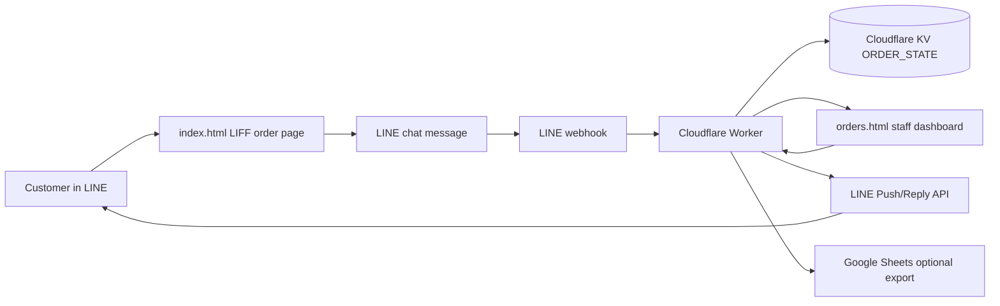
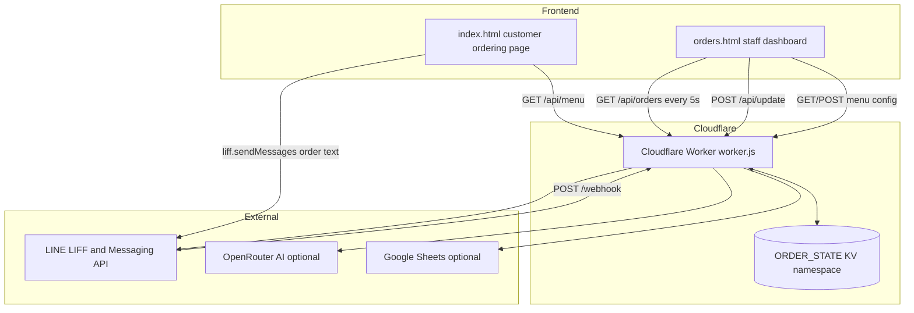
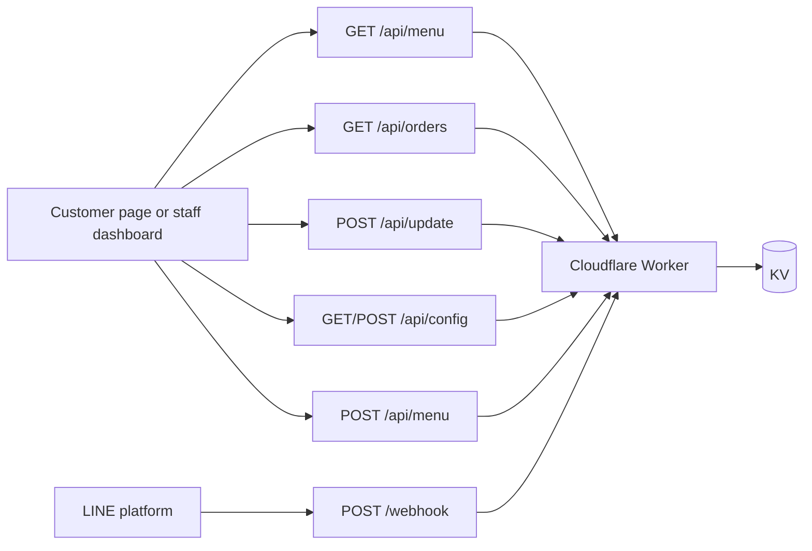
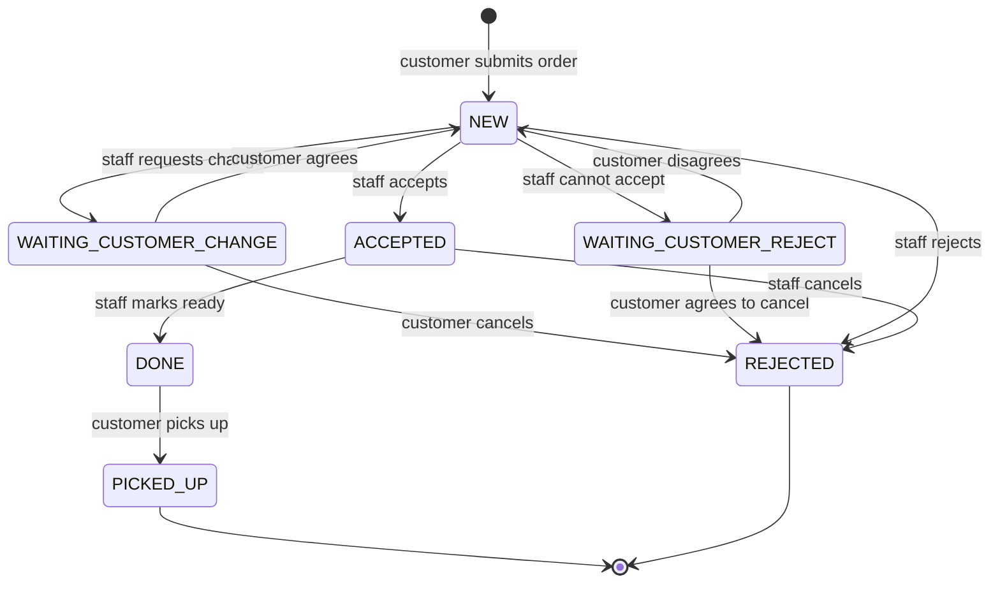
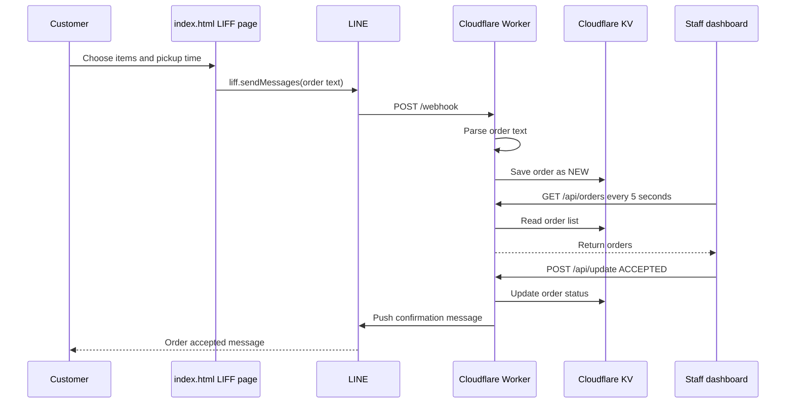

# Benmi Current Architecture

This document explains the current project in plain terms. It is written for someone who is new to Cloudflare, LINE Developers, and this codebase.

## What This Project Is

Benmi is a lightweight food-ordering system.

Customers order food from a mobile web page inside LINE. Staff manage orders from a separate dashboard page. A Cloudflare Worker is the backend API and webhook receiver. Cloudflare KV stores menu data, order state, dashboard settings, and temporary conversation state.

At a high level:

```text
Customer in LINE
  -> opens ordering page
  -> chooses food
  -> sends order text through LINE LIFF
  -> LINE webhook calls Cloudflare Worker
  -> Worker stores order in KV
  -> staff dashboard polls Worker API
  -> staff accepts/changes/rejects order
  -> Worker pushes LINE message back to customer when needed
```



## Files In This Repo

```text
index.html
orders.html
benmi-worker-official/
  src/worker.js
  wrangler.jsonc
  package.json
```

`index.html` is the customer ordering page.

`orders.html` is the staff dashboard.

`benmi-worker-official/src/worker.js` is the Cloudflare Worker backend.

`benmi-worker-official/wrangler.jsonc` is the Cloudflare Worker deployment configuration.

## Main Technologies

### Cloudflare Worker

A Cloudflare Worker is server-side JavaScript running on Cloudflare's edge network. In this project it handles API requests, LINE webhooks, order state changes, and outgoing LINE API calls.

Official docs: https://developers.cloudflare.com/workers/

### Wrangler

Wrangler is Cloudflare's CLI for developing and deploying Workers.

Official docs: https://developers.cloudflare.com/workers/wrangler/

This repo uses:

```bash
npm run dev
npm run deploy
```

Inside `benmi-worker-official`, those call `wrangler dev` and `wrangler deploy`.

### Cloudflare KV

Workers KV is a key-value store. This app uses it as its simple database.

Official docs: https://developers.cloudflare.com/kv/

The Worker config binds KV as:

```jsonc
"kv_namespaces": [
  {
    "id": "4800c4ce106043de89baa2aa7a7676b0",
    "binding": "ORDER_STATE"
  }
]
```

In code, that becomes:

```js
env.ORDER_STATE.get(...)
env.ORDER_STATE.put(...)
```

### LINE LIFF

LIFF lets a web page run inside LINE and use LINE capabilities. The customer page loads:

```html
<script src="https://static.line-scdn.net/liff/edge/2/sdk.js"></script>
```

Then it initializes:

```js
liff.init({ liffId: "2009560906-c5taZfiY" })
```

The page sends an order into the LINE chat using:

```js
liff.sendMessages([{ type: "text", text: msg }])
```

The Worker later receives that text from LINE via webhook.

## Runtime Components



### Customer Ordering Page

File: `index.html`

Responsibilities:

- Fetch menu from `GET /api/menu`.
- Render product categories: small bread, large bread, combos, drinks.
- Track cart quantity and customizations.
- Validate pickup date and time.
- Generate an order number.
- Build a human-readable order text message.
- Send the message through LINE LIFF.

The frontend does not directly create an order through the backend in normal customer flow. It sends a LINE message, then the backend receives the LINE webhook.

### Staff Dashboard

File: `orders.html`

Responsibilities:

- Poll `GET /api/orders` every 5 seconds.
- Display orders grouped by operational status.
- Play a sound for new orders.
- Let staff accept, mark ready, mark picked up, reject, or request changes.
- Edit menu data through `GET /api/menu` and `POST /api/menu`.
- Edit operating hours through `GET /api/config` and `POST /api/config`.

Current dashboard status columns:

```text
Left panel:
  NEW
  ACCEPTED
  WAITING_CUSTOMER_CHANGE
  WAITING_CUSTOMER_REJECT

Right panel:
  DONE

History:
  PICKED_UP
  REJECTED
```

### Cloudflare Worker Backend

File: `benmi-worker-official/src/worker.js`

Responsibilities:

- Receive LINE webhook events at `POST /webhook` or `POST /`.
- Parse LIFF-generated order text.
- Store orders in KV.
- Serve dashboard APIs.
- Serve menu/config APIs.
- Push LINE messages back to customers.
- Keep temporary pending states when staff ask the customer to confirm changes.
- Optionally use OpenRouter AI to detect ordering intent.
- Optionally sync completed/cancelled orders to Google Sheets.

## API Endpoints

Current Worker routes:

```text
POST /webhook
POST /
POST /api/create
POST /api/update
GET  /api/orders
GET  /api/config
POST /api/config
GET  /api/menu
POST /api/menu
GET  /api/auth
POST /api/auth
POST /api/auth/change
POST /api/auth/templink
GET  /api/auth/templink
```



Important practical note: auth routes exist, but the write APIs are not currently protected by Worker-side auth. That should be fixed before relying on this in production.

## Data Stored In KV

The KV binding is `ORDER_STATE`.

Known key patterns:

```text
order:<orderKey>
order_index:latest
order_view:cache
menu:latest
store_config
pending:<lineUserId>
draft:<lineUserId>
liff_redirected:<lineUserId>
dashboard:password
templink:<token>
```

### Order Object Shape

Approximate shape:

```json
{
  "key": "B0502-2201-1234",
  "customer": "Customer name",
  "time": "2026-05-03 12:30",
  "content": "2份 x 烤肉 小",
  "status": "NEW",
  "createdAt": 1770000000000,
  "userId": "LINE user id",
  "total": 160,
  "reason": "",
  "note": ""
}
```

## Order Lifecycle

Normal happy path:

```text
NEW
  -> ACCEPTED
  -> DONE
  -> PICKED_UP
```



When staff request a change:

```text
NEW
  -> WAITING_CUSTOMER_CHANGE
  -> customer agrees
  -> NEW or ACCEPTED
```

When staff cannot accept:

```text
NEW
  -> WAITING_CUSTOMER_REJECT
  -> customer agrees to cancel
  -> REJECTED
```

Force cancel:

```text
WAITING_CUSTOMER_CHANGE or WAITING_CUSTOMER_REJECT
  -> FORCE_REJECT request
  -> REJECTED
```

## LINE Message Flow



### Customer Places An Order

1. Customer opens `index.html` inside LINE.
2. Customer chooses items.
3. `index.html` builds text like:

```text
訂單編號：B0503-1230-4567
📦 訂單內容：

1份 x 烤肉 小

🕒 取餐時間：2026-05-03 12:30
💰 總金額：$72
```

4. `liff.sendMessages()` sends this text to the LINE chat.
5. LINE calls the Worker webhook.
6. Worker detects `訂單編號：` and `📦 訂單內容：`.
7. Worker stores a `NEW` order.

### Staff Accepts The Order

1. Dashboard calls `POST /api/update`.
2. Worker changes status to `ACCEPTED`.
3. Worker pushes a LINE message to the customer:

```text
Benmi 已收到您的訂單 #...
```

### Staff Requests Change

1. Dashboard calls `POST /api/update` with status `CHANGED`.
2. Worker changes order to `WAITING_CUSTOMER_CHANGE`.
3. Worker stores a pending state under `pending:<userId>`.
4. Worker pushes a LINE message asking the customer to agree/cancel/change.
5. Customer replies in LINE.
6. Webhook matches the reply to the pending state.
7. Worker updates the order.

## Deployment Model

Current frontend files are static:

```text
index.html
orders.html
```

They may be hosted separately, probably CloudFront/S3 based on the original context. The backend is definitely Cloudflare Workers because both frontend files call:

```text
https://benmi-worker-official.thuanmnc.workers.dev
```

The Worker itself is deployable with Wrangler from:

```bash
cd benmi-worker-official
npm install
npm run deploy
```

Cloudflare also supports deploying static assets together with a Worker, so this project could later move away from CloudFront and host the frontend on Cloudflare Workers Static Assets.

Official docs: https://developers.cloudflare.com/workers/static-assets/

## Environment Variables And Secrets

The Worker expects these values from Cloudflare environment variables/secrets:

```text
LINE_CHANNEL_TOKEN
LIFF_ID
LIFF_URL
OPENROUTER_API_KEY
OPENROUTER_MODEL
GOOGLE_SHEETS_URL
```

Some have fallback values in code. For production, secrets and external URLs should live in Cloudflare, not hardcoded in source.

## Current Risks To Understand

These are not theoretical. They affect how safe the current system is.

- Dashboard write APIs are public unless protected elsewhere.
- LINE webhook payloads are not currently signature-verified.
- `DEFAULT_PASSWORD` is hardcoded as `12345678`.
- Google Sheets fallback URL is hardcoded.
- KV is eventually consistent and not transactional, so concurrent order index updates can race.
- The dashboard is a single large HTML file, so maintainability will get harder as features grow.

## Mental Model

Think of the current system as:

```text
Static HTML frontend
+ Cloudflare Worker API
+ KV as lightweight database
+ LINE as identity/chat/notification transport
+ Google Sheets as optional export
```

The heart of the product is not the food menu UI. The heart is the chat-based order lifecycle:

```text
customer order
staff review
customer confirmation if needed
staff fulfillment
history/export
```
