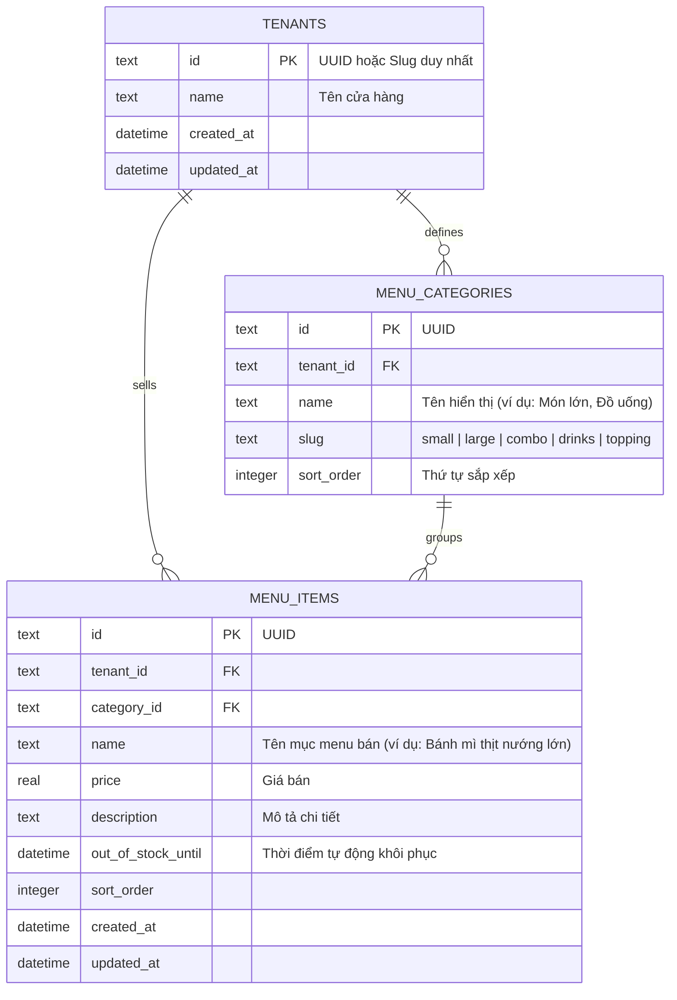

# Thiết kế Cơ sở Dữ liệu D1 (D1 Database Design)

Tài liệu này mô tả chi tiết thiết kế cơ sở dữ liệu quan hệ Cloudflare D1 cho hệ thống quản lý thực đơn đa hộ thuê (multi-tenant) của **Benmi Order**, bao gồm cấu trúc bảng, lập chỉ mục (indexing), và cơ chế cô lập dữ liệu (tenant isolation).

---

## 1. Mô hình Quan hệ Thực thể (ERD)

Hệ thống sử dụng các bảng sau để lưu trữ thực đơn:

*(Lưu ý: Sơ đồ ERD đã được đơn giản hóa để chỉ tập trung vào việc quản lý thực đơn trực tiếp trên menu items)*



---

## 2. Schema SQL chi tiết (SQLite / Cloudflare D1)

Dưới đây là mã SQL DDL để khởi tạo cơ sở dữ liệu trên Cloudflare D1:

```sql
-- 1. Bảng Cửa hàng (Tenants)
CREATE TABLE tenants (
    id TEXT PRIMARY KEY,
    name TEXT NOT NULL,
    created_at DATETIME DEFAULT CURRENT_TIMESTAMP,
    updated_at DATETIME DEFAULT CURRENT_TIMESTAMP
);

-- 2. Bảng Danh mục Thực đơn (Menu Categories)
CREATE TABLE menu_categories (
    id TEXT PRIMARY KEY,
    tenant_id TEXT NOT NULL,
    name TEXT NOT NULL,
    slug TEXT NOT NULL, -- 'small', 'large', 'combo', 'drinks', 'topping'
    sort_order INTEGER DEFAULT 0,
    created_at DATETIME DEFAULT CURRENT_TIMESTAMP,
    FOREIGN KEY (tenant_id) REFERENCES tenants(id) ON DELETE CASCADE,
    UNIQUE(tenant_id, slug) -- Đảm bảo slug là duy nhất đối với mỗi cửa hàng
);

-- 3. Bảng Mục Thực đơn chi tiết (Menu Items)
CREATE TABLE menu_items (
    id TEXT PRIMARY KEY,
    tenant_id TEXT NOT NULL,
    category_id TEXT NOT NULL,
    name TEXT NOT NULL,
    price REAL NOT NULL CHECK(price >= 0),
    description TEXT,
    out_of_stock_until DATETIME, -- NULL: còn hàng, tương lai: hết hàng đến mốc đó
    sort_order INTEGER DEFAULT 0,
    created_at DATETIME DEFAULT CURRENT_TIMESTAMP,
    updated_at DATETIME DEFAULT CURRENT_TIMESTAMP,
    FOREIGN KEY (tenant_id) REFERENCES tenants(id) ON DELETE CASCADE,
    FOREIGN KEY (category_id) REFERENCES menu_categories(id) ON DELETE RESTRICT
);
```

---

## 3. Thiết kế Lập chỉ mục (Indexing) cho Hiệu năng cao

Để đảm bảo các truy vấn đọc menu cho khách hàng diễn ra dưới 10ms trên D1 trước khi cache, các index sau được thiết lập:

```sql
-- Tăng tốc truy vấn lọc thực đơn theo cửa hàng (Tenant Isolation)
CREATE INDEX idx_menu_items_tenant ON menu_items(tenant_id);
CREATE INDEX idx_menu_categories_tenant ON menu_categories(tenant_id);

-- Tăng tốc truy vấn kiểm tra hết hàng (Out of Stock Checks)
CREATE INDEX idx_menu_items_out_of_stock ON menu_items(tenant_id, out_of_stock_until);
```

---

## 4. Chiến lược Cô lập Dữ liệu (Tenant Isolation)

Để ngăn chặn lỗi rò rỉ dữ liệu chéo giữa các cửa hàng (Tenant Data Leakage), chúng tôi áp dụng các quy tắc sau:

1. **Cô lập ở tầng Database (Logical Isolation):**
   Mọi bảng dữ liệu liên quan đến menu (`menu_categories`, `menu_items`) bắt buộc phải có cột `tenant_id`.
2. **Cô lập ở tầng Middleware API:**
   Khi nhận request từ Client, Middleware sẽ trích xuất `tenant_id` từ subdomain (ví dụ: `shop1.benmi.vn` $\rightarrow$ `shop1`) hoặc qua header `X-Tenant-ID` sau khi xác thực.
   Mọi câu lệnh truy vấn SQL đi vào D1 đều phải đính kèm điều kiện `WHERE tenant_id = ?`:
   ```sql
   SELECT * FROM menu_items WHERE tenant_id = ? AND category_id = ?;
   ```
3. **Phân quyền Nhân viên (RBAC):**
   Mỗi nhân viên đăng nhập sẽ có token liên kết trực tiếp với một `tenant_id`. API sửa trạng thái thực đơn sẽ so sánh `tenant_id` của nhân viên với `tenant_id` của món ăn muốn sửa; nếu không trùng khớp, trả về `403 Forbidden`.
