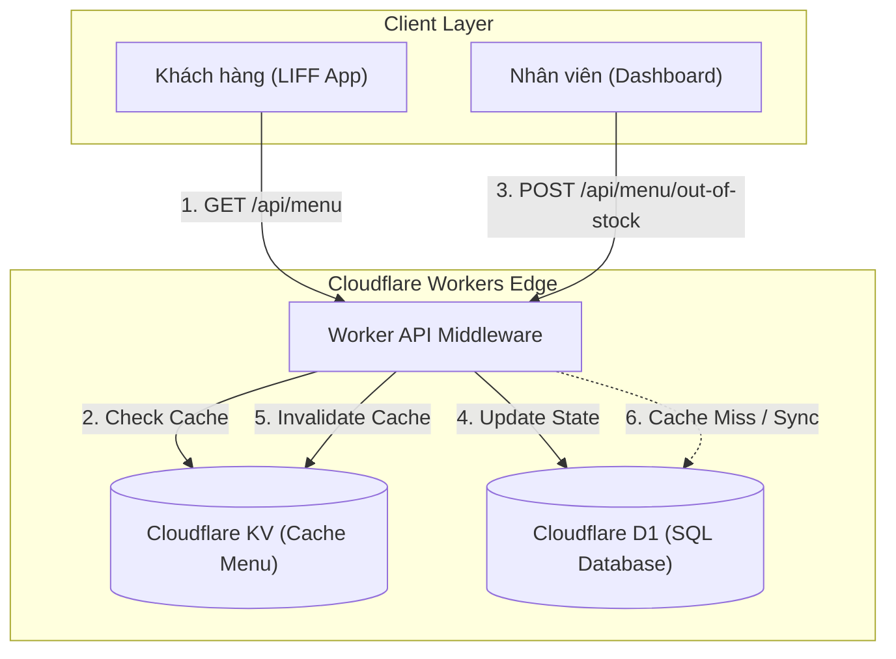
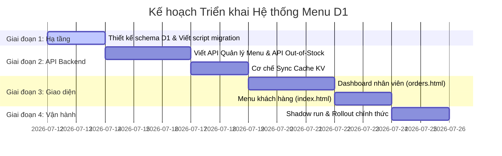

# PDP: Hệ thống Quản lý Thực đơn Đa hộ thuê & Báo Hết hàng (Cloudflare D1 & KV)

Tài liệu này đề xuất giải pháp thiết kế cơ sở dữ liệu quan hệ trên Cloudflare D1 và kiến trúc ứng dụng để chuyển đổi hệ thống thực đơn của **Benmi Order** từ dạng cấu hình tĩnh (KV/Hardcode) sang mô hình đa hộ thuê (multi-tenant) động, tích hợp tính năng quản lý trạng thái hết hàng (out-of-stock) nâng cao cho nhân viên.

---

## 1. Tóm tắt Dự án & Mục tiêu

### Vấn đề hiện tại
Hiện tại, thực đơn (menu) của Benmi đang được cấu hình cứng thông qua mã nguồn backend hoặc lưu trữ trên Cloudflare KV dưới dạng một JSON Object duy nhất (`menu:latest`). Điều này dẫn đến các hạn chế lớn:
1. **Thiếu khả năng Đa hộ thuê (Multi-tenancy):** Không thể cấu hình và cô lập thực đơn cho nhiều cửa hàng khác nhau trên cùng một hạ tầng dùng chung.
2. **Khó cập nhật thời gian thực:** Cập nhật bất cứ mục nào yêu cầu ghi đè toàn bộ JSON Menu, tăng nguy cơ xung đột dữ liệu (race conditions) khi nhiều người dùng sửa cùng lúc.
3. **Không hỗ trợ trạng thái Hết hàng (Out-of-Stock) thông minh:** Nhân viên không thể đánh dấu một món hết hàng tạm thời trong ngày hôm nay hoặc trong nhiều ngày. Khách hàng vẫn có thể đặt các món đã hết nguyên liệu, dẫn đến việc hủy đơn hoặc trải nghiệm khách hàng kém.

### Mục tiêu thiết kế
*   **Đa hộ thuê:** Thiết kế database sẵn sàng hỗ trợ hàng trăm cửa hàng (tenant) độc lập, cô lập dữ liệu tuyệt đối bằng `tenant_id`.
*   **Dịch chuyển sang SQL (Cloudflare D1):** Sử dụng Cloudflare D1 làm Source of Truth để lưu trữ thực đơn chi tiết (dạng bảng quan hệ), đảm bảo tính nhất quán dữ liệu cao.
*   **Quản lý Hết hàng thông minh (Out-of-Stock):**
    *   **Hết hàng hôm nay (Today-only):** Tự động mở lại vào ngày hôm sau (không cần thao tác thủ công).
    *   **Hết hàng nhiều ngày (Multiple days):** Hết hàng đến một mốc thời gian cụ thể do nhân viên thiết lập.
    *   **Hết hàng vô thời hạn (Indefinitely):** Chỉ có hàng lại khi nhân viên bật thủ công.
*   **Tương thích ngược và Hiệu năng:** Sử dụng Cloudflare KV làm tầng đệm (Cache Layer) để tối ưu hóa thời gian tải menu cho khách hàng dưới 50ms, tránh quá tải truy vấn đọc vào D1.

### Ngoài phạm vi (Out-of-Scope)
*   Chức năng tự đăng ký tenant của chủ cửa hàng (Sẽ thực hiện thủ công bằng seed script).
*   Giao diện quản lý toàn bộ thuộc tính món ăn (chỉ tập trung vào trạng thái hết hàng ở giai đoạn đầu).

---

## 2. Bối cảnh & Kiến trúc hiện tại

Hiện tại, cả khách hàng (`index.html`) và nhân viên (`orders.html`) đều gọi API `/api/menu` để lấy thông tin. 
*   **GET `/api/menu`**: Đọc từ KV key `menu:latest`, nếu trống sẽ trả về `DEFAULT_MENU` (hardcoded trong `src/modules/menu.ts`).
*   **POST `/api/menu`**: Nhân viên lưu thay đổi bằng cách gửi toàn bộ JSON của menu lên để lưu đè vào KV.

Cấu trúc JSON hiện tại:
```json
{
  "small": { "燒肉": 56, "火腿": 56 },
  "large": { "燒肉": 80, "火腿": 80 },
  "combo": { "1 大燒肉+飲料": 90 },
  "drinks": { "越南咖啡": 48 },
  "topping": { "起司": 15 }
}
```

---

## 3. Kiến trúc Đề xuất

Chúng tôi đề xuất mô hình kiến trúc kết hợp **D1 (Source of Truth) + KV (Cache Layer)** để đảm bảo vừa có tính nhất quán quan hệ, vừa duy trì tốc độ đọc siêu nhanh ở Edge.

### Sơ đồ luồng dữ liệu (Data Flow)



### Nguyên lý thiết kế Out-of-Stock (Cấp độ Món ăn chi tiết)
*   **Cơ sở dữ liệu:** Trạng thái hết hàng được lưu trực tiếp trên từng **Mục menu cụ thể (Menu Item)**.
*   **Logics hoạt động:** Nhân viên có thể chọn trực tiếp bất cứ món ăn, đồ uống hoặc topping nào từ danh sách để đánh dấu hết hàng mà không phụ thuộc vào liên kết nguyên liệu.
*   **Cơ chế tự động khôi phục (Auto-restock):** 
    Sử dụng cột `out_of_stock_until` kiểu dữ liệu DATETIME trong D1:
    *   `NULL` hoặc `thời gian quá khứ`: Còn hàng (Available).
    *   `Thời gian tương lai`: Hết hàng (Out of stock) cho đến mốc thời gian đó.
    *   *Ví dụ:* Hết hàng hôm nay $\rightarrow$ Đặt `out_of_stock_until` thành `04:00 AM` sáng ngày hôm sau. Khách hàng truy cập sau giờ đó sẽ thấy món tự động hiển thị còn hàng mà nhân viên không cần làm gì.
    *   *Hết hàng vô thời hạn:* Đặt `out_of_stock_until` thành một mốc xa trong tương lai (ví dụ: `9999-12-31 23:59:59`).

---

## 4. Phân chia các Tài liệu Thiết kế Chi tiết & Kế hoạch

Hệ thống được chia nhỏ thành các tài liệu thiết kế chi tiết để dễ dàng triển khai theo từng bước độc lập:

1.  **[Thiết kế Cơ sở Dữ liệu D1 (D1 Database Design)](file:///Users/duccao/Documents/benmi-order/docs/menu_proposal/db_design.md):**
    *   Chi tiết schema các bảng: `tenants`, `menu_categories`, `menu_items`.
    *   Các câu lệnh SQL khởi tạo (migration schema) và lập chỉ mục (indexing) tối ưu truy vấn.
    *   Cấu trúc Tenant Isolation (Cô lập dữ liệu đa hộ thuê).
2.  **[Thiết kế API & Logic Báo Hết Hàng (Out-of-Stock API Design)](file:///Users/duccao/Documents/benmi-order/docs/menu_proposal/outofstock_feature.md):**
    *   Chi tiết các API endpoints mới dành cho Staff và Customer.
    *   Công thức SQL tính toán trạng thái khả dụng thời gian thực.
    *   Cơ chế invalidation cache trên Cloudflare KV khi trạng thái hết hàng thay đổi.
3.  **[Kế hoạch Tích hợp Frontend & Rollout (Frontend & Rollout Plan)](file:///Users/duccao/Documents/benmi-order/docs/menu_proposal/frontend_rollout.md):**
    *   Thiết kế giao diện bật/tắt hết hàng trên Dashboard nhân viên (`orders.html`).
    *   Thiết kế hiển thị trạng thái hết hàng trên Menu khách hàng (`index.html`) kèm theo việc vô hiệu hóa nút thêm vào giỏ hàng.
    *   Kế hoạch dịch chuyển dữ liệu (Migration) từ dữ liệu KV hiện tại sang cấu trúc D1 mới mà không gây gián đoạn hệ thống.

---

## 5. Đánh giá Giải pháp Thay thế & Đánh đổi

### Phương án A: Chỉ lưu cờ Boolean `is_out_of_stock`
*   **Ưu điểm:** Thiết kế database cực kỳ đơn giản.
*   **Nhược điểm:** Nhân viên bắt buộc phải nhớ bật lại món ăn thủ công vào ngày hôm sau. Thực tế vận hành cho thấy nhân viên thường xuyên quên mở lại món vào buổi sáng, gây thất thoát doanh thu đáng tiếc.
*   **Lựa chọn:** Bị loại bỏ. Sử dụng `out_of_stock_until` giải quyết triệt để bài toán tự động hóa này.

### Phương án B: Truy vấn trực tiếp D1 cho mọi lượt truy cập của khách hàng
*   **Ưu điểm:** Luôn đảm bảo thông tin menu mới nhất 100%, không cần quản lý cache.
*   **Nhược điểm:** Tốn tài nguyên đọc (read query limits) của D1 và làm tăng độ trễ (latency) của trang đặt hàng lên thêm 50-100ms tùy vị trí địa lý của khách hàng.
*   **Lựa chọn:** Bị loại bỏ. Sử dụng mô hình **D1 làm Source of Truth + KV làm Read Cache** mang lại trải nghiệm khách hàng tối ưu nhất (lấy menu từ KV siêu tốc tại Edge).

---

## 6. Lộ trình Thực hiện (Roadmap)



---

## 7. Kế hoạch Kiểm thử & Xác minh (Verification Plan)

### Kiểm thử Tự động (Automated Testing)
*   Viết test case trong module backend để kiểm tra logic tính khả dụng của món ăn dựa trên thời gian hiện tại (`CURRENT_TIMESTAMP` so với `out_of_stock_until`).
*   Viết test case kiểm tra tính cô lập tenant: Đảm bảo Tenant A không thể xem hoặc chỉnh sửa menu của Tenant B thông qua API.

### Kiểm thử Thủ công (Manual Testing)
*   **Test Case 1: Hết hàng hôm nay** $\rightarrow$ Đặt món hết hàng hôm nay, kiểm tra menu của khách hàng hiển thị "Hết hàng" và nút chọn bị vô hiệu hóa. Sử dụng script thay đổi thời gian hệ thống giả lập sang ngày hôm sau $\rightarrow$ Kiểm tra món tự động có hàng trở lại.
*   **Test Case 2: Hết hàng vô thời hạn** $\rightarrow$ Đặt món hết hàng vô thời hạn, kiểm tra món luôn hết hàng cho đến khi nhân viên bấm "Còn hàng" thủ công trên Dashboard.
