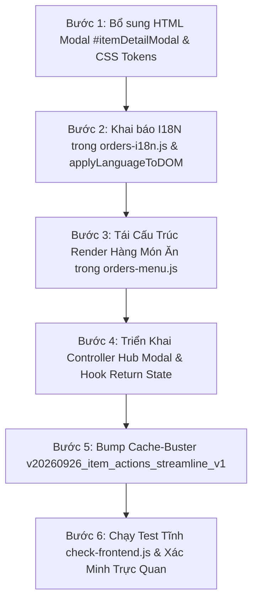

# Kế Hoạch Chi Tiết: Rút Gọn Nút Bấm Trên Từng Thẻ Món Ăn (Item Card Action Bar Modernization & Detail Hub Modal)

| Thuộc tính | Chi tiết |
| :--- | :--- |
| **Tài liệu** | Kế hoạch triển khai & Đặc tả kỹ thuật (Technical Spec & Implementation Plan - v1.1 Post-Review) |
| **Vị trí** | `docs/prompts/plan_item_card_action_streamline.md` |
| **Phạm vi** | Bảng quản lý thực đơn POS (`orders.html`, `css/orders.css`, `js/orders-menu.js`, `js/orders-bundle-wizard.js`, `js/orders-i18n.js`) |
| **Phương pháp** | Đã thống nhất qua `/grill-me` và kiểm chứng kiến trúc toàn diện (Architectural Double-Check) |
| **Nguyên tắc cốt lõi** | Tablet-First (vùng chạm $\ge$ 48px), Zero Childish Emojis (SVG Lucide nét mảnh), Chuẩn I18N Đa Ngôn Ngữ (`zh-TW` & `vi`), Cache-Busting bắt buộc |

---

## 1. Bối Cảnh & Vấn Đề Hiện Tại (Problem Statement)

Trên giao diện Quản lý thực đơn hiện tại của màn hình POS (`orders.html` $\rightarrow$ tab Menu), mỗi hàng món ăn (Item Row Card) đang bị quá tải bởi **6 nút bấm và trường nhập liệu** dàn trải theo chiều ngang:
1. `Nhãn/Gợi` (Input nhập nhãn trực tiếp chiếm 76px - 100px)
2. `Còn món` / `Hết hàng` (Pill trạng thái tồn kho)
3. `+ Cấu hình Combo` (Nút viền nét đứt dài)
4. `+ Tuỳ chọn món` (Nút viền nét đứt dài)
5. `Ảnh món` (Nút chữ dài)
6. `Xóa` (Nút chữ dài)

### Hậu quả:
* **Gây rối mắt nghiêm trọng (Visual Clutter)**: Hơn 90% món ăn thông thường không phải combo và không có tuỳ chọn riêng, nhưng toàn bộ danh sách 20-50 món đều phải hiển thị các nút viền đứt `+ Cấu hình Combo` và `+ Tuỳ chọn món`.
* **Tràn dòng trên Tablet/iPad**: Khi hiển thị trên màn hình cảm ứng đặt tại quầy thu ngân (chiều rộng 1024px - 1180px), hàng nút bị bóp nghẹt, gây tràn dòng hoặc che khuất tên món.
* **Thao tác chạm khó khăn**: Các nút quá nhiều làm phân tán sự tập trung của nhân viên khi cần thao tác nhanh (như đổi tên món, sửa giá hoặc bật/tắt hết hàng).

---

## 2. Kết Quả Thống Nhất Qua Phỏng Vấn `/grill-me` & Double-Check Kỹ Thuật

| Quyết định thiết kế | Lựa chọn đã thống nhất | Lý do & Ý nghĩa trải nghiệm |
| :--- | :--- | :--- |
| **Kiến trúc rút gọn** | **Mô hình Hub Modal (`⚙️ Cài đặt`)** | Thu gọn tối đa hàng món ăn, chỉ giữ lại các thao tác cốt lõi hàng ngày. Mọi cấu hình chuyên sâu chuyển vào một Modal trung tâm duy nhất (`#itemDetailModal`). |
| **Hiển thị trạng thái cấu hình** | **Indicator Chips thông minh** | Nếu món *chưa có* Combo/Tuỳ chọn/Nhãn: **Ẩn hoàn toàn (không hiện nút rác)**. Nếu món *đã có*: Hiện chip nhỏ gọn (`[Combo: 2]`, `[+3 Tuỳ chọn]`, `[Bán chạy]`). |
| **Phím tắt nhanh (Shortcuts)** | **Chạm trực tiếp vào Chip** | Chạm vào chip `[Combo: 2]` sẽ mở thẳng Bundle Wizard, chạm vào `[+3 Tuỳ chọn]` mở thẳng Item Modifiers Modal mà không cần qua bước trung gian. |
| **Xử lý ô nhập Nhãn/Huy hiệu** | **Chuyển vào Hub Modal** | Bỏ ô `Nhãn/Gợi` trên hàng món để tiết kiệm 120px chiều ngang; chỉ hiển thị chip nhãn màu cam khi món đã được đặt nhãn. |
| **Định dạng nút Thao tác cuối hàng** | **`[⚙️ Cài đặt]` (có chữ) + `[🗑️]` (Icon-only)** | Nút Cài đặt có nhãn chữ giúp nhận diện rõ ràng chức năng mở rộng; nút Xóa là icon thùng rác nhỏ gọn, hover đỏ nhẹ nhàng để tránh bấm nhầm. |
| **Luồng điều hướng (Navigation Flow)** | **Stacked Return Flow với Auto-Commit** | Khi từ Hub Modal bấm mở Bundle Wizard hoặc Modifiers: Tự động commit các thay đổi tạm thời của Hub Modal, tạm ẩn Hub Modal. Khi đóng/lưu ở modal con sẽ tự động quay lại Hub Modal và re-render trạng thái mới nhất. |
| **Quản lý Ảnh tích hợp** | **Inline Photo Manager trong Hub Modal** | Xem ảnh, đổi ảnh và xóa ảnh trực tiếp bên trong Hub Modal, không phải mở đè thêm popup `#imageModal` cũ. |

---

## 3. Thiết Kế Chi Tiết Giao Diện (Detailed UI/UX Design)

### 3.1. Cấu trúc Hàng Món Ăn Mới (Streamlined Item Row)

```
+----+----------------------------+-------+--------------------+------------+--------------+-----+
| :: | Tên món                    | $ 140 | [Combo: 2] [+3 To] | (• Còn món)| [⚙️ Cài đặt] | [🗑️]|
+----+----------------------------+-------+--------------------+------------+--------------+-----+
```

* **Phần 1: Thông tin cơ bản (Inline Editing)**:
  * Grip kéo thả (`⋮⋮`): 24px, đổi thứ tự món.
  * Ô nhập tên món (`menu-item-name-input`): Co giãn tự nhiên, gõ sửa tức thì.
  * Ô nhập giá tiền (`menu-item-price-input`): Nhỏ gọn 60px, hiển thị `$ 140`.
* **Phần 2: Cụm Indicator Chips (Chỉ hiện khi có dữ liệu)**:
  * **Chip Combo**: Nền tím nhạt `#f5f3ff`, chữ tím đậm `#6d28d9`, viền `#ddd6fe`, icon `Layers` kèm số nhóm (VD: `Combo: 2`). *Ẩn nếu tenant bật feature flag `disable_bundle_builder_v2`*.
  * **Chip Tuỳ chọn**: Nền xanh lam nhạt `#eff6ff`, chữ xanh đậm `#1d4ed8`, viền `#bfdbfe`, icon `Sliders` kèm số nhóm (VD: `+3 Tuỳ chọn`).
  * **Chip Nhãn**: Nền cam nhạt `#fff7ed`, chữ cam đậm `#c2410c`, viền `#fed7aa`, icon `Tag` kèm tên nhãn (VD: `Bán chạy`). Bấm vào mở thẳng Hub Modal focus vào ô nhãn.
* **Phần 3: Thao tác hành động**:
  * **Pill Còn món / Hết hàng**: Nút trạng thái mềm mại, bấm mở `openStockModal(cIdx, iIdx)`.
  * **Nút Cài đặt (`[⚙️ Cài đặt]`)**: Nút ghost hiện đại, viền mờ `1px solid var(--border)`, chữ đậm vừa, chiều cao tối thiểu 40px (vùng chạm 48px), mở `#itemDetailModal`.
  * **Nút Xóa (`[🗑️]`)**: Nút vuông 40x40px, icon SVG Lucide Trash nét mảnh, hover đổi nền `#fef2f2` và viền đỏ nhạt `#fecaca`.

---

### 3.2. Cấu Trúc Hub Modal — Trung Tâm Thiết Lập Món (`#itemDetailModal`)

Modal mở ra khi bấm `[⚙️ Cài đặt]` (hoặc bấm vào chip Nhãn), được chia làm 4 khu vực thông thoáng:

```
+-------------------------------------------------------------+
| Thiết lập món: 鹹水半隻                                   ✕ |
+-------------------------------------------------------------+
| [KHU VỰC 1: ẢNH MÓN ĂN - INTEGRATED PHOTO]                  |
| +-----------+  鹹水半隻                                     |
| |  [Ảnh]    |  Chưa có ảnh minh họa cho món này             |
| |  80x80px  |  [📷 Tải ảnh lên / Thay ảnh]   [🗑️ Xóa ảnh]    |
| +-----------+                                               |
+-------------------------------------------------------------+
| [KHU VỰC 2: NHÃN GỢI Ý & ĐỀ XUẤT]                           |
| Nhãn hiển thị trên Menu khách:                              |
| [ Ô nhập nhãn: "Bán chạy"                              ]    |
| Gợi ý nhanh: [Bán chạy] [Khuyên dùng] [Món mới] [Cay]       |
|                                                             |
| [ ] Đánh dấu là món nổi bật (Khuyên dùng / Recommended)     |
+-------------------------------------------------------------+
| [KHU VỰC 3: CẤU HÌNH NÂNG CAO]                              |
| +---------------------------------------------------------+ |
| | 🎛️ Tuỳ chọn riêng cho món (Modifiers)                 > | |
| |    Đang áp dụng: 2 nhóm (Độ cay, Thêm Topping)          | |
| +---------------------------------------------------------+ |
| +---------------------------------------------------------+ |
| | 📦 Cấu hình Combo / Suất ăn (Bundle Wizard)            > | |
| |    Trạng thái: Món tiêu chuẩn (Chưa cấu hình combo)     | |
| +---------------------------------------------------------+ |
+-------------------------------------------------------------+
|                                              [ Hoàn tất ]   |
+-------------------------------------------------------------+
```

1. **Header**:
   * Tiêu đề: `Thiết lập món: [Tên món]` (`單品設定: [菜品名稱]`).
   * Nút đóng `✕` (`closeItemDetailModal()`): đóng modal mà không commit thay đổi chưa lưu trong form.
2. **Khu vực 1: Ảnh món ăn tích hợp (Integrated Photo Manager)**:
   * Thumbnail 80x80px (`#item-detail-img-preview`), bo góc 12px, `object-fit: cover`. Nếu chưa có ảnh: hiện placeholder camera SVG cách điệu.
   * Label trạng thái ảnh: `#item-detail-img-status`.
   * Nút `Tải ảnh lên / Thay ảnh` (`#btn-item-detail-upload`): Kích hoạt hidden `<input type="file" id="item-detail-file-input">`. Resize tự động $\le$ 800px WebP và tải lên qua `/api/image` với key `${cat.id}_${item.name}`.
   * Nút `Xóa ảnh` (`#btn-item-detail-delete-img`): Gọi API `DELETE /api/image` và dọn thumbnail ngay tại chỗ.
3. **Khu vực 2: Nhãn gợi ý & Món nổi bật (Badge & Featured)**:
   * Input text nhập nhãn tự do: `#item-detail-badge-input`.
   * Quick tag chips: Bấm 1 chạm để điền nhanh:
     * Nếu bấm chip đang chọn: hủy chọn (clear input).
     * Nếu bấm "Khuyên dùng" / "推薦": tự động tích luôn checkbox `#item-detail-recommended-checkbox`.
   * Checkbox/Toggle: `#item-detail-recommended-checkbox` (lưu vào `item.isRecommended`).
4. **Khu vực 3: Thẻ hành động Cấu hình Nâng cao (Interactive Action Cards)**:
   * **Thẻ 1 - Tuỳ chọn riêng (`#item-detail-mod-card`)**:
     * Icon SVG `Sliders` nét mảnh.
     * Tiêu đề: `Tuỳ chọn riêng cho món (Modifiers)`.
     * Tóm tắt động: `t("cardModifiersCount", { count })` hoặc `t("cardModifiersEmpty")`.
     * Bấm mở: Gọi `transitionToSubEditor('modifiers')`.
   * **Thẻ 2 - Cấu hình Combo (`#item-detail-bundle-card`)**:
     * Icon SVG `Layers` nét mảnh.
     * Tiêu đề: `Cấu hình Combo / Suất ăn (Bundle)`.
     * Tóm tắt động: `t("cardBundleCount", { count })` hoặc `t("cardBundleEmpty")`.
     * Bấm mở: Gọi `transitionToSubEditor('bundle')`.
     * *Ẩn thẻ này nếu `cat.type !== 'catalog'` hoặc tenant có flag `disable_bundle_builder_v2`*.
5. **Footer**:
   * Nút `[Hoàn tất / Xong]` (`btn btn-primary`, `saveItemDetailModal()`): Lưu giá trị từ modal vào `item.badgeText` và `item.isRecommended`, gọi `markMenuDirty()`, re-render row và đóng modal.

---

## 4. Đặc Tả Kỹ Thuật & Kiến Trúc Xử Lý 10 Rủi Ro Kỹ Thuật

### 4.1. File `orders.html`
* Thêm modal `#itemDetailModal` ngay trước thẻ đóng `</body>`.
* Cấu trúc markup:
```html
<div id="itemDetailModal" class="modal" style="display: none;">
  <div class="modal-content item-detail-modal-content">
    <div class="modal-title">
      <h3 id="item-detail-modal-title">單品設定</h3>
      <div class="modal-close" onclick="closeItemDetailModal()">✕</div>
    </div>
    <div class="modal-body item-detail-modal-body">
      <!-- Section 1: Photo -->
      <div class="item-detail-section item-detail-photo-section">
        <div class="item-detail-photo-preview-wrap">
          
          <div id="item-detail-img-placeholder" class="item-detail-photo-placeholder">
            <svg width="28" height="28" viewBox="0 0 24 24" fill="none" stroke="currentColor" stroke-width="2" stroke-linecap="round" stroke-linejoin="round"><path d="M23 19a2 2 0 0 1-2 2H3a2 2 0 0 1-2-2V8a2 2 0 0 1 2-2h4l2-3h6l2 3h4a2 2 0 0 1 2 2z"/><circle cx="12" cy="13" r="4"/></svg>
          </div>
        </div>
        <div class="item-detail-photo-info">
          <div class="item-detail-photo-name" id="item-detail-photo-item-name"></div>
          <div class="item-detail-photo-status" id="item-detail-img-status"></div>
          <div class="item-detail-photo-actions">
            <button type="button" class="btn btn-ghost btn-sm" id="btn-item-detail-upload" onclick="triggerItemDetailPhotoUpload()">
              <svg width="14" height="14" viewBox="0 0 24 24" fill="none" stroke="currentColor" stroke-width="2" stroke-linecap="round" stroke-linejoin="round"><path d="M21 15v4a2 2 0 0 1-2 2H5a2 2 0 0 1-2-2v-4"/><polyline points="17 8 12 3 7 8"/><line x1="12" y1="3" x2="12" y2="15"/></svg>
              <span id="i18n-btn-item-photo-upload">上傳/更換圖片</span>
            </button>
            <button type="button" class="btn btn-ghost btn-sm btn-danger-ghost" id="btn-item-detail-delete-img" style="display: none;" onclick="deleteItemDetailPhoto()">
              <svg width="14" height="14" viewBox="0 0 24 24" fill="none" stroke="currentColor" stroke-width="2" stroke-linecap="round" stroke-linejoin="round"><polyline points="3 6 5 6 21 6"/><path d="M19 6v14a2 2 0 0 1-2 2H7a2 2 0 0 1-2-2V6m3 0V4a2 2 0 0 1 2-2h4a2 2 0 0 1 2 2v2"/></svg>
              <span id="i18n-btn-item-photo-remove">移除圖片</span>
            </button>
          </div>
          <input type="file" id="item-detail-file-input" accept="image/png, image/jpeg, image/webp" style="display: none;" onchange="handleItemDetailImageSelect(event)">
        </div>
      </div>

      <!-- Section 2: Badge & Recommended -->
      <div class="item-detail-section">
        <label class="item-detail-label" id="i18n-item-badge-title">標籤與推薦</label>
        <div class="item-detail-badge-input-wrap">
          <input type="text" id="item-detail-badge-input" class="item-detail-input" placeholder="例如：熱銷、主廚推薦">
        </div>
        <div class="item-detail-quick-tags" id="item-detail-quick-tags">
          <!-- Rendered via JS based on currentLang -->
        </div>
        <label class="item-detail-checkbox-label">
          <input type="checkbox" id="item-detail-recommended-checkbox">
          <span id="i18n-item-recommended-label">標記為推薦餐點 (在線上菜單置頂凸顯)</span>
        </label>
      </div>

      <!-- Section 3: Advanced Action Cards -->
      <div class="item-detail-section" id="item-detail-advanced-section">
        <label class="item-detail-label" id="i18n-item-advanced-title">進階設定</label>
        
        <!-- Modifiers Card -->
        <div class="item-detail-action-card" id="item-detail-mod-card" onclick="transitionToSubEditor('modifiers')">
          <div class="item-detail-card-icon">
            <svg width="20" height="20" viewBox="0 0 24 24" fill="none" stroke="currentColor" stroke-width="2.2" stroke-linecap="round" stroke-linejoin="round"><line x1="4" x2="20" y1="21" y2="21"/><line x1="4" x2="20" y1="14" y2="14"/><line x1="4" x2="20" y1="7" y2="7"/><circle cx="14" cy="21" r="2"/><circle cx="8" cy="14" r="2"/><circle cx="16" cy="7" r="2"/></svg>
          </div>
          <div class="item-detail-card-content">
            <div class="item-detail-card-title" id="i18n-card-mod-title">專屬客製化選項 (Modifiers)</div>
            <div class="item-detail-card-sub" id="item-detail-mod-summary">尚未設定專屬選項</div>
          </div>
          <div class="item-detail-card-arrow">
            <svg width="18" height="18" viewBox="0 0 24 24" fill="none" stroke="currentColor" stroke-width="2.2" stroke-linecap="round" stroke-linejoin="round"><polyline points="9 18 15 12 9 6"/></svg>
          </div>
        </div>

        <!-- Bundle Card -->
        <div class="item-detail-action-card" id="item-detail-bundle-card" onclick="transitionToSubEditor('bundle')">
          <div class="item-detail-card-icon bundle-icon">
            <svg width="20" height="20" viewBox="0 0 24 24" fill="none" stroke="currentColor" stroke-width="2.2" stroke-linecap="round" stroke-linejoin="round"><polygon points="12 2 2 7 12 12 22 7 12 2"/><polyline points="2 17 12 22 22 17"/><polyline points="2 12 12 17 22 12"/></svg>
          </div>
          <div class="item-detail-card-content">
            <div class="item-detail-card-title" id="i18n-card-bundle-title">套餐/組合設定 (Bundle)</div>
            <div class="item-detail-card-sub" id="item-detail-bundle-summary">一般單品 (未啟用套餐組合)</div>
          </div>
          <div class="item-detail-card-arrow">
            <svg width="18" height="18" viewBox="0 0 24 24" fill="none" stroke="currentColor" stroke-width="2.2" stroke-linecap="round" stroke-linejoin="round"><polyline points="9 18 15 12 9 6"/></svg>
          </div>
        </div>
      </div>
    </div>
    <div class="modal-actions" style="justify-content: flex-end; padding: 12px 20px;">
      <button type="button" class="btn btn-primary" id="btn-item-detail-done" onclick="saveItemDetailModal()" style="min-width: 110px;">完成</button>
    </div>
  </div>
</div>
```

---

### 4.2. File `css/orders.css`
* Cập nhật các class style:
```css
/* Indicator Chips Container */
.menu-item-indicator-chips {
  display: inline-flex;
  align-items: center;
  gap: 6px;
  flex-wrap: wrap;
}

.menu-item-chip {
  display: inline-flex;
  align-items: center;
  gap: 4px;
  font-size: 12px;
  font-weight: 700;
  padding: 4px 8px;
  border-radius: 6px;
  cursor: pointer;
  transition: all 0.15s ease;
  user-select: none;
  border: 1px solid transparent;
  line-height: 1.2;
}

.menu-item-chip svg {
  flex-shrink: 0;
}

.chip-combo {
  background: #f5f3ff;
  color: #6d28d9;
  border-color: #ddd6fe;
}
.chip-combo:hover {
  background: #ede9fe;
}

.chip-modifier {
  background: #eff6ff;
  color: #1d4ed8;
  border-color: #bfdbfe;
}
.chip-modifier:hover {
  background: #dbeafe;
}

.chip-badge {
  background: #fff7ed;
  color: #c2410c;
  border-color: #fed7aa;
}
.chip-badge:hover {
  background: #ffedd5;
}

/* Settings button */
.menu-item-settings-btn {
  min-height: 40px;
  border: 1.5px solid #e2e8f0;
  background: #ffffff;
  color: #334155;
  font-size: 13px;
  font-weight: 700;
  border-radius: 9px;
  padding: 0 12px;
  display: inline-flex;
  align-items: center;
  gap: 6px;
  cursor: pointer;
  transition: all 0.15s ease;
}
.menu-item-settings-btn:hover {
  background: #f8fafc;
  border-color: #cbd5e1;
  color: #0f172a;
}

/* Delete Icon-Only Button */
.menu-item-delete-btn {
  width: 40px;
  height: 40px;
  padding: 0;
  display: inline-flex;
  align-items: center;
  justify-content: center;
  border: 1.5px solid #fee2e2;
  background: #fff5f5;
  color: var(--brand-red);
  border-radius: 9px;
  cursor: pointer;
  transition: all 0.15s ease;
  flex-shrink: 0;
}
.menu-item-delete-btn:hover {
  background: #fef2f2;
  border-color: #fca5a5;
  color: #dc2626;
}

/* Hub Modal Styles */
.item-detail-modal-content {
  max-width: 540px;
  width: 92vw;
  border-radius: 16px;
}
.item-detail-section {
  padding: 14px 0;
  border-bottom: 1px solid #f1f5f9;
}
.item-detail-section:last-child {
  border-bottom: none;
}
.item-detail-photo-section {
  display: flex;
  align-items: center;
  gap: 16px;
  padding-top: 4px;
}
.item-detail-photo-preview-wrap {
  width: 80px;
  height: 80px;
  border-radius: 12px;
  overflow: hidden;
  background: #f8fafc;
  border: 1.5px solid #e2e8f0;
  display: flex;
  align-items: center;
  justify-content: center;
  flex-shrink: 0;
}
.item-detail-photo-preview-wrap img {
  width: 100%;
  height: 100%;
  object-fit: cover;
}
.item-detail-photo-placeholder {
  color: #94a3b8;
}
.item-detail-photo-info {
  flex: 1;
  min-width: 0;
}
.item-detail-photo-name {
  font-size: 15px;
  font-weight: 800;
  color: #0f172a;
  margin-bottom: 2px;
}
.item-detail-photo-status {
  font-size: 12px;
  color: #64748b;
  margin-bottom: 8px;
}
.item-detail-photo-actions {
  display: flex;
  gap: 8px;
}
.item-detail-label {
  display: block;
  font-size: 13px;
  font-weight: 800;
  color: #334155;
  margin-bottom: 8px;
}
.item-detail-input {
  width: 100%;
  height: 42px;
  border: 1.5px solid #e2e8f0;
  border-radius: 9px;
  padding: 0 12px;
  font-size: 14px;
  box-sizing: border-box;
}
.item-detail-input:focus {
  outline: none;
  border-color: var(--primary);
  box-shadow: 0 0 0 3px rgba(0, 185, 0, 0.12);
}
.item-detail-quick-tags {
  display: flex;
  gap: 8px;
  margin-top: 8px;
  flex-wrap: wrap;
}
.quick-tag-chip {
  padding: 5px 10px;
  border-radius: 6px;
  background: #f1f5f9;
  border: 1px solid #e2e8f0;
  font-size: 12px;
  font-weight: 700;
  color: #475569;
  cursor: pointer;
  transition: all 0.15s ease;
}
.quick-tag-chip.active,
.quick-tag-chip:hover {
  background: #fee2e2;
  border-color: #fca5a5;
  color: #b91c1c;
}
.item-detail-checkbox-label {
  display: flex;
  align-items: center;
  gap: 8px;
  margin-top: 12px;
  font-size: 13.5px;
  font-weight: 600;
  color: #1e293b;
  cursor: pointer;
}
.item-detail-checkbox-label input {
  width: 18px;
  height: 18px;
  accent-color: var(--primary);
  cursor: pointer;
}
.item-detail-action-card {
  display: flex;
  align-items: center;
  gap: 12px;
  padding: 12px 14px;
  border-radius: 12px;
  border: 1.5px solid #e2e8f0;
  background: #ffffff;
  cursor: pointer;
  margin-bottom: 10px;
  transition: all 0.15s ease;
}
.item-detail-action-card:hover {
  background: #f8fafc;
  border-color: #cbd5e1;
  transform: translateY(-1px);
}
.item-detail-card-icon {
  width: 38px;
  height: 38px;
  border-radius: 9px;
  background: #eff6ff;
  color: #2563eb;
  display: flex;
  align-items: center;
  justify-content: center;
  flex-shrink: 0;
}
.item-detail-card-icon.bundle-icon {
  background: #f5f3ff;
  color: #7c3aed;
}
.item-detail-card-content {
  flex: 1;
  min-width: 0;
}
.item-detail-card-title {
  font-size: 13.5px;
  font-weight: 800;
  color: #0f172a;
}
.item-detail-card-sub {
  font-size: 12px;
  color: #64748b;
  margin-top: 2px;
}
.item-detail-card-arrow {
  color: #94a3b8;
  display: flex;
  align-items: center;
}
```

---

### 4.3. File `js/orders-menu.js`

#### A. Kiến Trúc Đồng Bộ & Tránh Mất Dữ Liệu (`syncMenuDataFromDOM` & Auto-Commit)
1. **Sửa `syncMenuDataFromDOM()`**:
   - Hiện tại: `syncMenuDataFromDOM()` quét `input[data-badge-cidx]`. Khi bỏ ô badge khỏi hàng món, NodeList rỗng.
   - Cơ chế mới: Giữ nguyên việc sync `name` và `price`. Riêng `badgeText` và `isRecommended` được quản lý trực tiếp qua Hub Modal controller (`saveItemDetailModal()`), không phụ thuộc vào DOM polling.
2. **Auto-commit trước khi mở Sub-editor (Chống mất dữ liệu)**:
   - Khi đang mở Hub Modal, nếu user gõ sửa badge hoặc đổi tick "Khuyên dùng", rồi bấm vào thẻ "Tuỳ chọn riêng" hoặc "Cấu hình Combo":
   - Hàm `transitionToSubEditor(type)` sẽ **tự động commit** các giá trị hiện tại vào `currentMenuData[cIdx].items[iIdx]` trước khi mở sub-editor, ngăn chặn tuyệt đối tình trạng mất dữ liệu chưa lưu!

#### B. Cơ Chế Stacked Return Flow với `window._hubModalReturnState`
1. Khi chuyển tiếp sang Modal con:
   ```javascript
   function transitionToSubEditor(type) {
     if (activeItemDetailCatIdx === null || activeItemDetailItemIdx === null) return;
     // 1. Auto-commit current Hub edits
     autoCommitItemDetailFields();

     const cat = currentMenuData[activeItemDetailCatIdx];
     const item = cat.items[activeItemDetailItemIdx];

     // 2. Set return hook
     window._hubModalReturnState = {
       catId: cat.id,
       itemName: item.name,
       catIdx: activeItemDetailCatIdx,
       itemIdx: activeItemDetailItemIdx
     };

     // 3. Hide Hub modal
     document.getElementById("itemDetailModal").style.display = "none";

     // 4. Open destination sub-editor
     if (type === 'modifiers') {
       openItemModifiersModal(activeItemDetailCatIdx, activeItemDetailItemIdx);
     } else if (type === 'bundle') {
       openBundleWizard(activeItemDetailCatIdx, activeItemDetailItemIdx);
     }
   }
   ```
2. Khi modal con đóng hoặc lưu:
   - Trong `closeItemModifiersModal()`:
     ```javascript
     if (window._hubModalReturnState) {
       const state = window._hubModalReturnState;
       window._hubModalReturnState = null;
       openItemDetailModal(state.catIdx, state.itemIdx);
     }
     ```
   - Trong `orders-bundle-wizard.js` (`dismissComboWizard()`):
     ```javascript
     if (window._hubModalReturnState) {
       const state = window._hubModalReturnState;
       window._hubModalReturnState = null;
       // Tìm lại index mới trong currentMenuData (sau khi loadMenuData đã reload)
       const freshCatIdx = currentMenuData.findIndex(c => c.id === state.catId);
       if (freshCatIdx !== -1) {
         const freshItemIdx = currentMenuData[freshCatIdx].items.findIndex(it => it.name === state.itemName);
         if (freshItemIdx !== -1) {
           openItemDetailModal(freshCatIdx, freshItemIdx);
         }
       }
     }
     ```

#### C. Quản Lý Ảnh Tích Hợp (Integrated Photo Management)
1. Trong `openItemDetailModal(cIdx, iIdx)`:
   - Tên món: `item.name`.
   - Category ID: `cat.id`.
   - Biến toàn cục ảnh: `currentDetailImageKey = `${cat.id}_${item.name}`;`
   - Gọi `checkItemDetailImage(cat.id, item.name)`:
     - Lấy cache `window._tenantImageList` hoặc fetch `api/image_list`.
     - Nếu có ảnh: hiện `#item-detail-img-preview` với link `/api/image?tenant_id=...&name=${currentDetailImageKey}&_t=...`, ẩn placeholder, hiện nút Xóa ảnh.
     - Nếu chưa có: ẩn preview, hiện placeholder camera, ẩn nút Xóa ảnh.
2. Xử lý tải ảnh:
   - `handleItemDetailImageSelect(e)`: Đọc ảnh, resize $\le$ 800px WebP qua canvas, POST `/api/image`.
   - Sau khi tải thành công: Cập nhật ngay preview, hiển thị toast/status thành công, cập nhật cache `window._tenantImageList.add(currentDetailImageKey)`.
3. Xử lý xóa ảnh:
   - `deleteItemDetailPhoto()`: Confirm, gọi `DELETE /api/image`, reset preview về placeholder, dọn khỏi cache.

#### D. Render Hàng Món Ăn Mới (`renderMenuCategoryEditor`)
1. Loại bỏ input `Nhãn/Gợi` trên hàng.
2. Tạo cụm Indicator Chips:
   - **Bundle Chip**: Nếu `item.bundleRule?.groups?.length > 0` và `!window.currentTenantFeatures?.includes('disable_bundle_builder_v2')`: Render chip tím với icon `Layers`, text `Combo: ${count}`, `onclick="openBundleWizard(${index}, ${iIdx})"`.
   - **Modifiers Chip**: Nếu `item.modifierGroups?.length > 0`: Render chip xanh với icon `Sliders`, text `+${count} ${t('btnItemModifiers')}`, `onclick="openItemModifiersModal(${index}, ${iIdx})"`.
   - **Badge Chip**: Nếu `item.badgeText`: Render chip cam với icon `Tag`, text `item.badgeText`, `onclick="openItemDetailModal(${index}, ${iIdx})"`.
3. Render nút `[⚙️ Cài đặt]` (`onclick="openItemDetailModal(${index}, ${iIdx})"`) và nút `[🗑️]` icon-only (`onclick="removeMenuItemAt(${index}, ${iIdx})"`).

---

### 4.4. File `js/orders-bundle-wizard.js`
* Bổ sung hook `window._hubModalReturnState` trong `dismissComboWizard()`:
  - Khi đóng Bundle Wizard (kể cả khi bấm Hủy hoặc sau khi lưu thành công `saveComboWizard()`), kiểm tra `window._hubModalReturnState`.
  - Nếu có, khôi phục lại Hub Modal với category và item tương ứng.

---

### 4.5. File `js/orders-i18n.js`
* Khai báo đầy đủ từ khóa trong cả 2 từ điển `I18N["zh-TW"]` (tiếng Trung phồn thể chuẩn) và `I18N["vi"]` (tiếng Việt POS):

| Key | `zh-TW` | `vi` |
| :--- | :--- | :--- |
| `btnItemSettings` | `"設定"` | `"Cài đặt"` |
| `itemDetailTitle` | `"單品詳細設定"` | `"Thiết lập chi tiết món"` |
| `itemPhotoTitle` | `"餐點圖片"` | `"Ảnh minh họa món"` |
| `btnUploadPhoto` | `"上傳/更換圖片"` | `"Tải ảnh lên / Thay đổi"` |
| `btnRemovePhoto` | `"移除圖片"` | `"Xóa ảnh"` |
| `itemBadgeTitle` | `"標籤與推薦"` | `"Nhãn hiển thị & Đề xuất"` |
| `itemBadgePlaceholder` | `"例如：熱銷、主廚推薦"` | `"Ví dụ: Bán chạy, Đặc sản"` |
| `itemRecommendedLabel` | `"標記為推薦餐點 (在線上菜單置頂凸顯)"` | `"Đánh dấu là món nổi bật (Khuyên dùng)"` |
| `itemAdvancedTitle` | `"進階設定"` | `"Thiết lập nâng cao"` |
| `cardModifiersTitle` | `"專屬客製化選項 (Modifiers)"` | `"Tuỳ chọn riêng cho món (Modifiers)"` |
| `cardModifiersEmpty` | `"尚未設定專屬選項"` | `"Chưa thiết lập tuỳ chọn riêng"` |
| `cardModifiersCount` | `"已設定 {count} 組客製化選項"` | `"Đang áp dụng {count} nhóm tuỳ chọn"` |
| `cardBundleTitle` | `"套餐/組合設定 (Bundle)"` | `"Cấu hình Combo / Suất ăn (Bundle)"` |
| `cardBundleEmpty` | `"一般單品 (未啟用套餐組合)"` | `"Món tiêu chuẩn (Không phải combo)"` |
| `cardBundleCount` | `"套餐組合 ({count} 個選擇組)"` | `"Combo {count} nhóm lựa chọn"` |
| `btnDetailDone` | `"完成"` | `"Hoàn tất"` |
| `quickTagHot` | `"熱銷"` | `"Bán chạy"` |
| `quickTagRecommend` | `"推薦"` | `"Khuyên dùng"` |
| `quickTagNew` | `"新品"` | `"Món mới"` |
| `quickTagSpicy` | `"辣"` | `"Cay"` |

* Cập nhật `applyLanguageToDOM()` để ánh xạ toàn bộ các id `i18n-*` trong `#itemDetailModal`.

---

## 5. Danh Sách 10 Rủi Ro & Giải Pháp Phòng Ngừa Chi Tiết (Architectural Risk Register)

| # | Rủi ro phát hiện | Mức độ | Giải pháp phòng ngừa đã tích hợp vào Plan |
|---|---|---|---|
| 1 | **Mất dữ liệu in-memory khi `saveComboWizard` gọi `loadMenuData`** | 🔴 Critical | Auto-commit giá trị Hub Modal trước khi mở Bundle; lưu `catId` và `itemName` vào `_hubModalReturnState` để re-lookup index chính xác sau reload. |
| 2 | **Signature của `openImageModal(categoryId, itemName)`** | 🔴 Critical | Tích hợp Inline Photo Manager trực tiếp trong Hub Modal thay vì mở popup chồng popup; resolve `cat.id` và `item.name` tường minh. |
| 3 | **`syncMenuDataFromDOM` truy vấn `input[data-badge-cidx]` bị rỗng** | 🔴 Critical | Loại bỏ phụ thuộc DOM polling cho badge; quản lý badge qua Hub Modal controller và ghi thẳng vào `item.badgeText`. |
| 4 | **Feature flag `disable_bundle_builder_v2`** | 🟡 Medium | Kiểm tra `!window.currentTenantFeatures?.includes('disable_bundle_builder_v2')` ở cả 2 nơi: ẩn Combo Chip trên row và ẩn Action Card Combo trong Hub Modal. |
| 5 | **Phân loại danh mục `cat.type !== 'catalog'`** | 🟡 Medium | Ẩn khu vực nâng cao (Modifiers & Bundle) trong Hub Modal khi đang thao tác trên category loại `modifier` hoặc `order_customization`. |
| 6 | **Thiếu cơ chế callback cho Stacked Flow** | 🟡 Medium | Thiết lập biến điều hướng chuẩn `window._hubModalReturnState` được kiểm tra ở cả `closeItemModifiersModal()` và `dismissComboWizard()`. |
| 7 | **Hàm `t()` nội suy chuỗi `{count}`** | 🟡 Medium | Đã đối chiếu mã nguồn `orders-i18n.js`: `t()` thay thế biến `{count}` bằng regex toàn cục, hoạt động 100% chuẩn xác. |
| 8 | **Hành vi Quick Tags chưa cụ thể** | 🟢 Minor | Quy định rõ: bấm tag đang active sẽ clear tag; bấm "Khuyên dùng/推薦" tự động tích luôn checkbox `isRecommended`. |
| 9 | **Xử lý nút Đóng `✕` vs `Hoàn tất`** | 🟢 Minor | Nút `✕` chỉ đóng modal (discard form); nút `Hoàn tất` commit thay đổi và đánh dấu `markMenuDirty()`. |
| 10 | **Responsive layout cho Indicator Chips** | 🟢 Minor | Thiết lập `flex-wrap: wrap`, giới hạn chiều cao tối đa, đảm bảo không đẩy hàng món phình to trên màn hình iPad dọc (768px). |

---

## 6. Kế Hoạch Triển Khai Từng Bước (Step-by-Step Implementation Workflow)



### Bước 1: HTML Markup & Styling
1. Mở `orders.html`, thêm cấu trúc `#itemDetailModal` gồm 4 phân khu sạch sẽ.
2. Mở `css/orders.css`, thêm style cho indicator chips (`.chip-combo`, `.chip-modifier`, `.chip-badge`), nút cài đặt `.menu-item-settings-btn`, nút xóa icon-only `.menu-item-delete-btn` và toàn bộ Hub Modal styles.

### Bước 2: Chuẩn Hóa I18N
1. Mở `js/orders-i18n.js`, thêm đầy đủ các key vào `I18N["zh-TW"]` (tiếng Trung phồn thể thuần túy) và `I18N["vi"]` (tiếng Việt POS).
2. Ánh xạ các key vào `applyLanguageToDOM()`.

### Bước 3: Cải Tiến Render Hàng Món
1. Mở `js/orders-menu.js`, cập nhật `renderMenuCategoryEditor`:
   - Bỏ thẻ input badge khỏi hàng.
   - Render cụm `.menu-item-indicator-chips` chỉ khi có dữ liệu.
   - Render nút `[⚙️ Cài đặt]` và `[🗑️]` icon-only.
2. Điều chỉnh `syncMenuDataFromDOM()` để không phụ thuộc vào `input[data-badge-cidx]`.

### Bước 4: Viết Controller Cho Hub Modal
1. Triển khai `openItemDetailModal(cIdx, iIdx)`, `closeItemDetailModal()`, `saveItemDetailModal()`.
2. Triển khai Inline Photo Management: `checkItemDetailImage`, `triggerItemDetailPhotoUpload`, `handleItemDetailImageSelect`, `deleteItemDetailPhoto`.
3. Triển khai `transitionToSubEditor(type)` với `window._hubModalReturnState`.
4. Cập nhật `closeItemModifiersModal()` trong `orders-menu.js` và `dismissComboWizard()` trong `orders-bundle-wizard.js` để khôi phục Hub Modal.

### Bước 5: Cache-Busting & Test Tĩnh
1. Cập nhật version cache-buster trong `orders.html`: `?v=20260926_item_actions_streamline_v1` cho `orders.css`, `orders-menu.js`, `orders-bundle-wizard.js`, `orders-i18n.js`.
2. Chạy kiểm tra tĩnh bắt buộc: `npm run check` (`node scripts/check-frontend.js`).

---

## 7. Tiêu Chí Nghiệm Thu (Acceptance Criteria)

- [ ] **Màn hình thực đơn sạch sẽ, thông thoáng**: Không còn bất kỳ nút nét đứt trống nào (`+ Cấu hình Combo`, `+ Tuỳ chọn món`) trên các món thông thường.
- [ ] **Indicator Chips hoạt động chính xác**: Món nào có Combo thì hiện chip tím `[Combo: N]`; món có tuỳ chọn riêng hiện chip xanh `[+N Tuỳ chọn]`; món có nhãn hiện chip cam. Bấm vào chip nào mở thẳng công cụ sửa chip đó.
- [ ] **Hub Modal đầy đủ tính năng**: Bấm `[⚙️ Cài đặt]` hiển thị đầy đủ thông tin ảnh tích hợp, ô nhập nhãn, switch khuyên dùng, và 2 thẻ lớn liên kết tới Modifiers & Combo.
- [ ] **Stacked Return Flow hoàn hảo**: Từ Hub Modal chuyển sang Modifiers hoặc Combo và quay lại mượt mà, không mất dữ liệu in-memory kể cả khi Bundle Wizard gọi `loadMenuData()`.
- [ ] **Chuẩn Tablet Touch Target**: Mọi nút bấm, chip và thẻ hành động đều đạt kích thước tối thiểu $\ge$ 40px (vùng chạm 48px), dễ dàng thao tác bằng ngón tay trên iPad/Tablet.
- [ ] **Đa ngôn ngữ hoàn hảo**: Chuyển đổi giữa 繁體中文 và Tiếng Việt hoạt động mượt mà, không sót key hay pha trộn ngôn ngữ.
- [ ] **Zero Regressions**: Dữ liệu lưu menu (`saveMenuData()`) gửi đúng định dạng JSON lên Cloudflare Worker D1 & KV cache, không gây lỗi logic đặt món của khách hàng trên LINE LIFF.
