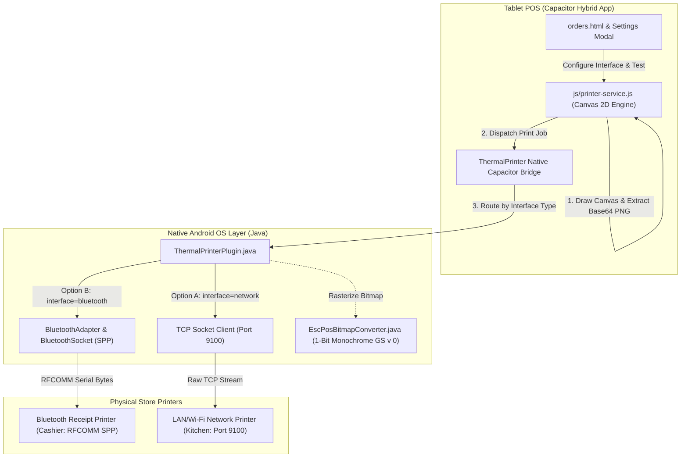

# PDP: Android POS Bluetooth Classic (SPP) ESC/POS Thermal Printing Architecture [New]

| Status | Proposed / Approved via `/grill-me` |
| :--- | :--- |
| **Author** | Principal Systems Architect |
| **Target Platforms** | Android Tablet (Lenovo Tab M8, Samsung Galaxy Tab, Pixel) & Web POS |
| **Repository Scope** | `apps/android-pos/`, `js/printer-service.js`, `orders.html`, `js/orders-settings.js`, `js/orders-i18n.js` |
| **Target Branch** | `dev` |

---

## 1. Executive Summary & Objectives

### 1.1 Problem Statement
While the current TCP/IP network socket thermal printing system provides high performance over Wi-Fi/LAN routers, many F&B kiosks, food trucks, night-market stalls, and pop-up locations operate **without a dedicated local Wi-Fi router or fixed Ethernet infrastructure**. In these environments, store operators rely on **portable or desktop Bluetooth thermal receipt printers** (Epson, Xprinter, Sunmi, Rongta, Zywell) paired directly to the POS tablet.

### 1.2 Objectives (In-Scope)
1. **Bluetooth Classic RFCOMM / SPP Protocol (`00001101-0000-1000-8000-00805F9B34FB`)**: Direct serial socket stream support for 99% of commercial ESC/POS thermal printers.
2. **Paired Devices Discovery Bridge**: Native Android API bridge (`BluetoothAdapter.getBondedDevices()`) allowing store staff to pair once in Android OS Settings and select the printer by Name & MAC address from a dropdown in POS Settings.
3. **Hybrid Multi-Interface Architecture**: Independent per-station transport selection (`interface_type: 'network' | 'bluetooth'`), allowing Cashier on Bluetooth and Kitchen on TCP/IP (or both on Bluetooth).
4. **Unified Canvas 2D Bitmap Pipeline**: Reuses our 1-bit monochrome raster engine (`EscPosBitmapConverter`), guaranteeing 100% crisp Traditional Chinese (`zh-TW`) and Vietnamese (`vi`) font rendering without printer ROM font dependencies.
5. **Runtime Android Bluetooth Permissions**: Full compliance with modern Android 12+ (`BLUETOOTH_CONNECT`, `BLUETOOTH_SCAN`) and Android 11- permissions.
6. **Graceful Web Fallback**: Seamless preview simulator when POS is operated in standard desktop web browsers.

### 1.3 Non-Goals (Out-of-Scope)
- Modifying Cloudflare Worker backend or database schemas (printing configuration is client-side store hardware state).
- Proprietary proprietary cloud printing APIs (Star CloudPRNT, Epson Omnilink Cloud).

---

## 2. System Architecture & Component Topology



---

## 3. Data Schema & Configuration Model

### 3.1 Printer Settings Schema (`pos_printer_settings_${tenantId}`)
```typescript
interface StationConfig {
  enabled: boolean;
  interface_type: 'network' | 'bluetooth'; // Hybrid selection
  // Network TCP/IP fields
  ip?: string;
  port?: number; // default: 9100
  // Bluetooth Classic fields
  mac_address?: string; // e.g. "00:11:22:33:44:55"
  device_name?: string;  // e.g. "XP-58IIH"
  // Hardware parameters
  paperWidth: 80 | 58;
  autoCut: boolean;
}

interface POSPrinterSettings {
  autoPrintNewOrders: boolean;
  cashier: StationConfig;
  kitchen: StationConfig;
}
```

---

## 4. Native Android Implementation Specification

### 4.1 Android Manifest Permissions (`AndroidManifest.xml`)
```xml
<!-- Bluetooth Permissions for Android 11 and older -->
<uses-permission android:name="android.permission.BLUETOOTH" android:maxSdkVersion="30" />
<uses-permission android:name="android.permission.BLUETOOTH_ADMIN" android:maxSdkVersion="30" />
<uses-permission android:name="android.permission.ACCESS_FINE_LOCATION" android:maxSdkVersion="30" />

<!-- Bluetooth Permissions for Android 12+ (API 31+) -->
<uses-permission android:name="android.permission.BLUETOOTH_CONNECT" />
<uses-permission android:name="android.permission.BLUETOOTH_SCAN" android:usesPermissionFlags="neverForLocation" />
```

### 4.2 Native Plugin Methods (`ThermalPrinterPlugin.java`)

1. **`getPairedBluetoothDevices(PluginCall call)`**:
   - Queries `BluetoothAdapter.getDefaultAdapter().getBondedDevices()`.
   - Returns list of `{ name: string, address: string, type: string }`.
2. **`printBluetooth(PluginCall call)`**:
   - Parameters: `{ macAddress: string, data?: string, base64Image?: string, paperWidth: number, autoCut: boolean, timeoutMs: number }`.
   - Connects to Bluetooth device via standard SPP UUID:
     `UUID.fromString("00001101-0000-1000-8000-00805F9B34FB")`.
   - Transmits ESC/POS byte stream and flushes.
3. **`testBluetoothConnection(PluginCall call)`**:
   - Verifies RFCOMM socket handshake with device.

---

## 5. UI/UX & I18N Integration

### 5.1 Settings Interface (`orders.html` & `orders-settings.js`)
- Add **Interface Type Radio/Dropdown** for each station:
  - 🌐 **Mạng LAN / Wi-Fi (TCP/IP)**: Displays IP Address & Port inputs.
  - 📡 **Bluetooth (Không dây)**: Displays Paired Device dropdown + "🔄 Quét lại thiết bị" button.
- Dynamically loads paired Bluetooth devices upon opening Settings.

### 5.2 I18N Localization (`js/orders-i18n.js`)
Complete key coverage in both **繁體中文 (`zh-TW`)** and **Tiếng Việt (`vi`)**:
- `printer_interface_type`: `連線方式` / `Hình thức kết nối`
- `printer_interface_network`: `區域網路 (TCP/IP)` / `Mạng nội bộ (LAN / Wi-Fi)`
- `printer_interface_bluetooth`: `藍牙連線 (Bluetooth)` / `Kết nối Bluetooth`
- `printer_select_bt_device`: `選擇已配對藍牙裝置` / `Chọn thiết bị Bluetooth đã ghép đôi`
- `printer_refresh_bt`: `重新整理藍牙清單` / `Quét lại Bluetooth`
- `printer_bt_no_devices`: `未發現已配對的藍牙印表機，請先至 Android 設定中完成配對` / `Chưa có máy in Bluetooth nào được ghép đôi. Vui lòng ghép đôi trong Cài đặt Android trước.`

---

## 6. Verification & Rollout Plan

### 6.1 Automated Verification (`tests/test_printer_system.js`)
- Unit test for Bluetooth payload generation.
- Unit test for hybrid configuration persistence (Cashier BT + Kitchen TCP).

### 6.2 Manual Test Protocol
1. Pair Bluetooth receipt printer in Android OS Bluetooth Settings.
2. Open Benmi POS Settings -> Select Bluetooth interface -> Choose printer from dropdown.
3. Click "Test Print" -> Verify instant physical thermal receipt printout.
