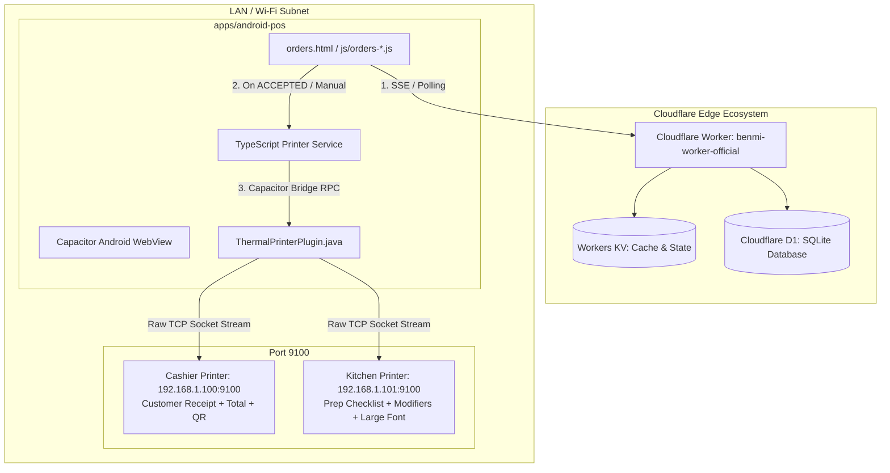

# PDP: Android Hybrid POS & Silent ESC/POS Thermal Printing Architecture (New Subsystem)

---

## 1. Executive Summary & Objectives

### Problem Statement
Store staff currently operate the Benmi POS dashboard (`orders.html`) via standard web browsers on tablets or PCs. While this works well for viewing and accepting orders, physical receipt printing in standard browsers suffers from major operational bottlenecks:
1. Standard browser printing invokes OS-level print dialogs (`window.print()`), requiring manual confirmation on every order and breaking the speed of high-volume F&B quầy / kitchen operations.
2. Bluetooth / USB Web Print APIs lack reliability across varied Android tablet hardware and cannot perform direct background raw TCP socket communication to commercial LAN/Wi-Fi thermal printers.
3. Traditional Chinese (`zh-TW`) and Vietnamese (`vi`) diacritic rendering often outputs garbled characters on commercial ESC/POS printers due to hardware ROM and code page limitations.

### Goals (In-Scope)
- **Zero-Touch Silent Printing**: Direct raw TCP socket streaming over LAN/Wi-Fi (`[PRINTER_IP]:9100`) bypassing all Android OS dialogs with `< 200ms` transmission latency.
- **Dual Station Support**: Independent routing for **Cashier Printer** (full customer receipt with pricing & branding) and **Kitchen Printer** (large-type production ticket with itemized modifiers).
- **Hybrid Rendering Engine**: 
  - **Graphic Raster Mode (`GS v 0`)**: Converts HTML/Canvas receipts into 1-bit monochrome bitmaps in native Java, guaranteeing 100% pixel-perfect rendering of Traditional Chinese, Vietnamese accents, logos, and QR codes across any ESC/POS brand (Epson, Xprinter, Rongta, Star, Sunmi).
  - **Raw Text Mode**: High-speed byte streaming using `Big5` / `UTF-8` with ESC/POS styling commands for text-only operations.
- **Strict Scope Isolation**: Package only the frontend web application in a dedicated subfolder (`apps/android-pos/`). The Cloudflare Worker (`benmi-worker-official/`) remains completely untouched on the cloud edge.
- **Deduplicated Acceptance Trigger**: Auto-print immediately upon order transition to `ACCEPTED` state (with manual reprint action on order cards) and persistent print tracking to prevent duplicate receipts during network reconnects.

### Non-Goals (Out-of-Scope)
- No modifications to the Cloudflare Worker architecture, D1 database schemas, or cloud deployment pipelines.
- No cloud-to-printer tunneling (e.g. Google Cloud Print / MQTT broker on printer). All printer communication occurs strictly on the local store LAN/Wi-Fi subnet.

---

## 2. System Architecture & Context

### High-Level Topology



---

## 3. Detailed Component Design

### A. Repository & Directory Structure

To keep the Cloudflare backend and root static web assets clean, the Android app lives in a dedicated subproject:

```
benmi-order/
├── index.html                   # Customer Menu (Cloudflare Pages)
├── orders.html                  # POS Dashboard
├── css/ & js/                   # Core Web Frontend Assets
├── benmi-worker-official/       # Cloudflare Workers Backend (Untouched)
└── apps/
    └── android-pos/             # Dedicated Android POS Hybrid Subproject
        ├── package.json         # Capacitor dependencies
        ├── capacitor.config.ts  # Capacitor configuration
        ├── build.sh             # Web assets sync script
        ├── src/                 # Print service & bridge
        │   └── services/
        │       ├── printerService.ts
        │       └── escposBuilder.ts
        └── android/             # Generated Native Android Studio Project
            ├── app/src/main/
            │   ├── AndroidManifest.xml
            │   └── java/com/benmi/pos/
            │       ├── MainActivity.java
            │       └── ThermalPrinterPlugin.java
```

---

### B. Native Android Plugin (`ThermalPrinterPlugin.java`)

The custom Capacitor plugin handles low-level raw TCP socket connections and byte transmission to LAN printers with strict timeouts and error handling:

```java
package com.benmi.pos;

import android.graphics.Bitmap;
import android.graphics.BitmapFactory;
import android.util.Base64;
import com.getcapacitor.JSObject;
import com.getcapacitor.Plugin;
import com.getcapacitor.PluginCall;
import com.getcapacitor.PluginMethod;
import com.getcapacitor.annotation.CapacitorPlugin;

import java.io.OutputStream;
import java.net.InetSocketAddress;
import java.net.Socket;

@CapacitorPlugin(name = "ThermalPrinter")
public class ThermalPrinterPlugin extends Plugin {

    @PluginMethod
    public void printRaw(PluginCall call) {
        String host = call.getString("host");
        Integer port = call.getInt("port", 9100);
        String base64Data = call.getString("data");

        if (host == null || base64Data == null) {
            call.reject("Missing required parameters: host or data");
            return;
        }

        new Thread(() -> {
            Socket socket = new Socket();
            try {
                byte[] bytes = Base64.decode(base64Data, Base64.DEFAULT);
                socket.connect(new InetSocketAddress(host, port), 3000); // 3s connect timeout
                socket.setSoTimeout(5000); // 5s read/write timeout

                OutputStream out = socket.getOutputStream();
                out.write(bytes);
                out.flush();
                socket.close();

                JSObject ret = new JSObject();
                ret.put("success", true);
                call.resolve(ret);
            } catch (Exception e) {
                try { socket.close(); } catch (Exception ignored) {}
                call.reject("Print socket failed: " + e.getMessage(), e);
            }
        }).start();
    }

    @PluginMethod
    public void printRasterBitmap(PluginCall call) {
        String host = call.getString("host");
        Integer port = call.getInt("port", 9100);
        String base64Image = call.getString("imageBase64");
        Integer paperWidth = call.getInt("paperWidth", 80); // 80mm or 58mm

        if (host == null || base64Image == null) {
            call.reject("Missing host or imageBase64");
            return;
        }

        new Thread(() -> {
            Socket socket = new Socket();
            try {
                byte[] imgBytes = Base64.decode(base64Image, Base64.DEFAULT);
                Bitmap bitmap = BitmapFactory.decodeByteArray(imgBytes, 0, imgBytes.length);
                if (bitmap == null) {
                    call.reject("Failed to decode image bitmap");
                    return;
                }

                byte[] rasterEscPos = EscPosBitmapConverter.convertBitmapToRasterEscPos(bitmap, paperWidth);

                socket.connect(new InetSocketAddress(host, port), 3000);
                OutputStream out = socket.getOutputStream();
                out.write(rasterEscPos);
                out.flush();
                socket.close();

                JSObject ret = new JSObject();
                ret.put("success", true);
                call.resolve(ret);
            } catch (Exception e) {
                try { socket.close(); } catch (Exception ignored) {}
                call.reject("Bitmap print failed: " + e.getMessage(), e);
            }
        }).start();
    }
}
```

---

### C. ESC/POS Buffer Builder & Multi-Station Routing (`escposBuilder.ts`)

```typescript
export interface PrinterConfig {
  enabled: boolean;
  ip: string;
  port: number;
  mode: 'raster' | 'text';
  paperWidth: 80 | 58;
  autoCut: boolean;
}

export interface DualPrinterSettings {
  cashier: PrinterConfig;
  kitchen: PrinterConfig;
  autoPrintOnAccept: boolean;
}

export class EscPosBuilder {
  private buffer: number[] = [];

  init(): this {
    this.buffer.push(0x1B, 0x40); // ESC @ (Initialize)
    return this;
  }

  align(align: 'left' | 'center' | 'right'): this {
    const val = align === 'center' ? 1 : (align === 'right' ? 2 : 0);
    this.buffer.push(0x1B, 0x61, val);
    return this;
  }

  bold(enable: boolean): this {
    this.buffer.push(0x1B, 0x45, enable ? 1 : 0);
    return this;
  }

  textSize(width: number = 1, height: number = 1): this {
    const n = ((width - 1) << 4) | (height - 1);
    this.buffer.push(0x1D, 0x21, n);
    return this;
  }

  feed(lines: number = 1): this {
    for (let i = 0; i < lines; i++) this.buffer.push(0x0A);
    return this;
  }

  cut(partial: boolean = false): this {
    this.buffer.push(0x1D, 0x56, partial ? 0x01 : 0x00);
    return this;
  }

  text(str: string): this {
    // Encodes characters using Big5 / UTF-8 array
    const encoder = new TextEncoder();
    const bytes = encoder.encode(str);
    for (let b of bytes) this.buffer.push(b);
    return this;
  }

  getUint8Array(): Uint8Array {
    return new Uint8Array(this.buffer);
  }

  getBase64(): string {
    let binary = '';
    const bytes = this.getUint8Array();
    for (let i = 0; i < bytes.byteLength; i++) {
      binary += String.fromCharCode(bytes[i]);
    }
    return btoa(binary);
  }
}
```

---

### D. Dual Receipt Generators (Cashier vs Kitchen)

1. **Cashier Receipt (`buildCashierReceipt(order, tenant)`)**:
   - Header: Store Name (`brandName`), Address, Phone.
   - Meta: Order `#KEY`, Table/Dining Type, Pickup Time, Date.
   - Items: Itemized list with customization details, item quantities, and subtotal prices.
   - Summary: Total Amount `$XXX`, Payment Status (`PAID` / `CASH`), Customer Notes.
   - Footer: Thank you message, QR code link.
   - Cutter: `GS V 0`.

2. **Kitchen Checklist (`buildKitchenTicket(order)`)**:
   - Header: Large Bold Header `【廚房出單】 - #${order.key}`.
   - Dining Type: `【內用 桌號: X】` or `【外帶自取】` (Double-height text).
   - Time: `預計取餐: HH:MM`.
   - Items: Item name with bold modifier tags (e.g. `✦ 辣度: 大辣`, `✦ 不加香菜`, `✦ 加蛋 x1`). **No prices**.
   - Cutter: `GS V 1` (Partial Cut).

---

## 4. Frontend POS Integration Flow

### Automatic Print on Order Acceptance
In `js/orders-live.js` (inside `acceptOrder(orderKey)`):

```javascript
async function acceptOrder(orderKey) {
  // 1. Send accept status to Cloudflare Worker
  const res = await updateOrderStatus(orderKey, "ACCEPTED");
  
  if (res && res.success) {
    // 2. Trigger Dual Station Silent Print via Local Native Bridge
    if (window.PrinterService && window.PrinterService.isSupported()) {
      const order = getOrderFromState(orderKey);
      if (order && !isOrderAlreadyPrinted(orderKey)) {
        window.PrinterService.printDualStation(order)
          .then(() => markOrderAsPrinted(orderKey))
          .catch((err) => console.warn("[Printer] Auto-print error:", err));
      }
    }
  }
}
```

### In-App Printer Settings Modal in POS Dashboard
A dedicated **Printer Settings (印表機設定)** card added to the Settings tab in `orders.html`:
- **Cashier Printer (櫃檯印表機)**: Toggle On/Off, IP Address input (Default: `192.168.1.100`), Port (9100), Paper Width (`80mm` / `58mm`), Test Print button.
- **Kitchen Printer (廚房印表機)**: Toggle On/Off, IP Address input (Default: `192.168.1.101`), Port (9100), Paper Width (`80mm` / `58mm`), Test Print button.
- **Print Trigger**: Auto-print on order acceptance toggle.

---

## 5. Android Manifest & Kiosk Configuration

### Android Permissions & Cleartext Traffic
In `android/app/src/main/AndroidManifest.xml`:
```xml
<manifest xmlns:android="http://schemas.android.com/apk/res/android">
    <uses-permission android:name="android.permission.INTERNET" />
    <uses-permission android:name="android.permission.ACCESS_NETWORK_STATE" />
    <uses-permission android:name="android.permission.ACCESS_WIFI_STATE" />
    <uses-permission android:name="android.permission.WAKE_LOCK" />

    <application
        android:allowBackup="true"
        android:icon="@mipmap/ic_launcher"
        android:label="Benmi POS"
        android:roundIcon="@mipmap/ic_launcher_round"
        android:supportsRtl="true"
        android:theme="@style/AppTheme"
        android:usesCleartextTraffic="true">
        
        <activity
            android:configChanges="orientation|keyboardHidden|keyboard|screenSize|locale|smallestScreenSize|screenLayout|uiMode"
            android:name=".MainActivity"
            android:label="Benmi POS"
            android:theme="@style/AppTheme.NoActionBarLaunch"
            android:launchMode="singleTask"
            android:exported="true">
            <intent-filter>
                <action android:name="android.intent.action.MAIN" />
                <category android:name="android.intent.category.LAUNCHER" />
            </intent-filter>
        </activity>
    </application>
</manifest>
```

### Tablet Kiosk & Operational Readiness
1. **Battery Optimization Exclusion**: The app prompts staff or instructs admin to disable battery optimization (`Battery -> Unrestricted`) to ensure background WebSockets/SSE and Wi-Fi sockets never drop in standby.
2. **Screen Pinning (App Pinning)**: Android Settings -> Security -> App Pinning enables dedicated single-app tablet operation preventing accidental exits.
3. **Screen Always On (`FLAG_KEEP_SCREEN_ON`)**: Configured in `MainActivity.java` so tablet display never dims during store hours.

---

## 6. Implementation Milestones & Execution Plan

- [ ] **Milestone 1: Project Scaffolding (`apps/android-pos`)**
  - Initialize Capacitor 6.x environment under `apps/android-pos/`.
  - Create `build.sh` script to bundle static frontend (`orders.html`, `js/`, `css/`) into Capacitor `webDir`.
- [ ] **Milestone 2: Native Android ESC/POS Socket Plugin**
  - Implement `ThermalPrinterPlugin.java` and `EscPosBitmapConverter.java`.
  - Register plugin in `MainActivity.java` with `FLAG_KEEP_SCREEN_ON` and cleartext network permissions.
- [ ] **Milestone 3: TypeScript Printer Service & Dual-Station Engine**
  - Create `escposBuilder.ts` and `printerService.ts`.
  - Implement Cashier receipt and Kitchen prep ticket templates.
- [ ] **Milestone 4: POS UI Integration & Settings Management**
  - Add Printer Settings section to `orders.html` & `js/orders-settings.js`.
  - Hook auto-print trigger into `acceptOrder()` in `js/orders-live.js`.
  - Add manual "Print Receipt" and "Print Kitchen" action buttons to POS order cards.
- [ ] **Milestone 5: Verification & End-to-End Testing**
  - Test print with simulated/real ESC/POS thermal printers on port 9100.
  - Verify Traditional Chinese and Vietnamese typography rendering in both raster and text modes.

---

## 7. Verification & Testing Plan

### Automated & Unit Tests
- Test ESC/POS buffer byte serialization (Verify `ESC @`, `GS v 0`, `GS V 0` headers).
- Test base64 encoding and payload validity.

### Manual Verification
1. **Test Print Connection**:
   - Open POS Settings -> Enter Printer IP (e.g., `192.168.1.100`) -> Click "Test Print" -> Verify thermal printer prints connection confirmation slip.
2. **Dual Station Auto-Print**:
   - Receive a test order on POS -> Click "接單 (Accept)" -> Verify Cashier printer outputs customer receipt with prices and Kitchen printer outputs prep ticket without prices.
3. **Character Rendering Quality**:
   - Verify Traditional Chinese (`越式招牌麵包`, `打拋豬`) and Vietnamese (`Bánh mì thịt băm`) render with crisp, clear typography without garbled characters.
