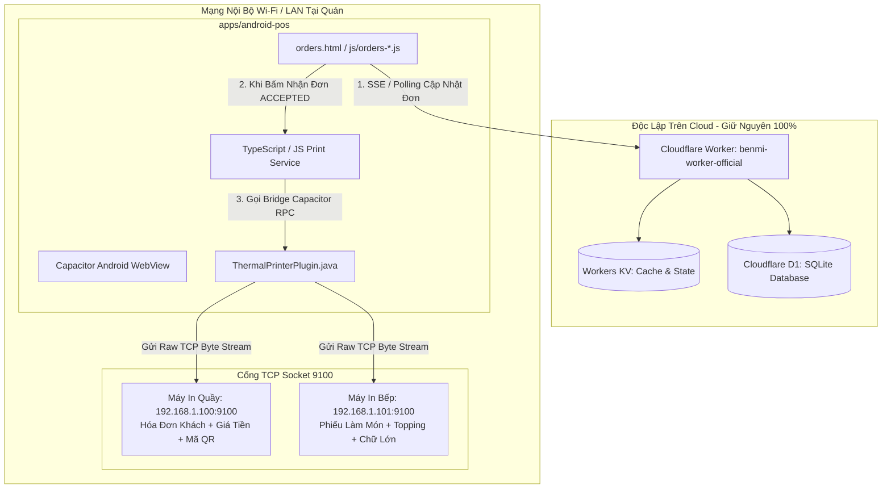

# PDP: Kiến Trúc Ứng Dụng Android Hybrid POS & Hệ Thống In Nhiệt ESC/POS Tự Động (Silent Printing)

---

## 1. Tóm Tắt Điều Hành & Mục Tiêu (Executive Summary & Objectives)

### A. Bối Cảnh & Vấn Đề Hiện Tại (Problem Statement)
Nhân viên tại quầy hiện đang vận hành bảng quản lý đơn hàng POS (`orders.html`) qua trình duyệt web trên máy tính bảng (Tablet/iPad) hoặc máy tính bàn. Mặc dù giao diện web đáp ứng tốt việc hiển thị và nhận đơn theo thời gian thực, cơ chế in hóa đơn vật lý qua trình duyệt web tiêu chuẩn gặp phải các rào cản vận hành nghiêm trọng:
1. **Hộp thoại in gián đoạn (Browser Print Dialog)**: Lệnh in tiêu chuẩn của trình duyệt (`window.print()`) luôn mở popup xác nhận của hệ điều hành, yêu cầu nhân viên phải bấm thêm 1-2 bước thủ công cho mỗi đơn hàng, làm chậm tốc độ xử lý trong giờ cao điểm của quán.
2. **Hạn chế giao tiếp phần cứng trên Web**: Trình duyệt di động bị giới hạn bảo mật Sandbox, không thể mở trực tiếp luồng kết nối **TCP Socket (Cổng 9100)** tới các máy in nhiệt thương mại trong mạng nội bộ (LAN / Wi-Fi).
3. **Lỗi hiển thị ký tự (Encoding & Font Corruption)**: Các dòng máy in nhiệt ESC/POS thông dụng thường không tích hợp sẵn ROM ký tự tiếng Trung phồn thể (`zh-TW`) hoặc tiếng Việt có dấu (`vi`), dẫn đến tình trạng in ra ký tự rác (garbled `???`) nếu chỉ gửi văn bản thuần.

### B. Mục Tiêu Trong Phạm Vi (Goals / In-Scope)
- **In Tự Động Không Tiếng Động (Zero-Touch Silent Printing)**: Truyền dữ liệu trực tiếp qua kết nối mạng nội bộ LAN/Wi-Fi TCP Socket (`[PRINTER_IP]:9100`), bỏ qua hoàn toàn mọi hộp thoại xác nhận của Android với độ trễ truyền tải `< 200ms`.
- **Hỗ Trợ 2 Trạm In Độc Lập (Dual-Station Routing)**:
  - **Máy in Quầy (Cashier Printer)**: In hóa đơn thanh toán đầy đủ cho khách (kèm giá tiền, chi tiết tùy biến, tổng tiền, phương thức thanh toán và mã QR).
  - **Máy in Bếp (Kitchen Printer)**: In phiếu chế biến cho bếp font chữ lớn (kèm số bàn/hình thức ăn, danh sách món, lưu ý gia vị/topping, **không hiện giá tiền**).
- **Bộ Xử Lý Đồ Họa Hybrid (Hybrid Rendering Engine)**:
  - **Chế độ Raster Bitmap (`GS v 0`)**: Chuyển đổi giao diện hóa đơn HTML/Canvas thành ảnh Bitmap đơn sắc 1-bit trong Native Java, đảm bảo **100% hiển thị sắc nét tiếng Trung phồn thể, tiếng Việt có dấu, logo thương hiệu và mã QR** trên mọi thương hiệu máy in (Epson, Xprinter, Rongta, Star, Sunmi).
  - **Chế độ Raw Text**: Truyền chuỗi byte tốc độ cao mã hóa `Big5` / `UTF-8` kèm các mã lệnh định dạng ESC/POS tiêu chuẩn.
- **Cô Lập Phạm Vi Tuyệt Đối (Strict Scope Separation)**: Đóng gói duy nhất mã nguồn giao diện Web Frontend vào thư mục con `apps/android-pos/`. Giữ nguyên 100% toàn bộ hệ thống Cloudflare Worker backend (`benmi-worker-official/`) chạy độc lập trên Cloudflare Edge.
- **Kích Hoạt Khi Nhận Đơn (`ACCEPTED`) & Chống In Trùng**: Tự động kích hoạt in ngay khi nhân viên bấm **Nhận đơn (接單)** trên POS, đồng thời lưu vết bộ nhớ (Deduplication Set) để chống in trùng lặp khi mạng chập chờn hoặc tải lại trang.

### C. Ngoài Phạm Vi (Non-Goals / Out-of-Scope)
- Không can thiệp, chỉnh sửa cấu trúc Worker, cơ sở dữ liệu D1 hay Cloudflare KV backend.
- Không sử dụng giải pháp in qua đám mây trung gian (Cloud Print / MQTT broker). Toàn bộ luồng in diễn ra trực tiếp giữa máy tính bảng và máy in trong cùng mạng Wi-Fi/LAN của quán.

---

## 2. Bối Cảnh & Kiến Trúc Hệ Thống (System Architecture)

### Sơ Đồ Khối Tổng Thể (System Topology)



---

## 3. Thiết Kế Chi Tiết Các Thành Phần (Detailed Component Design)

### A. Cấu Trúc Thư Mục Dự Án (Project Structure)

Ứng dụng Android được tổ chức trong thư mục con độc lập `apps/android-pos/` để không làm xáo trộn cấu trúc repository gốc:

```
benmi-order/
├── index.html                   # Menu đặt món khách hàng (Cloudflare Pages)
├── orders.html                  # Giao diện POS quản lý đơn hàng
├── css/ & js/                   # Toàn bộ mã nguồn Web Frontend
├── benmi-worker-official/       # Backend Cloudflare Worker (Giữ nguyên)
└── apps/
    └── android-pos/             # Dự án con Android Hybrid App (Capacitor)
        ├── package.json         # Khai báo thư viện @capacitor/core, @capacitor/android
        ├── capacitor.config.ts  # Cấu hình Capacitor (appId: com.benmi.pos)
        ├── build.sh             # Script đồng bộ web assets từ root vào dist/
        ├── src/                 # Print service & bridge
        │   └── services/
        │       ├── printerService.ts
        │       └── escposBuilder.ts
        └── android/             # Mã nguồn Native Android Studio
            ├── app/src/main/
            │   ├── AndroidManifest.xml
            │   └── java/com/benmi/pos/
            │       ├── MainActivity.java
            │       ├── ThermalPrinterPlugin.java
            │       └── EscPosBitmapConverter.java
```

---

### B. Native Android Plugin (`ThermalPrinterPlugin.java`)

Plugin Java tùy chỉnh chịu trách nhiệm mở kết nối TCP Socket trực tiếp với máy in trong mạng nội bộ, thiết lập thời gian chờ (Timeout) và xử lý lỗi ngắt kết nối:

```java
package com.benmi.pos;

import android.graphics.Bitmap;
import android.graphics.BitmapFactory;
import android.util.Base64;
import com.getcapacitor.JSObject;
import com.getcapacitor.Plugin;
import com.getcapacitor.PluginCall;
import com.getcapacitor.PluginMethod;
import com.getcapacitor.annotation.CapacitorPlugin;

import java.io.OutputStream;
import java.net.InetSocketAddress;
import java.net.Socket;

@CapacitorPlugin(name = "ThermalPrinter")
public class ThermalPrinterPlugin extends Plugin {

    @PluginMethod
    public void printRaw(PluginCall call) {
        String host = call.getString("host");
        Integer port = call.getInt("port", 9100);
        String base64Data = call.getString("data");

        if (host == null || base64Data == null) {
            call.reject("Thiếu tham số bắt buộc: host hoặc data");
            return;
        }

        new Thread(() -> {
            Socket socket = new Socket();
            try {
                byte[] bytes = Base64.decode(base64Data, Base64.DEFAULT);
                socket.connect(new InetSocketAddress(host, port), 3000); // Timeout kết nối 3s
                socket.setSoTimeout(5000); // Timeout đọc/ghi 5s

                OutputStream out = socket.getOutputStream();
                out.write(bytes);
                out.flush();
                socket.close();

                JSObject ret = new JSObject();
                ret.put("success", true);
                call.resolve(ret);
            } catch (Exception e) {
                try { socket.close(); } catch (Exception ignored) {}
                call.reject("Lỗi kết nối máy in: " + e.getMessage(), e);
            }
        }).start();
    }

    @PluginMethod
    public void printRasterBitmap(PluginCall call) {
        String host = call.getString("host");
        Integer port = call.getInt("port", 9100);
        String base64Image = call.getString("imageBase64");
        Integer paperWidth = call.getInt("paperWidth", 80); // Khổ 80mm hoặc 58mm

        if (host == null || base64Image == null) {
            call.reject("Thiếu tham số bắt buộc: host hoặc imageBase64");
            return;
        }

        new Thread(() -> {
            Socket socket = new Socket();
            try {
                byte[] imgBytes = Base64.decode(base64Image, Base64.DEFAULT);
                Bitmap bitmap = BitmapFactory.decodeByteArray(imgBytes, 0, imgBytes.length);
                if (bitmap == null) {
                    call.reject("Không thể giải mã ảnh Bitmap");
                    return;
                }

                // Chuyển đổi Bitmap sang chuỗi byte lệnh ESC/POS Raster (GS v 0)
                byte[] rasterEscPos = EscPosBitmapConverter.convertBitmapToRasterEscPos(bitmap, paperWidth);

                socket.connect(new InetSocketAddress(host, port), 3000);
                OutputStream out = socket.getOutputStream();
                out.write(rasterEscPos);
                out.flush();
                socket.close();

                JSObject ret = new JSObject();
                ret.put("success", true);
                call.resolve(ret);
            } catch (Exception e) {
                try { socket.close(); } catch (Exception ignored) {}
                call.reject("Lỗi in ảnh Bitmap: " + e.getMessage(), e);
            }
        }).start();
    }
}
```

---

### C. Bộ Chuyển Đổi Ảnh Đơn Sắc Raster ESC/POS (`EscPosBitmapConverter.java`)

Thuật toán chuyển ảnh sang 1-bit Monochrome Raster (`GS v 0`) để đảm bảo chất lượng in sắc nét cho mọi ngôn ngữ:

```java
package com.benmi.pos;

import android.graphics.Bitmap;
import android.graphics.Color;
import java.io.ByteArrayOutputStream;

public class EscPosBitmapConverter {

    public static byte[] convertBitmapToRasterEscPos(Bitmap bitmap, int paperWidthMm) {
        // Khổ 80mm: 576 dots; Khổ 58mm: 384 dots
        int targetWidth = (paperWidthMm == 58) ? 384 : 576;
        int targetHeight = (int) ((float) bitmap.getHeight() * ((float) targetWidth / (float) bitmap.getWidth()));
        Bitmap scaledBitmap = Bitmap.createScaledBitmap(bitmap, targetWidth, targetHeight, true);

        ByteArrayOutputStream stream = new ByteArrayOutputStream();
        
        // 1. Khởi tạo máy in: ESC @
        stream.write(0x1B);
        stream.write(0x40);

        // 2. Căn giữa: ESC a 1
        stream.write(0x1B);
        stream.write(0x61);
        stream.write(0x01);

        // 3. Lệnh in Raster Bit Image: GS v 0 m xL xH yL yH
        int widthBytes = (targetWidth + 7) / 8;
        int heightPixels = targetHeight;

        stream.write(0x1D);
        stream.write(0x76);
        stream.write(0x30);
        stream.write(0x00); // Chế độ chuẩn (Normal mode)
        stream.write(widthBytes & 0xFF);
        stream.write((widthBytes >> 8) & 0xFF);
        stream.write(heightPixels & 0xFF);
        stream.write((heightPixels >> 8) & 0xFF);

        // 4. Dithering chuyển đổi từng điểm ảnh (Pixel) sang 1-bit byte stream
        for (int y = 0; y < targetHeight; y++) {
            for (int xByte = 0; xByte < widthBytes; xByte++) {
                byte b = 0;
                for (int bit = 0; bit < 8; bit++) {
                    int x = xByte * 8 + bit;
                    if (x < targetWidth) {
                        int pixel = scaledBitmap.getPixel(x, y);
                        int r = Color.red(pixel);
                        int g = Color.green(pixel);
                        int bVal = Color.blue(pixel);
                        int luminance = (int) (0.299 * r + 0.587 * g + 0.114 * bVal);
                        if (luminance < 160) { // Ngưỡng màu đen (Dot on)
                            b |= (byte) (1 << (7 - bit));
                        }
                    }
                }
                stream.write(b);
            }
        }

        // 5. Đẩy giấy 4 dòng và Cắt giấy: GS V 0
        stream.write(0x1B);
        stream.write(0x64);
        stream.write(0x04);
        stream.write(0x1D);
        stream.write(0x56);
        stream.write(0x00);

        return stream.toByteArray();
    }
}
```

---

### D. Bộ Xây Dựng Lệnh ESC/POS (`escposBuilder.ts`)

```typescript
export interface PrinterStationConfig {
  enabled: boolean;
  ip: string;
  port: number;
  mode: 'raster' | 'text';
  paperWidth: 80 | 58;
  autoCut: boolean;
}

export interface POSPrinterSettings {
  cashier: PrinterStationConfig;
  kitchen: PrinterStationConfig;
  autoPrintOnAccept: boolean;
}

export class EscPosBuilder {
  private buffer: number[] = [];

  init(): this {
    this.buffer.push(0x1B, 0x40); // ESC @ (Khởi tạo máy in)
    return this;
  }

  align(align: 'left' | 'center' | 'right'): this {
    const val = align === 'center' ? 1 : (align === 'right' ? 2 : 0);
    this.buffer.push(0x1B, 0x61, val);
    return this;
  }

  bold(enable: boolean): this {
    this.buffer.push(0x1B, 0x45, enable ? 1 : 0);
    return this;
  }

  textSize(width: number = 1, height: number = 1): this {
    const n = ((width - 1) << 4) | (height - 1);
    this.buffer.push(0x1D, 0x21, n);
    return this;
  }

  feed(lines: number = 1): this {
    for (let i = 0; i < lines; i++) this.buffer.push(0x0A);
    return this;
  }

  cut(partial: boolean = false): this {
    this.buffer.push(0x1D, 0x56, partial ? 0x01 : 0x00);
    return this;
  }

  text(str: string): this {
    const encoder = new TextEncoder();
    const bytes = encoder.encode(str);
    for (let b of bytes) this.buffer.push(b);
    return this;
  }

  getUint8Array(): Uint8Array {
    return new Uint8Array(this.buffer);
  }

  getBase64(): string {
    let binary = '';
    const bytes = this.getUint8Array();
    for (let i = 0; i < bytes.byteLength; i++) {
      binary += String.fromCharCode(bytes[i]);
    }
    return btoa(binary);
  }
}
```

---

### E. Mẫu Định Dạng Hóa Đơn (Cashier Receipt vs Kitchen Ticket)

1. **Mẫu Hóa Đơn Quầy (Cashier Receipt)**:
   - **Tiêu đề**: Tên quán (`brandName`), Địa chỉ, Số điện thoại hotline.
   - **Thông tin đơn**: Mã đơn `#KEY`, Hình thức ăn (`【內用 桌號: X】` / `【外帶自取】`), Giờ nhận hàng, Ngày giờ tạo đơn.
   - **Chi tiết món**: Tên món, số lượng, tùy chọn gia vị/topping, đơn giá và thành tiền.
   - **Tổng tiền**: Tổng thanh toán `$XXX`, Trạng thái thanh toán (`已付款` / `現場付款`), Ghi chú của khách.
   - **Chân trang**: Lời cảm ơn, mã QR tra cứu tiến độ đơn.
   - **Lệnh cắt**: `GS V 0` (Cắt toàn phần).

2. **Mẫu Phiếu Chế Biến Bếp (Kitchen Ticket)**:
   - **Tiêu đề**: Chữ lớn in đậm `【廚房出單】 - #${order.key}`.
   - **Hình thức ăn**: Chữ phóng to gấp đôi `【內用 桌號: X】` hoặc `【外帶自取】`.
   - **Giờ nhận hàng**: `預計取餐: HH:MM`.
   - **Chi tiết món**: Tên món in đậm, danh sách chi tiết các tùy biến gia vị (ví dụ: `✦ 辣度: 大辣`, `✦ 不加香菜`, `✦ 加蛋 x1`). **Tuyệt đối không hiện giá tiền**.
   - **Lệnh cắt**: `GS V 1` (Cắt một phần / Partial Cut).

---

## 4. Tích Hợp Vào Giao Diện POS (`orders.html` / `js/`)

### A. Tự Động Kích Hoạt Khi Nhận Đơn (`acceptOrder`)
Trong file `js/orders-live.js`:

```javascript
async function acceptOrder(orderKey) {
  // 1. Cập nhật trạng thái đơn lên Cloudflare Worker backend
  const res = await updateOrderStatus(orderKey, "ACCEPTED");
  
  if (res && res.success) {
    // 2. Kích hoạt in nhiệt 2 trạm tự động qua Native Bridge
    if (window.PrinterService && window.PrinterService.isSupported()) {
      const order = getOrderFromState(orderKey);
      if (order && !isOrderAlreadyPrinted(orderKey)) {
        window.PrinterService.printDualStation(order)
          .then(() => markOrderAsPrinted(orderKey))
          .catch((err) => console.warn("[Printer] Lỗi in tự động:", err));
      }
    }
  }
}
```

### B. Giao Diện Cài Đặt Máy In Trong POS Settings
Thêm khối **Cài đặt máy in (印表機設定)** trong tab Cài đặt của `orders.html`:
- **Máy in Quầy (櫃檯印表機)**: Bật/Tắt, Địa chỉ IP (Mặc định: `192.168.1.100`), Cổng (9100), Khổ giấy (`80mm` / `58mm`), Nút "In Thử Nghiệm".
- **Máy in Bếp (廚房印表機)**: Bật/Tắt, Địa chỉ IP (Mặc định: `192.168.1.101`), Cổng (9100), Khổ giấy (`80mm` / `58mm`), Nút "In Thử Nghiệm".
- **Cấu hình tự động**: Công tắc bật/tắt "Tự động in khi bấm nhận đơn".

---

## 5. Cấu Hình Android Manifest & Chế Độ Kiosk (Kiosk Readiness)

### A. Quyền Mạng & Cho Phép Cleartext Traffic
Trong file `android/app/src/main/AndroidManifest.xml`:
```xml
<manifest xmlns:android="http://schemas.android.com/apk/res/android">
    <uses-permission android:name="android.permission.INTERNET" />
    <uses-permission android:name="android.permission.ACCESS_NETWORK_STATE" />
    <uses-permission android:name="android.permission.ACCESS_WIFI_STATE" />
    <uses-permission android:name="android.permission.WAKE_LOCK" />

    <application
        android:allowBackup="true"
        android:icon="@mipmap/ic_launcher"
        android:label="Benmi POS"
        android:roundIcon="@mipmap/ic_launcher_round"
        android:supportsRtl="true"
        android:theme="@style/AppTheme"
        android:usesCleartextTraffic="true">
        
        <activity
            android:configChanges="orientation|keyboardHidden|keyboard|screenSize|locale|smallestScreenSize|screenLayout|uiMode"
            android:name=".MainActivity"
            android:label="Benmi POS"
            android:theme="@style/AppTheme.NoActionBarLaunch"
            android:launchMode="singleTask"
            android:exported="true">
            <intent-filter>
                <action android:name="android.intent.action.MAIN" />
                <category android:name="android.intent.category.LAUNCHER" />
            </intent-filter>
        </activity>
    </application>
</manifest>
```

### B. Tối Ưu Hóa Vận Hành Tablet Quầy
1. **Tắt Tối Ưu Hóa Pin (Battery Optimization -> Unrestricted)**: Đảm bảo tiến trình kết nối ngầm WebSocket/SSE và Wi-Fi Socket không bị Android tự động ngắt khi máy tính bảng ở trạng thái chờ.
2. **Ghim Ứng Dụng (App Pinning / Screen Pinning)**: Bật tính năng ghim màn hình trong cài đặt Android để cố định màn hình POS, ngăn nhân viên vô tình thoát ứng dụng.
3. **Giữ Màn Hình Luôn Sáng (`FLAG_KEEP_SCREEN_ON`)**: Kích hoạt trực tiếp trong `MainActivity.java` giúp màn hình tablet luôn hiển thị liên tục trong suốt ca làm việc.

---

## 6. Kế Hoạch Thực Thi Từng Bước (Step-by-Step Execution Plan)

- [ ] **Giai đoạn 1: Khởi Tạo Dự Án Con (`apps/android-pos`)**
  - Cài đặt môi trường Capacitor 6.x trong `apps/android-pos/`.
  - Viết script `build.sh` đóng gói mã nguồn Web Frontend (`orders.html`, `js/`, `css/`) vào `dist/`.
- [ ] **Giai đoạn 2: Lập Trình Native Java ESC/POS Plugin**
  - Viết `ThermalPrinterPlugin.java` và thuật toán xử lý ảnh `EscPosBitmapConverter.java`.
  - Cấu hình `MainActivity.java` (đăng ký plugin, kích hoạt cờ giữ sáng màn hình) và cấu hình `AndroidManifest.xml`.
- [ ] **Giai đoạn 3: Xây Dựng Web Print Service & Mẫu In 2 Trạm**
  - Viết `js/printer-service.js` tạo cấu trúc lệnh in Bill Quầy và Phiếu Bếp.
- [ ] **Giai đoạn 4: Tích Hợp Giao Diện POS**
  - Thêm panel cài đặt máy in trong `orders.html` và `js/orders-settings.js`.
  - Gắn trigger tự động in vào hàm `acceptOrder()` trong `js/orders-live.js`.
  - Thêm nút in lại thủ công trên thẻ đơn hàng.
- [ ] **Giai đoạn 5: Kiểm Thử Toàn Diện & Đóng Gói APK**
  - Thử nghiệm in trên máy in nhiệt thực tế (hoặc Socket Server giả lập trên cổng 9100).
  - Kiểm tra độ sắc nét của tiếng Trung và tiếng Việt có dấu.
  - Build bản APK Release hoàn chỉnh.

---

## 7. Kế Hoạch Kiểm Thử & Xác Minh (Verification Plan)

### A. Kiểm Thử Kết Nối Mạng Socket
- Sử dụng lệnh kiểm tra kết nối từ máy tính bảng tới máy in qua cổng 9100:
  ```bash
  nc -zv [PRINTER_IP] 9100
  ```
- Kiểm tra tính năng "In Thử Nghiệm (Test Print)" từ POS Settings.

### B. Kiểm Thử Nghiệp Vụ POS
1. Đặt 1 đơn hàng có tùy biến đầy đủ (ví dụ: `打拋豬麵包`, `大辣`, `加蛋`, `不加香菜`).
2. Trên tablet POS, bấm **Nhận đơn (接單)**.
3. Xác nhận:
   - Máy in Quầy in hóa đơn có giá tiền và chi tiết đơn.
   - Máy in Bếp in phiếu làm món font to, ghi chú rõ ràng, không có giá tiền.
   - Khi mất kết nối máy in, giao diện POS hiển thị cảnh báo nhẹ mà không gây văng ứng dụng (No Crash).
