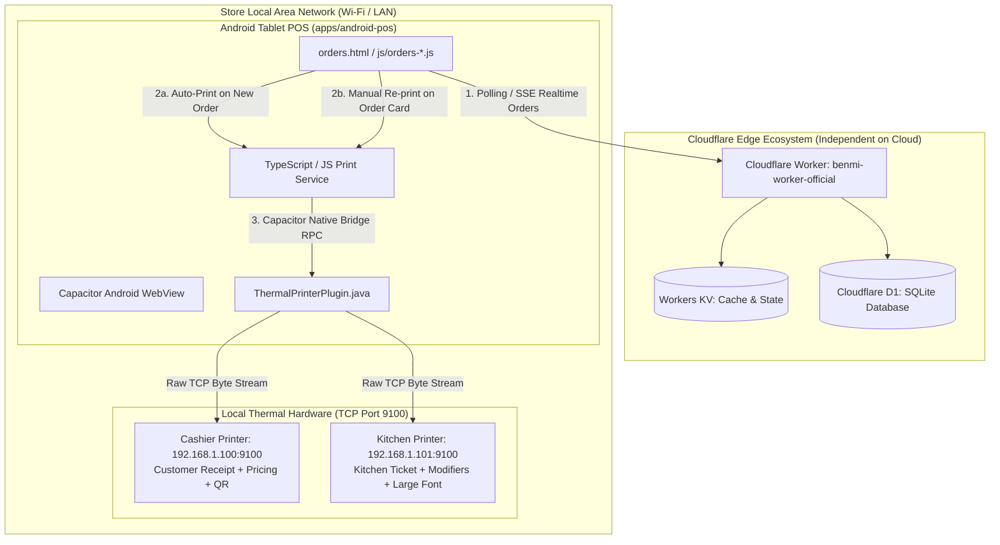

# PDP: Android Hybrid POS Architecture & ESC/POS Thermal Printing System (Auto & Manual Modes)

---

## 1. Executive Summary & Objectives

### A. Background & Problem Statement
Store staff currently operate the POS order management dashboard ([`orders.html`](file:///Users/duccao/Documents/benmi-order/orders.html)) through web browsers on tablets (iPads/Android tablets) or desktop PCs. While the web interface excels at real-time order tracking and dispatching, physical receipt printing via standard web browsers suffers from critical operational bottlenecks:
1. **Disruptive Browser Print Dialogs**: Standard browser printing (`window.print()`) triggers operating system print dialogs, requiring staff to perform 1–2 extra manual confirmation taps per order, severely slowing down throughput during peak rush hours.
2. **Web Hardware Communication Restrictions**: Mobile browsers are restricted by sandbox security policies and cannot open direct **raw TCP Sockets (Port 9100)** to commercial thermal printers within the local store network (LAN / Wi-Fi).
3. **Character Encoding & Font Corruption**: Standard thermal ESC/POS printers typically lack built-in ROM fonts for Traditional Chinese (`zh-TW`) or Vietnamese (`vi`) diacritics, resulting in garbled text (e.g. `???`) when sending raw strings.

### B. Goals / In-Scope
- **Dual Trigger Modes (Auto-Print & Manual On-Demand)**:
  1. **Auto-Print Mode**: Whenever a new order arrives (`status === 'NEW'`), the POS automatically sends print jobs immediately to designated printers (Cashier and/or Kitchen) without any staff interaction. Built-in **Deduplication Set** guarantees each new order is auto-printed exactly once.
  2. **Manual / On-Demand Mode**: Provides a dedicated **Print / Re-print (補印 / 列印)** button on every order card across all tabs (Live Orders, History, and Order Detail Modals) allowing staff to re-print receipts anytime.
- **Zero-Touch Silent Printing**: Sends print data directly over local LAN/Wi-Fi TCP Sockets (`[PRINTER_IP]:9100`), bypassing all OS print dialogs with sub-200ms network transmission latency.
- **Dual-Station Routing (Cashier & Kitchen)**:
  - **Cashier Printer**: Prints comprehensive customer receipts including itemized pricing, customization notes, order totals, payment method, and QR codes.
  - **Kitchen Printer**: Prints high-visibility kitchen tickets in large bold text with table numbers, dining options, dish names, and modifier notes, **strictly without prices**.
- **Hybrid Rendering Engine**:
  - **1-Bit Monochrome Raster Bitmap Mode (`GS v 0`)**: Converts HTML/Canvas layout into 1-bit monochrome bitmaps in Native Java, guaranteeing **100% crisp typography for Traditional Chinese (`zh-TW`), Vietnamese (`vi`), brand logos, and QR codes** across all printer manufacturers (Epson, Xprinter, Rongta, Star, Sunmi).
  - **Raw Text Mode**: Fast byte stream transmission encoded in `Big5` / `UTF-8` with standard ESC/POS format commands.
- **Strict Scope Separation**: Wraps ONLY the frontend web assets into a dedicated subfolder `apps/android-pos/`. Keeps 100% of the Cloudflare Worker backend ([`benmi-worker-official/`](file:///Users/duccao/Documents/benmi-order/benmi-worker-official)) running independently on the cloud edge.

### C. Non-Goals / Out-of-Scope
- No modifications to the Cloudflare Worker backend architecture, D1 SQLite database, or KV cache logic.
- No intermediary cloud print services or external MQTT brokers. All printing is executed locally over the store Wi-Fi/LAN.

---

## 2. System Architecture & Topology

### System Topology Diagram



---

## 3. Detailed Component Design

### A. Project Directory Structure

The Android hybrid application is located in an isolated subfolder `apps/android-pos/`:

```
benmi-order/
├── index.html                   # Customer ordering web app (Cloudflare Pages)
├── orders.html                  # Store POS order management dashboard
├── css/ & js/                   # Frontend assets & core modules
├── benmi-worker-official/       # Cloudflare Worker backend (Untouched)
└── apps/
    └── android-pos/             # Capacitor Android Hybrid App
        ├── package.json         # @capacitor/core, @capacitor/android, @capacitor/cli
        ├── capacitor.config.ts  # Capacitor config (appId: com.benmi.pos)
        ├── build.sh             # Asset sync script (root web files -> dist/)
        ├── src/                 # Print service & bridge
        │   └── services/
        │       ├── printerService.ts
        │       └── escposBuilder.ts
        └── android/             # Native Android project
            ├── app/src/main/
            │   ├── AndroidManifest.xml
            │   └── java/com/benmi/pos/
            │       ├── MainActivity.java
            │       ├── ThermalPrinterPlugin.java
            │       └── EscPosBitmapConverter.java
```

---

## 4. Dual Print Modes (Auto-Print vs Manual Print)

### A. Auto-Print Mode (Automatic on Incoming Orders)
1. **Trigger Condition**:
   - When the POS polling engine (`pollOrders()` in `js/orders-core.js`) or SSE stream detects incoming orders with `status === 'NEW'`, it evaluates `printerSettings.autoPrintNewOrders`:
     ```javascript
     if (printerSettings.autoPrintNewOrders && !isOrderAlreadyPrinted(order.key)) {
       PrinterService.printDualStation(order)
         .then(() => markOrderAsPrinted(order.key))
         .catch((err) => console.warn("[Printer] Auto-print error:", err));
     }
     ```
2. **Deduplication Set**:
   - Printed order keys are maintained in `localStorage` under `pos_printed_orders_${tenantId}` (capped at the most recent 500 orders).
   - Once an order is successfully sent to the printer, its key is recorded.
   - Subsequent polling ticks (every 5s) or browser page refreshes will **never re-trigger auto-print** for previously printed orders.

### B. Manual / On-Demand Mode
1. **Order Card Action Button**:
   - Every order card across Live Orders, History, and Review Modals displays a dedicated **Print (補印 / 列印)** button with an SVG printer icon:
     ```html
     <button class="btn-print" onclick="PrinterService.printManual('${order.key}')" title="Print Receipt">
       <svg class="icon-printer" ...></svg>
       <span>Print</span>
     </button>
     ```
2. **On-Demand Destination Selection**:
   - Clicking the Print button allows instant one-tap printing to configured default stations, or opening a quick station selector: `[Print Kitchen Ticket]`, `[Print Cashier Receipt]`, `[Print Both]`.

---

## 5. Native Android Plugin (`ThermalPrinterPlugin.java`)

A custom Capacitor plugin handling direct asynchronous TCP socket streams with timeouts and error handling:

```java
package com.benmi.pos;

import android.graphics.Bitmap;
import android.graphics.BitmapFactory;
import android.util.Base64;
import com.getcapacitor.JSObject;
import com.getcapacitor.Plugin;
import com.getcapacitor.PluginCall;
import com.getcapacitor.PluginMethod;
import com.getcapacitor.annotation.CapacitorPlugin;

import java.io.OutputStream;
import java.net.InetSocketAddress;
import java.net.Socket;
import java.util.concurrent.ExecutorService;
import java.util.concurrent.Executors;

@CapacitorPlugin(name = "ThermalPrinter")
public class ThermalPrinterPlugin extends Plugin {
    private final ExecutorService executor = Executors.newFixedThreadPool(2);

    @PluginMethod
    public void printTcp(PluginCall call) {
        String ip = call.getString("ip");
        Integer port = call.getInt("port", 9100);
        String base64Data = call.getString("data");
        Integer timeoutMs = call.getInt("timeoutMs", 4000);

        if (ip == null || base64Data == null) {
            call.reject("IP address and base64 print data are required");
            return;
        }

        executor.execute(() -> {
            Socket socket = null;
            try {
                byte[] rawBytes = Base64.decode(base64Data, Base64.DEFAULT);
                socket = new Socket();
                socket.connect(new InetSocketAddress(ip, port), timeoutMs);
                socket.setSoTimeout(timeoutMs);

                OutputStream outputStream = socket.getOutputStream();
                outputStream.write(rawBytes);
                outputStream.flush();

                JSObject ret = new JSObject();
                ret.put("success", true);
                ret.put("ip", ip);
                call.resolve(ret);
            } catch (Exception e) {
                call.reject("Thermal print error to " + ip + ":" + port + " - " + e.getMessage(), e);
            } finally {
                if (socket != null) {
                    try { socket.close(); } catch (Exception ignored) {}
                }
            }
        });
    }

    @PluginMethod
    public void printBitmap(PluginCall call) {
        String ip = call.getString("ip");
        Integer port = call.getInt("port", 9100);
        String base64Image = call.getString("base64Image");
        Integer paperWidth = call.getInt("paperWidth", 80);
        Integer timeoutMs = call.getInt("timeoutMs", 5000);

        if (ip == null || base64Image == null) {
            call.reject("IP address and base64 image data are required");
            return;
        }

        executor.execute(() -> {
            Socket socket = null;
            try {
                byte[] decodedString = Base64.decode(base64Image, Base64.DEFAULT);
                Bitmap decodedBitmap = BitmapFactory.decodeByteArray(decodedString, 0, decodedString.length);
                byte[] escPosBytes = EscPosBitmapConverter.convertBitmapToEscPosRaster(decodedBitmap, paperWidth);

                socket = new Socket();
                socket.connect(new InetSocketAddress(ip, port), timeoutMs);
                socket.setSoTimeout(timeoutMs);

                OutputStream outputStream = socket.getOutputStream();
                outputStream.write(escPosBytes);
                outputStream.flush();

                JSObject ret = new JSObject();
                ret.put("success", true);
                call.resolve(ret);
            } catch (Exception e) {
                call.reject("Bitmap print error to " + ip + ": " + e.getMessage(), e);
            } finally {
                if (socket != null) {
                    try { socket.close(); } catch (Exception ignored) {}
                }
            }
        });
    }
}
```

---

## 6. 1-Bit Monochrome Raster Bitmap Converter (`EscPosBitmapConverter.java`)

```java
package com.benmi.pos;

import android.graphics.Bitmap;
import android.graphics.Color;
import java.io.ByteArrayOutputStream;

public class EscPosBitmapConverter {
    public static byte[] convertBitmapToEscPosRaster(Bitmap bitmap, int paperWidthMm) {
        int targetWidth = (paperWidthMm == 58) ? 384 : 576;
        float scale = (float) targetWidth / bitmap.getWidth();
        int targetHeight = Math.round(bitmap.getHeight() * scale);

        Bitmap scaledBitmap = Bitmap.createScaledBitmap(bitmap, targetWidth, targetHeight, true);
        int widthBytes = (targetWidth + 7) / 8;
        int heightPixels = targetHeight;

        ByteArrayOutputStream stream = new ByteArrayOutputStream();

        // 1. Initialize printer: ESC @
        stream.write(0x1B);
        stream.write(0x40);

        // 2. Raster Bitmap Command: GS v 0 m xL xH yL yH
        stream.write(0x1D);
        stream.write(0x76);
        stream.write(0x30);
        stream.write(0x00); // Mode 0 (Normal)

        stream.write(widthBytes & 0xFF);
        stream.write((widthBytes >> 8) & 0xFF);
        stream.write(heightPixels & 0xFF);
        stream.write((heightPixels >> 8) & 0xFF);

        // 3. Pixel luminance thresholding into 1-bit byte stream
        for (int y = 0; y < targetHeight; y++) {
            for (int xByte = 0; xByte < widthBytes; xByte++) {
                byte b = 0;
                for (int bit = 0; bit < 8; bit++) {
                    int x = xByte * 8 + bit;
                    if (x < targetWidth) {
                        int pixel = scaledBitmap.getPixel(x, y);
                        int r = Color.red(pixel);
                        int g = Color.green(pixel);
                        int bVal = Color.blue(pixel);
                        int luminance = (int) (0.299 * r + 0.587 * g + 0.114 * bVal);
                        if (luminance < 160) { // Black dot threshold
                            b |= (byte) (1 << (7 - bit));
                        }
                    }
                }
                stream.write(b);
            }
        }

        // 4. Paper feed and cut: GS V 0
        stream.write(0x1B);
        stream.write(0x64);
        stream.write(0x04);
        stream.write(0x1D);
        stream.write(0x56);
        stream.write(0x00);

        return stream.toByteArray();
    }
}
```

---

## 7. POS Settings UI & Card Actions Integration

In the Settings tab of `orders.html`, a comprehensive **Thermal Printer Settings** panel is provided:

```
┌─────────────────────────────────────────────────────────────┐
│ 🖨️ Thermal Printer & Print Mode Configuration              │
├─────────────────────────────────────────────────────────────┤
│ ❖ Print Trigger Modes:                                      │
│   [✓] Auto-Print Incoming Orders (新訂單自動列印)           │
│   [✓] Enable Card Manual Re-print Button                    │
│                                                             │
│ ❖ Cashier Printer - Customer Receipt (櫃檯印表機):          │
│   [✓] Enabled                                               │
│   IP: [ 192.168.1.100 ]   Port: [ 9100 ]   Paper: (•) 80mm  │
│   [ Test Print ]                                            │
│                                                             │
│ ❖ Kitchen Printer - Prep Checklist (廚房印表機):            │
│   [✓] Enabled                                               │
│   IP: [ 192.168.1.101 ]   Port: [ 9100 ]   Paper: (•) 80mm  │
│   [ Test Print ]                                            │
└─────────────────────────────────────────────────────────────┘
```

---

## 8. Implementation & Rollout Milestones

1. **Milestone 1 (Scaffolding)**: Initialize `apps/android-pos/` with `@capacitor/core`, `@capacitor/android`, and `@capacitor/cli`.
2. **Milestone 2 (Native Layer)**: Implement `ThermalPrinterPlugin.java` and `EscPosBitmapConverter.java`.
3. **Milestone 3 (Print Bridge)**: Create `js/printer-service.js` with `handleNewIncomingOrder(order)` and `printManual(orderKey, station)`.
4. **Milestone 4 (UI Integration)**: Integrate Settings modal fields in `orders.html` and manual print buttons on cards in `orders-live.js` and `orders-history.js`.
