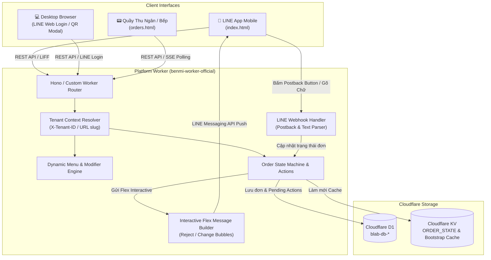
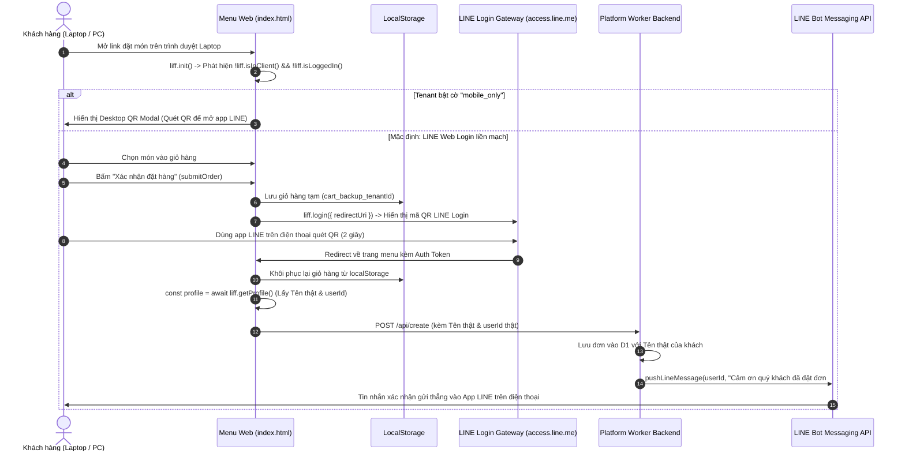

# PDP: BSC Multi-Tenant Platform Unification & Interactive Notification Architecture [Migrate/Enhance]

> **Status:** Proposed  
> **Author:** Principal Engineer (AI Pair)  
> **Date:** 2026-08-24  
> **Target Release:** 3-Tier Environments (`dev` -> `staging` -> `main`)

---

## 1. Executive Summary & Objectives

### 1.1. Problem Statement
Quán **BSC (干城鹹水雞 - Đài Trung Lê Minh)** trước đây vận hành trên một codebase tách rời (`bsc-pos` / `bsc-worker`) với cơ chế lưu trữ KV đơn giản, thiếu các cải tiến mới nhất của Platform (`benmi-worker-official`) như:
- Cơ sở dữ liệu quan hệ **Cloudflare D1 (SQLite at Edge)** với phân tách Tenant Context (`X-Tenant-ID`).
- Hệ thống **Dynamic Modifiers & Applied Modifiers** đa tầng.
- Bảng quản trị POS thời gian thực (`orders.html` / `orders-*.js`), hỗ trợ in bill, báo cáo doanh thu và âm thanh thông báo.
- Khả năng đồng bộ bộ nhớ đệm biên **Bootstrap Edge Cache (< 10ms)**.

Ngoài ra, hệ thống Platform hiện tại cần hoàn thiện thêm 2 tính năng cao cấp mà BSC đã thử nghiệm thành công:
1. **Interactive LINE Flex Messages (Postback Buttons)** cho các thao tác trạng thái đặc thù của nhân viên (Nút Đỏ: Từ chối / Hủy đơn, Nút Vàng: Yêu cầu sửa đơn).
2. **Cơ chế quản lý trình duyệt Máy tính / Laptop (Desktop Browser Handling)**: Hỗ trợ linh hoạt giữa việc đăng nhập LINE Web Login liền mạch (lấy đầy đủ Profile & User ID) và cờ cấu hình chặn đặt đơn trên Desktop (`block_desktop_ordering`) yêu cầu quét mã QR bằng điện thoại.

### 1.2. In-Scope Goals
1. **Chuẩn hóa Menu BSC vào CSDL D1**:
   - Seed toàn bộ Catalog món ăn của BSC (Thịt gà, Tiểu thái $50, $30, $25, Rau củ / Phối thái) và các nhóm Tùy biến (Khẩu vị, Độ mặn, Độ cay, Gia vị kèm, Topping có phí) theo đúng cấu trúc `menu_categories` (`category_type = 'modifier'`) và `menu_items`.
2. **Nâng cấp Interactive LINE Flex Messages**:
   - Xây dựng Flex Message chuẩn thương mại cho **Nút Đỏ (REJECTED / 無法接單)** kèm 2 nút Postback: `🔴 同意取消訂單` (`action=reject_agree`) và `⚪ 不同意` (`action=reject_disagree`).
   - Xây dựng Flex Message chuẩn thương mại cho **Nút Vàng (CHANGED / 需要修改)** kèm 2 nút Postback: `🟡 同意變更` (`action=change_agree`) và `⚪ 取消訂單` (`action=change_cancel`).
   - Cập nhật `handleLineWebhook` hỗ trợ cả 2 luồng: Click nút Postback trên LINE và gõ tin nhắn text ("同意", "取消", "不同意").
3. **Cơ chế xử lý Desktop Browser thông minh trên Frontend (`index.html`)**:
   - Tự động phát hiện khi chạy ngoài LINE App (`!liff.isInClient()`).
   - Nếu tenant bật cờ `block_desktop_ordering`: Hiển thị Modal/Overlay QR Code trang nhã yêu cầu khách quét bằng điện thoại.
   - Mặc định: Kích hoạt LINE Web Login (`liff.login()`), lưu tạm giỏ hàng vào `localStorage` để không mất món, lấy Tên thật + User ID của khách để gửi tin nhắn xác nhận và cập nhật tiến độ qua LINE bot.
4. **Phân bổ 3 môi trường hoàn chỉnh**: Áp dụng đồng bộ lên `blab-db-dev`, `blab-db-test` và `blab-db-production`.

### 1.3. Non-Goals
- Không thay đổi nghiệp vụ cơ bản của các tenant khác (`benmi`, `zhadantongxue`, `jidangaodashu`, `weiweibao`). Mọi tính năng mới đều hoàn toàn tương thích ngược (Backward Compatible) và cấu hình linh hoạt theo Tenant.

---

## 2. Architecture & Data Flow



---

## 3. Detailed Component Specifications

### 3.1. D1 Database Migration: Seed Tenant `bsc` (干城鹹水雞)
- **Tenant Configuration**:
  - `tenant_id`: `'bsc'`
  - `brand_name`: `'干城鹹水雞'`
  - `brand_subtitle`: `'台中黎明店'`
  - `brand_color`: `'#00b900'` (Chuẩn màu xanh thống nhất toàn Platform)
  - `brand_color_dark`: `'#009900'`
  - `store_address`: `'台中市南屯區黎明里干城街302號'`
  - `operating_hours`: `'{"0":[{"start":"16:30","end":"21:30"}],"4":[{"start":"16:30","end":"21:30"}],"5":[{"start":"16:30","end":"21:30"}],"6":[{"start":"16:30","end":"21:30"}]}'`
  - `allow_dine_in`: `0` (Quán bán mang đi)
  - `features`: `'["reports", "flex_notifications"]'`
  - `order_prefix`: `'K'`

- **Danh Mục Món Ăn & Phân Loại Đặc Biệt (`menu_categories`)**:
  - `cat_bsc_flavor_section`: 🧪 口味與客製化選擇 (`category_type = 'order_customization'`, `slug = 'sec-flavor'`, `sort_order = 1`)
    - *Đặc điểm*: Là một **Phân loại đặc biệt (Order-Level Customization Category)** tham gia trực tiếp vào luồng quản lý thứ tự ưu tiên trên POS. Nhân viên có thể kéo thả sắp xếp vị trí (#1 đầu menu, #3 giữa menu, hoặc #6 cuối menu) hoàn toàn bình thường trong `⚙️ Quản lý phân loại`.
  - `cat_bsc_meat`: 🍗 肉類 (`category_type = 'catalog'`, `sort_order = 2`)
  - `cat_bsc_side50`: ⭐ 精選小菜 $50/份 (`category_type = 'catalog'`, `sort_order = 3`)
  - `cat_bsc_side30`: 🥘 特色小菜 $30/份 (`category_type = 'catalog'`, `sort_order = 4`)
  - `cat_bsc_side25`: 🥗 經典小菜 $25/份 (`category_type = 'catalog'`, `sort_order = 5`)
  - `cat_bsc_veggie`: 🥦 蔬菜/配菜 1份$35 / 3份$100 (`category_type = 'catalog'`, `sort_order = 6`)

- **Cấu Trúc Tùy Biến Con Bên Trong Khối Khẩu Vị (`menu_customizations` / Sub-options)**:
  - `cat_bsc_flavor` (`key = 'flavor'`): ✦ 口味選擇 (`type = 'radio'`, `sort_order = 0`)
    - Options: `特調胡椒`, `泰式酸辣`, `清爽檸檬`, `檸檬香菜`, `原味客製`
    - **Sub-Options động khi chọn `原味客製`**: `不加香油`, `不加胡椒`, `不加胡椒加鹽巴`
    - **Sub-Options động khi chọn `清爽檸檬` hoặc `檸檬香菜`**: `不加香油`, `不加鹽巴`
  - `cat_bsc_salt` (`key = 'salt'`): ✦ 鹹度調整 (`type = 'radio'`, `sort_order = 1`)
    - Options: `正常`, `調味重`, `調味清淡`
  - `cat_bsc_spicy` (`key = 'spicy'`): ✦ 辣度選擇 (`type = 'radio'`, `sort_order = 2`)
    - Options: `不辣`, `微辣`, `小辣`, `中辣`, `大辣`, `辣椒放餐盒角落`
  - `cat_bsc_ingredients` (`key = 'ingredients'`): ✦ 配料調整 (`type = 'checkbox'`, `sort_order = 3`)
    - Options: `不加蔥花`, `不加蒜頭`, `不加洋蔥`
  - `cat_bsc_addons` (`key = 'addons'`): ✦ 加價配料 (`type = 'checkbox'`, `sort_order = 4`)
    - Options: `加香菜 (+$15)`, `加檸檬汁 (+$20)`

- **Cơ chế Hiển Thị & Quản Lý Đồng Bộ**:
  1. **Trên POS Dashboard (`orders.html` / `js/orders-menu.js`)**:
     - Phân loại `🧪 口味與客製化選擇` hiển thị trong màn hình kéo thả `⚙️ Quản lý phân loại` với nhãn nhận diện `[Tùy biến toàn đơn / Order Customization]`.
     - Cho phép chỉnh sửa tên hiển thị, bật/tắt hiển thị, và kéo thả thay đổi vị trí ưu tiên `sort_order` như mọi phân loại món khác.
  2. **Trên Thực Đơn Khách Hàng (`index.html`)**:
     - Thanh điều hướng dính (`sticky-nav`) và các section nội dung được render tự động theo đúng thứ tự `sort_order` từ API Bootstrap.
     - Vị trí của khối `🧪 口味與客製化選擇` trên giao diện khách hàng sẽ phản chiếu 100% vị trí mà nhân viên POS đã sắp xếp.

---

### 3.2. Interactive Flex Messages Module (`src/modules/line.ts`)

#### A. Reject Flex Bubble (`createRejectFlexBubble`)
- Header đỏ sang trọng `#DC2626`, hiển thị mã đơn `#K...`, lý do từ chối.
- 2 nút Postback:
  - `🔴 同意取消訂單` (`action=reject_agree&orderKey=${orderKey}`)
  - `⚪ 不同意` (`action=reject_disagree&orderKey=${orderKey}`)

#### B. Change Flex Bubble (`createChangeFlexBubble`)
- Header hổ phách cảnh báo `#D97706`, hiển thị lý do điều chỉnh thời gian / món.
- 2 nút Postback:
  - `🟡 同意變更` (`action=change_agree&orderKey=${orderKey}`)
  - `⚪ 取消訂單` (`action=change_cancel&orderKey=${orderKey}`)

#### C. Xử lý trong LINE Webhook (`handleLineWebhook`)
- Bắt sự kiện Postback `action=reject_agree`, `action=reject_disagree`, `action=change_agree`, `action=change_cancel`.
- Song song duy trì bộ lọc từ khóa text ("同意", "取消", "不同意") cho khách hàng gõ chữ.

---

### 3.3. Desktop Browser Handling & Seamless LINE Login (`index.html`)

#### A. Nguyên nhân kỹ thuật & Thách thức
1. **Phân biệt môi trường Mobile vs Desktop**:
   - Trên Điện thoại (`liff.isInClient() === true`): Chạy trong WebView nhúng của App LINE, tự động có phiên đăng nhập, lấy được Profile (`displayName`, `userId`) và gọi được `liff.sendMessages()`.
   - Trên Laptop/Máy tính (`liff.isInClient() === false`): Chạy trên trình duyệt ngoài (Chrome/Safari), mặc định chưa có phiên đăng nhập (`liff.isLoggedIn() === false`), không tự lấy được tên khách và LINE chặn 100% hàm `liff.sendMessages()`.

#### B. Sơ đồ tuần tự giải pháp Hybrid (Sequence Diagram)


#### C. Chi tiết triển khai Frontend (`js/client-checkout.js` / `index.html`)
1. **Lưu & Khôi phục giỏ hàng khi Redirect**:
   ```javascript
   function persistCurrentCartState() {
     const tenantId = getTenantIdFromUrl();
     const cartData = { cart, timestamp: Date.now() };
     localStorage.setItem(`benmi_cart_${tenantId}`, JSON.stringify(cartData));
   }

   function restorePersistedCartState() {
     const tenantId = getTenantIdFromUrl();
     const raw = localStorage.getItem(`benmi_cart_${tenantId}`);
     if (raw) {
       try {
         const data = JSON.parse(raw);
         if (Date.now() - data.timestamp < 3600000) { // Trong vòng 1 giờ
           cart = data.cart || {};
           updateCartUI();
         }
       } catch (e) { }
       localStorage.removeItem(`benmi_cart_${tenantId}`);
     }
   }
   ```

2. **Xử lý submit đơn khi chạy trên trình duyệt ngoài**:
   ```javascript
   async function submitOrder() {
     if (!liff.isInClient() && !liff.isLoggedIn()) {
       persistCurrentCartState();
       liff.login({ redirectUri: window.location.href });
       return;
     }

     const profile = liff.isLoggedIn() ? await liff.getProfile() : null;
     const customerName = profile?.displayName || "顧客";
     const userId = profile?.userId || "";

     const payload = {
       customer: customerName,
       userId: userId,
       // ...
     };

     const res = await fetch(`${WORKER_BASE}/api/create`, {
       method: "POST",
       headers: { "Content-Type": "application/json", "X-Tenant-ID": tenantId },
       body: JSON.stringify(payload)
     });
     // ...
   }
   ```

---

## 4. Execution & Rollout Strategy

1. **Phase 1 (Dev Environment)**:
   - Viết migration `0037_seed_bsc_menu.sql` tạo catalog và modifiers cho `bsc`.
   - Cập nhật `src/modules/line.ts` và `src/modules/orders.ts` bổ sung Flex Message và Postback Handler.
   - Cập nhật `index.html` và `js/client-checkout.js` cho Desktop Login & QR modal.
   - Apply migration lên `blab-db-dev` và deploy lên `platform-worker-dev`.
2. **Phase 2 (Staging QA & Demo)**:
   - Merge `dev` sang `staging`. Apply migration lên `blab-db-test` và deploy `platform-worker-staging`.
3. **Phase 3 (Production Release)**:
   - Merge `staging` sang `main`. Apply migration lên `blab-db-production` và deploy `benmi-worker-official`.

---

## 5. Verification Plan

| # | Hạng mục kiểm thử | Phương thức | Kết quả mong đợi |
| :--- | :--- | :--- | :--- |
| 1 | Bootstrap Menu BSC | `GET /api/tenant/bootstrap?tenant_id=bsc` | Trả về 5 danh mục món và 5 nhóm modifier tùy biến đầy đủ |
| 2 | Nút Đỏ (Từ chối đơn) | Thao tác POS -> Bấm "無法接單" | Bot LINE gửi Reject Flex Bubble có 2 nút Postback |
| 3 | Click Postback Nút Đỏ | Bấm `🔴 同意取消訂單` trên LINE | Đơn chuyển `REJECTED`, bot gửi xác nhận |
| 4 | Nút Vàng (Sửa đơn) | Thao tác POS -> Bấm "需要修改" | Bot LINE gửi Change Flex Bubble có 2 nút Postback |
| 5 | Click Postback Nút Vàng | Bấm `🟡 同意變更` trên LINE | Đơn chuyển `ACCEPTED`, bot gửi xác nhận |
| 6 | Đặt đơn trên Desktop | Mở Chrome trên Laptop | Tự động điều hướng LINE Web Login và giữ nguyên giỏ hàng |
