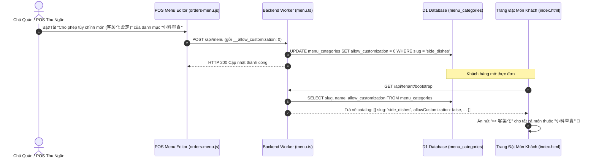

# PDP: Dynamic Category-Level Customization (Modifiers) Toggle

| Metadata | Details |
| :--- | :--- |
| **Feature** | Cấu hình Bật/Tắt Tùy Chỉnh Món (客製化設定) Theo Từng Loại Sản Phẩm |
| **Status** | `PROPOSED` |
| **Author** | Principal Engineer (Antigravity) |
| **Target System** | Cloudflare Workers (`benmi-worker-official`), D1 Database (`menu_categories`), POS Dashboard (`orders.html` / `orders-menu.js`), Menu LIFF (`index.html`) |
| **Date** | 2026-08-23 |

---

## 1. Executive Summary & Context

### Problem Statement
Hiện tại trên trang thực đơn của khách hàng (`index.html`), cơ chế hiển thị nút **"✏️ 客製化（加料 / 辣度 / 備註）"** đang bị hardcode theo logic:
```javascript
const hasModifiers = bootstrapData?.modifiers && bootstrapData.modifiers.length > 0 && catSlug !== 'drinks';
```
- **Hạn chế**:
  1. Chỉ có danh mục cố định mang tên `drinks` là bị tắt nút tùy chỉnh.
  2. Khi các quán đối tác (như **Zhadantongxue / 炸蛋同學** hoặc các thương hiệu mới) thêm các danh mục như `小料單賣` (Topping/tiểu liệu bán lẻ), `點心` (Đồ ăn vặt/tráng miệng đóng gói), `套餐加購`... thì toàn bộ các món này **vẫn bị hiện nút tùy chỉnh (chọn cay, thêm rau, thêm topping)** dù thực tế món đó không cần và không thể tùy biến.
  3. Quán không có quyền chủ động bật/tắt tính năng tùy chỉnh cho từng loại sản phẩm trong giao diện quản trị POS.

### Solution Overview
1. **Cấu hình động ở cấp Loại Sản Phẩm (Category-Level Modifier Toggle)**:
   - Thêm trường `allow_customization` (boolean/integer) vào bảng `menu_categories` trong D1.
   - Cho phép chủ quán bật/tắt tùy chọn này trực tiếp trong POS Menu Settings khi tạo hoặc sửa danh mục.
2. **Loại bỏ hoàn toàn hardcode trên Frontend**:
   - `index.html` kiểm tra trực tiếp thuộc tính `cat.allowCustomization` từ `bootstrapData.catalog`.
   - Nếu `allowCustomization === false` (hoặc `0`), nút `✏️ 客製化` sẽ bị ẩn hoàn toàn.

---

## 2. Hotfix Rollout Strategy (Zero-Conflict Git Plan)

### Chiến Lược Đưa Hotfix Fix Tên Món Lên Production (`main`) Không Gây Conflict:

```mermaid
gitGraph
   commit id: "main (prod)"
   branch hotfix/category-item-name
   checkout hotfix/category-item-name
   commit id: "fix: parseCartKey hotfix"
   checkout main
   merge hotfix/category-item-name id: "merge hotfix -> main (deploy prod)"
   checkout staging
   merge main id: "merge main -> staging (zero conflict)"
```

1. **Bước 1**: Checkout tạo nhánh `hotfix/category-item-name` từ đỉnh của `main`.
2. **Bước 2**: Cherry-pick commit `4c2e38a` (chứa sửa đổi hàm `parseCartKey`) sang nhánh hotfix.
3. **Bước 3**: Merge nhánh hotfix vào `main` -> Deploy lên Cloudflare Production.
4. **Bước 4**: Merge `main` ngược lại vào `staging`. Vì commit trên `main` và `staging` chia sẻ cùng cây thay đổi, Git 3-way merge sẽ tự động đồng bộ sạch sẽ mà **tuyệt đối không phát sinh conflict**.

---

## 3. Architecture & Data Flow



---

## 4. Technical Specifications

### 4.1 Database Migration (`0030_add_category_customization.sql`)
```sql
-- Migration: 0030_add_category_customization.sql
-- Thêm cột allow_customization vào bảng menu_categories (mặc định là 1: Bật tùy chỉnh)
ALTER TABLE menu_categories ADD COLUMN allow_customization INTEGER DEFAULT 1;

-- Cập nhật mặc định cho danh mục drinks (đồ uống) là 0 (Tắt tùy chỉnh)
UPDATE menu_categories SET allow_customization = 0 WHERE slug = 'drinks';
```

### 4.2 Backend Worker Updates

#### A. Bootstrap Response (`src/modules/bootstrap.ts`)
```typescript
// Trong hàm getTenantBootstrap:
const [catsRes, itemsRes] = await env.DB.batch([
  env.DB.prepare(
    `SELECT id, name, slug, 
            COALESCE(category_type, 'catalog') AS category_type, 
            COALESCE(selection_type, 'single') AS selection_type, 
            COALESCE(is_required, 0) AS is_required, 
            COALESCE(min_selection, 0) AS min_selection, 
            COALESCE(max_selection, 1) AS max_selection,
            COALESCE(allow_customization, 1) AS allow_customization,
            sort_order 
     FROM menu_categories 
     WHERE tenant_id = ? 
     ORDER BY sort_order ASC`
  ).bind(tenantId),
  ...
]);

// Trong vòng lặp catalog:
catalog.push({
  id: cat.id,
  slug: cat.slug,
  name: cat.name,
  allowCustomization: Boolean(cat.allow_customization ?? 1),
  items: catItems
});
```

#### B. Menu Save API (`src/modules/menu.ts`)
```typescript
// Trong hàm saveMenu:
const allowCustomization = itemsMap?.__allow_customization !== undefined 
  ? (itemsMap.__allow_customization ? 1 : 0) 
  : (slug === 'drinks' ? 0 : 1);

statements.push(
  env.DB.prepare(
    `INSERT INTO menu_categories (id, tenant_id, name, slug, category_type, allow_customization, sort_order)
     VALUES (?, ?, ?, ?, ?, ?, ?)
     ON CONFLICT(id) DO UPDATE SET 
       name = excluded.name, 
       category_type = excluded.category_type,
       allow_customization = excluded.allow_customization,
       sort_order = excluded.sort_order`
  ).bind(catId, tenantId, catName, slug, customCatType, allowCustomization, catSortOrder++)
);
```

### 4.3 POS Menu Editor Frontend (`orders.html` & `orders-menu.js`)

#### A. Multi-Language Dictionary Update (`orders.html`)
Tuân thủ nghiêm ngặt nguyên tắc **UI Design Principles** (`.agents/rules/ui-design-principles.md`):
```javascript
// I18N["zh-TW"]
allowCustomizationLabel: "允許客製化選項 (加料 / 辣度 / 備註)",
allowCustomizationDesc: "開啟後，顧客在點選此分類餐點時可選擇客製化設定",

// I18N["vi"]
allowCustomizationLabel: "Cho phép tùy chỉnh món (Topping / Độ cay / Ghi chú)",
allowCustomizationDesc: "Khi bật, khách hàng có thể tùy chỉnh thêm topping, mức cay cho các món trong loại này",
```

#### B. POS Editor UI Switch (`orders-menu.js`)
Trong thanh tiêu đề / cài đặt của danh mục đang mở:
```html
<div class="category-customization-toggle" style="display: flex; align-items: center; gap: 8px; margin-bottom: 12px; background: #f8fafc; padding: 10px 14px; border-radius: 8px; border: 1px solid #e2e8f0;">
  <label class="toggle-switch">
    <input type="checkbox" id="cat-allow-customization-toggle" ${cat.allowCustomization !== false ? 'checked' : ''} onchange="onCategoryCustomizationChanged()">
    <span class="slider round"></span>
  </label>
  <div>
    <div style="font-weight: 700; font-size: 14px; color: #1e293b;" id="i18n-allow-customization-label">${t("allowCustomizationLabel")}</div>
    <div style="font-size: 12px; color: #64748b;" id="i18n-allow-customization-desc">${t("allowCustomizationDesc")}</div>
  </div>
</div>
```

### 4.4 Customer Menu Frontend (`index.html`)

Thay đổi logic hiển thị nút `✏️ 客製化`:
```javascript
// Thay vì: catSlug !== 'drinks'
const catAllowsCustomization = (cat && cat.allowCustomization !== false && cat.slug !== 'drinks');
const hasModifiers = bootstrapData?.modifiers && bootstrapData.modifiers.length > 0 && catAllowsCustomization;

// Ẩn/Hiện nút 客製化 trên thẻ món ăn và khi cập nhật số lượng:
customizeBtn.style.display = (!isOos && qty > 0 && hasModifiers) ? 'block' : 'none';
```

---

## 5. Execution Plan & Rollout

- [ ] **Phase 1 (Production Hotfix)**:
  - Tạo nhánh `hotfix/category-item-name` từ `main`.
  - Cherry-pick `4c2e38a` sang `main`, deploy lên Cloudflare Production.
  - Merge `main` ngược lại vào `staging`.
- [ ] **Phase 2 (Database & Worker Backend)**:
  - Tạo migration `0030_add_category_customization.sql` trên D1.
  - Cập nhật `bootstrap.ts` và `menu.ts` hỗ trợ trường `allow_customization`.
- [ ] **Phase 3 (POS & Menu Frontend)**:
  - Bổ sung Switch toggle và từ điển I18N trong `orders.html` & `orders-menu.js`.
  - Cập nhật điều kiện hiển thị nút `✏️ 客製化` trong `index.html`.
- [ ] **Phase 4 (Testing & Verification)**:
  - Kiểm thử tắt tùy chỉnh cho danh mục `小料單賣` -> Xác nhận nút `✏️ 客製化` biến mất.
  - Kiểm thử bật tùy chỉnh cho danh mục `Bánh mì` -> Xác nhận nút `✏️ 客製化` hoạt động bình thường.
