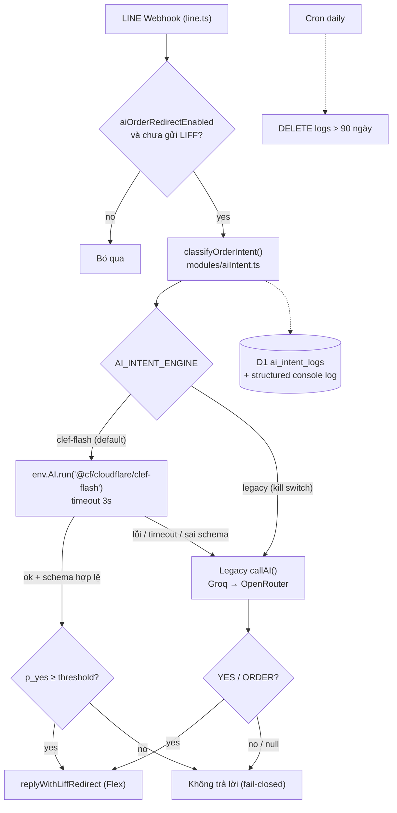

# PDP: AI Order-Intent Classifier → Clef-flash [Replace]

> Trạng thái: **Draft – chờ duyệt** · Ngày: 2026-10-10 · Phạm vi: `benmi-worker-official` (backend only, không đụng frontend)

---

## 1. Executive Summary & Objectives

### Problem Statement
Webhook LINE hiện dùng LLM sinh văn bản (Groq `openai/gpt-oss-20b` → fallback OpenRouter `gemma`) để trả lời "YES/NO" hoặc "ORDER/IGNORE", rồi parse chuỗi bằng regex. Cách này:
- Dùng model sinh text cho bài toán **phân loại nhị phân** → chậm, tốn token (prompt kèm cả menu), output không ổn định (phải fail-closed khi model trả lời lan man).
- Phụ thuộc 2 nhà cung cấp bên ngoài + API key trong Secrets Store.
- Prompt menu dựa vào `formatMenuForPrompt` đang hardcode slug danh mục của Benmi (vi phạm rule multi-tenant).

**Clef-flash** (`@cf/cloudflare/clef-flash`) là *decision model* 9B của Cloudflare trên Workers AI: nhận `state` + schema câu hỏi có kiểu, trả về **xác suất** cho từng câu hỏi. Đúng bản chất bài toán, chạy ngay trong mạng Cloudflare, không cần API key.

### Goals (In-Scope)
1. Clef-flash là engine chính cho **điểm quyết định (A) – intent tin nhắn mới** (YES/NO) dẫn tới Flex LIFF ([line.ts:L1336-L1358](file:///Users/duccao/Documents/benmi-order/benmi-worker-official/src/modules/line.ts#L1336-L1358)).
2. Đóng gói logic vào 1 module classifier có kiểu rõ ràng, thiết kế mở rộng được (tham số `kind`) để sau này đưa (B) vào mà không đổi interface.
3. Quyết định theo ngưỡng xác suất: mặc định toàn cục `0.70`, tenant override được.
4. Fallback Groq → OpenRouter cho (A) **chỉ khi** Clef lỗi / timeout (3s) / sai schema. Việc gỡ hẳn Groq/OpenRouter chờ tới khi (B) cũng chuyển xong.
5. Ghi log quyết định vào D1 (`ai_intent_logs`, giữ 90 ngày) để tinh chỉnh ngưỡng.
6. p95 latency classifier < 500ms (Clef) so với vài giây hiện tại.

### Non-Goals (Out-of-Scope)
- **(B) Tin nhắn tiếp nối draft cũ — ORDER/IGNORE** ([line.ts:L1080-L1100](file:///Users/duccao/Documents/benmi-order/benmi-worker-official/src/modules/line.ts#L1080-L1100)): giữ nguyên `callAI()` Groq → OpenRouter + menu prompt. Sẽ xét ở giai đoạn sau, dựa trên số liệu `ai_intent_logs` của (A).
- Không truyền menu vào Clef (chỉ tin nhắn khách + tên quán).
- Không sửa `formatMenuForPrompt` (vẫn dùng ở fallback legacy của (A) và toàn bộ luồng (B)).
- Không shadow mode / canary — **cutover thẳng** sau khi test dev & staging.
- Không thay đổi Flex message, LIFF, quick reply, pending-action flow.
- Không xây UI POS để chỉnh threshold (chỉnh qua Admin API hiện có).

---

## 2. Context & Current Architecture

| Thành phần | File | Ghi chú |
| :--- | :--- | :--- |
| Webhook + 2 điểm gọi AI ((A) trong scope, (B) ngoài scope) | [line.ts](file:///Users/duccao/Documents/benmi-order/benmi-worker-official/src/modules/line.ts) | Chạy trong `ctx.waitUntil`, sau đó gọi `replyWithLiffRedirect` |
| AI client (Groq → OpenRouter) | [groq.ts](file:///Users/duccao/Documents/benmi-order/benmi-worker-official/src/integrations/groq.ts) | `max_tokens: 10`, `temperature: 0`, timeout 8s |
| Client cũ không dùng | [openRouter.ts](file:///Users/duccao/Documents/benmi-order/benmi-worker-official/src/integrations/openRouter.ts) | Dead code |
| Tenant context (KV cache) | [tenant.ts](file:///Users/duccao/Documents/benmi-order/benmi-worker-official/src/modules/tenant.ts) | Có `aiOrderRedirectEnabled`, `groqModel`... |
| Admin upsert tenant_config | [admin.ts](file:///Users/duccao/Documents/benmi-order/benmi-worker-official/src/modules/admin.ts) | |
| Bindings | [cloudflare.config.ts](file:///Users/duccao/Documents/benmi-order/benmi-worker-official/cloudflare.config.ts) | Chưa có binding `AI`, chưa có cron |

Luồng hiện tại (A): quick reply miss → `aiOrderRedirectEnabled` → check KV `liff_redirected:{tenant}:{user}` → load menu → prompt LLM → regex `YES` → Flex.

---

## 3. Proposed Architecture

### Overview


### Detailed Design

#### 3.1 Binding & biến môi trường (`cloudflare.config.ts`, cả dev / staging / production)
| Key | Loại | Giá trị mặc định | Mục đích |
| :--- | :--- | :--- | :--- |
| `AI` | Workers AI binding | — | Gọi Clef-flash |
| `AI_INTENT_ENGINE` | text | `clef-flash` | Kill switch cho (A): `legacy` để quay về LLM cũ không cần revert code. Không ảnh hưởng (B) |
| `AI_INTENT_THRESHOLD` | text | `0.70` | Ngưỡng toàn cục |
| `AI_INTENT_CLEF_TIMEOUT_MS` | text | `3000` | Timeout riêng cho Clef |
| Cron trigger | trigger | `0 19 * * *` (UTC = 03:00 Asia/Taipei) | Purge log |

> [!NOTE]
> Cú pháp khai báo AI binding và cron trong `cf/config` cần xác minh bằng `npx cf cli search "ai binding"` / `"cron trigger"` trước khi viết — không đoán từ cú pháp Wrangler.

#### 3.2 Schema D1 — migration `0065_ai_intent_clef_flash.sql`
```sql
-- NULL = dùng AI_INTENT_THRESHOLD toàn cục
ALTER TABLE tenant_config ADD COLUMN ai_intent_threshold REAL;

CREATE TABLE IF NOT EXISTS ai_intent_logs (
  id              INTEGER PRIMARY KEY AUTOINCREMENT,
  tenant_id       TEXT    NOT NULL,
  user_id         TEXT    NOT NULL,            -- LINE userId gốc (theo yêu cầu tra cứu hội thoại)
  kind            TEXT    NOT NULL CHECK (kind IN ('new_message', 'draft_followup')), -- 'draft_followup' dành sẵn cho giai đoạn sau (SQLite không sửa CHECK được nếu không rebuild bảng)
  message_text    TEXT    NOT NULL,            -- cắt tối đa 1000 ký tự
  engine          TEXT    NOT NULL CHECK (engine IN ('clef-flash', 'groq', 'openrouter', 'none')),
  p_yes           REAL,                        -- NULL nếu engine là LLM legacy
  threshold       REAL,
  decision        INTEGER NOT NULL CHECK (decision IN (0, 1)),
  fallback_reason TEXT,                        -- 'timeout' | 'error' | 'bad_schema' | 'kill_switch' | NULL
  latency_ms      INTEGER NOT NULL,
  created_at      INTEGER NOT NULL             -- epoch ms
);
CREATE INDEX IF NOT EXISTS idx_ai_intent_logs_tenant_created ON ai_intent_logs (tenant_id, created_at);
CREATE INDEX IF NOT EXISTS idx_ai_intent_logs_created       ON ai_intent_logs (created_at);
```

#### 3.3 Clef client — `src/integrations/clefFlash.ts` (mới)
```ts
export type ClefNoulQuestion = { type: 'noul'; instructions: string };
export interface ClefResult { pYes: number; inputTokens?: number }

/** Throws ClefError('timeout' | 'error' | 'bad_schema') — caller quyết định fallback. */
export async function runClefNoul(
  env: Env, state: Record<string, unknown>, questionId: string,
  question: ClefNoulQuestion, timeoutMs: number
): Promise<ClefResult>;
```
- Gọi `env.AI.run('@cf/cloudflare/clef-flash', { model: 'clef-flash', state, questions: { [questionId]: question } })`, bọc `Promise.race` với timeout.
- Validate: `answers[questionId].type === 'noul'` và `noul` là số hữu hạn trong `[0,1]`; ngược lại `bad_schema`.

#### 3.4 Classifier — `src/modules/aiIntent.ts` (mới)
```ts
export type IntentKind = 'new_message'; // mở rộng 'draft_followup' ở giai đoạn sau
export interface IntentInput {
  kind: IntentKind; tenantId: string; userId: string;
  brandName: string; userText: string;
}
export interface IntentDecision {
  isOrder: boolean; engine: 'clef-flash' | 'groq' | 'openrouter' | 'none';
  pYes: number | null; threshold: number; latencyMs: number;
  fallbackReason: 'timeout' | 'error' | 'bad_schema' | 'kill_switch' | null;
}
export async function classifyOrderIntent(
  input: IntentInput, env: Env, tenantCtx: TenantContext | null
): Promise<IntentDecision>;

/** Pure – unit-testable. */
export function resolveThreshold(tenantValue: number | null | undefined, envValue?: string): number;
export function decide(pYes: number, threshold: number): boolean; // pYes >= threshold
```

**State & câu hỏi gửi Clef** (không có menu):
```jsonc
// kind = new_message
{ "store": "<brandName>", "channel": "LINE official account of a food & drink shop",
  "customer_message": "<userText>" }
// question id: "wants_to_order"
{ "type": "noul", "instructions": "Is the customer trying to place a food or drink order with this store — e.g. naming items they want, asking how to order, or saying they want to order? Questions about hours, location, delivery fees, chit-chat, or complaints are NOT ordering." }
```
> Instruction viết tiếng Anh (base Qwen đa ngữ), state giữ nguyên ngôn ngữ khách (zh-TW/vi). Sẽ được kiểm chứng bằng bộ eval ở mục 8.

**Thứ tự ngưỡng**: `tenant_config.ai_intent_threshold` (nếu hợp lệ `0.05–0.99`) → `AI_INTENT_THRESHOLD` → `0.70`.

**Fallback legacy**: tái sử dụng nguyên prompt + `callAI()` hiện có (kể cả menu context) để hành vi fallback giống hệt hôm nay. Menu chỉ được load khi rơi vào fallback (lazy).

**Logging**: sau khi quyết định, `INSERT` vào `ai_intent_logs` (lỗi insert bị nuốt + `console.error`) và `console.log(JSON.stringify({ evt: 'ai_intent', tenant_id, kind, engine, p_yes, threshold, decision, fallback_reason, latency_ms }))` — **không** in nội dung tin nhắn ra console log.

#### 3.5 Thay đổi ở `line.ts`
- (A): thay khối prompt + regex bằng `classifyOrderIntent(...)`, giữ nguyên các guard `aiOrderRedirectEnabled` và `liff_redirected` KV check (chạy **trước** classifier để tiết kiệm chi phí).
- Bỏ `getMenuData/formatMenuForPrompt` khỏi đường chính của (A).
- (B) `processDraft`: **không đổi**. Lưu ý: nếu khách có draft còn hạn, (B) xử lý trước và `continue`, nên (A) chỉ chạy khi không có draft — hành vi hiện tại giữ nguyên.

#### 3.6 Tenant & Admin
- `TenantContext.aiIntentThreshold: number | null` ([tenant.ts](file:///Users/duccao/Documents/benmi-order/benmi-worker-official/src/modules/tenant.ts), [types/tenant.ts](file:///Users/duccao/Documents/benmi-order/benmi-worker-official/src/types/tenant.ts)).
- Admin upsert nhận `ai_intent_threshold` (validate số trong `0.05–0.99` hoặc `null`), dùng cơ chế xoá tenant KV cache hiện có sau khi cập nhật.

#### 3.7 Purge job — `scheduled()` handler trong `src/index.ts`
```sql
DELETE FROM ai_intent_logs WHERE id IN (
  SELECT id FROM ai_intent_logs WHERE created_at < ?1 LIMIT 5000
);
```
Lặp tối đa N lần/lần chạy cho tới khi `changes = 0` để không vượt giới hạn D1.

---

## 4. Migration & Rollout Strategy

Theo quyết định: **cutover thẳng**, an toàn dựa vào fallback + kill switch.

| Bước | Môi trường | Hành động | Gate để đi tiếp |
| :--- | :--- | :--- | :--- |
| 1 | dev | Apply `0065`, deploy, chạy eval set + test thủ công qua LINE dev | Eval đạt mục 8; 0 lỗi schema |
| 2 | staging | Merge `dev → staging`, apply migration, deploy; QA 1–2 ngày | Fallback rate < 2%, không false positive rõ ràng |
| 3 | production | Merge `staging → main`, **apply migration trước**, rồi deploy | — |
| 4 | production | Theo dõi 72h qua `ai_intent_logs` + Observability | Xem trigger rollback |
| 5 | giai đoạn sau | Chuyển (B) sang Clef-flash (PDP bổ sung) | Số liệu (A) ổn định |
| 6 | sau khi (B) xong | Gỡ `groq.ts`, `formatMenuForPrompt`, secrets Groq/OpenRouter, cột `groq_*`/`openrouter_*` (migration riêng) | Fallback rate ~0 trong 2 tuần |

> [!IMPORTANT]
> Vì (B) vẫn dùng Groq/OpenRouter, **không được gỡ** `groq.ts`, secrets hay cột `groq_*`/`openrouter_*` trong phạm vi PDP này. Chỉ [openRouter.ts](file:///Users/duccao/Documents/benmi-order/benmi-worker-official/src/integrations/openRouter.ts) (dead code) có thể xoá ngay.

**Thứ tự an toàn**: migration chỉ *thêm* cột/bảng → code cũ vẫn chạy được với schema mới; apply migration trước deploy.

### Rollback Plan
| Trigger | Hành động |
| :--- | :--- |
| Fallback rate > 10% trong 1h, hoặc Workers AI outage | Không cần làm gì — fallback tự xử lý; nếu kéo dài → đặt `AI_INTENT_ENGINE=legacy` và redeploy |
| Khách/quán phản ánh bị spam Flex (false positive) | Tăng `ai_intent_threshold` cho tenant đó qua Admin API (hiệu lực sau khi xoá cache), hoặc tăng ngưỡng toàn cục |
| Bỏ lỡ đơn rõ ràng (false negative) | Giảm ngưỡng; phân tích `ai_intent_logs` |
| Lỗi nghiêm trọng khác | `AI_INTENT_ENGINE=legacy` + deploy; nếu vẫn lỗi → revert commit. Migration không cần rollback (additive) |

---

## 5. Alternatives Considered & Trade-offs

| Phương án | Ưu | Nhược | Kết luận |
| :--- | :--- | :--- | :--- |
| **Clef-flash + fallback LLM (chọn)** | Nhanh, rẻ, trả xác suất, ngưỡng chỉnh được, không cần API key | Model mới (ra mắt 01/10/2026), cần eval tiếng Trung phồn thể | ✅ |
| Clef (27B) | Chính xác hơn | Chậm & đắt hơn; bài toán nhị phân đơn giản không cần | Giữ làm phương án nâng cấp nếu eval Flash yếu |
| LLM chat trên Workers AI (vd. Llama/Qwen instruct) | Không cần key ngoài | Vẫn là sinh text + regex, không có xác suất | ❌ |
| Giữ nguyên Groq/OpenRouter (status quo) | Không tốn công | Chậm, phụ thuộc bên ngoài, output không ổn định, tốn token menu | ❌ |
| Shadow mode trước khi cutover | Có số liệu so sánh trước khi quyết | Thêm 1 tuần + code tạm | Người dùng chọn cutover thẳng; bù lại bằng eval offline + log D1 |

---

## 6. Cross-Cutting Concerns

### Security & Compliance
- Không có secret mới (binding `AI` dùng quyền của account).
- `userText` chỉ đưa vào `state` (dữ liệu), không ghép vào instructions → giảm prompt-injection. Câu trả lời là xác suất số nên không thể "nói" gì ra ngoài.
- **Dữ liệu cá nhân**: `ai_intent_logs` lưu tin nhắn + LINE userId gốc trong 90 ngày. Cần:
  - Chỉ đọc bảng qua công cụ nội bộ/`cf d1 execute`, không mở API công khai.
  - Cập nhật chính sách quyền riêng tư nếu có cam kết với khách về lưu trữ tin nhắn.

> [!WARNING]
> Lưu userId gốc + nội dung tin nhắn 90 ngày là dữ liệu cá nhân nhạy cảm hơn mức hiện tại. Nên xác nhận với chủ quán/điều khoản LINE OA trước khi bật ở production.

### Observability
- Structured log `evt=ai_intent` (không nội dung tin nhắn) → Workers Observability.
- Truy vấn theo dõi:
  ```sql
  SELECT engine, fallback_reason, COUNT(*), AVG(latency_ms), AVG(decision)
  FROM ai_intent_logs WHERE created_at > (strftime('%s','now') - 86400) * 1000
  GROUP BY engine, fallback_reason;
  ```
- Phân bố `p_yes` gần ngưỡng (0.5–0.85) để tinh chỉnh.

### Performance & Cost
- Clef-flash: $0.038 / 1M input tokens, không tính output. State ~100–200 tokens → ~1 USD cho ~150–250k lượt phân loại. Bỏ menu khỏi prompt giảm mạnh token.
- Đường chính của (A) không còn đọc menu (bớt 1 lần đọc KV/D1). (B) vẫn đọc menu như cũ.
- Thêm 1 lần `INSERT` D1 mỗi lần phân loại, chạy trong `waitUntil` nên không ảnh hưởng thời gian phản hồi webhook.

---

## 7. Step-by-Step Execution Plan

- [ ] **PR1 – Infra & schema**
  - Migration `0065_ai_intent_clef_flash.sql`.
  - `cloudflare.config.ts`: binding `AI`, 3 biến text, cron trigger (cả 3 môi trường).
  - `types/env.ts`: `AI: Ai`, các biến mới; `npm run types`.
- [ ] **PR2 – Core backend**
  - `integrations/clefFlash.ts`, `modules/aiIntent.ts` (+ logger D1).
  - `TenantContext.aiIntentThreshold`, `tenant.ts`, `admin.ts` (validate + xoá cache).
  - `line.ts`: thay điểm gọi AI (A); (B) giữ nguyên.
  - Xoá [openRouter.ts](file:///Users/duccao/Documents/benmi-order/benmi-worker-official/src/integrations/openRouter.ts) (dead code, không ai import).
  - `index.ts`: `scheduled()` purge.
- [ ] **PR3 – Verification**
  - Unit test cho `resolveThreshold`, `decide`, validator schema, đường fallback (mock `env.AI`).
  - Script eval `scripts/eval-intent-clef.mjs` chạy bộ ~60 câu gắn nhãn tay qua REST API.
- [ ] **Release**: dev → staging → production theo mục 4.
- [ ] **Ngoài phạm vi (giai đoạn sau)**: chuyển (B) sang Clef-flash, rồi mới gỡ Groq/OpenRouter + cột/secret liên quan.

---

## 8. Verification & Test Plan

### Automated
- `npm run check` (tsc) trong `benmi-worker-official/`.
- `node --test` (Node 24, type stripping) cho các hàm pure trong `aiIntent.ts`:
  - `p=0.71, t=0.70 → true`; `p=0.69 → false`; tenant override `0.85` thắng env.
  - Threshold không hợp lệ (`-1`, `2`, `NaN`) → về mặc định.
  - `env.AI.run` throw → fallback, `fallbackReason='error'`.
  - Không trả lời trong 3s → `fallbackReason='timeout'`.
  - `answers` thiếu / `noul` ngoài `[0,1]` → `bad_schema`.
  - Clef lỗi + legacy trả `null` → `isOrder=false`, `engine='none'`.
  - `AI_INTENT_ENGINE=legacy` → không gọi `env.AI`.

### Eval offline (gate trước staging)
Bộ ~60 tin nhắn thật/giả lập (zh-TW, vi, en), gắn nhãn tay, gồm ca khó: "你們幾點開？", "外送費多少", "我要兩個大的", "可以訂明天中午嗎", "cho mình 1 ly trà sữa", spam/sticker text. (Chỉ tin nhắn mới, không có ngữ cảnh draft.)
- Mục tiêu tại ngưỡng 0.70: **precision ≥ 0.95** (ít spam Flex), **recall ≥ 0.85**.
- Ra bảng p_yes để chọn ngưỡng mặc định cuối cùng.

### Manual
```bash
# Gọi thử Clef-flash qua REST (ngoài Worker)
curl https://api.cloudflare.com/client/v4/accounts/$CLOUDFLARE_ACCOUNT_ID/ai/run/@cf/cloudflare/clef-flash \
  -H "Authorization: Bearer $CLOUDFLARE_AUTH_TOKEN" \
  -d '{"model":"clef-flash","state":{"store":"Benmi","customer_message":"我要兩個大的烤肉麵包"},
       "questions":{"wants_to_order":{"type":"noul","instructions":"Is the customer trying to place a food or drink order with this store?"}}}'
```
- Nhắn LINE OA dev: 1 câu đặt món → nhận Flex; 1 câu hỏi giờ mở cửa → không nhận Flex; kiểm tra row trong `ai_intent_logs`.
- Regression (B): tạo draft còn hạn rồi nhắn tiếp → hành vi giống trước (vẫn qua Groq), không có row mới trong `ai_intent_logs`.
- Đặt `AI_INTENT_ENGINE=legacy` trên dev → xác nhận `engine='groq'`, `fallback_reason='kill_switch'`.
- Chạy thử cron trên dev (`cf dev` với scheduled test) → bản ghi > 90 ngày bị xoá.
