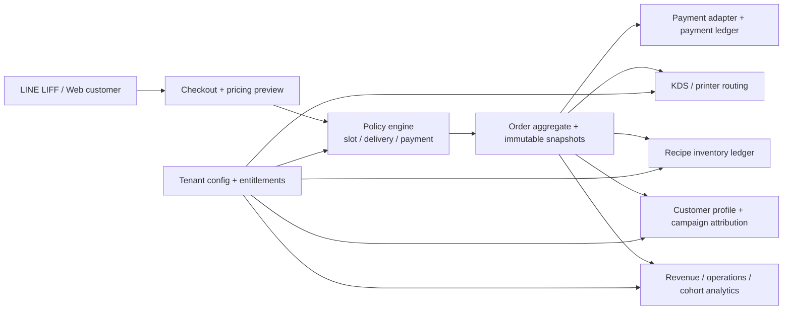

# PDP: Competitive Gap & Business Strategy Roadmap [New]

**Ngày phân tích:** 2026-09-14  
**Phạm vi:** đối chiếu trang feature/pricing của đối thủ với code hiện tại trong repository Benmi Order  
**Đối thủ được khảo sát:** [MenuForFood – 方案比較表](https://menuforfood-git-master-christine0527s-projects.vercel.app/test4-payment.html)

## 1. Executive Summary

### Kết luận ngắn

Benmi không thiếu nền tảng order/menu/POS cốt lõi. Benmi đang thiếu các capability biến hệ thống thành một sản phẩm SaaS F&B có doanh thu cao hơn:

1. **Thu tiền và đối soát đáng tin cậy**: payment gateway, payment state machine, refund/void, đối soát theo ngày.
2. **Tăng doanh thu cho quán**: coupon, campaign, voucher, threshold gift, CRM/segment và LINE remarketing.
3. **Vận hành đa kênh**: delivery có vùng/khoảng cách/phí/minimum order, pickup slot capacity, dispatch.
4. **Giảm thao tác tại quầy**: thermal printer/KDS, kitchen routing, delayed print, staff-created POS order.
5. **Kiểm soát chi phí và mở rộng**: inventory theo nguyên liệu/recipe, purchasing/warehouse, self-serve tenant onboarding và subscription billing.

Đối thủ đang bán theo mô hình **4 gói theo sản lượng đơn/tháng**: `$300`, `$500`, `$700`, `$900`/tháng; các capability như LINE Pay, blacklist, campaign, delivery, inventory tự động và in trễ được đẩy lên gói trả phí. Trang còn niêm yết hardware add-on: 58mm printer `$2,800`, label printer `$2,900`, back-office 80mm printer `$4,100`. Đây là tín hiệu rõ về chiến lược monetization: **base order system + paid operational modules + hardware attach**.

### Thứ tự nên làm

| Ưu tiên | Capability | Vì sao |
|---|---|---|
| P0 | Payment abstraction + payment ledger + manual/online reconciliation | Tạo doanh thu trực tiếp, giảm tranh chấp, là prerequisite cho nhiều rule khác |
| P0 | Structured delivery/pickup policy + slot capacity | Mở rộng use case và doanh thu ngoài cửa hàng; thay text policy bằng business logic |
| P0 | Thermal printer/KDS MVP | Giảm lỗi vận hành và tạo gói premium dễ bán |
| P1 | Campaign/coupon/threshold reward engine | Tăng AOV, repeat order và giúp LINE trở thành kênh tăng trưởng |
| P1 | Inventory theo recipe + auto sold-out | Giảm hủy đơn và lãng phí; nền cho purchasing |
| P1 | Customer profile/segments + LINE CRM | Tăng retention và tạo moat dữ liệu |
| P2 | Purchasing/warehouse | Tăng ARPU ở quán lớn nhưng độ phức tạp cao |
| P2 | Self-serve onboarding, billing, usage metering | Scale business SaaS; nên làm sau khi product modules đã chứng minh PMF |
| P2 | Marketplace/AI forecasting/loyalty | Differentiation dài hạn, không nên chen trước các điểm đau vận hành |

### Mục tiêu chiến lược

Không nên chạy theo việc “copy đủ tên feature”. Nên định vị Benmi là **LINE-first operating system cho quán nhỏ và chuỗi nhỏ**, với:

- triển khai nhanh, chi phí hạ tầng thấp;
- order và trạng thái bếp đáng tin cậy;
- một nguồn dữ liệu cho online, dine-in, POS và delivery;
- module mở rộng theo nhu cầu, nhưng entitlement/schema vẫn tenant-config driven;
- dữ liệu khách hàng và campaign tạo switching cost.

## 2. Phương pháp và giới hạn bằng chứng

### 2.1 Đối thủ

Trang được cung cấp là một **static feature/pricing matrix**. Khi kiểm tra DOM, trang có bảng, không có form, button, link hoặc script tương tác. Vì vậy:

- các tên feature và gói giá là **claim/positioning đã quan sát được**;
- chưa thể kết luận sâu về workflow, SLA, payment reliability hay chất lượng POS của đối thủ;
- các feature đã được ghi nhận theo trạng thái ô trong bảng, không suy diễn thêm ngoài nội dung trang.

### 2.2 Benmi

Đánh giá dựa trên source hiện tại trong repository, gồm frontend HTML/JS, Worker routes/modules và D1 migrations. `git status` cho thấy working tree đang có thay đổi chưa commit liên quan order identity; báo cáo này không sửa hoặc đánh giá lại các thay đổi đó.

### 2.3 Quy ước trạng thái

- **Có:** có code/schema/UI đủ để thực hiện capability cơ bản.
- **Một phần:** có primitive liên quan, nhưng chưa đáp ứng workflow thương mại/đối thủ.
- **Thiếu:** không thấy implementation chạy được trong source hiện tại.
- **Proposal only:** có thiết kế trong `docs/proposals`, nhưng chưa có runtime implementation tương ứng.

## 3. Bảng giá trị kinh doanh của đối thủ

| Gói trên trang đối thủ | Giá hiển thị | Ngưỡng đơn/tháng | Ý nghĩa monetization |
|---|---:|---:|---|
| 基本版 | $300/tháng | dưới 300 | entry plan, cạnh tranh giá |
| PRO版 | $500/tháng | 300–1,000 | mở payment, LINE, delivery và campaign cơ bản |
| PRO MAX版 | $700/tháng | 1,000–1,300 | thêm delivery distance rules, warehouse, support |
| 旗艦版 | $900/tháng | 1,300–1,550 | bundle toàn bộ feature + support |

Các ngưỡng trên hơi hẹp/chồng lấn về mặt commercial design, nên không nên copy nguyên xi. Benmi nên dùng **usage band + module attach**, tránh khóa tenant vào một con số đơn cứng nếu mô hình sau này có nhiều cửa hàng trong cùng tenant.

## 4. Competitive Gap Matrix

### 4.1 Advanced features

| Feature đối thủ | Gói thấp nhất của đối thủ | Benmi | Bằng chứng/nhận xét |
|---|---|---|---|
| LINE Pay | PRO | **Thiếu** | Benmi có LINE Messaging/LIFF, nhưng không có gateway/payment intent/webhook/ledger; `PAID` hiện là trạng thái POS thủ công. |
| Blacklist | PRO | **Thiếu** | Có `user_id`/customer name để nhận diện, chưa có bảng policy blocklist, reason, expiry, audit hay enforcement. |
| Coupon / promotion popup | PRO | **Thiếu** | Có announcement và bundle pricing, chưa có campaign entity, coupon code, eligibility, quota, schedule hoặc popup targeting. |
| Custom requirements | PRO, 2 lựa chọn; PRO MAX 4; Flagship all | **Có một phần / mạnh hơn ở rule engine** | Có modifier, applied modifiers, bundle rules và threshold customization rules; chưa có commercial quota/entitlement kiểu “chọn N module”. |
| Customer service | PRO MAX | **Có một phần** | Có LINE bot, quick replies và flow đổi giờ/hủy; chưa có ticket, SLA, assignment, internal notes hay service analytics. |
| LINE management | PRO | **Có một phần** | Có webhook, push/reply, Flex và quick replies; chưa có UI quản lý audience, broadcast, campaign, template/versioning hoặc consent. |
| Auto sold-out khi inventory = 0 | PRO | **Có một phần** | Có manual `out_of_stock_until` cho món và option; chưa có quantity ledger, recipe depletion hoặc atomic reservation. |
| Advance reservation 30 ngày | PRO | **Có một phần** | Có date/time picker từ ngày hiện tại và scheduled pickup; chưa giới hạn horizon 30 ngày, slot capacity, blackout date hay reservation inventory. |
| Non-current-day orders require LINE Pay | PRO | **Thiếu** | Chưa có payment method rule engine. |
| Multiple operating shifts | PRO | **Có** | D1 lưu operating hours; POS có add/remove shift và customer menu render nhiều ca. |
| POS LINE Pay bookkeeping | PRO | **Thiếu** | Chưa có payment transaction, fee, settlement batch hay daily reconciliation. |
| Merchant delivery service | PRO | **Có một phần** | Có `delivery_policy` dạng text/FAQ; chưa có delivery order type, address capture, fee quote, dispatch, driver status hoặc proof of delivery. |
| Distance-tier minimum order | PRO MAX | **Thiếu** | Có latitude/longitude marketplace và text policy, chưa có geocoding/address normalization + distance tier calculation tại checkout. |
| Delivery/pickup date selection 7 days | PRO | **Có một phần** | Có date/time picker, nhưng không có delivery workflow và không thấy cap 7 ngày/capacity per slot. |
| Global taste preference | PRO | **Có một phần** | Có per-item customization; chưa có order-level preference profile áp dụng xuyên món/khách hàng. |
| Threshold gift item | PRO | **Thiếu** | Bundle/discount rule không đồng nghĩa với free gift SKU có quota/stock/selection. |
| Amount threshold only LINE Pay | PRO | **Thiếu** | Chưa có payment method constraints. |
| Delayed printer 20 minutes before pickup | PRO | **Proposal only** | Có proposal Android/ESC-POS, nhưng chưa có runtime printer service/station queue. |
| Warehouse purchasing | PRO MAX | **Thiếu** | Chưa có supplier, purchase order, receiving, stock movement hay cost basis. |

### 4.2 Base features

| Base feature đối thủ | Benmi | Đánh giá thực tế |
|---|---|---|
| Order management | **Có** | Live POS, history, status transition, append order, queue-ahead và LINE progress. |
| Menu management | **Có** | Dynamic menu/category/item/modifier, image và stock-status update. |
| Personalization | **Có** | Branding, logo, address, announcement, locale, operating hours và tenant config. |
| Revenue overview | **Có một phần** | Có item revenue KPI; chưa có gross/net sales, payment split, refunds, fees, tax hay reconciliation view. |
| Reports | **Có một phần** | Có item analytics cho today/7d/30d/custom API; chưa có channel, hourly, margin, payment và export report đầy đủ. |
| Sales ranking | **Có** | Top item và ranking theo quantity/sales. |
| Customer analysis | **Có một phần** | Lưu `user_id`/customer name và order history; chưa có customer profile, repeat rate, cohort, RFM, LTV hay segmentation. |
| Activity/campaign management | **Thiếu** | Announcement không phải campaign management. Bundle rules cũng chưa có audience, schedule, budget, quota hay attribution. |
| Order and add-on time | **Có** | Có pickup date/time, created time, append rounds và last appended time. |
| Dine-in table number | **Có** | Có dine-in feature gate, table number, filter và round append. |
| Payment and printer integration | **Thiếu runtime** | Có `PAID` status/manual action và proposal printer; chưa có gateway hoặc hardware integration production-ready. |
| Settings | **Có** | Có store status, pickup mode, shifts, address, announcement, logo, language, dine-in, reports. |
| POS ordering | **Có một phần** | POS xử lý incoming orders; chưa thấy staff-created order/quick sale/phone order flow đầy đủ. |
| Order logic rules | **Có** | Có stock validation, bundle rules, threshold customization, pickup ordering và tenant feature gating. |

### 4.3 Kết luận gap

Khoảng cách cạnh tranh có 3 tầng:

1. **Parity gap:** payment, printer/KDS, delivery logic, campaign/coupon, customer analysis.
2. **Scale/operational gap:** inventory ledger, recipe depletion, purchasing/warehouse, staff roles/audit.
3. **Commercialization gap:** usage metering, self-serve plan/billing, entitlement catalog, module adoption analytics.

## 5. Nên làm gì trước – chấm điểm chiến lược

### 5.1 Tiêu chí

Điểm 1–5 cho mỗi tiêu chí:

- **Revenue:** khả năng tăng MRR/ARPU hoặc GMV ngay;
- **Retention:** mức độ làm khách hàng khó rời hệ thống;
- **Pain:** tần suất và mức đau vận hành;
- **Leverage:** mở khóa capability khác;
- **Effort:** độ khó; điểm cao là dễ làm hơn.

Điểm ưu tiên định hướng = `Revenue*2 + Retention + Pain + Leverage + Effort`.

### 5.2 Ranking

| Rank | Initiative | Revenue | Retention | Pain | Leverage | Effort | Tổng | Recommendation |
|---:|---|---:|---:|---:|---:|---:|---:|---|
| 1 | Payment abstraction + ledger + reconciliation | 5 | 5 | 4 | 5 | 2 | 26 | **P0 – bắt buộc** |
| 2 | Delivery/pickup policy engine + slot capacity | 5 | 4 | 5 | 4 | 2 | 25 | **P0 – bắt buộc** |
| 3 | Thermal printer/KDS MVP | 4 | 5 | 5 | 4 | 3 | 25 | **P0 – premium wedge** |
| 4 | Campaign/coupon/threshold reward engine | 5 | 5 | 3 | 4 | 2 | 24 | **P1 – growth loop** |
| 5 | Ingredient inventory + atomic depletion/auto sold-out | 4 | 5 | 5 | 4 | 2 | 24 | **P1 – quality/scale** |
| 6 | Customer profiles, segments, consent and LINE CRM | 5 | 5 | 3 | 4 | 2 | 24 | **P1 – moat** |
| 7 | Staff-created POS order + roles/audit | 3 | 4 | 5 | 3 | 3 | 21 | **P1 – parity/operation** |
| 8 | Purchasing/warehouse | 4 | 5 | 4 | 3 | 1 | 21 | **P2 – large-store ARPU** |
| 9 | Self-serve onboarding + subscription billing + usage metering | 5 | 4 | 2 | 5 | 1 | 22 | **P2 – platform scale** |
| 10 | Loyalty/membership/referral | 5 | 5 | 2 | 3 | 2 | 22 | **P2 – retention expansion** |
| 11 | Marketplace discovery/map | 3 | 3 | 2 | 4 | 3 | 20 | **P2 – network effect** |
| 12 | AI demand forecast/menu copilot | 3 | 2 | 2 | 3 | 3 | 18 | **P2 – differentiation later** |

Điểm không phải dự báo doanh thu tuyệt đối; đây là thứ tự đầu tư theo leverage và khả năng tạo business proof.

## 6. Các chức năng cả hai bên chưa có nhưng Benmi nên xây

Đây là các cơ hội không xuất hiện rõ trên bảng đối thủ và cũng chưa có đầy đủ trong Benmi. Nên chọn những thứ tận dụng lợi thế LINE + multi-tenant + structured orders.

### 6.1 Customer/data moat

- **Unified customer profile:** LINE user, consent, order frequency, AOV, last order, favorite items, preferred pickup mode.
- **RFM/cohort/LTV dashboard:** owner biết khách nào cần giữ, campaign nào tạo repeat purchase.
- **LINE campaign automation:** welcome, win-back sau N ngày, birthday/anniversary, abandoned cart, reorder favorite.
- **Coupon attribution:** biết campaign nào thật sự tạo incremental order thay vì chỉ giảm margin.

### 6.2 F&B operating intelligence

- **Recipe-level inventory and forecast:** từ order item → ingredient movement → projected stockout time.
- **Prep forecast:** dự báo số lượng cần chuẩn bị theo slot/weekday, giảm waste và thiếu món.
- **Kitchen SLA:** received → accepted → preparing → ready → picked up, alert khi quá SLA.
- **Multi-station routing:** món/nhóm món đi đúng printer/KDS station; bundle snapshot bất biến.

### 6.3 SaaS/product moat

- **Self-serve onboarding:** tạo tenant, import menu, theme setup, LINE connection checklist, test order.
- **Plan simulator:** thử module, forecast monthly price theo volume, preview locked/unlocked behavior.
- **Tenant health score:** order success rate, payment failure, printer offline, stock rejection, response time.
- **Feature adoption analytics:** biết tenant đã bật nhưng chưa dùng module nào để trigger onboarding/support.

### 6.4 Network/distribution

- **Multi-store group account:** headquarters dashboard, shared catalog template, store-level overrides.
- **Marketplace order routing:** marketplace không chỉ list quán mà tạo traffic, coupon cross-store và sponsored placement.
- **Partner ecosystem:** printer installers, delivery partners, accountant/export integrations.

## 7. Kiến trúc đề xuất để không phá multi-tenant

### Nguyên tắc dữ liệu

- Dùng `tenant_id` trên mọi bảng nghiệp vụ và mọi index truy vấn chính.
- Không hardcode tên quán, slug category hoặc payment provider trong business rules.
- Tách domain rõ ràng: `orders`, `payments`, `delivery_quotes`, `inventory_movements`, `campaigns`, `customer_profiles`, `subscriptions`.
- Pricing/payment/campaign phải lưu **immutable snapshot** vào order để lịch sử không thay đổi khi config đổi.
- KV chỉ cache read model/bootstrap; D1 là source of truth cho ledger và trạng thái có hậu quả tài chính.
- Entitlement phải có capability key/config-driven; frontend lock chỉ là UX, backend luôn enforce.

### Đề xuất các bảng lõi trong tương lai

| Domain | Bảng đề xuất | Vai trò |
|---|---|---|
| Payment | `payment_transactions`, `payment_events`, `payment_settlements` | idempotency, webhook event log, reconciliation |
| Delivery | `delivery_zones`, `delivery_quotes`, `delivery_jobs` | distance/zone, fee/minimum, dispatch lifecycle |
| Capacity | `fulfillment_slots`, `slot_reservations` | capacity theo ngày/ca/channel |
| Growth | `campaigns`, `coupons`, `coupon_redemptions`, `rewards` | promotion lifecycle và attribution |
| CRM | `customer_profiles`, `customer_consents`, `customer_segments` | retention và LINE automation |
| Inventory | `ingredients`, `recipes`, `inventory_movements`, `purchase_orders` | depletion, receiving, COGS |
| Operations | `prep_stations`, `printer_devices`, `print_jobs`, `kitchen_events` | KDS/printer reliability |
| SaaS | `plans`, `entitlements`, `tenant_subscriptions`, `usage_daily` | packaging, billing, usage metering |

## 8. Roadmap triển khai

### Phase 0 – Product instrumentation và contract hardening

- [ ] Chuẩn hóa order pricing calculation thành một service dùng chung cho preview và server validation.
- [ ] Thêm correlation/trace id cho order, payment, print và campaign events.
- [ ] Tách `PAID` manual status khỏi payment provider status; thêm `payment_method`, `payment_status`, `settlement_status` dưới dạng snapshot/ledger.
- [ ] Định nghĩa capability catalog: `payments`, `delivery_rules`, `printer`, `inventory`, `campaigns`, `crm`, `purchasing`.

### Phase 1 – P0 revenue/operation (3 PR streams)

**A. Payment MVP**

- [ ] Payment adapter interface, bắt đầu với một provider phù hợp thị trường mục tiêu.
- [ ] Create payment intent với idempotency key = tenant + order UUID.
- [ ] Webhook signature verification, event deduplication và state transition.
- [ ] Manual cash/transfer vẫn được ghi vào cùng ledger.
- [ ] POS reconciliation: gross, fee, net, refund, mismatch.

**B. Delivery & capacity MVP**

- [ ] Structured delivery policy: zone/radius, minimum subtotal, fee, free-shipping threshold.
- [ ] Address capture/normalization và server-side quote.
- [ ] Pickup/delivery slots theo timezone tenant, capacity và blackout date.
- [ ] Snapshot quote/policy vào order.

**C. Printer/KDS MVP**

- [ ] Printer device/station registration và heartbeat.
- [ ] `print_jobs` idempotent, retry/backoff, dead-letter/error state.
- [ ] Kitchen ticket, cashier receipt, delayed print và manual reprint.
- [ ] Start with Android/ESC-POS proposal already present, but implement runtime before selling the feature.

### Phase 2 – Growth and control

- [ ] Campaign/coupon/reward engine with schedule, quota, eligibility, usage limit and attribution.
- [ ] Ingredient/recipe inventory with atomic movement and auto sold-out.
- [ ] Customer profile, consent, segmentation and LINE campaign audit.
- [ ] Staff-created POS order, role-based access and audit log.

### Phase 3 – ARPU and platform scale

- [ ] Purchasing/warehouse and COGS.
- [ ] Multi-store HQ controls and template inheritance.
- [ ] Self-serve onboarding, subscription billing and usage metering.
- [ ] Marketplace demand generation, loyalty/referral and AI copilot.

## 9. Rollout, metrics và ngưỡng quyết định

### 9.1 Rollout

1. **Shadow mode:** calculate payment/delivery/inventory quote nhưng chưa chặn order; log mismatch.
2. **Canary tenants:** bật theo `features` cho 1–2 tenant có volume và owner hợp tác.
3. **Dual-read/dual-write có chọn lọc:** chỉ với payment/inventory ledger; không duplicate financial side effects.
4. **Progressive enablement:** theo tenant, sau đó theo store/channel.
5. **Fallback:** manual payment, manual delivery policy, manual print/reprint luôn tồn tại trong P0.

### 9.2 Metrics bắt buộc

| Nhóm | Metric |
|---|---|
| Revenue | MRR/module, attach rate, ARPU, payment conversion, AOV, repeat order rate |
| Reliability | order success rate, payment webhook lag, duplicate payment rate, printer failure rate |
| Operations | order-to-ready p50/p95, stock rejection rate, cancellation rate, slot over-capacity rate |
| Growth | campaign redemption, incremental AOV, repeat within 30 days, customer reactivation |
| SaaS | activation time, weekly active tenant, module adoption, churn, support tickets per tenant |

### 9.3 Go/no-go criteria

- Payment: không rollout rộng nếu webhook reconciliation chưa đạt 99.9% event coverage.
- Delivery: không thu phí theo quote nếu server quote và captured amount còn mismatch không giải thích được.
- Printer: không bán như “automatic” nếu chưa có retry, offline visibility và reprint audit.
- Campaign: không tối ưu theo số coupon dùng; phải đo incremental gross profit sau discount.
- Inventory: không auto sold-out nếu movement chưa idempotent và chưa có correction flow.

## 10. Rủi ro và trade-offs

| Lựa chọn | Ưu điểm | Rủi ro |
|---|---|---|
| Copy toàn bộ competitor feature list | Dễ kể chuyện sales | Dàn trải, thiếu reliability ở payment/inventory/printer |
| Làm payment trước | Tạo nền tài chính và mở nhiều rule | Phụ thuộc provider, cần security/reconciliation nghiêm ngặt |
| Làm growth trước | Có thể tăng order nhanh | Giảm giá trước khi đo margin/retention dễ làm xấu economics |
| Làm warehouse sớm | ARPU lớn ở quán lớn | Quá nặng với SMB; chưa giải quyết pain phổ biến nhất |
| Dùng JSON config cho mọi domain | Nhanh prototype | Không phù hợp ledger, audit, query và concurrency |
| Tách relational domain tables | Rõ boundary, scale tốt | Nhiều migration/contract; cần rollout từng phase |

Khuyến nghị: giữ JSON cho **tenant feature catalog/read configuration**; dùng relational tables cho **money, stock, fulfillment, customer consent và audit**.

## 11. Kết luận

Đối thủ hiện đang có lợi thế về **câu chuyện đóng gói và bán module** hơn là bằng chứng sản phẩm đã kiểm chứng. Benmi có lợi thế kỹ thuật nền tảng: multi-tenant, LINE-native, edge bootstrap, structured order items, bundle/threshold rules và marketplace foundation.

Khoản đầu tư hợp lý nhất là biến những primitive đang có thành các module production-grade có thể tính phí:

1. **Payments & reconciliation**;
2. **Delivery/capacity**;
3. **Printer/KDS**;
4. **Campaign/CRM**;
5. **Inventory/purchasing**.

Sau 5 module này mới nên hoàn thiện self-serve billing và network/AI. Thứ tự này bảo vệ unit economics, tạo lý do nâng gói rõ ràng và tận dụng tối đa kiến trúc tenant-config của Benmi.
