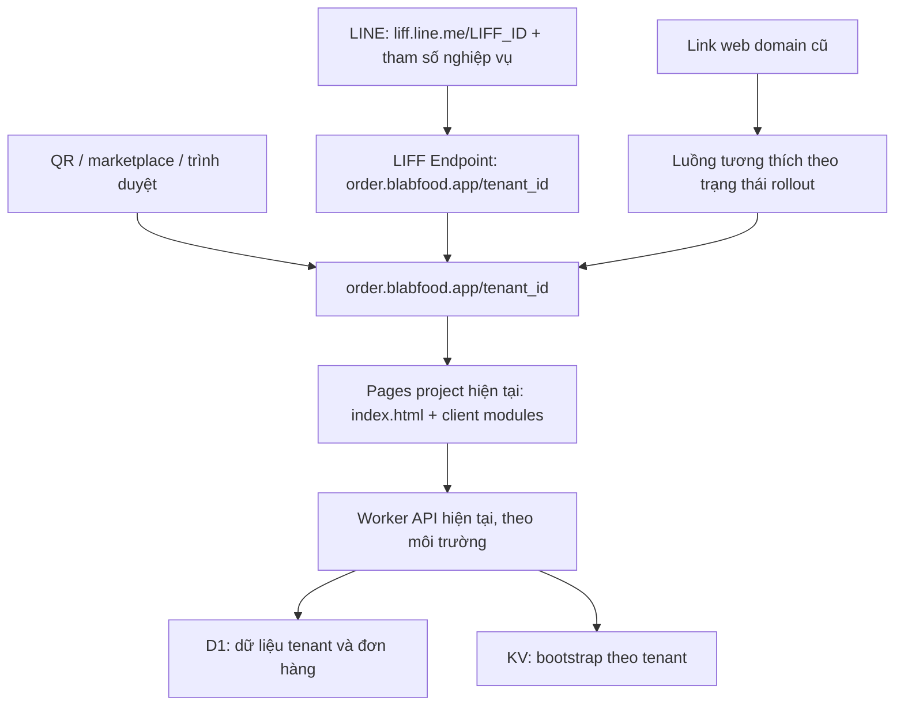

# PDP: Chuyển trang đặt món thực khách sang domain Blabfood [Migrate]

Ngày: 04/10/2026. Trạng thái: đề xuất, chưa triển khai.

## 1. Tóm tắt và mục tiêu

URL chính thức theo yêu cầu đã làm rõ: `https://order.blabfood.app/<tenant_id>`. Người dùng xác nhận mỗi quán có một LIFF ID riêng, nên Endpoint và rollout được quản lý riêng từng quán. Giữ `blabfood.app` làm trang giới thiệu, `explore.blabfood.app` làm trang khám phá quán và `pos.blabfood.app` làm POS. Mọi quán dùng cùng một handler động; không tạo file HTML, DNS hay điều kiện code riêng theo từng quán.

Mục tiêu: khách vào đúng quán, đăng nhập LINE thành công, đặt món/thêm món/sửa đơn hoạt động; link và QR cũ tiếp tục có đường sử dụng; có thể quay về domain cũ khi gặp lỗi. Không đổi dữ liệu đơn hàng, tenant ID hay mô hình menu.

Phạm vi: custom domain Pages, route theo tenant ID, cấu hình URL, LIFF Endpoint, link marketplace/QR/LINE, tương thích URL cũ và kiểm thử. Tách API sang `api.blabfood.app`, thay giao diện, tạo slug khác tenant ID và di chuyển database là các dự án riêng.

## 2. Hiện trạng đã kiểm tra

| Thành phần | Hiện trạng trong repository | Tác động |
| --- | --- | --- |
| `README.md` | Frontend production được mô tả là `benmi-order.pages.dev`; dev/staging có domain riêng | Có thể thêm custom domain vào cùng Pages project |
| `index.html` | Root apex không có query/hash chuyển sang `/landing`; tenant lấy từ query, `liff.state`, hash, storage, rồi fallback tenant mặc định | Cần xử lý rõ URL thiếu tenant trên domain mới |
| `js/client-core.js` | Worker API chọn theo hostname; `getCleanLiffRedirectUri()` đổi apex về `benmi-order.pages.dev` | Đăng nhập có thể kéo khách trở lại domain cũ; hàm còn được dùng với `history.replaceState()` |
| `js/marketplace.js` | `buildMarketplaceOrderUrl()` luôn sinh link production domain cũ, tại ba vị trí sử dụng | Cần chuyển đồng bộ các link và tránh dev/staging dẫn khách vào production |
| `functions/_middleware.js` | Định tuyến riêng cho explore và POS; host khác đi qua Pages assets | Root order có thể dùng `index.html` sẵn có; không cần tạo Pages project mới chỉ để phục vụ root |
| Backend tenant/bootstrap | Đọc `liff_id`, `liff_url` từ cấu hình tenant; còn một số fallback theo tenant cụ thể | Không thêm hardcode tenant; kiểm tra tenant nào có LIFF riêng, tenant nào dùng chung |
| LINE receipts/sold-out | Nút thêm món/sửa đơn dùng `https://liff.line.me/{id}` kèm tenant và tham số đơn | Nên giữ LIFF URL; đổi Endpoint phía LINE, không thay tất cả bằng web URL |
| `src/utils/http.ts` | CORS hiện cho phép origin `*`, có OPTIONS và header tenant | Đổi frontend origin không mặc nhiên yêu cầu sửa CORS; vẫn phải kiểm thử response và preflight thực tế |
| `_headers` | JS/CSS cache dài, HTML revalidate | Mọi JS sửa phải bump version trong HTML và preload tương ứng |

Kiểm tra HTTP từ môi trường làm việc ngày 04/10/2026: `blabfood.app` trả HTTP 200; `order.blabfood.app` chưa resolve ở resolver sử dụng. Chưa kiểm tra Dashboard Cloudflare, DNS authoritative, cấu hình Pages thực tế, danh sách tenant production hoặc LINE Developers Console. Không coi cấu hình mô tả trong repo là bằng chứng cấu hình live đã hoàn tất.

## 3. Kiến trúc đề xuất



### 3.1. Domain và môi trường

| Vai trò | Production | Dev/staging trong lần chuyển này |
| --- | --- | --- |
| Trang giới thiệu | `blabfood.app` | Giữ cấu hình hiện tại |
| Khám phá quán | `explore.blabfood.app` | Giữ cấu hình hiện tại |
| Đặt món | `order.blabfood.app` | Giữ `dev.benmi-order.pages.dev`, `staging.benmi-order.pages.dev` |
| POS | `pos.blabfood.app` | Giữ cấu hình hiện tại |
| API | Worker URL production hiện tại | Worker dev và staging hiện tại |

Thêm `order.blabfood.app` trong **Pages project → Custom domains**, hoàn tất DNS và chứng chỉ, rồi kiểm tra HTTPS. Không chỉ thêm CNAME mà bỏ qua đăng ký domain vào Pages. Quy trình này theo [Cloudflare Pages custom domains](https://developers.cloudflare.com/pages/configuration/custom-domains/).

Thêm route GET/HEAD `/<tenant_id>` và `/<tenant_id>/` trong Pages middleware cho order host. Phục vụ document root nội bộ qua `env.ASSETS`, giữ URL gốc trên browser và giữ query/hash phía client. Không dùng 301/302 về `/?tenant_id=...`, không gửi redirect clean URL của asset nội bộ ra browser. Static asset request và các host POS/explore giữ luồng định tuyến riêng.

Đổi asset trong `index.html` thành đường dẫn từ root: `/index.css`, `/js/client-core.js`, `/js/...`, `/blab_icon.png`, gồm cả preload. Nếu giữ đường dẫn tương đối, `/store-a/` sẽ tìm JS tại `/store-a/js/...` và có thể nhận HTML thay vì JS. Rà soát đường dẫn ảnh/font phát sinh từ JS/CSS; không thêm `<base>` chỉ để chữa asset vì nó thay đổi cách resolve mọi URL tương đối.

Middleware phải trả `Cache-Control: public, max-age=0, must-revalidate` cho document tenant, kể cả route không có đuôi `.html`. Cần test response header thực tế vì route qua Pages Functions không thể chỉ dựa vào `_headers` cho static assets.

### 3.2. Tenant và URL

- URL mới và Endpoint của quán cùng dùng `https://order.blabfood.app/<tenant_id>`, không có trailing slash trong link sinh mới. Cả hai biến thể `/<tenant_id>` và `/<tenant_id>/` phải hoạt động mà không redirect đổi path trong lúc LIFF khởi tạo. LINE có thể tạo secondary URL có slash/tham số bổ sung.
- Trên route order tenant, path là nguồn tenant chính. Query `tenant_id`/`tenant` và tenant trong `liff.state`/hash chỉ được chấp nhận nếu khớp path; nếu xung đột thì hiển thị lỗi và không nạp LIFF/đơn của tenant khác. Storage không được ghi đè tenant trong path.
- Đọc tenant từ path ngay ở `extractTenantId()` trước bootstrap/theme/LIFF. Mọi API vẫn gửi tenant bằng query/header hiện có, không cần đổi backend route.
- Kiểm tra cú pháp tenant ID theo quy ước hiện có, loại trừ các segment hệ thống/assets, và xác nhận tenant tồn tại bằng bootstrap. Inventory phải phát hiện tenant ID trùng segment dành riêng trước rollout. Tenant không hợp lệ/không tồn tại phải hiển thị lỗi; không fallback vào quán mặc định.
- Domain order mới thiếu tenant mở luồng chọn quán. Root query cũ còn hỗ trợ để tương thích, nhưng sau khi Endpoint chuyển sang path thì không gọi `liff.init()` của quán ngay tại root: phải vào path tương ứng trước khi bắt đầu auth. Nếu request chứa ngữ cảnh callback/SDK đang xử lý thì dùng chính sách tương thích riêng, không redirect tổng quát.
- LIFF URL giữ dạng `https://liff.line.me/<LIFF_ID>` với query nghiệp vụ. Không thêm tenant path sau LIFF ID nếu Endpoint đã có tenant path, tránh ghép thành `/tenant_id/tenant_id`. Các query tenant cũ trong receipts phải khớp tenant của Endpoint.
- Bảo toàn `tenant_id`, `mode`, `order_key`, `parent_order_key`, `parent_display_key`, `table_number`, `display_key` và các tham số nghiệp vụ đang dùng. Backend tiếp tục xác minh quyền truy cập đơn, không dùng tenant query như bằng chứng phân quyền.

### 3.3. URL builder và đăng nhập

Tách hai trách nhiệm hiện đang cùng sử dụng `getCleanLiffRedirectUri()`:

1. Làm sạch URL hiển thị **trên origin hiện tại**, chỉ sau khi `liff.init()` thành công. `history.replaceState()` không nhận URL của origin khác.
2. Tạo URL đăng nhập theo Endpoint đã cấu hình cho LIFF ID và môi trường hiện tại. Không đổi hostname vô điều kiện theo domain thương hiệu.

Quản lý URL qua cấu hình môi trường và cấu hình tenant khi thực sự có override; không dùng điều kiện theo tên quán. Nếu cần lưu trạng thái rollout, dùng registry cấu hình riêng với mapping tenant → LIFF ID → Endpoint hiện tại; schema migration không bắt buộc cho bản chuyển domain tối thiểu. Không nhét metadata object vào `tenant_config.features`: frontend hiện sử dụng trường này như danh sách feature.

Ví dụ với tenant `store-a`: Endpoint là `https://order.blabfood.app/store-a`; browser login trả về chính path đó, có thể kèm query nghiệp vụ; sau SDK init, chỉ làm sạch URL trên cùng origin/path. Không hạ URL về root hay đổi sang domain cũ. Kiểm tra LIFF ID từ bootstrap đúng quán, không cho query `liff_id`/`liffClientId` tự ý chọn app khác khi đã có tenant xác định.

Marketplace dùng URL builder duy nhất theo môi trường và trạng thái sẵn sàng của từng tenant: tenant chưa chuyển vẫn mở domain cũ; tenant đã chuyển dùng `order.blabfood.app/<tenant_id>`. Chỉ công bố URL mới khi Endpoint của LIFF tương ứng đã chuyển và smoke test đạt.

LINE yêu cầu `redirectUri` nằm trong phạm vi Endpoint URL; không sửa tham số SDK trước khi `liff.init()` hoàn tất. Primary redirect và secondary redirect phải được khởi tạo đúng. Tham khảo [LIFF API reference](https://developers.line.biz/en/reference/liff/) và [Opening a LIFF app](https://developers.line.biz/en/docs/liff/opening-liff-app/).

### 3.4. Backend, D1 và KV

Giữ Worker API, D1 và KV hiện tại. Không đổi key `tenant:{tenant_id}:bootstrap` hoặc di chuyển đơn hàng. Chỉ deploy backend nếu cần metadata rollout hay sửa cơ chế sinh URL.

Nếu giữ LIFF ID thì chỉ thay Endpoint trong LINE Console; không cần thay `liff_id`/`liff_url` trong D1 vì LIFF URL vẫn như cũ. Nếu thực sự cập nhật cấu hình tenant/metadata bootstrap, gọi `invalidateBootstrapCache(tenantId, env)` và xử lý browser bootstrap cache để không giữ trạng thái rollout cũ. Không đưa id/token/secret vào URL cấu hình public.

## 4. Chuyển đổi, link cũ và rollback

### 4.1. Trình tự rollout

1. **Inventory:** ghi nhận từng tenant và LIFF ID riêng, LINE Login channel, Endpoint hiện tại, môi trường, owner có quyền sửa và bản backup cấu hình. Xác minh mapping 1:1 và kiểm tra tenant ID không xung đột path hệ thống. Ghi nhận QR, rich menu và link đã phát hành.
2. **Chuẩn bị:** deploy code tương thích lên dev → staging → main; link public vẫn dùng domain cũ. Thêm custom domain và xác nhận HTML/assets/API hoạt động. Smoke test LIFF trên staging trước; staging không dùng chung production LIFF ID.
3. **Pilot:** chọn một quán; đổi Endpoint của LIFF riêng sang `https://order.blabfood.app/<tenant_id>`, kiểm tra đăng nhập và các luồng đơn; sau đó bật link path mới cho quán đó.
4. **Mở rộng:** chuyển các quán còn lại theo đợt, mỗi quán có smoke test và quan sát lỗi. Giữ LIFF ID và channel hiện có để giữ link đã phát hành.
5. **Ổn định:** mặc định link mới, tiếp tục hỗ trợ domain cũ. Đề xuất tối thiểu 30 ngày theo dõi trước khi đánh giá có cần redirect cố định; QR cũ có thể cần hỗ trợ lâu hơn. Không đóng toàn bộ `pages.dev`.

### 4.2. Chính sách domain cũ

- Không redirect toàn bộ `benmi-order.pages.dev/*`: host này còn phục vụ POS cũ, assets và các trang khác.
- Giai đoạn đầu để các trang đang mở tiếp tục chạy tại origin cũ; không tự chuyển host giữa giỏ hàng hoặc lúc gửi đơn. Tab đã mở không thể đảm bảo đổi domain đồng bộ.
- Sau khi LIFF của một quán chuyển, lần đăng nhập mới từ trang cũ dùng đường dẫn tương thích sang LIFF URL của đúng tenant/app, bảo toàn tham số nghiệp vụ. Với phiên cũ đã đăng nhập và còn hoạt động, cho phép hoàn tất đơn tại origin cũ.
- OAuth callback/primary redirect đang xử lý không đi qua redirect host tổng quát. Giữ các tham số SDK cho luồng init; nếu callback cũ không còn hợp lệ sau thay Endpoint, cung cấp luồng đăng nhập lại trên Endpoint mới và giữ bản nháp ở origin cũ. Kiểm thử tình huống này trước rollout; không cam kết không gián đoạn mọi phiên OAuth đang mở.
- Nếu về sau bật redirect, giới hạn vào GET/HEAD của entrypoint đặt món cho quán đã chuyển, dùng 302 trong giai đoạn còn rollback. Không redirect POST/API, assets, POS, dev/staging hoặc tenant chưa chuyển.
- Query nghiệp vụ được giữ; hash cần xử lý phía browser vì server không nhận fragment. Không chuyển nguyên query OAuth hoặc access token sang origin khác.

### 4.3. Storage và giỏ hàng

`localStorage`/`sessionStorage` thuộc origin, nên cache bootstrap, giỏ hàng và trạng thái sửa/thêm món ở domain cũ không tự xuất hiện trên domain mới. Lần mở đầu sẽ tải lại bootstrap và có thể đăng nhập lại.

Bản đầu giữ tab cũ để khách hoàn tất giỏ hàng. Không truyền giỏ hàng hoặc token qua query string. Nếu yêu cầu giữ bản nháp xuyên domain, lập thêm thiết kế chuyển bản nháp có xác thực, TTL và chống replay; đây là phạm vi bổ sung.

### 4.4. Rollback

Trigger: bất kỳ lỗi sai tenant/rò dữ liệu; lỗi đăng nhập, vòng lặp redirect hoặc không tạo được đơn tái hiện được; tỷ lệ lỗi LIFF/create tăng đáng kể so với baseline. Mức cảnh báo ban đầu đề xuất: lỗi tăng trên 1 điểm phần trăm trong 10 phút khi mẫu đủ lớn; mẫu nhỏ dựa vào smoke test và lỗi cụ thể.

Thứ tự: dừng công bố link mới → khôi phục Endpoint cũ cho LIFF app bị ảnh hưởng → phục hồi cấu hình URL/rollout của quán → invalidate bootstrap nếu cấu hình đổi → kiểm tra link cũ, đăng nhập và tạo đơn. Domain mới vẫn phục vụ trang hỗ trợ/luồng quay về đúng quán theo cấu hình rollback. Không xóa custom domain hoặc sửa DNS để rollback ngay. Không rollback database/đơn hàng.

## 5. Phương án thay thế và đánh đổi

| Phương án | Ưu điểm | Đánh đổi | Đánh giá |
| --- | --- | --- | --- |
| `order.blabfood.app/<tenant_id>` | URL theo yêu cầu; Endpoint từng quán xác định tenant ngay từ path | Phải thêm route, đọc tenant từ path, sửa asset và kiểm thử cả hai dạng slash | Phương án đã chọn |
| `order.blabfood.app/?tenant_id=...` | Ít thay đổi route | URL query; init tại root không còn phù hợp Endpoint path khi chuyển | Chỉ giữ làm entrypoint tương thích |
| `blabfood.app/order?tenant_id=...` | URL cùng domain thương hiệu | Phải route `/order`, kiểm tra asset tương đối và LIFF Endpoint path, xử lý xung đột landing | Dùng nếu muốn giữ apex |
| `blabfood.app/?tenant_id=...` | Ít thay đổi asset/path | Root vừa landing vừa đặt món; LIFF thiếu tenant dễ xung đột redirect `/landing` | Cần thiết kế phân luồng rõ |
| Giữ domain `pages.dev` | Không có cutover | Chưa đạt URL thương hiệu | Chỉ dùng làm fallback |

Không đổi LIFF ID chỉ để đổi domain: tạo app mới làm thay đổi link đã phát hành và tăng việc cập nhật cấu hình. Chỉ tạo thêm app nếu cần môi trường kiểm thử/pilot độc lập hoặc yêu cầu channel thực tế.

## 6. Bảo mật, quan sát và hiệu năng

- Cấu hình destination origin phải thuộc danh sách được quản lý; không nhận redirect destination tự do từ query.
- Không ghi URL đầy đủ chứa `code`, `state`, access token, thông tin khách vào analytics/logs. Log các trường đã lọc: environment, frontend host, version, tenant ID, LIFF ID, phase, error code, request ID khi có.
- Theo dõi bootstrap error, LIFF init/login error, create/append/modify success và độ trễ. Dùng dữ liệu quan sát sẵn có trước; chỉ bổ sung telemetry tối thiểu nếu chưa đủ, không tạo hệ thống metrics lớn cho lần đổi domain.
- So sánh với baseline cùng tenant/môi trường; đăng nhập thành công phải đi tiếp đến thao tác nghiệp vụ. UI success nhưng LINE receipt/POS không nhận đơn vẫn là lỗi.
- Không thêm proxy API hoặc thay database vào đợt đầu. HTML revalidate; JS/CSS tăng cache-buster trong cả preload và script/style, ví dụ `?v=20261004_order_domain_v1` nếu triển khai trong ngày này.
- CORS wildcard hiện tại không phải cơ chế xác thực. Không đưa việc sửa toàn bộ CORS vào scope nếu không có lỗi thực tế hoặc chuyển sang cookie credentials.

## 7. Kế hoạch thực thi theo milestone

- [ ] **M1 — Inventory và hạ tầng:** chốt URL, inventory LIFF/tenant, backup Endpoint, kiểm tra Pages production branch, thêm custom domain, kiểm tra SSL.
- [ ] **M2 — Code tương thích:** thêm route tenant có/không trailing slash vào middleware; đọc tenant path và chặn xung đột trong `index.html`; chuyển assets/preloads sang root; sửa URL login/URL cleanup trong `js/client-core.js`; bảo toàn query nghiệp vụ trong `js/client-checkout.js`; sinh marketplace link path theo rollout. Bump `index.html` và `marketplace.html` nếu JS liên quan đổi; HTML khác chỉ bump khi thực sự tham chiếu asset đổi.
- [ ] **M3 — QA dev/staging:** kiểm thử đúng môi trường và luồng LIFF; bổ sung regression tests vào `scripts/test-explore-routing.mjs`, `scripts/test-client-modular.mjs` hoặc file riêng nếu phù hợp. Chạy `npm run check`, `npm test`; nếu backend đổi, chạy type check và tests liên quan.
- [ ] **M4 — Pilot production:** release qua dev → staging → main, đổi Endpoint LIFF của một quán sang tenant path, smoke test rồi bật link mới; cập nhật QR/rich menu nếu hiện dùng web URL cũ. LIFF URL giữ ID không cần phát hành lại chỉ vì đổi Endpoint.
- [ ] **M5 — Mở rộng và vận hành:** chuyển các quán còn lại, quan sát, diễn tập rollback, cập nhật README/runbook, duy trì link cũ theo lưu lượng thực tế.

Ước lượng để lập lịch: 2–3 ngày làm việc cho inventory, code và QA khi có quyền Cloudflare/LINE và ít LIFF app; rollout/quan sát thêm 1–3 ngày. Số app/channel và chủ sở hữu Console có thể làm tăng thời gian. Đây là dự trù, không phải cam kết trước inventory.

## 8. Kiểm thử và điều kiện hoàn tất

| Nhóm | Tình huống bắt buộc |
| --- | --- |
| Domain/assets | `/<tenant>` và `/<tenant>/` trả document đúng, không 3xx trong auth; asset `/js/...` có content-type JS; document revalidate; không loop; không chuyển landing/POS/explore ngoài dự kiến |
| Tenant | Hai tenant khác nhau; tenant trong path; query/`liff.state` khớp và xung đột path; tenant không hợp lệ; URL không tenant; storage lưu tenant cũ nhưng path chỉ tenant khác; query LIFF ID khác tenant bị chặn |
| Môi trường | Dev/staging gọi đúng Worker và LIFF; marketplace dev/staging không dẫn production |
| LINE | iOS/Android trong LINE; external browser/desktop; Endpoint tenant path; login trả đúng path; login mới, logout/login lại, hủy consent; primary/secondary redirect đều init; URL/tham số SDK không bị sửa trước init |
| Đơn hàng | Tạo đơn mang đi, tại bàn, đặt trước theo config; thêm món từ receipt; sửa món hết hàng; POS nhận đơn và LINE phản hồi đúng |
| Tương thích | QR web cũ; LIFF URL cũ; query/hash nghiệp vụ; tab còn giỏ hàng; OAuth callback đang chạy lúc cutover |
| Cache | Browser đã cache bản cũ và browser mới; version HTML/preload/script nhất quán; bootstrap config đổi được invalidation |
| Rollback | Endpoint về domain cũ; link builder chuyển lại; smoke test hoàn tất, không mất đơn đã tạo |

Kiểm tra read-only khi domain đã sẵn sàng:

```bash
curl -I https://order.blabfood.app/
curl -I 'https://order.blabfood.app/<TEST_TENANT>'
curl -I 'https://order.blabfood.app/<TEST_TENANT>/'
curl -I 'https://order.blabfood.app/js/client-core.js?v=<RELEASE_VERSION>'
```

Không coi HTTP 200 hay static tests là bằng chứng LINE đăng nhập hoạt động. Cần kiểm tra trên thiết bị thực với đúng LIFF Endpoint. Kiểm thử tạo/sửa/thêm đơn dùng tenant QA trong dev/staging; production pilot theo runbook đã thống nhất với vận hành.

Hoàn tất khi từng quán đã chuyển có đủ luồng nghiệp vụ đạt, link mới dùng tenant path trên domain thương hiệu, link cũ còn đường sử dụng, không sai tenant, dev/staging tách biệt và rollback đã diễn tập. Tài liệu này chỉ là kế hoạch; chưa thay code chạy thực tế, DNS, Console LINE hay dữ liệu production.
