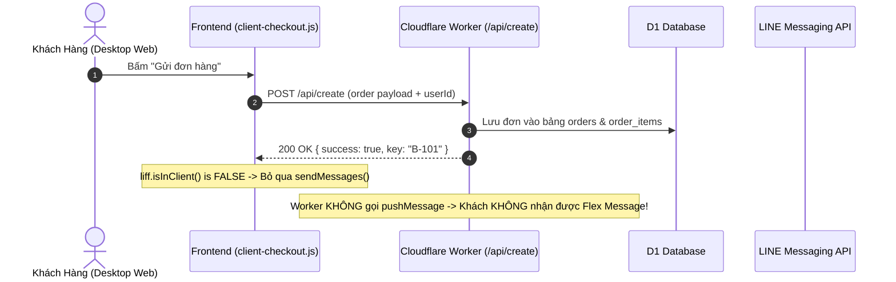
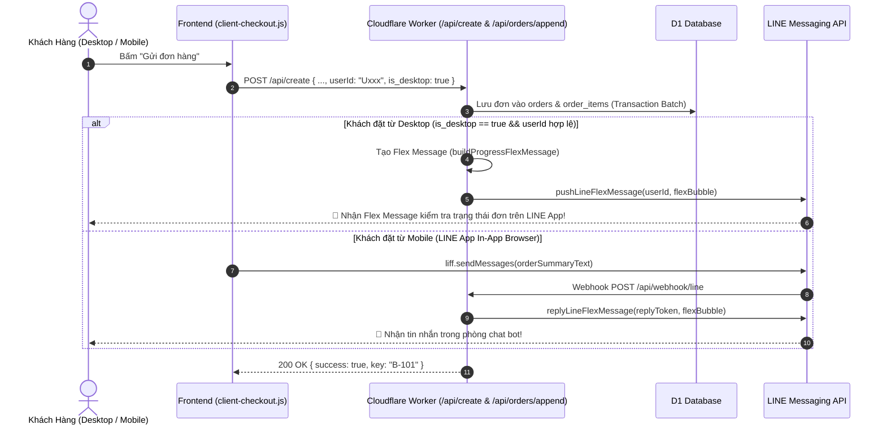

# PDP: Desktop Web Order LINE Confirmation & Flex Message Dispatch

**Document Status**: Proposed  
**Author**: Principal Engineer (AI Agent)  
**Date**: 2026-08-25  
**Target Environments**: Dev (`blab-db-dev`), Staging (`blab-db-test`), Production (`blab-db-production`)  

---

## 1. Executive Summary & Objectives

### 1.1 Problem Statement
Hiện tại, trên nền tảng **Benmi Multi-Tenant Order Platform**:
1. **Trên Điện Thoại (Mobile - LINE In-App Browser)**: Khi khách đặt món qua LIFF (`liff.isInClient() === true`), hàm `liff.sendMessages()` tự động gửi tin nhắn tóm tắt đơn vào phòng chat giữa khách và LINE Official Account (OA). Webhook của Cloudflare Worker bắt được tin nhắn này và phản hồi lại (`replyLineFlexMessage`) một thẻ **Flex Message tiến độ đơn hàng** (`buildProgressFlexMessage`), giúp khách dễ dàng theo dõi trạng thái món, thời gian lấy món hoặc bấm nút 加點 (gọi thêm món).
2. **Trên Máy Tính (Desktop / Laptop / Trình duyệt ngoài)**:
   - Trình duyệt ngoài không thể chạy `liff.sendMessages()` do chính sách bảo mật và kiến trúc của LINE LIFF SDK (`liff.sendMessages is not supported in external browser`).
   - Sau khi tạo đơn thành công qua REST API `/api/create`, Backend Cloudflare Worker chỉ lưu đơn vào CSDL (D1/KV) mà **không thực hiện gửi thông báo Flex Message xác nhận đơn hàng** đến tài khoản LINE của khách hàng (mặc dù khách đã đăng nhập LINE Web Login và có `userId`).
   - **Hậu quả**: Khách hàng đặt món trên máy tính hoàn toàn không nhận được tin nhắn xác nhận trên ứng dụng LINE, không có thẻ Flex Message để kiểm tra tiến độ làm món hay gọi thêm món.

### 1.2 Goals (In-Scope)
- **Tự động gửi LINE Flex Message xác nhận đơn hàng** từ Backend đến tài khoản LINE của khách hàng ngay khi nhận được đơn từ Desktop/Web (`is_desktop` hoặc `source === 'desktop_web'`).
- Đảm bảo Flex Message gửi cho khách đặt qua Desktop **có đầy đủ cấu trúc, giao diện và tính năng tương đương 100%** so với khi đặt trên Mobile (gồm mã đơn, chi tiết món, giá tiền, thời gian nhận, nút "Tra cứu tiến độ" và nút "Gọi thêm món" nếu là đơn ăn tại quán).
- Hỗ trợ cả 2 luồng: **Đặt đơn mới (`/api/create`)** và **Gọi thêm món tại bàn (`/api/orders/append`)**.
- Tối ưu quota tin nhắn LINE: Chỉ gọi `pushLineFlexMessage` khi khách đặt qua Desktop (hoặc khi `liff.sendMessages` không thể kích hoạt webhook), tránh trùng lặp tin nhắn.
- Đảm bảo tuân thủ tuyệt đối quy tắc **1,000+ Multi-Tenant Scalability**: Token và cấu hình LINE OA được đọc động theo từng quán (`tenantCtx.lineChannelToken`).

### 1.3 Non-Goals (Out-of-Scope)
- Không thay đổi hành vi gửi tin nhắn đối với khách chưa đăng nhập LINE (khách vãng lai dùng ID tạm `guest_...`). Khách vãng lai sẽ theo dõi trực tiếp trên giao diện Web.

---

## 2. Context & Current Architecture

### 2.1 Luồng Hiện Tại (Current Flow)



---

## 3. Proposed Architecture

### 3.1 Luồng Xử Lý Mới (Proposed Architecture Flow)



---

## 4. Chi Tiết Kỹ Thuật & Code Changes

### 4.1 Frontend ([`js/client-checkout.js`](file:///Users/duccao/Documents/benmi-order/js/client-checkout.js))
Thêm cờ `is_desktop: !(typeof liff !== 'undefined' && liff.isInClient && liff.isInClient())` vào payload khi gọi `/api/create` và `/api/orders/append`:

```javascript
const isDesktop = !(typeof liff !== 'undefined' && liff.isInClient && liff.isInClient());

const orderPayload = {
    key: orderNum,
    userId: userId,
    customer: customerName,
    time: `${dateInput} ${timeInput}`,
    dining_option: isDineIn ? 'dine_in' : 'takeaway',
    table_number: tableNumber || undefined,
    content: msg.split('\n\n🕒')[0].replace(/\[.*?點餐\]\n/g, '').replace('[Benmi 點餐]\n', ''),
    total: currentTotal,
    note: mainNote,
    tenant_id: tenantId,
    items: structuredItems,
    is_desktop: isDesktop
};
```

### 4.2 Backend ([`benmi-worker-official/src/modules/orders.ts`](file:///Users/duccao/Documents/benmi-order/benmi-worker-official/src/modules/orders.ts))

#### A. Đơn Mới (`createOrder`):
Sau khi lưu đơn thành công vào D1, nếu `data.is_desktop === true` (hoặc đặt qua REST API ngoài LINE in-client) và `order.userId` là một LINE User ID hợp lệ (`U[0-9a-f]{32}`):
Worker sẽ gọi `pushLineFlexMessage` để gửi trực tiếp Flex Message kiểm tra tiến độ đến khách hàng:

```typescript
// Gửi Flex Message xác nhận đơn hàng cho khách đặt qua Desktop Web
if (order.userId && order.userId.startsWith("U") && (data.is_desktop || !data.liffInClient)) {
  try {
    const queueRes = await getOrderQueueAhead(env, tenantId, order.key);
    const queueAheadCount = queueRes ? queueRes.queueAhead : 0;
    const flexBubble = buildProgressFlexMessage(order, queueAheadCount, tenantCtx);
    const brandName = tenantCtx?.brandName || "Benmi";
    
    // Gửi bất đồng bộ (ctx.waitUntil nếu có) để không làm chậm response của API
    const pushPromise = pushLineFlexMessage(
      order.userId,
      `[${brandName}] 訂單明細及進度 #${order.key}`,
      flexBubble,
      env,
      tenantCtx
    );
    if (ctx && typeof ctx.waitUntil === 'function') {
      ctx.waitUntil(pushPromise);
    } else {
      await pushPromise;
    }
  } catch (pushErr) {
    console.error(`[${tenantId}] Failed to push desktop order Flex Message:`, pushErr);
  }
}
```

#### B. Đơn Gọi Thêm Món (`executeAppendOrderInternal`):
Tương tự cho đơn gọi thêm món tại bàn từ máy tính:
```typescript
if (userId && userId.startsWith("U") && isDesktop) {
  try {
    const flexBubble = buildAppendConfirmationFlexMessage(
      row,
      appendedContent,
      appendedTotal,
      nextRound,
      tenantCtx
    );
    const brandName = tenantCtx?.brandName || "Benmi";
    const pushPromise = pushLineFlexMessage(
      userId,
      `[${brandName}] 現場加點確認 (第 ${nextRound} 輪)`,
      flexBubble,
      env,
      tenantCtx
    );
    if (ctx && typeof ctx.waitUntil === 'function') {
      ctx.waitUntil(pushPromise);
    } else {
      await pushPromise;
    }
  } catch (pushErr) {
    console.error(`[${tenantId}] Failed to push desktop append Flex Message:`, pushErr);
  }
}
```

---

## 5. Alternatives Considered & Trade-offs

| Giải pháp | Ưu điểm | Nhược điểm | Đánh giá |
| :--- | :--- | :--- | :--- |
| **A. Backend Push Flex Message (Được chọn)** | Hoạt động 100% tự động, trải nghiệm người dùng liền mạch, Flex Message đồng bộ chuẩn đẹp với bản Mobile | Tiêu tốn 1 lượt push message quota của LINE OA (đối với gói miễn phí) | **Khuyên Dùng (Chuẩn POS chuyên nghiệp)** |
| **B. Yêu cầu quét mã QR để mở lại trên Mobile** | Không tốn quota push message | Trải nghiệm bị gián đoạn, khách phải cầm điện thoại lên quét lại | Không tối ưu UX |
| **C. Chỉ hiển thị thông báo trên Web Desktop** | Dễ làm | Khách không theo dõi được đơn khi rời khỏi bàn/máy tính | Trái với yêu cầu của người dùng |

---

## 6. Kế Hoạch Triển Khai (Execution Plan)

- [ ] **Phase 1 (Frontend)**: Cập nhật [`js/client-checkout.js`](file:///Users/duccao/Documents/benmi-order/js/client-checkout.js) để gửi trường `is_desktop: true` khi `!liff.isInClient()`.
- [ ] **Phase 2 (Backend)**: Bổ sung logic `pushLineFlexMessage` trong `createOrder` và `executeAppendOrderInternal` của [`benmi-worker-official/src/modules/orders.ts`](file:///Users/duccao/Documents/benmi-order/benmi-worker-official/src/modules/orders.ts).
- [ ] **Phase 3 (Deploy & Test)**: Deploy lên môi trường `dev` -> Kiểm thử luồng đặt món từ trình duyệt PC và xác nhận Flex Message nhận được trên LINE App của khách.
- [ ] **Phase 4 (Release)**: Hợp nhất lên `staging` và `main` (Production).

---

## 7. Kế Hoạch Kiểm Thử (Verification Plan)

1. **Kiểm thử mô phỏng Desktop**:
   - Mở menu khách hàng trên trình duyệt máy tính (Chrome/Safari).
   - Đăng nhập LINE Web Login (`liff.isLoggedIn() === true`).
   - Đặt 1 đơn hàng mang đi hoặc ăn tại quán.
   - Kiểm tra điện thoại: Tài khoản LINE của khách nhận được Flex Message tiến độ đơn hàng ngay lập tức.
   - Bấm nút "🔍 查詢製作進度" trên Flex Message để xác nhận bot phản hồi bình thường.
2. **Kiểm thử mô phỏng Mobile**:
   - Mở menu trên LINE In-App Browser trên điện thoại.
   - Đặt món -> Đảm bảo không bị gửi lặp 2 tin nhắn Flex Message.
