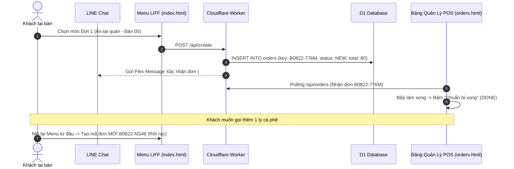
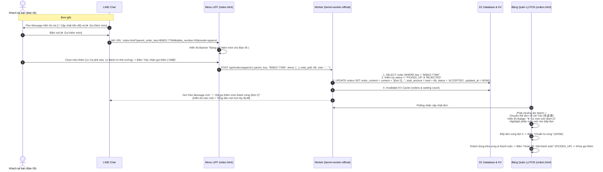

# PDP: Dine-In Order Append & Multi-Round Ordering Architecture (加點餐點架構)

- **Status**: Proposed / Approved in Alignment
- **Author**: Principal Engineer (AI Agent) & System Architect
- **Date**: 2026-08-22
- **Target Subsystems**: LINE Bot Flex Message, Customer Menu LIFF (`index.html`), Backend API Worker (`benmi-worker-official`), POS Dashboard (`orders.html`)

---

## 1. Executive Summary & Objectives

### 1.1 Problem Statement
Trong mô hình kinh doanh ăn uống tại quán (Dine-In), hành vi khách hàng thường diễn ra theo nhiều đợt:
1. Gọi món chính đợt 1 khi mới vào bàn.
2. Trong lúc đợi món hoặc khi đang ăn, khách muốn gọi thêm đồ uống, tráng miệng hoặc thêm bánh/topping (Gọi thêm món - 加點).
3. Hiện tại, mỗi lần khách đặt hàng trên LINE hệ thống tạo ra một mã đơn hoàn toàn độc lập, khiến nhân viên thu ngân và nhà bếp bị phân mảnh hóa đơn, khó kiểm soát tổng tiền của bàn, và có thể dẫn đến việc kết thúc đơn đợt 1 sớm trong khi khách vẫn đang tiếp tục dùng bữa.

### 1.2 Goals (In-Scope)
- **Multi-Round Ordering (Gọi món nhiều đợt vào cùng 1 bàn)**: Cho phép khách hàng tại bàn nhấn nút **"➕ 加點餐點" (Gọi thêm món)** trực tiếp trên LINE Flex Message để mở Menu LIFF và gửi thêm món vào hóa đơn gốc của bàn (`parent_order_key`).
- **Unified Order Content & Accumulative Total**: Nội dung đơn hàng tự động phân chia theo `[Đợt 1 - HH:mm]`, `[Đợt 2 - HH:mm (加點)]`, tổng tiền tự động cộng dồn theo thời gian thực.
- **Kitchen & POS Real-time Alerting & State Machine**:
  - Nếu đơn đợt 1 đã ra món xong (`DONE`), khi khách gọi thêm món đợt 2, đơn tự động chuyển trạng thái về `ACCEPTED` và quay lại cột **"待處理" (Chờ làm món)** kèm nhãn nổi bật `➕ Có món mới (Đợt 2)` và phát chuông âm thanh cảnh báo bếp.
  - Trên POS, danh sách món mới gọi thêm được highlight rõ ràng để đầu bếp chỉ làm món mới, không làm trùng các món cũ đã giao.
- **Session Locking & Boundary**: Nút gọi thêm mở trong suốt thời gian khách ngồi tại bàn (`NEW`, `ACCEPTED`, `DONE`), và tự động khóa khi nhân viên quầy bấm **"Hoàn tất / Đã thanh toán" (`PICKED_UP`)** hoặc **"Đã hủy" (`REJECTED`)**.

### 1.3 Non-Goals (Out-of-Scope)
- Không áp dụng cho đơn mang về (Takeaway - đơn mang về mỗi lần đặt là một giao dịch độc lập).
- Không chia tách hóa đơn thành nhiều hóa đơn con cho nhiều người cùng bàn (Single Check per Table).

---

## 2. Context & Current Architecture

### 2.1 Current Flow


### 2.2 Shortcomings of Current Flow
- Tạo 2 mã đơn riêng biệt (`B0822-776M` và `B0822-NS48`) cho cùng Bàn 05.
- Nhân viên quầy phải theo dõi 2 hóa đơn rời rạc, dễ sót món và khó tính tổng bill khi thanh toán.
- Khách hàng phải nhập lại số bàn từ đầu.

---

## 3. Proposed Architecture & Solution Design

### 3.1 End-to-End Sequence Diagram (Append Order Flow)



---

## 4. Detailed Component Design

### 4.1 LINE Bot Flex Message (`src/modules/line.ts`)
Cập nhật hàm `buildProgressFlexMessage(order, queueAheadCount, tenantCtx)`:
- Nếu `isDineIn === true` và `order.status` thuộc `['NEW', 'ACCEPTED', 'DONE']`:
  - Thêm nút phụ (Button):
    ```json
    {
      "type": "button",
      "style": "primary",
      "color": "#7c3aed",
      "height": "sm",
      "action": {
        "type": "uri",
        "label": "➕ 加點餐點 (Gọi thêm món)",
        "uri": "https://liff.line.me/{LIFF_ID}?tenant_id={tenantId}&parent_order_key={order.key}&table_number={tableNumber}&mode=append"
      }
    }
    ```
- Xây dựng hàm `buildAppendConfirmationFlexMessage(order, newItemsText, addedAmount, roundNumber, tenantCtx)` gửi cho khách ngay khi gọi thêm thành công.

### 4.2 Customer Menu Frontend (`index.html` & `js/client-checkout.js`)
1. **URL Parameter Parsing**:
   - Đọc các tham số: `parent_order_key`, `table_number`, `mode=append`.
2. **UI Adaptation**:
   - Nếu `mode === 'append'` và có `parent_order_key`:
     - Hiển thị Banner ghim đầu trang:
       ```html
       <div id="append-mode-banner" class="append-mode-banner">
         <span>🍽️ 正在為 <strong>桌號 ${tableNumber}</strong> (訂單 #${parent_order_key}) 加點餐點</span>
       </div>
       ```
     - Cố định hình thức dùng bữa là `dine_in`, ẩn switcher chọn mang về.
     - Ô số bàn `#dinein-table-number` tự động điền sẵn `${tableNumber}` và bật thuộc tính `readonly` / `disabled`.
     - Nút xác nhận thanh toán đổi nhãn: `確認加點 (+$${total})` / `Xác nhận gọi thêm (+${total}đ)`.
3. **Payload Submission**:
   - Gửi lên API endpoint mới: `POST /api/orders/append?tenant_id=${tenantId}` với payload:
     ```json
     {
       "parent_order_key": "B0822-776M",
       "user_id": "U12345678",
       "customer_name": "Nguyen Van A",
       "appended_content": "1份 x 越南咖啡\n1份 x 燒肉 小",
       "appended_total": 68,
       "note": "Ít đá",
       "tenant_id": "benmi"
     }
     ```

### 4.3 Backend API Endpoint (`benmi-worker-official`)
1. **Endpoint**: `POST /api/orders/append`
2. **Business Logic**:
   - Kiểm tra đơn gốc `parent_order_key`:
     - Nếu không tồn tại: trả về HTTP 404 (`Order not found`).
     - Nếu `status === 'PICKED_UP' || status === 'REJECTED'`: trả về HTTP 400 (`訂單已完成或已取消，無法再加點，請重新開啟新訂單 / Đơn hàng đã kết thúc hoặc đã hủy, không thể gọi thêm`).
   - Phân tích số lần gọi thêm (Round Counter):
     - Đếm số lần `[Đợt X]` hoặc `[加點]` trong `order_content`. Nếu chưa có thì đợt ban đầu là `[Đợt 1]`, đợt mới là `[Đợt 2]`.
   - Cập nhật Database:
     ```sql
     UPDATE orders 
     SET 
       order_content = ?,
       total_amount = total_amount + ?,
       status = 'ACCEPTED',
       note = CASE WHEN ? != '' THEN COALESCE(note || ' | ', '') || ? ELSE note END,
       updated_at = datetime('now')
     WHERE key = ? AND tenant_id = ?;
     ```
   - Xóa KV cache để POS cập nhật tức thì: `tenant:{tenantId}:orders:v2` và `tenant:{tenantId}:waiting_count`.
   - Gửi Flex Message xác nhận gọi thêm qua LINE Messaging API.

### 4.4 POS Dashboard (`orders.html` & `js/orders-live.js` / `js/orders-modals.js`)
1. **Highlight Món Mới**:
   - Hàm `formatContentHtml(order)` phân tách các khối `[Đợt 1]`, `[Đợt 2 (加點)]`.
   - Các món thuộc đợt mới nhất được bao bọc bởi khung highlight viền tím nhạt + badge `Mới thêm lúc HH:mm` để nhân viên bếp dễ dàng nhận biết chỉ làm các món mới.
2. **State & Audio Notification**:
   - Khi đơn chuyển từ `DONE` về `ACCEPTED` do có món gọi thêm:
     - Hệ thống POS tự động phát chuông âm thanh thông báo.
     - Thẻ đơn hàng hiển thị huy hiệu tím: `➕ Có món mới (Đợt 2)` / `➕ 有新加點 (第2輪)`.
3. **Modal Chi Tiết Đơn**:
   - Hiển thị bảng kê chi tiết từng đợt gọi món kèm mốc thời gian và thành tiền từng đợt.

---

## 5. Database Schema & Migration Strategy

### 5.1 D1 Schema Migration (`0026_add_append_rounds.sql`)
Để hỗ trợ truy vết lịch sử các đợt gọi món chi tiết:
```sql
-- Migration 0026: Add append round tracking and order audit
ALTER TABLE orders ADD COLUMN round_count INTEGER DEFAULT 1;
ALTER TABLE orders ADD COLUMN last_appended_at TEXT DEFAULT NULL;

-- Optional index for faster active dine-in table lookups
CREATE INDEX IF NOT EXISTS idx_orders_tenant_table_status ON orders (tenant_id, table_number, status);
```

---

## 6. Execution Plan & Milestones

| Giai đoạn | Nội dung công việc | File liên quan |
| :--- | :--- | :--- |
| **Phase 1: DB & Backend API** | - Migration `0026_add_append_rounds.sql`<br/>- Implement `appendOrder()` trong `src/modules/orders.ts`<br/>- Router handler `POST /api/orders/append`<br/>- Cập nhật `buildProgressFlexMessage` thêm nút "加點餐點" | `orders.ts`, `line.ts`, `index.ts` |
| **Phase 2: Customer LIFF Menu** | - Nhận diện `mode=append` & `parent_order_key`<br/>- Banner thông báo gọi thêm, khóa số bàn<br/>- Gửi payload gọi thêm lên API `/api/orders/append` | `index.html`, `js/client-checkout.js` |
| **Phase 3: POS Dashboard** | - Phân tách giao diện các đợt gọi món trên thẻ đơn Live<br/>- Hiển thị badge `➕ Có món mới (Đợt X)`<br/>- Chuông báo âm thanh và modal xem lại | `js/orders-live.js`, `js/orders-modals.js`, `js/orders-i18n.js` |
| **Phase 4: Testing & Deployment** | - Unit test API gọi thêm<br/>- Kiểm thử kịch bản: Gọi đợt 1 -> Bếp DONE -> Khách bấm gọi đợt 2 -> Đơn quay lại cột Trái kèm món mới -> POS hoàn tất | Worker test env, staging branch |

---

## 7. Verification & Test Plan

### 7.1 Automated & API Verification
```bash
# 1. Tạo đơn gốc ăn tại bàn 08
curl -X POST "https://platform-worker-staging.thuanmnc.workers.dev/api/create?tenant_id=benmi" \
  -H "Content-Type: application/json" \
  -d '{"key":"B0822-TEST1","customer_name":"Tester","user_id":"Utest","time":"2026-08-22 18:00","dining_option":"dine_in","table_number":"08","content":"1份 x 燒肉 大","total":80,"tenant_id":"benmi"}'

# 2. Chuyển trạng thái đơn sang DONE (Bếp làm xong đợt 1)
curl -X POST "https://platform-worker-staging.thuanmnc.workers.dev/api/status?tenant_id=benmi" \
  -H "Content-Type: application/json" \
  -d '{"key":"B0822-TEST1","status":"DONE"}'

# 3. Khách hàng gọi thêm món (Đợt 2)
curl -X POST "https://platform-worker-staging.thuanmnc.workers.dev/api/orders/append?tenant_id=benmi" \
  -H "Content-Type: application/json" \
  -d '{"parent_order_key":"B0822-TEST1","appended_content":"1份 x 越南咖啡","appended_total":48,"note":"Ít ngọt","tenant_id":"benmi"}'

# 4. Kiểm tra đơn hàng sau khi gọi thêm
# Kỳ vọng: status='ACCEPTED', total_amount=128, round_count=2, content chứa [Đợt 1] và [Đợt 2]
curl -s "https://platform-worker-staging.thuanmnc.workers.dev/api/orders?tenant_id=benmi"
```

### 7.2 Manual E2E Flow
1. Mở Menu LIFF khách hàng đặt 1 bánh mì ăn tại bàn `05`.
2. Kiểm tra tin nhắn Flex Message nhận được trên LINE: Có nút `🔄 重新整理進度` và `➕ 加點餐點`.
3. Bấm `➕ 加點餐點` -> Mở LIFF với banner `Đang gọi thêm cho Bàn 05` -> Chọn 1 ly Cà phê sữa -> Bấm `Xác nhận gọi thêm (+48$)`.
4. Quan sát POS: Đơn hàng tự động nhảy về cột Trái, phát chuông báo, hiển thị món cà phê sữa vừa thêm.
5. Nhân viên quầy bấm `Chuẩn bị xong` -> Bấm `Đã thanh toán` -> Khóa không cho gọi thêm.
