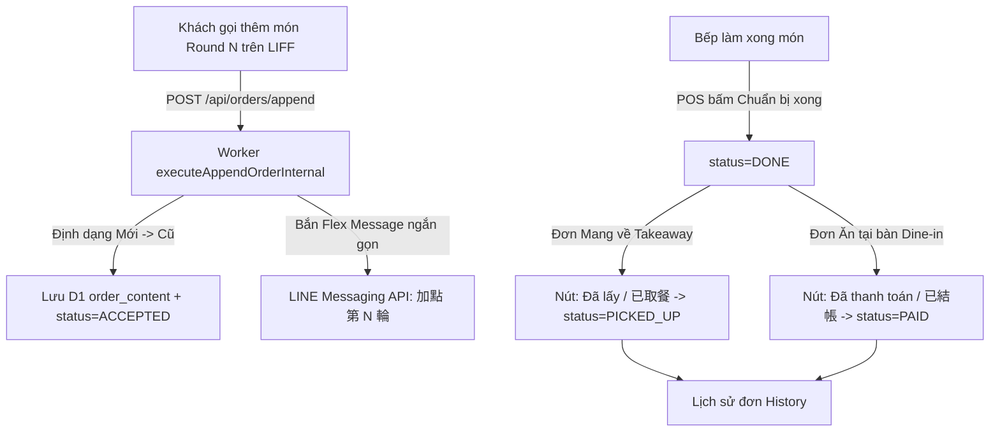

# PDP: Dine-In Experience, Multi-Round Order Formatting & PAID Status Enhancement

- **Author**: Principal Engineer (AI)
- **Status**: Proposed / Review Ready
- **Date**: 2026-08-23
- **Corpus**: Thuanmai56/benmi-order
- **Target Environments**: Staging (`blab-db-test`) & Production (`blab-db-production`)

---

## 1. Executive Summary & Objectives

### Problem Statement
1. **Thứ tự nội dung đợt gọi món bị ngược**: Khi khách ăn tại bàn gọi thêm món (Round 2, 3), các món mới được nối vào đuôi (dưới cùng). Nhân viên đứng tại quầy POS phải cuộn xuống đáy để đọc món mới, dễ gây sót món trong giờ cao điểm.
2. **Ngữ nghĩa trạng thái hoàn thành đơn ăn tại bàn**: Khi nhà bếp làm xong món (`DONE`), đơn mang về (`takeaway`) sẽ được khách lấy đi (`PICKED_UP`), nhưng đơn ăn tại bàn (`dine_in`) thì khách ngồi tại quán ăn xong mới ra quầy thanh toán tiền. Việc hiển thị nút "Đã lấy / 已取餐" là không đúng ngữ cảnh và gây khó hiểu cho thu ngân.
3. **Tiêu đề thông báo LINE Flex Message quá dài**: Thông báo `🍽️ 加點成功 (第 2 輪)` quá dài trên màn hình di động nhỏ, cần tinh gọn thành `🍽️ 加點 (第 2 輪)`.

### In-Scope Goals
- **Mới $\rightarrow$ Cũ (Newest Round on Top)**: Đợt gọi món mới nhất luôn hiển thị trên cùng trong `order_content`, phân tách bằng đường gạch nét đứt trực quan với các đợt trước đó.
- **Trạng thái CSDL mới `PAID` (Đã thanh toán / 已結帳)**:
  - Bổ sung `PAID` vào enum trạng thái đơn hàng.
  - Thu ngân bấm hoàn tất đơn ăn tại bàn sẽ chuyển trạng thái sang `PAID` (thay vì `PICKED_UP`).
  - Toàn bộ backend query (Live orders, History, Summary, Google Sheets, Lock check) xử lý `PAID` đồng bộ.
- **Đa ngữ POS I18N chuẩn xác**:
  - `zh-TW`: `btnPaid: "已結帳"`, `badgePaid: "已結帳"`.
  - `vi`: `btnPaid: "Đã thanh toán"`, `badgePaid: "Đã thanh toán"`.
- **Cố định thời gian đặt bàn**: Thời gian hiển thị đơn ăn tại bàn luôn là mốc thời gian khách đặt đơn ban đầu (`created_at` / `time` của Round 1) kèm thời gian đã ngồi (`elapsed time`).
- **LINE Flex Message & LIFF Chat Tinh Gọn**: Đổi `加點成功` $\rightarrow$ `加點`.

### Non-Goals
- Thay đổi logic tính tổng tiền nhiều round (đã hoạt động ổn định).
- Chia tách hóa đơn từng người trên cùng 1 bàn (giữ nguyên mô hình gộp theo bàn/UUID).

---

## 2. Context & Current Architecture



---

## 3. Detailed Technical Design

### A. Định Dạng Nội Dung Đơn Nhiều Round (Mới $\rightarrow$ Cũ)

Khi khách gọi thêm món đợt $N$ ($N \ge 2$), Worker sẽ định dạng `order_content` như sau:

```typescript
// 1. Chuẩn hóa nội dung cũ (nếu chưa có tag đợt 1 thì gắn tag đợt 1)
let previousRounds = existingContent;
if (!previousRounds.includes("[第 1 輪") && !previousRounds.includes("[Đợt 1")) {
  previousRounds = `[第 1 輪 / Đợt 1]\n${previousRounds}`;
}

// 2. Đưa đợt mới nhất lên trên cùng
const separator = "--------------------------------";
const newRoundBlock = `[第 ${nextRound} 輪 加點 / Đợt ${nextRound} - ${timeStr}]\n${appendedContent.trim()}`;
const updatedContent = `${newRoundBlock}\n\n${separator}\n${previousRounds}`;
```

### B. Bổ Sung Trạng Thái `PAID` vào Schema & Backend

1. **`benmi-worker-official/src/types/index.ts`**:
   ```typescript
   export type OrderStatus =
     | 'NEW'
     | 'ACCEPTED'
     | 'DONE'
     | 'PICKED_UP'
     | 'PAID'
     | 'REJECTED'
     | 'WAITING_CUSTOMER_CHANGE'
     | 'WAITING_CUSTOMER_REJECT'
     | 'EXPIRED'
     | 'FORCE_REJECT';
   ```

2. **`benmi-worker-official/src/modules/orders.ts`**:
   - `saveOrder`: Kiểm tra conflict status giữ `PAID` như `PICKED_UP`.
   - `executeAppendOrderInternal`: Khóa không cho gọi thêm nếu `status IN ('PICKED_UP', 'REJECTED', 'PAID')`.
   - `getOrders`: Trả về đơn `PAID` nếu phát sinh trong ngày hôm nay.
   - `getHistorySummary` & `getHistoryAll`: Truy vấn `WHERE status IN ('PICKED_UP', 'REJECTED', 'PAID')`.
   - `updateOrder`: Hỗ trợ payload `{ status: 'PAID' }`.

3. **`benmi-worker-official/src/integrations/googleSheets.ts`**:
   - Ánh xạ `PAID` $\rightarrow$ `已結帳 (Đã thanh toán)`.

### C. Nâng Cấp Giao Diện POS (Tablet-First UI)

1. **Danh sách đơn đã làm xong (`renderListRight` trong `orders-live.js`)**:
   - Nếu `order.diningOption === 'dine_in'`:
     - Nút màu xanh indigo/tím hoặc vàng: `onclick="updateStatus('${order.key}', 'PAID', {}, this)"`
     - Nhãn hiển thị: `t('btnPaid')` (`已結帳` / `Đã thanh toán`).
   - Nếu `order.diningOption === 'takeaway'`:
     - Nút: `onclick="updateStatus('${order.key}', 'PICKED_UP', {}, this)"`
     - Nhãn hiển thị: `t('btnPickedUp')` (`已取餐` / `Đã lấy`).

2. **Modal chi tiết đơn (`reviewModal` trong `orders-modals.js` & `orders.html`)**:
   - Trong `#review-actions-done`:
     - Đơn ăn tại bàn: Hiển thị nút `btn-review-paid` với text `已結帳 / Đã thanh toán` $\rightarrow$ Gửi `PAID`.
     - Đơn mang đi: Hiển thị nút `btn-review-picked` với text `已取餐 / Đã lấy` $\rightarrow$ Gửi `PICKED_UP`.

3. **Tab Lịch sử đơn (`orders-history.js`)**:
   - Thẻ đơn có trạng thái `PAID` sẽ hiển thị badge:
     ```html
     <span class="badge done" style="background:#e0e7ff; color:#4338ca;">已結帳 / Đã thanh toán</span>
     ```

### D. Tinh Gọn LINE Flex Message

1. **`benmi-worker-official/src/modules/line.ts`**:
   - Tiêu đề header Flex Bubble: `🍽️ 加點 (第 ${roundNumber} 輪)` (thay vì `加點成功`).
   - Alt text push/reply: `🍽️ 加點 (第 ${roundNumber} 輪)`.

2. **`js/client-checkout.js`**:
   - Chat message: `[加點 #${window.parentOrderKey}]\n...` (thay vì `[加點成功 ...]`).

---

## 4. Multi-Tenant Scalability Validation

- **Zero Hardcoding**: Không có bất kỳ điều kiện nào phụ thuộc tên quán. Mọi quán có `features: ['dine_in']` sẽ tự động hưởng lợi từ quy trình `PAID` và đảo thứ tự round.
- **I18N Strict Separation**: Từ điển `zh-TW` chỉ chứa tiếng Trung phồn thể (`已結帳`), từ điển `vi` chỉ chứa tiếng Việt chuẩn POS (`Đã thanh toán`). Không pha trộn.
- **Tablet Touch Ergonomics**: Kích thước nút bấm tối thiểu 48px trên POS, màu sắc phân biệt rõ ràng giữa "Đã lấy mang đi" và "Đã thanh toán tại bàn".

---

## 5. Execution Plan

1. [x] **PDP Creation**: Soạn thảo thiết kế chi tiết.
2. [ ] **Backend Schema & Logic (`benmi-worker-official`)**:
   - Cập nhật `OrderStatus` types, `executeAppendOrderInternal` (đảo thứ tự Mới $\rightarrow$ Cũ).
   - Cập nhật `orders.ts` (hỗ trợ `PAID` trong mọi query, update, history, append lock).
   - Cập nhật `line.ts` (tinh gọn header flex message).
3. [ ] **Frontend POS & Client Checkout**:
   - Cập nhật `js/orders-i18n.js` (thêm key `btnPaid`, `badgePaid`).
   - Cập nhật `js/orders-live.js`, `js/orders-modals.js`, `orders.html` (phân nhánh nút `PAID` vs `PICKED_UP`).
   - Cập nhật `js/orders-history.js` (render badge `PAID`).
   - Cập nhật `js/client-checkout.js` (tin nhắn `[加點 #...]`).
4. [ ] **Testing on Staging**:
   - Test tạo đơn ăn tại bàn $\rightarrow$ Gọi thêm Round 2 $\rightarrow$ Xác nhận đợt 2 ở trên cùng.
   - Bấm "Đã thanh toán" $\rightarrow$ Kiểm tra trạng thái chuyển thành `PAID`.
   - Kiểm tra tab Lịch sử hiển thị `PAID` chính xác.
5. [ ] **Deploy Production**.
