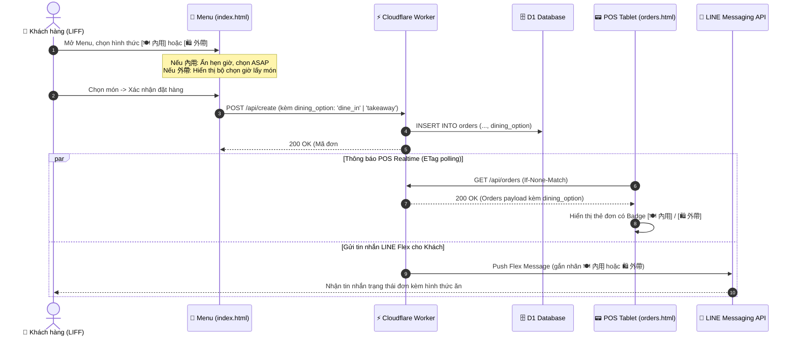

# PDP: Hỗ Trợ Đơn Lấy Mang Đi (Takeaway) & Ăn Tại Quán (Dine-in)

- **Tác giả**: Principal Engineer / Antigravity AI
- **Trạng thái**: Proposed
- **Ngày tạo**: 2026-08-22
- **Mục tiêu hệ thống**: Benmi Multi-Tenant Order Platform (`benmi-worker-official`, `index.html`, `orders.html`)

---

## 1. Executive Summary & Objectives

### 1.1 Problem Statement
Hiện tại, toàn bộ luồng đặt món trên hệ thống (Menu LIFF, API Backend D1/Workers, và Bảng điều khiển POS) được thiết kế mặc định cho hình thức **Lấy mang đi (外帶 / Takeaway / Pickup)** với cơ chế chọn thời gian lấy hàng (hẹn giờ hoặc làm ngay).
Đối với các cửa hàng có chỗ ngồi hoặc quầy phục vụ ăn tại chỗ (như Benmi, 炸蛋同學, 雞蛋糕大叔), khách hàng và nhân viên quầy không có cách nào phân biệt đơn nào cần **bày đĩa/khay để ăn tại quán (內用 / Dine-in)** và đơn nào cần **đóng hộp/túi để mang đi (外帶 / Takeaway)**. Điều này dẫn đến nhầm lẫn trong khâu đóng gói món ăn, mất thời gian của nhân viên và giảm trải nghiệm khách hàng.

### 1.2 Goals (In-Scope)
- **Frontend Đặt Món (`index.html`)**:
  - Tích hợp thanh chuyển đổi chế độ (Sticky Tab / Toggle Switch) phong cách Uber Eats / Foodpanda đặt ở đầu menu và đồng bộ trong khu vực thanh toán/giỏ hàng.
  - Tự động điều chỉnh form: Đơn Ăn tại quán mặc định là "Làm ngay (現場製作 / ASAP)", ẩn bộ chọn giờ hẹn; Đơn Mang đi giữ nguyên đầy đủ cơ chế hẹn giờ lấy món.
  - Khách nhận món theo Mã đơn / Tên hoặc máy rung (Buzzer) tại quầy, không bắt buộc nhập số bàn.
- **Backend & Cloudflare D1 (`benmi-worker-official`)**:
  - Mở rộng schema bảng `orders` lưu trường `dining_option` (`'takeaway'` | `'dine_in'`).
  - Mở rộng schema bảng `tenant_config` hỗ trợ `allow_dine_in` (cho phép bật/tắt theo từng quán).
  - Cập nhật API `/api/create`, `/api/orders`, `/api/config` và logic đồng bộ Google Sheets.
  - Tối ưu thông báo LINE Webhook & Flex Message hiển thị trực quan biểu tượng `🍽️ 內用 (Ăn tại quán)` hoặc `🛍️ 外帶 (Mang đi)`.
- **Bảng Quản Lý Đơn POS (`orders.html` - Tablet-first)**:
  - Gắn nhãn màu sắc nổi bật (Badge) trên từng thẻ đơn hàng (`[內用]` tím/cam vs `[外帶]` xanh).
  - Bổ sung bộ lọc nhanh (Quick Filter Pills: Tất cả / Mang đi / Ăn tại quán) trên giao diện POS để nhân viên bếp dễ thao tác.
  - Tuân thủ nghiêm ngặt đa ngôn ngữ (`zh-TW` và `vi`), không pha trộn phụ đề.

### 1.3 Non-Goals (Out-of-Scope)
- Quản lý sơ đồ bàn (Table Management Map) phức tạp hoặc phân bàn theo khu vực (quán quy mô vừa và nhỏ phục vụ theo số thứ tự/buzzer).
- Phí dịch vụ (Service Charge) riêng biệt cho ăn tại quán (mức giá món ăn đồng nhất giữa 2 hình thức).

---

## 2. Context & Current Architecture

Hệ thống Benmi Order vận hành theo mô hình Multi-Tenant không máy chủ (Serverless Multi-Tenant) trên nền tảng Cloudflare:
- **Frontend Menu (`index.html`, `js/client-checkout.js`)**: Web App / LINE LIFF In-App Browser (Mobile-first).
- **Frontend POS (`orders.html`, `js/orders-live.js`, `js/orders-core.js`, `js/orders-i18n.js`)**: Dashboard quản lý đơn cho nhân viên (Tablet-first).
- **Backend (`benmi-worker-official`)**:
  - Cloudflare Workers + D1 Database (`orders`, `tenants`, `tenant_config`, `menu_items`).
  - LINE Messaging API (Flex Messages, webhook tương tác bot).

---

## 3. Proposed Architecture

### 3.1 Luồng Tương Tác Hệ Thống (Mermaid Diagram)



---

### 3.2 Thiết Kế Chi Tiết Dữ Liệu & Backend

#### 3.2.1 D1 Database Migration (`0020_add_dining_options.sql`)
```sql
-- 1. Bổ sung trường dining_option vào bảng orders
ALTER TABLE orders ADD COLUMN dining_option TEXT NOT NULL DEFAULT 'takeaway';

-- 2. Chỉ mục tối ưu truy vấn lọc theo loại đơn
CREATE INDEX IF NOT EXISTS idx_orders_tenant_dining ON orders(tenant_id, dining_option, created_at DESC);

-- 3. Bổ sung cấu hình bật/tắt ăn tại quán theo tenant
ALTER TABLE tenant_config ADD COLUMN allow_dine_in INTEGER DEFAULT 1;

-- Cập nhật mặc định cho các tenant hiện hữu
UPDATE tenant_config SET allow_dine_in = 1 WHERE allow_dine_in IS NULL;
```

#### 3.2.2 Cập Nhật TypeScript Types (`src/types/index.ts`, `src/types/tenant.ts`)
```typescript
export type DiningOption = 'takeaway' | 'dine_in';

export interface Order {
  key: string;
  customer: string;
  time: string;
  content: string;
  status: 'NEW' | 'ACCEPTED' | 'DONE' | 'PICKED_UP' | 'WAITING_CUSTOMER_CHANGE' | 'WAITING_CUSTOMER_REJECT' | 'REJECTED';
  createdAt: number;
  userId?: string;
  total: number;
  reason?: string;
  note?: string;
  diningOption: DiningOption; // 'takeaway' | 'dine_in'
}

export interface TenantConfig {
  // ...
  allowDineIn: boolean; // boolean từ allow_dine_in (1/0)
  allowScheduledPickup: boolean;
}
```

#### 3.2.3 API Specification
- **`GET /api/config?tenant_id=...`**:
  - Bổ sung `allowDineIn: true | false` trong response để frontend quyết định có hiển thị tab chọn hay không.
- **`POST /api/create?tenant_id=...`**:
  - Request Body mở rộng:
    ```json
    {
      "key": "B0822-1015-123",
      "userId": "U123456...",
      "customer": "Đức Cao",
      "time": "2026-08-22 12:30",
      "content": "1份 x 原味麵包\n   ↳ 不辣",
      "total": 120,
      "note": "Ít rau",
      "tenant_id": "benmi",
      "dining_option": "dine_in"
    }
    ```
- **`GET /api/orders?tenant_id=...`**:
  - Trường `diningOption` (`"dine_in"` hoặc `"takeaway"`) trả về trong từng object order.

---

### 3.3 Thiết Kế Giao Diện Khách Hàng (`index.html` & `js/client-checkout.js`)

1. **Sticky Header Selector (Uber Eats style)**:
   - Đặt ngay bên dưới Store Banner / Header.
   - 2 Tabs dạng Segmented Pill với chuyển động mượt (CSS transition):
     - `🛍️ 外帶 (Mang đi)`
     - `🍽️ 內用 (Ăn tại quán)`
   - Lưu trạng thái vào `sessionStorage` hoặc `state` để không bị mất khi chuyển đổi danh mục món.
2. **Hành vi động của Form Checkout**:
   - Khi chọn **`內用 (Ăn tại quán)`**:
     - Ẩn phần chọn ngày & giờ hẹn lấy món.
     - Tự động gán thời gian là "現場內用 (Làm ngay / ASAP)".
     - Nút bấm và văn bản xác nhận hiển thị rõ: `確認送出 (內用)`.
   - Khi chọn **`外帶 (Mang đi)`**:
     - Hiển thị đầy đủ ô chọn giờ lấy món (Hẹn giờ / Lấy ngay theo config của quán).
3. **Format Tin Nhắn Đơn Hàng**:
   - Thêm dòng đầu tiên nổi bật:
     `📍 用餐方式：🍽️ 內用 (現場製作)` hoặc `📍 用餐方式：🛍️ 外帶自取`

---

### 3.4 Thiết Kế Giao Diện POS Quản Lý (`orders.html`, `orders-live.js`, `orders-i18n.js`)

1. **Badge Nhận Diện Trên Thẻ Đơn (Tile)**:
   - **`🍽️ 內用`**: Badge nền tím đậm / chữ trắng hoặc cam sáng (`background: #7c3aed; color: #fff;` hoặc `background: #ffedd5; color: #c2410c; border: 1px solid #fed7aa;`).
   - **`🛍️ 外帶`**: Badge nền xanh ngọc / chữ xanh đậm (`background: #ecfdf5; color: #047857; border: 1px solid #a7f3d0;`).
2. **Bộ Lọc Nhanh (Quick Filter Tabs)**:
   - Nằm trên thanh công cụ: `[全部 (All)]`, `[🛍️ 外帶]`, `[🍽️ 內用]`.
   - Bấm vào lọc tức thì các đơn đang hiển thị ở cả 2 cột (Chờ xác nhận & Đang chuẩn bị) mà không cần reload trang.
3. **Đa Ngôn Ngữ Chuẩn Hóa (I18N)**:
   - `zh-TW`:
     - `diningOption`: `用餐方式`
     - `takeaway`: `外帶`
     - `dineIn`: `內用`
     - `filterAll`: `全部訂單`
     - `filterTakeaway`: `外帶訂單`
     - `filterDineIn`: `內用訂單`
   - `vi`:
     - `diningOption`: `Hình thức`
     - `takeaway`: `Mang đi`
     - `dineIn`: `Ăn tại quán`
     - `filterAll`: `Tất cả`
     - `filterTakeaway`: `Đơn mang đi`
     - `filterDineIn`: `Đơn ăn tại quán`

---

## 4. Migration & Rollout Strategy

### 4.1 Rollout Phân Kỳ (Zero-Downtime)
1. **Giai đoạn 1: Database & Backend Compatibility**:
   - Chạy migration D1 `0020_add_dining_options.sql` (cột `dining_option` có default value là `'takeaway'`, bảo đảm 100% tương thích ngược với mọi bản ghi cũ).
   - Deploy backend Worker với parser xử lý cả trường hợp request cũ không truyền `dining_option` (mặc định fallback về `'takeaway'`).
2. **Giai đoạn 2: Cập nhật POS Dashboard (`orders.html`)**:
   - Cập nhật POS render Badge và bộ lọc. Nếu gặp đơn cũ (diningOption là undefined hoặc takeaway), hiển thị bình thường như trước.
3. **Giai đoạn 3: Cập nhật Menu Client (`index.html`)**:
   - Deploy giao diện chọn Ăn tại quán / Mang đi.
4. **Rollback Plan**:
   - Nếu có sự cố trên giao diện khách, có thể tạm tắt `allow_dine_in = 0` qua D1 hoặc API config; menu sẽ tự động ẩn toggle và hoạt động 100% như phiên bản cũ.

---

## 5. Alternatives Considered & Trade-offs

| Phương án | Ưu điểm | Nhược điểm | Đánh giá |
| :--- | :--- | :--- | :--- |
| **Phương án A (Được chọn): Sticky Toggle ở Menu + Auto ASAP cho Ăn tại quán** | Trải nghiệm trực quan giống Uber Eats, khách chọn ngay từ đầu, giảm thiểu thao tác nhập giờ không cần thiết khi ngồi tại quán. | Cần điều chỉnh layout header menu để không che khuất danh mục món. | **Tối ưu nhất cho quán ăn nhanh / đường phố.** |
| **Phương án B: Bật Pop-up Modal bắt buộc chọn khi vừa mở trang** | Đảm bảo 100% khách không quên chọn. | Gây gián đoạn trải nghiệm (Friction), tăng tỷ lệ thoát trang (bounce rate) của khách hàng. | Không chọn do giảm UX. |
| **Phương án C: Chỉ chọn ở bước thanh toán cuối cùng (Checkout Radio)** | Ít thay đổi UI trang chủ menu. | Khách có thể chọn nhầm giờ hẹn trước rồi mới nhận ra mình đang ăn tại quán; luồng UX bị ngược. | Không chọn. |

---

## 6. Cross-Cutting Concerns

- **Bảo mật & Tính toàn vẹn**: Validate chặt chẽ enum `dining_option` ở phía Worker, chỉ chấp nhận `'takeaway'` hoặc `'dine_in'`.
- **Hiệu năng & Caching**: ETag caching của `/api/orders` và `/api/config` tiếp tục hoạt động tối ưu; thêm chỉ mục `idx_orders_tenant_dining` để không làm chậm query khi số lượng đơn tăng.
- **Khả năng quan sát (Observability)**: Thêm thông tin `dining_option` vào log Worker và đồng bộ sang Google Sheets (nếu tenant cấu hình).

---

## 7. Step-by-Step Execution Plan

- [ ] **Milestone 1: Database Migration & Backend Support**
  - [ ] Tạo file migration `migrations/0020_add_dining_options.sql`.
  - [ ] Cập nhật types trong `src/types/index.ts` & `src/types/tenant.ts`.
  - [ ] Cập nhật module `src/modules/orders.ts` (xử lý `createOrder`, `getOrders`, `saveOrder`).
  - [ ] Cập nhật module `src/modules/config.ts` (trả về `allowDineIn`).
  - [ ] Cập nhật module `src/modules/line.ts` (gắn nhãn Flex Message & tin nhắn trả lời).
- [ ] **Milestone 2: POS Dashboard (`orders.html` & Modules)**
  - [ ] Bổ sung từ điển `zh-TW` và `vi` trong `js/orders-i18n.js`.
  - [ ] Thêm nút lọc nhanh (Filter Pills) trên POS topbar trong `orders.html`.
  - [ ] Cập nhật hàm render thẻ đơn trong `js/orders-live.js` (hiển thị Badge 內用 / 外帶).
  - [ ] Cập nhật Modal chi tiết đơn và in hóa đơn trong `js/orders-modals.js`.
  - [ ] Bổ sung CSS định dạng Badge & Filter trong `css/orders.css`.
- [ ] **Milestone 3: Customer Menu Frontend (`index.html` & `js/client-checkout.js`)**
  - [ ] Thêm Sticky Toggle Segmented Control (外帶 / 內用) trên `index.html`.
  - [ ] Cập nhật CSS cho thanh chuyển đổi trong `index.css`.
  - [ ] Cập nhật logic `js/client-checkout.js` (ẩn/hiện giờ hẹn khi chọn Ăn tại quán, format text đơn hàng).
  - [ ] Kiểm tra tương thích cấu hình `allowDineIn` từ tenant config.
- [ ] **Milestone 4: Verification & Manual Testing**
  - [ ] Test đặt đơn Ăn tại quán trên mobile/LIFF mô phỏng.
  - [ ] Test đặt đơn Mang đi với giờ hẹn cụ thể.
  - [ ] Test hiển thị, phân loại và lọc trên màn hình POS tablet.
  - [ ] Test tin nhắn LINE Flex Message gửi về người dùng.
