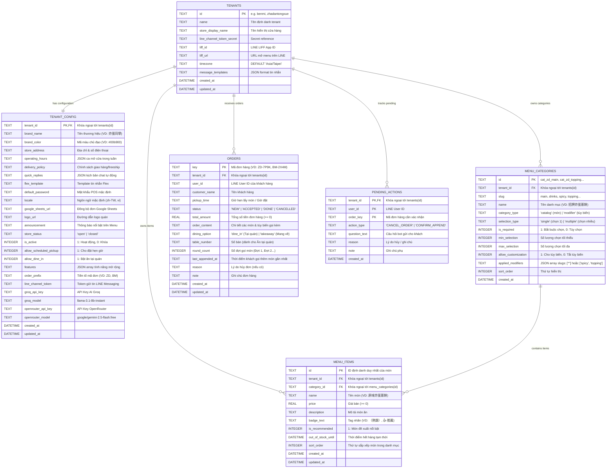

# PDP: Dine-In Order UUID Tracking & Automatic Append Engine

| Metadata | Details |
| :--- | :--- |
| **Feature** | Định Danh Đơn Hàng Bằng UUID & Cơ Chế Tự Động Gộp Món Ăn Tại Quán |
| **Status** | `PROPOSED` |
| **Author** | Principal Engineer (Antigravity) |
| **Target System** | Cloudflare Workers (`benmi-worker-official`), D1 (`blab-db`), LINE LIFF Web App |
| **Date** | 2026-08-23 |

---

## 1. Executive Summary & Objectives

### Problem Statement
Hiện tại, khi khách hàng ngồi ăn tại quán (`dine_in`) muốn gọi thêm món:
1. Nếu khách không bấm đúng nút `➕ 加點餐點` trên tin nhắn LINE Flex Message (ví dụ: khách quét lại mã QR tại bàn, bấm vào Rich Menu từ trang chủ LINE, hoặc trình duyệt LIFF bị mất tham số URL trong quá trình redirect), hệ thống sẽ gọi API `/api/create` thông thường và tạo ra một **vé đơn hàng mới hoàn toàn** (ví dụ: Đơn #2 cho Bàn 05) thay vì gộp vào đơn hiện tại.
2. Việc tạo nhiều đơn rời rạc cho cùng một bàn gây ra các vấn đề nghiêm trọng:
   - **Thu ngân POS** bị phân tán thành 2-3 vé khác nhau cho 1 bàn, khó theo dõi tổng bill và dễ nhầm lẫn khi thanh toán.
   - **Khách hàng** nhận 2-3 tin nhắn tiến độ riêng lẻ trên LINE thay vì 1 hóa đơn tổng theo dõi các đợt.
   - **Nhà bếp** khó nhận biết món nào là của bàn nào đang ăn dở.

### Goals (In-Scope)
- **Định danh phiên đơn hàng bằng UUID (`uuid`)**: Mỗi đơn hàng được gắn một UUID duy nhất lưu trữ trực tiếp trong Database D1.
- **Tự động nhận diện và gộp đơn (Auto-Merge Engine)**:
  - Dù khách hàng truy cập bằng bất kỳ đường dẫn nào (nút Flex Message, quét lại QR bàn, Rich Menu LINE, tải lại trang), hệ thống tự động nhận diện UUID phiên ăn đang mở của khách.
  - Phía Backend: API `createOrder` tự động phát hiện nếu yêu cầu chứa `order_uuid` của đơn đang active (`NEW`, `ACCEPTED`, `DONE`), sẽ **tự động chuyển hướng xử lý sang `appendOrder`** để gộp món thành Đợt 2, Đợt 3... thay vì tạo đơn mới.
- **Quản lý vòng đời phiên ăn an toàn (Session Lifecycle)**:
  - Khi quán bấm "Đã lấy / Thanh toán" (`PICKED_UP`) hoặc "Hủy" (`REJECTED`), phiên ăn ứng với UUID đó chính thức đóng lại trong Database.
  - Lần đặt tiếp theo của khách sau khi thanh toán sẽ tự động được coi là phiên ăn mới với UUID mới.

### Non-Goals (Out-of-Scope)
- Không gộp tự động các đơn mang đi (`takeaway`) vì mỗi đơn mang đi có giờ lấy (`pickup_time`) riêng biệt.
- Không hỗ trợ chia nhỏ hóa đơn (Split bill) trên cùng 1 bàn.

---

## 2. Context & Current Architecture

### Kiến trúc hiện tại
1. Bảng `orders` trong Database D1 dùng khóa chính `key` dạng chuỗi (ví dụ: `B0823-7ULH`).
2. Giao diện khách hàng (`client-checkout.js`) chỉ kích hoạt chế độ gọi thêm khi URL có đủ tham số `mode=append&parent_order_key=...`.
3. Nếu khách mở lại menu từ LINE Chat hay quét QR bàn, `parent_order_key` không có trên URL -> Hệ thống sinh mã đơn mới và gọi `POST /api/create`.

---

## 3. Proposed Architecture (Kiến Trúc Đề Xuất)



---

## 4. Chi Tiết Thiết Kế Kỹ Thuật

### 4.1 Database Schema Migration (`0029_add_order_uuid.sql`)
```sql
-- Migration: 0029_add_order_uuid.sql
-- Thêm cột uuid vào bảng orders và tạo chỉ mục tìm kiếm nhanh
ALTER TABLE orders ADD COLUMN uuid TEXT DEFAULT NULL;

-- Tạo index tìm kiếm theo uuid và tenant_id
CREATE UNIQUE INDEX IF NOT EXISTS idx_orders_uuid ON orders (uuid);
CREATE INDEX IF NOT EXISTS idx_orders_tenant_uuid ON orders (tenant_id, uuid);
```

### 4.2 Backend Worker Design

#### A. Khởi tạo đơn mới có UUID (`createOrder`):
- Khách hàng (hoặc Server) sinh một `order_uuid` (sử dụng chuẩn `crypto.randomUUID()`).
- Nếu trong request gửi lên có sẵn `order_uuid`, Server kiểm tra xem `order_uuid` này có đơn nào đang `NEW`, `ACCEPTED`, `DONE` trong Database không:
  - **Nếu có đơn active**: Server **tự động chuyển hướng nội bộ sang `appendOrder`**, gộp món vào đơn cũ mà không tạo vé mới!
  - **Nếu không có / Đơn cũ đã xong**: Server tạo đơn mới và lưu `uuid` vào D1.

#### B. API Kiểm Tra Trạng Thái Phiên (`GET /api/orders/active-check`):
- **Request**: `GET /api/orders/active-check?uuid=...&tenant_id=...`
- **Logic**:
  ```typescript
  const row = await env.DB.prepare(
    "SELECT key, uuid, customer_name, dining_option, table_number, status, total_amount, round_count FROM orders WHERE uuid = ? AND tenant_id = ?"
  ).bind(uuid, tenantId).first();

  if (row && (row.status === 'NEW' || row.status === 'ACCEPTED' || row.status === 'DONE')) {
    return json({ active: true, order: row });
  }
  return json({ active: false });
  ```

#### C. API Gọi Thêm Món (`POST /api/orders/append`):
- Hỗ trợ so khớp theo cả `parent_order_key` HOẶC `uuid`.

---

### 4.3 Frontend Menu LIFF Design (`client-checkout.js`)

1. **Khởi tạo khi tải trang (`initActiveOrderSession`)**:
   - Khi Menu khởi chạy:
     - Kiểm tra `localStorage.getItem('active_dinein_session_' + tenantId)`.
     - Nếu có session: Gửi request nhẹ `GET /api/orders/active-check?uuid=...` lên Worker.
     - Nếu Server phản hồi `active: true`:
       - Tự động kích hoạt `window.isAppendMode = true`, gán `window.parentOrderKey` và `window.orderUuid`.
       - Hiển thị banner tím: `🍽️ 正在為 桌號 X (訂單 #KEY) 加點餐點`.
       - Khóa số bàn và cố định chế độ `dine_in`.
     - Nếu Server phản hồi `active: false` (Quán đã hoàn tất đơn):
       - Tự động xóa `active_dinein_session_` khỏi `localStorage`.

2. **Khi gửi đơn lần đầu**:
   - Tự sinh `orderUuid = crypto.randomUUID()` và lưu vào session.

3. **Nút "✕ 建立新單" (Tạo đơn mới độc lập)**:
   - Nếu khách muốn chủ động hủy phiên ăn cũ để mở đơn mới riêng biệt: Bấm nút này sẽ xóa session khỏi thiết bị.

---

## 5. Alternatives Considered & Trade-offs

| Phương Án | Ưu Điểm | Nhược Điểm | Kết Luận |
| :--- | :--- | :--- | :---: |
| **A. Chỉ so khớp theo UUID trong Database (Đề xuất)** | • Chính xác 100% theo đúng thiết bị/phiên của khách.<br>• Không bị gộp nhầm nếu bàn cũ đổi khách mà thu ngân chưa bấm xong.<br>• Hoạt động mượt mà dù vào từ QR, Link, hay Rich Menu. | • Cần thêm 1 cột `uuid` trong D1 và 1 API kiểm tra trạng thái nhẹ (khoảng ~15ms). | ✅ **LỰA CHỌN TỐI ƯU** |
| **B. Tự động so khớp theo Số Bàn (Table Number)** | • Không cần lưu UUID trên client. | • **Rất nguy hiểm**: Nếu khách bàn trước vừa ăn xong đi về nhưng quán chưa kịp bấm "Đã lấy", khách mới vào ngồi bàn đó quét mã sẽ bị gộp nhầm đồ ăn vào hóa đơn của người trước. | ❌ **BỊ LOẠI** |
| **C. Chỉ dựa vào tham số URL `?mode=append` (Hiện tại)** | • Đơn giản, không cần thêm API. | • Dễ mất tham số khi khách mở lại menu từ nơi khác hoặc khi LINE redirect. | ❌ **BỊ LOẠI (Gây lỗi tạo đơn mới)** |

---

## 6. Execution Plan

1. **Phase 1: Database Migration**:
   - Tạo migration `0029_add_order_uuid.sql` thêm cột `uuid` và index.
   - Áp dụng migration lên D1 remote database `blab-db-test`.
2. **Phase 2: Backend API & Auto-Merge Engine**:
   - Thêm `uuid` vào interface `Order` và `saveOrder`.
   - Thêm endpoint `GET /api/orders/active-check`.
   - Cập nhật `createOrder` tự động nhận diện `order_uuid` active để chuyển thành `appendOrder`.
3. **Phase 3: Frontend Client Session Management**:
   - Cập nhật `client-checkout.js` lưu session UUID và tự động khôi phục chế độ gọi thêm khi mở menu.
4. **Phase 4: Kiểm thử E2E & Triển khai Staging**:
   - Kiểm tra đặt đơn 1 -> mở lại menu không kèm tham số -> menu tự nhận diện bàn và đợt gọi thêm -> gửi món -> kiểm tra POS hiển thị đúng Đợt 2 trên 1 đơn duy nhất.

---

## 7. Verification Plan

```bash
# 1. Tạo đơn bàn 08 kèm UUID
curl -X POST "https://platform-worker-staging.thuanmnc.workers.dev/api/create?tenant_id=benmi" \
  -H "Content-Type: application/json" \
  -d '{ "key": "TEST-UUID-01", "uuid": "sess-test-uuid-001", "dining_option": "dine_in", "table_number": "08", "total": 80, "content": "1份 x 燒肉 大" }'

# 2. Kiểm tra active status của UUID
curl "https://platform-worker-staging.thuanmnc.workers.dev/api/orders/active-check?tenant_id=benmi&uuid=sess-test-uuid-001"
# Kỳ vọng: { "active": true, "order": { "key": "TEST-UUID-01", ... } }

# 3. Gửi thêm món qua API create thông thường kèm UUID cũ (mô phỏng khách quét lại QR)
curl -X POST "https://platform-worker-staging.thuanmnc.workers.dev/api/create?tenant_id=benmi" \
  -H "Content-Type: application/json" \
  -d '{ "key": "TEST-UUID-02", "uuid": "sess-test-uuid-001", "dining_option": "dine_in", "table_number": "08", "total": 35, "content": "1份 x 豆漿" }'
# Kỳ vọng: Backend tự động gộp vào TEST-UUID-01 thành Đợt 2, total = 115k, KHÔNG tạo đơn mới TEST-UUID-02!
```
