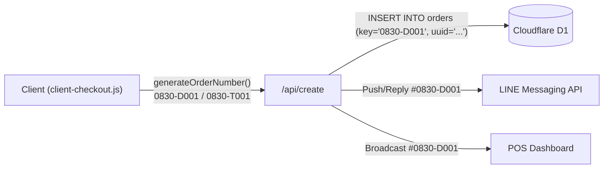
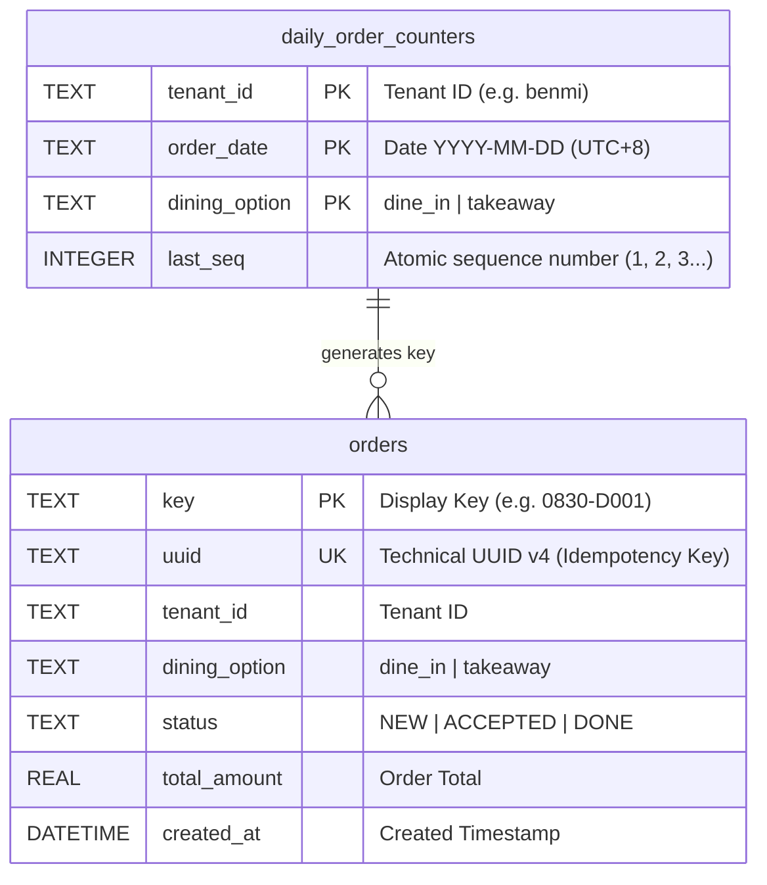
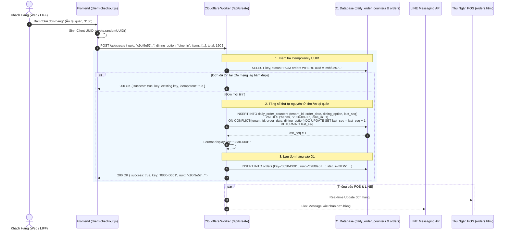

# Principal Design Proposal (PDP)
# PDP: Dual-Identifier Architecture with Dining-Type Daily Sequential Order ID (`MMDD-[D|T]XXX`) & Atomic SQLite Counter [New/Refactor]

**Document Identifier**: `PDP-2026-ORDER-ID-002`  
**Author**: Principal Engineer (Antigravity AI Agent)  
**Status**: Proposed (Aligned via `/grill-me`)  
**Target Systems**: Cloudflare Workers (`benmi-worker-official`), Cloudflare D1 (`blab-db`), Client LIFF Menu (`js/client-checkout.js`), POS Dashboard (`orders.html` / `js/orders-*.js`)  
**Target Environments**: Dev (`blab-db-dev`), Staging (`blab-db-test`), Production (`blab-db-production`)  
**Date**: 2026-08-30  

---

## 1. Executive Summary & Objectives

### 1.1 Problem Statement
1. **Trải Nghiệm Vận Hành Tại Quầy & Phân Biệt Đơn Ăn Tại Quán / Mang Đi**:
   - Hệ thống trước đây sử dụng mã đơn chuỗi ngẫu nhiên dài (ví dụ: `B0830-7ULH`), gây khó khăn cho nhân viên thu ngân và đầu bếp khi nhìn nhanh để phân loại đơn ăn tại chỗ hay mang đi.
   - Chủ quán và nhân viên POS mong muốn mã đơn hàng hiển thị theo định dạng **`<ThángNgày>-<LoạiĐơn><SốThứTựTrongNgày>`**:
     - **Ăn tại quán (Dine-in)**: **`MMDD-DXXX`** (Ví dụ ngày 30/08: đơn ăn tại quán số 1 là **`0830-D001`**, tiếp theo là **`0830-D002`**, **`0830-D003`**...).
     - **Mang đi (Takeaway)**: **`MMDD-TXXX`** (Ví dụ ngày 30/08: đơn mang đi số 1 là **`0830-T001`**, tiếp theo là **`0830-T002`**, **`0830-T003`**...).
     - Hai loại đơn có **bộ đếm số thứ tự tách riêng biệt**, tự động reset về `001` vào lúc `00:00:00` mỗi ngày theo múi giờ địa phương (`UTC+8`).

2. **Yêu Cầu Kỹ Thuật (Zero-Collision & Idempotency trên Serverless)**:
   - Áp dụng mô hình **Kiến Trúc Định Danh Kép (Dual-Identifier Pattern)**:
     - **Mã Kỹ Thuật (Technical UUID - Idempotency & Database Safety)**: Bổ sung cột `uuid` (UUID v4) trong bảng `orders` để đảm bảo tính duy nhất tuyệt đối và chống gửi đơn trùng khi mạng lag/retry.
     - **Mã Hiển Thị (Display Business Key)**: Chuỗi `0830-D001` / `0830-T001` được sinh nguyên tử (atomic) trên CSDL D1.

### 1.2 Goals (In-Scope)
- **Định dạng mã đơn hiển thị**: `MMDD-DXXX` (Ăn tại quán) và `MMDD-TXXX` (Mang đi) với số thứ tự 3 chữ số (`001`, `002`, `003`...).
- **Bộ đếm tách riêng nguyên tử (Atomic Daily Counter per Tenant per Dining Option)**:
  - Bảng `daily_order_counters` trong SQLite D1 sử dụng cơ chế `INSERT ... ON CONFLICT(tenant_id, order_date, dining_option) DO UPDATE SET last_seq = last_seq + 1 RETURNING last_seq`.
  - Tự động reset về `001` khi bước sang ngày mới theo múi giờ Đài Loan (`UTC+8`).
- **Tương Thích Ngược 100%**: Hỗ trợ tra cứu tất cả các đơn cũ trong lịch sử.

---

## 2. Context & Current Architecture



---

## 3. Proposed Architecture & Data Models

### 3.1 Cấu Trúc Bảng Dữ Liệu Bộ Đếm (`daily_order_counters`)



### 3.2 Luồng Xử Lý Đơn Hàng Nguyên Tử



---

## 4. Technical Specifications

### 4.1 Database Migration: `migrations/0046_add_order_uuid_and_daily_counter.sql`
```sql
-- Migration: 0046_add_order_uuid_and_daily_counter.sql
-- Description: Add technical uuid column to orders and create atomic daily sequence counters table

-- 1. Thêm cột uuid vào bảng orders (nếu chưa có)
ALTER TABLE orders ADD COLUMN uuid TEXT DEFAULT NULL;

-- 2. Chỉ mục Unique cho uuid để hỗ trợ Idempotency và tra cứu siêu tốc
CREATE UNIQUE INDEX IF NOT EXISTS idx_orders_uuid ON orders (uuid);
CREATE INDEX IF NOT EXISTS idx_orders_tenant_date_key ON orders (tenant_id, created_at, key);

-- 3. Bảng quản lý bộ đếm số thứ tự đơn trong ngày theo loại đơn cho từng quán
CREATE TABLE IF NOT EXISTS daily_order_counters (
    tenant_id TEXT NOT NULL,
    order_date TEXT NOT NULL, -- Định dạng: YYYY-MM-DD theo múi giờ quán (UTC+8)
    dining_option TEXT NOT NULL, -- 'dine_in' hoặc 'takeaway'
    last_seq INTEGER NOT NULL DEFAULT 0,
    PRIMARY KEY (tenant_id, order_date, dining_option)
);
```

### 4.2 Backend Worker Logic (`benmi-worker-official/src/modules/orders.ts`)

```typescript
export async function getNextDailyOrderSeq(
  env: Env,
  tenantId: string,
  diningOption: DiningOption = "takeaway",
  dateObj: Date = new Date()
): Promise<{ key: string; seq: number }> {
  // Múi giờ Đài Loan UTC+8
  const taiwanDate = new Date(dateObj.getTime() + 8 * 3600000);
  const yyyy = taiwanDate.getUTCFullYear();
  const mm = String(taiwanDate.getUTCMonth() + 1).padStart(2, "0");
  const dd = String(taiwanDate.getUTCDate()).padStart(2, "0");
  const dateStr = `${yyyy}-${mm}-${dd}`;
  const typePrefix = diningOption === "dine_in" ? "D" : "T";

  if (!env.DB) {
    const fallbackSeq = Math.floor(Math.random() * 900) + 100;
    return { key: `${mm}${dd}-${typePrefix}${fallbackSeq}`, seq: fallbackSeq };
  }

  try {
    const res = await env.DB.prepare(
      `INSERT INTO daily_order_counters (tenant_id, order_date, dining_option, last_seq)
       VALUES (?, ?, ?, 1)
       ON CONFLICT(tenant_id, order_date, dining_option) DO UPDATE SET last_seq = last_seq + 1
       RETURNING last_seq`
    ).bind(tenantId, dateStr, diningOption).first<{ last_seq: number }>();

    const seq = res?.last_seq || 1;
    const seqStr = String(seq).padStart(3, "0");
    return { key: `${mm}${dd}-${typePrefix}${seqStr}`, seq };
  } catch (err) {
    console.error(`[getNextDailyOrderSeq] Error for tenant ${tenantId}:`, err);
    const fallbackSeq = Math.floor(Math.random() * 900) + 100;
    return { key: `${mm}${dd}-${typePrefix}${fallbackSeq}`, seq: fallbackSeq };
  }
}
```

---

## 5. Step-by-Step Execution Plan

- [ ] **Phase 1 (Database Migration)**: Tạo và apply migration `0046_add_order_uuid_and_daily_counter.sql` lên `blab-db-test` (Staging).
- [ ] **Phase 2 (Backend Logic)**: Cập nhật `tenant.ts`, `orders.ts` và `line.ts` để triển khai `getNextDailyOrderSeq(env, tenantId, diningOption)` và lưu trữ `uuid`.
- [ ] **Phase 3 (Frontend Integration)**: Cập nhật `js/client-checkout.js` sinh `order_uuid` và hiển thị mã đơn `MMDD-DXXX` / `MMDD-TXXX`.
- [ ] **Phase 4 (Testing & Verification)**: Kiểm thử tạo đơn Ăn tại quán (`0830-D001`, `0830-D002`) và Mang đi (`0830-T001`, `0830-T002`) hiển thị chuẩn trên POS và LINE.
