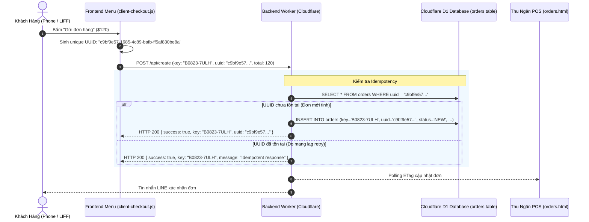

# PDP: Dual-Identifier Architecture with Client Idempotency UUID

| Metadata | Details |
| :--- | :--- |
| **Feature** | Kiến Trúc Định Danh Kép (Dual-Identifier) & Khóa Idempotency UUID |
| **Status** | `PROPOSED` |
| **Author** | Principal Engineer (Antigravity) |
| **Target System** | Cloudflare Workers (`benmi-worker-official`), D1 (`blab-db`), LINE LIFF Web App, POS Dashboard |
| **Date** | 2026-08-23 |

---

## 1. Executive Summary & Objectives

### Problem Statement
Hiện tại hệ thống Benmi POS & Web Order sử dụng một mã định danh duy nhất là chuỗi ký tự ngắn `key` (ví dụ: `B0823-7ULH`).
- **Ưu điểm của mã đơn hiện tại**: Rất trực quan, ngắn gọn, dễ gọi tên tại quầy, phù hợp hiển thị trên màn hình POS và tin nhắn LINE.
- **Hạn chế kỹ thuật khi hệ thống mở rộng**:
  1. **Thiếu cơ chế Idempotency chống gửi trùng**: Khi khách hàng ở khu vực mạng 3G/4G chập chờn hoặc bấm đúp nút thanh toán, request có thể bị gửi 2 lần liên tiếp dẫn đến nguy cơ sinh 2 mã đơn riêng biệt cho cùng 1 giỏ hàng.
  2. **Bảo mật tra cứu đơn qua API**: Mã đơn ngắn (`B0823-XXXX`) tuy có hậu tố Base32 nhưng về mặt lý thuyết vẫn có thể đoán được nếu người ngoài quét brute-force theo dải ngày.
  3. **Định danh phiên làm việc (Session Identification)**: Khi mở rộng sang các tính năng như thanh toán trực tuyến (LINE Pay, ECPay) hoặc phân tích hành vi khách hàng, cần một khóa chuẩn quốc tế UUID v4 không phụ thuộc vào định dạng hiển thị của quán.

### Goals (In-Scope)
- **Thiết lập Mô hình Định Danh Kép (Dual-Identifier Pattern)**:
  - **Business ID (`key`)**: Giữ nguyên 100% định dạng ngắn gọn (`B0823-7ULH`) cho Thu ngân POS, Nhà bếp, Phiếu in nhiệt, và Tin nhắn LINE.
  - **Technical / Security ID (`uuid`)**: Bổ sung UUID v4 (`e4eaaaf2-d142-11e1-b3e4-080027620cdd`) lưu trong Database D1.
- **Cơ chế Client-Generated Idempotency Key**:
  - Trình duyệt khách hàng tự sinh `order_uuid = crypto.randomUUID()` khi bấm gửi đơn.
  - Nếu request bị gửi lặp lại (mạng lag/retry), Server nhận diện cùng `uuid` và trả về kết quả đơn đã tạo mà không bao giờ tạo vé trùng.
- **Zero-Downtime & Zero Breaking Changes**:
  - Không phá vỡ bất kỳ luồng hoạt động nào hiện có của POS, Google Sheets, hay LINE Webhook.

---

## 2. Impact Analysis (Phân Tích Mức Độ Ảnh Hưởng Đến Hệ Thống Hiện Tại)

| Hệ thống / Chức năng | Mức độ ảnh hưởng | Chi tiết đánh giá kỹ thuật |
| :--- | :---: | :--- |
| **Bảng quản lý Thu ngân POS (`orders.html` / `orders.js`)** | 🟢 **0% (Không ảnh hưởng)** | POS vẫn hiển thị `#B0823-7ULH` làm số phiếu chính, thao tác chuyển trạng thái đơn (Đang làm, Đã xong, Đã lấy) và tìm kiếm không thay đổi. |
| **Quy trình Nhà bếp / Báo số bàn** | 🟢 **0% (Không ảnh hưởng)** | Đầu bếp và nhân viên phục vụ vẫn gọi nhau bằng 4 ký tự đuôi (ví dụ: `Bàn 08 - Đơn 7ULH`), không bị xáo trộn bởi chuỗi UUID dài. |
| **Đồng bộ Google Sheets (`googleSheets.ts`)** | 🟢 **0% (Không ảnh hưởng)** | Google Sheets tiếp tục ghi nhận cột `key` như cũ, có thể tùy chọn thêm cột `UUID` ở cuối bảng để lưu trữ audit trail nếu cần. |
| **LINE Bot & Flex Message (`line.ts`)** | 🟢 **0% (Không ảnh hưởng)** | Tin nhắn xác nhận và tra cứu tiến độ vẫn hiển thị `#B0823-7ULH`. Các postback button tiếp tục gắn `order_key` hoạt động ổn định. |
| **Cơ chế Polling & ETag Cache POS** | 🟢 **0% (Không ảnh hưởng)** | ETag vẫn tính toán dựa trên `MAX(updated_at)` và `COUNT(*)` trong D1. |

> [!NOTE]
> **Kết luận tác động**: Việc bổ sung `uuid` dưới dạng **khóa bổ trợ (Supplementary Field)** mang lại lợi ích kỹ thuật tối đa (chống trùng đơn, bảo mật API) mà **hoàn toàn không gây bất kỳ tác dụng phụ hay gián đoạn nào** cho vận hành thực tế của quán.

---

## 3. Proposed Architecture (Kiến Trúc Đề Xuất)



---

## 4. Technical Specifications

### 4.1 Database Migration (`0029_add_order_uuid.sql`)
```sql
-- Migration: 0029_add_order_uuid.sql
-- Thêm cột uuid vào bảng orders (cho phép NULL đối với các đơn cũ trong lịch sử)
ALTER TABLE orders ADD COLUMN uuid TEXT DEFAULT NULL;

-- Tạo Unique Index cho uuid để hỗ trợ tra cứu Idempotency siêu tốc O(1)
CREATE UNIQUE INDEX IF NOT EXISTS idx_orders_uuid ON orders (uuid);
CREATE INDEX IF NOT EXISTS idx_orders_tenant_uuid ON orders (tenant_id, uuid);
```

### 4.2 TypeScript Model Update (`src/types/index.ts`)
```typescript
export interface Order {
  key: string;              // Business ID: B0823-7ULH (Primary display & cashier reference)
  uuid?: string | null;     // Technical ID: UUID v4 (Idempotency key & secure session token)
  customer: string;
  time: string;
  content: string;
  status: string;
  createdAt: number;
  userId?: string;
  total: number;
  reason?: string;
  note?: string;
  diningOption?: DiningOption;
  tableNumber?: string | null;
  roundCount?: number;
  round_count?: number;
  lastAppendedAt?: string | null;
  last_appended_at?: string | null;
}
```

### 4.3 Backend Worker Implementation (`src/modules/orders.ts`)

```typescript
// Trong hàm createOrder:
export async function createOrder(request: Request, env: Env, ctx?: ExecutionContext, tenantCtx?: TenantContext | null): Promise<Response> {
  const data: any = await request.json();
  const tenantId = tenantCtx?.tenantId || getTenantId(request);

  // 1. Idempotency Check: Nếu client gửi kèm uuid, kiểm tra đơn đã tạo chưa
  const clientUuid = data.uuid ? String(data.uuid).trim() : null;
  if (clientUuid && env.DB) {
    const existingOrder = await env.DB.prepare(
      "SELECT key, uuid, total_amount, status FROM orders WHERE uuid = ? AND tenant_id = ?"
    ).bind(clientUuid, tenantId).first<any>();

    if (existingOrder) {
      console.log(`[createOrder] Idempotent request detected for UUID ${clientUuid}. Returning existing order ${existingOrder.key}`);
      return json({ success: true, key: existingOrder.key, uuid: existingOrder.uuid, idempotent: true });
    }
  }

  // 2. Tạo mã Business Key ngắn gọn như thường lệ
  const prefix = resolveTenantOrderPrefix(tenantCtx, tenantId);
  const orderKey = data.orderId || data.key || generateStandardOrderId(prefix);
  const finalUuid = clientUuid || crypto.randomUUID();

  const order: Order = {
    key: orderKey,
    uuid: finalUuid,
    customer: data.customer || "顧客",
    time: cleanTime,
    content: data.content,
    status: "NEW",
    createdAt: Date.now(),
    userId: data.userId,
    total: data.total,
    reason: data.reason || "",
    note: data.note || "",
    diningOption: diningOption,
    tableNumber: tableNumber,
    roundCount: 1,
    round_count: 1
  };

  await saveOrder(env, order, tenantId);
  return json({ success: true, key: orderKey, uuid: finalUuid });
}
```

---

## 5. Frontend Client Integration (`js/client-checkout.js`)

Khi khách hàng bấm nút gửi đơn:
```javascript
// Sinh UUID duy nhất cho phiên gửi đơn này
const orderUuid = (typeof crypto !== 'undefined' && crypto.randomUUID) 
    ? crypto.randomUUID() 
    : ('uuid-' + Date.now() + '-' + Math.random().toString(36).substring(2, 9));

const orderPayload = {
    key: orderNum,
    uuid: orderUuid, // Gửi kèm Idempotency UUID
    userId: userId,
    customer: customerName,
    ...
};
```

---

## 6. Execution Plan & Rollout

- [ ] **Phase 1 (Database)**: Áp dụng migration `0029_add_order_uuid.sql` lên D1 database (Staging & Production).
- [ ] **Phase 2 (Worker)**: Bổ sung trường `uuid` trong `Order`, câu lệnh `INSERT / UPDATE` và bộ lọc Idempotency trong `createOrder`.
- [ ] **Phase 3 (Frontend)**: Cập nhật `client-checkout.js` sinh `orderUuid` tự động khi tạo đơn.
- [ ] **Phase 4 (Testing)**: Kiểm thử E2E trường hợp gửi đơn 2 lần liên tiếp cùng 1 UUID và xác minh POS nhận 1 vé duy nhất.

---

## 7. Verification Plan

```bash
# 1. Tạo đơn lần đầu với UUID
curl -X POST "https://platform-worker-staging.thuanmnc.workers.dev/api/create?tenant_id=benmi" \
  -H "Content-Type: application/json" \
  -d '{ "key": "B0823-TEST", "uuid": "test-uuid-001", "total": 100, "content": "1份 x 燒肉" }'
# Kỳ vọng: HTTP 200 { success: true, key: "B0823-TEST", uuid: "test-uuid-001" }

# 2. Gửi lại request y hệt với cùng UUID (mô phỏng double click/mạng lag retry)
curl -X POST "https://platform-worker-staging.thuanmnc.workers.dev/api/create?tenant_id=benmi" \
  -H "Content-Type: application/json" \
  -d '{ "key": "B0823-NEWKEY", "uuid": "test-uuid-001", "total": 100, "content": "1份 x 燒肉" }'
# Kỳ vọng: HTTP 200 { success: true, key: "B0823-TEST", idempotent: true } (Không tạo đơn B0823-NEWKEY!)
```
