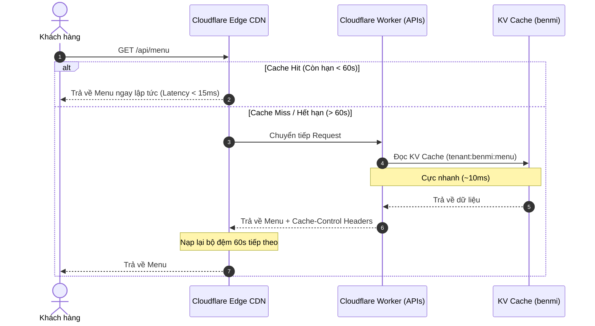

# PDP: Cloudflare Edge Caching Strategy [Performance/Infrastructure]

Tài liệu này đề xuất chiến lược lưu đệm Edge Caching trên hạ tầng mạng biên Cloudflare CDN nhằm tối ưu hiệu năng phản hồi, giảm thiểu số lượng cuộc gọi vào Cloudflare Workers và giảm tải cho cơ sở dữ liệu D1.

---

## 1. Executive Summary & Objectives

### Problem Statement
Hiện tại, trang gọi món của khách hàng (`index.html`) tải chậm do không sử dụng bộ đệm CDN. Việc gắn thêm tham số `?_t=${Date.now()}` và thiết lập `{ cache: 'no-store' }` vô hiệu hóa hoàn toàn Cloudflare Edge Cache. Mọi lượt mở trang của bất kỳ khách hàng nào đều bắt buộc Worker phải chạy lại và truy cập KV/D1, gây tốn CPU time và tăng độ trễ mạng biên không đáng có.

### Goals
*   **Tải trang tức thì (Sub-15ms Latency):** Phục vụ yêu cầu đọc menu và cấu hình của hơn 95% khách hàng trực tiếp từ bộ nhớ đệm Edge CDN gần họ nhất.
*   **Tiết kiệm tài nguyên hạ tầng:** Giảm tải đến 99% số lượng request truy vấn trực tiếp vào Cloudflare Worker và D1 Database khi đông khách.
*   **Đảm bảo tính nhất quán (Consistency):** Thiết lập TTL đệm thấp (60 giây) để các cập nhật (giá cả, trạng thái hết hàng) đồng bộ tới mọi khách hàng trong vòng tối đa 1 phút.

---

## 2. Proposed Architecture

### 2.1. Cấu hình Caching trên Cloudflare Edge CDN

Chiến lược Cache được thiết kế theo mô hình **Low-TTL Cache-Control**:

1.  **Client-side (Trình duyệt):**
    *   Loại bỏ hoàn toàn query parameter chống cache `?_t=${Date.now()}` khi tải Menu, Config, và Image List.
    *   Cho phép trình duyệt lưu cache tạm thời.
2.  **Worker-side (Backend Headers):**
    *   Bổ sung header `Cache-Control: public, max-age=60, s-maxage=60` vào các API đọc dữ liệu (`GET /api/menu`, `GET /api/config`, `GET /api/image_list`).
    *   `s-maxage=60` ra lệnh cho Cloudflare CDN lưu trữ bản sao cache tại máy chủ biên trong 60 giây.
    *   `max-age=60` cho phép trình duyệt của chính khách hàng lưu cache cục bộ trong 60 giây.

### 2.2. Luồng dữ liệu và Đồng bộ hóa



### 2.3. Lợi ích khi thay đổi Trạng thái Kho hàng (OOS Invalidation)
Khi chủ quán bật/tắt hết hàng ở Dashboard:
*   KV cache `tenant:benmi:menu` bị xóa lập tức trên Worker.
*   Bất kỳ khách hàng nào truy cập sau đó mà CDN cache của họ đã hết hạn (tối đa 60s) sẽ nhận được dữ liệu hoàn toàn mới đã cập nhật.
*   Độ trễ cập nhật tối đa giữa Dashboard của chủ quán và thiết bị khách hàng là **đúng 60 giây**.

---

## 3. Step-by-Step Execution Plan

- [ ] **Phase 1: Loại bỏ tham số chống cache ở Frontend (`index.html`)**
  - Xóa `?_t=${Date.now()}` và `{ cache: 'no-store' }` trong cuộc gọi `fetchMenu()`.
- [ ] **Phase 2: Bổ sung Cache Headers ở Worker (Backend)**
  - Thêm header `Cache-Control: public, max-age=60, s-maxage=60` vào hàm trả về của các API đọc:
    - `getMenu` (`src/modules/menu.ts`)
    - `getConfig` (`src/modules/config.ts`)
    - `getImageList` (`src/modules/image.ts`)
- [ ] **Phase 3: Deploy & Kiểm thử trên môi trường Test**
  - Triển khai và kiểm tra độ trễ phản hồi qua Network tab và các dòng lệnh Curl Header.

---

## 4. Verification & Test Plan

1.  **Kiểm tra Cache Headers:**
    *   Sử dụng lệnh curl đọc header:
        ```bash
        curl -I "https://spring-smoke-46ba.thuanmnc.workers.dev/api/menu?tenant_id=benmi"
        ```
    *   Xác nhận có sự xuất hiện của: `Cache-Control: public, max-age=60, s-maxage=60`.
2.  **Kiểm tra tính nhất quán (Consistency):**
    *   Báo hết hàng một món bất kỳ qua Dashboard.
    *   Tải lại trang khách hàng liên tiếp, xác nhận món đó hiển thị hết hàng chậm nhất là sau 60 giây.
