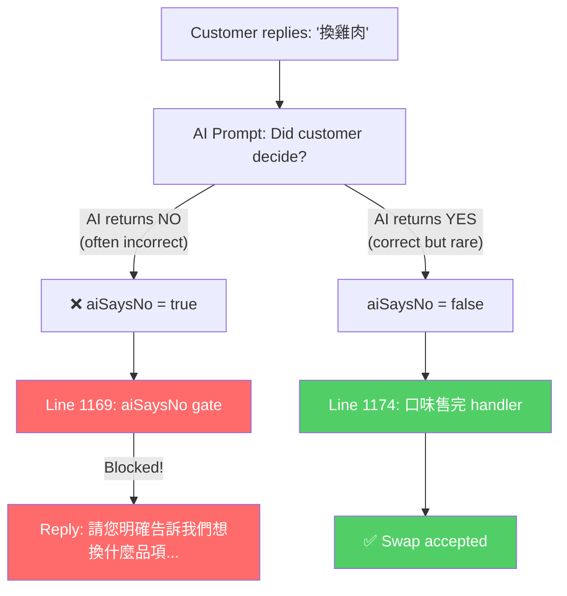
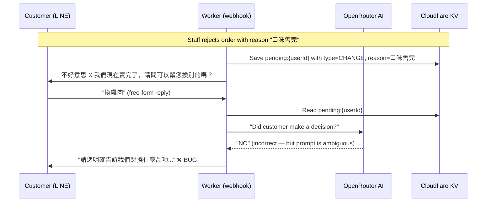
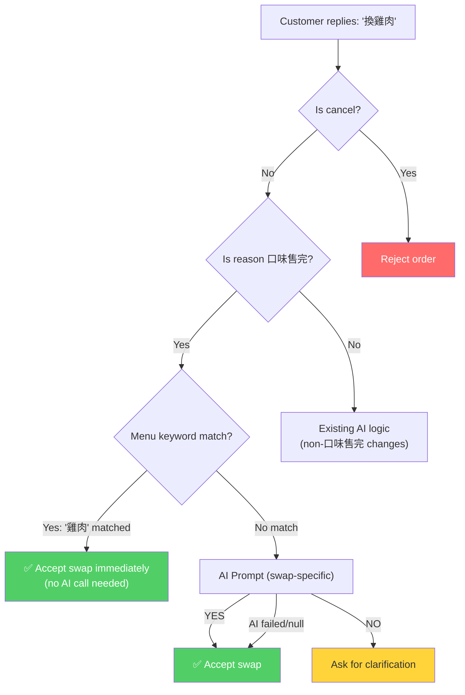

# PDP: Customer Alternative Reply Detection Fix

## 1. Executive Summary & Objectives

### Problem Statement

When a staff member rejects an order because an item is **out of stock** (`口味售完`), the system sends the customer a message like:

> 不好意思 燒肉 我們現在賣完了，請問可以幫您換別的嗎？

The customer has three possible responses:
1. **"OK" / "好" / "同意"** — Accept (but what to swap to?)
2. **"取消" / "不要了"** — Cancel the order
3. **Free-form text** — e.g. "換雞肉" or "幫我改成烤肉" (choose a specific alternative)

**The system correctly handles cases 1 & 2, but consistently fails on case 3.** The customer always receives:

> 請您明確告訴我們想換什麼品項，或者回覆「取消」直接取消訂單。

### Root Cause

The bug is a **logic gate ordering problem** combined with an **over-aggressive AI prompt**:

```
Lines 1143-1172 in worker.js
```

The flow for a `CHANGE` pending with reason `口味售完` is:

```
1. AI prompt asks: "Did the customer make a clear decision?" → YES/NO
2. Check isCancel → if cancel, reject order ✅
3. if (aiSaysNo) → reply "請您明確告訴我們想換什麼品項..." and CONTINUE ❌
4. if (currentReason === "口味售完") → accept the swap ← NEVER REACHED
```

**The AI consistently returns `NO` for customer alternative messages** because the prompt explicitly instructs:

> 如果問題是問想換什麼口味，但顧客只回答「好/同意」而沒有說明要換什麼品項，表示未做出完整決定，請回答「NO」

This prompt was designed for the "agree without specifying" case, but the AI also interprets legitimate alternatives (e.g. "換雞肉", "那我要烤肉") as "not a complete decision" since customers often write informally. The `aiSaysNo` gate at line 1169 blocks the flow **before** the `口味售完` handler at line 1174 ever executes.



### Goals (In-Scope)

1. **Fix the logic gate ordering** so that the `口味售完` case processes correctly for free-form alternative messages.
2. **Add a menu-aware keyword matcher** as a fast, deterministic first-pass that doesn't depend on AI.
3. **Improve the AI prompt** for the remaining ambiguous cases so it correctly classifies customer alternatives.
4. **Zero downtime** — the fix is a single Worker deploy with no data migration.

### Non-Goals (Out-of-Scope)

- Redesigning the entire pending flow state machine.
- Adding interactive LINE quick-reply buttons (a separate improvement, out of scope here).
- Changing the staff-facing dashboard behavior.

---

## 2. Context & Current Architecture

### Current Code Location

All logic lives in a single file: [worker.js](file:///Users/duccao/Documents/benmi-order/benmi-worker-official/src/worker.js)

### Relevant Functions & Lines

| Function / Section | Lines | Purpose |
|---|---|---|
| [normalizeCustomerReply](file:///Users/duccao/Documents/benmi-order/benmi-worker-official/src/worker.js#L914-L923) | 914–923 | Basic keyword detection for agree/cancel/disagree |
| [processEvents](file:///Users/duccao/Documents/benmi-order/benmi-worker-official/src/worker.js#L936-L1270) | 936–1270 | Main webhook event loop |
| [AI gate (aiSaysNo)](file:///Users/duccao/Documents/benmi-order/benmi-worker-official/src/worker.js#L1143-L1155) | 1143–1155 | AI decides if customer "made a decision" |
| [CHANGE handler](file:///Users/duccao/Documents/benmi-order/benmi-worker-official/src/worker.js#L1157-L1197) | 1157–1197 | Processes CHANGE pending type |
| [口味售完 branch](file:///Users/duccao/Documents/benmi-order/benmi-worker-official/src/worker.js#L1174-L1183) | 1174–1183 | The swap handler that is **currently unreachable** |
| [DEFAULT_MENU](file:///Users/duccao/Documents/benmi-order/benmi-worker-official/src/worker.js#L390-L400) | 390–400 | Hardcoded menu (backup); actual menu loaded from KV |

### Data Flow



---

## 3. Proposed Architecture

### Overview

A three-layer fix in ascending cost:

1. **Layer 1 (Deterministic):** Menu keyword matcher — check if the customer's message contains a known menu item name. If yes, skip AI entirely and accept the swap.
2. **Layer 2 (Logic fix):** Restructure the `CHANGE` handler so the `口味售完` swap path runs **before** the `aiSaysNo` gate, not after it.
3. **Layer 3 (AI improvement):** Rewrite the AI prompt to be context-aware for the `口味售完` case, asking specifically "did the customer name a replacement item?" instead of the generic "did they decide?".

### Detailed Design

#### Layer 1: Menu Keyword Matcher

Add a new helper function that checks the customer's message against the current menu:

```javascript
/**
 * Check if the customer's free-text reply contains any known menu item.
 * Returns the matched item name(s) or null.
 */
async function matchMenuItems(text, env) {
  // Load current menu (KV first, fallback to DEFAULT_MENU)
  let menu = DEFAULT_MENU;
  try {
    const raw = await env.ORDER_STATE.get("menu:latest");
    if (raw) {
      const parsed = JSON.parse(raw);
      if (parsed && typeof parsed === "object") menu = parsed;
    }
  } catch {}

  // Collect all unique item names from all categories
  const allItems = new Set();
  for (const category of Object.values(menu)) {
    if (typeof category === "object") {
      for (const name of Object.keys(category)) {
        // Strip combo prefixes like "1 大燒肉+飲料" → "燒肉"
        const clean = name.replace(/^\d+\s*/, "").replace(/^[大小]\s*/, "").replace(/\+.*$/, "").trim();
        if (clean) allItems.add(clean);
      }
    }
  }

  const lowerText = text.toLowerCase();
  const matched = [];
  for (const item of allItems) {
    if (lowerText.includes(item.toLowerCase())) {
      matched.push(item);
    }
  }
  return matched.length > 0 ? matched : null;
}
```

#### Layer 2: Restructured CHANGE Handler Logic

The key structural change — for `口味售完`, process the swap **before** consulting AI:

```javascript
if (pendingType === "CHANGE") {
  // Step 1: Cancel check (always first)
  if (isCancel) { /* ... reject ... */ }

  // Step 2: For 口味售完, check menu match BEFORE AI
  if (currentReason === "口味售完") {
    const menuMatch = await matchMenuItems(userText, env);
    if (menuMatch) {
      // Deterministic match — accept swap immediately
      order.content = `【顧客換單】：${userText}\n----原本訂單----\n${order.content}`;
      order.reason = ""; order.note = ""; order.status = "NEW";
      await replyText(replyToken, `收到您的回覆！我們會依您的需求修改訂單。`, env);
      await saveOrder(env, order);
      await finishPending();
      continue;
    }

    // No menu keyword match → try AI with improved prompt
    if (!aiSaysNo) {
      // AI says YES or AI failed → accept the swap as free-text
      order.content = `【顧客換單】：${userText}\n----原本訂單----\n${order.content}`;
      order.reason = ""; order.note = ""; order.status = "NEW";
      await replyText(replyToken, `收到您的回覆！我們會依您的需求修改訂單。`, env);
      await saveOrder(env, order);
      await finishPending();
      continue;
    }

    // AI explicitly said NO → prompt for clarification
    await replyText(replyToken, `請您明確告訴我們想換什麼品項，或者回覆「取消」直接取消訂單。`, env);
    continue;
  }

  // Step 3: For non-口味售完 CHANGE types, existing logic
  if (aiSaysNo) { /* ... prompt clarification ... */ }
  /* ... agree fallback ... */
}
```

#### Layer 3: Improved AI Prompt

Replace the generic prompt with a context-specific one for `口味售完`:

```javascript
// When reason is 口味售完, use a swap-specific prompt
if (currentReason === "口味售完") {
  prompt = `店家告知顧客某些餐點售完，問他要不要換別的。\n` +
    `店家的問題：「${questionText}」\n` +
    `顧客回覆：「${userText}」\n\n` +
    `顧客的回覆是否有提到想要的替代品項或口味？（例如：「換雞肉」「要烤肉」「那改綜合」「幫我換火腿的」等）\n` +
    `如果有提到替代品項 → 回覆「YES」\n` +
    `如果只是反問、抱怨、或完全無關 → 回覆「NO」\n` +
    `請嚴格只回覆 YES 或 NO。`;
}
```

### Final Flow After Fix



---

## 4. Migration & Rollout Strategy

> [!NOTE]
> This is a **pure code change** in a single Worker file. No data migration, schema changes, or KV key structure changes needed.

### Rollout Phases

1. **Phase 1**: Deploy the fix to the `benmi-worker-official` Worker via `wrangler deploy`.
2. **Phase 2**: Test with a real LINE conversation by triggering a `口味售完` rejection and replying with alternatives.
3. **Phase 3**: Monitor Worker logs for 24h to confirm AI prompt accuracy.

### Rollback Plan

- **Trigger**: If customers report incorrect swap processing (wrong items being accepted).
- **Action**: Revert the last Wrangler deploy with `wrangler rollback` or re-deploy the previous `worker.js`.
- **Impact**: Reverts to the current (broken) state — customers see the clarification message again, but no data is lost.

---

## 5. Alternatives Considered & Trade-offs

### Alternative A: Remove AI Entirely for 口味售完

**Description**: Always accept any non-cancel reply as the customer's swap choice.

| Pros | Cons |
|---|---|
| Simplest fix, no AI latency/cost | Gibberish messages ("哈哈哈") would be accepted as swaps |
| Zero risk of AI misclassification | Staff would see nonsensical swap requests |

**Why not selected**: While appealing for simplicity, it shifts the burden to staff to interpret every reply. The menu keyword match + AI fallback provides a good balance.

### Alternative B: LINE Quick Reply Buttons

**Description**: Instead of asking a free-form question, send a LINE Flex Message with buttons for each available menu item.

| Pros | Cons |
|---|---|
| Zero ambiguity — customer taps a button | Requires knowing which items are still in stock (not currently tracked per-item) |
| No AI needed at all | Larger code change, touches the LIFF/dashboard too |
| Better UX | Out of scope for an urgent fix |

**Why not selected**: This is the **ideal long-term solution** but requires significantly more work (inventory tracking, dynamic Flex Message generation). Recommend as a follow-up.

### Alternative C: Status Quo (Do Nothing)

**Cost**: Customers in the `口味售完` flow are stuck in a loop. They must either say "OK" (without specifying what to swap to, which is useless) or "取消". **Lost revenue** from customers who abandon orders.

---

## 6. Cross-Cutting Concerns

### Security & Compliance
- **No new secrets or API keys** introduced.
- The menu data is already stored in KV and accessed server-side — no new attack surface.
- AI prompts do not include any PII (no customer names or phone numbers sent to OpenRouter).

### Observability
- The existing `console.error` / `console.log` logging covers the critical paths.
- **Recommendation**: Add a structured log when menu keyword matching succeeds/fails to help debug future edge cases:
  ```javascript
  console.log(`[Benmi] Menu match for userId=${userId}: matched=${JSON.stringify(matched)}, text="${userText}"`);
  ```

### Performance
- **Layer 1 (menu keyword match)** adds 1 KV read (`menu:latest`), but this is already cached in the Worker's memory for `getMenu()`. Net impact: ~0ms if cached, ~50ms cold.
- **Layer 2 (logic reorder)** has zero performance impact — just conditional reordering.
- **Layer 3 (AI prompt)** — same latency as before; prompt is slightly longer but negligible.
- **Best case improvement**: If the menu keyword matches, **we skip the AI call entirely**, saving ~500-2000ms latency and 1 OpenRouter API call cost per swap request.

---

## 7. Step-by-Step Execution Plan

- [ ] **Phase 1**: Add `matchMenuItems()` helper function (after line ~910, near the quick reply helpers).
- [ ] **Phase 2**: Restructure the `CHANGE` handler block (lines 1157–1197) to:
  - Move `口味售完` check before the `aiSaysNo` gate.
  - Add menu keyword matching as the first detection layer.
  - Update AI prompt for `口味售完` context.
- [ ] **Phase 3**: Add observability logging for menu matches.
- [ ] **Phase 4**: Deploy and test.

---

## 8. Verification & Test Plan

### Manual Verification

Simulate the full flow via LINE:

1. **Setup**: Create a test order, then trigger `CHANGED` with reason `口味售完` and note `燒肉` from the dashboard.
2. **Test Case 1 — Menu keyword match**: Reply "換雞肉". Expected: Order content updated with `【顧客換單】：換雞肉`, status reset to `NEW`.
3. **Test Case 2 — Informal phrasing**: Reply "那我要烤肉好了". Expected: "烤肉" matched from menu, swap accepted.
4. **Test Case 3 — Cancel**: Reply "不要了". Expected: Order status → `REJECTED`.
5. **Test Case 4 — Gibberish**: Reply "哈哈哈你好". Expected: AI returns NO, customer sees clarification prompt.
6. **Test Case 5 — Agree without specifying**: Reply "好". Expected: Treated as agree but we need to clarify what item since this is the `口味售完` case.

### Automated Verification

Since the Worker has no test framework currently, verification is manual via the LINE chat + dashboard + `GET /api/debug?key=order:{orderKey}`.

> [!IMPORTANT]
> **Recommended follow-up**: Add a `wrangler dev` local test harness that can simulate webhook payloads without hitting the LINE API. This would make future fixes significantly easier to verify.

---

## Open Questions

> [!IMPORTANT]
> **Question 1**: When the customer replies "好" / "OK" to a `口味售完` question without specifying a replacement item — what should the system do?
> - **Option A**: Ask for clarification: "好的，請問您想換什麼口味呢？"
> - **Option B**: Accept as-is and let staff figure it out (current behavior after bypassing the bug).
> 
> The current code (line 1186–1193) falls through to a generic "agree" path that sets status to `ACCEPTED`, which doesn't make sense for a "sold out" scenario where the whole point is to pick a replacement.

> [!IMPORTANT]
> **Question 2**: Should we add the menu keyword match **only** for `口味售完`, or also apply it to other `CHANGE` reasons? Other reasons (e.g. `時間需調整`) have a dedicated handler already, but future reasons might benefit from it.
