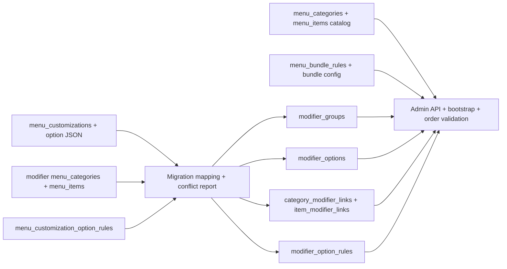

# PDP: Chuyển hoàn toàn dữ liệu tuỳ chọn menu sang canonical schema

**Trạng thái:** Đề xuất kế hoạch; chưa chạy backfill hoặc cutover dữ liệu.  
**Phạm vi:** Migration từ các biểu diễn modifier/customization cũ sang `modifier_groups`, `modifier_options` và các bảng liên kết canonical; đồng thời gỡ phụ thuộc runtime vào nguồn modifier cũ sau khi đạt parity.

## 1. Tóm tắt và mục tiêu

Hiện menu có nhiều nguồn biểu diễn tuỳ chọn: `menu_customizations.options_json`, danh mục loại `modifier` cùng các `menu_items` con, và schema canonical mới. UI/API vì vậy phải hợp nhất nhiều nguồn; việc sửa ở một màn hình có thể không xuất hiện ở màn hình khác hoặc gây payload lưu không tương thích.

Đích đến là một nguồn dữ liệu duy nhất cho tuỳ chọn trong mỗi tenant: canonical modifier schema. Sau cutover, POS, trang đặt món, bootstrap và API quản trị chỉ đọc/ghi canonical modifier tables. Các bảng sản phẩm/danh mục vẫn tiếp tục tồn tại cho catalog; combo/bundle vẫn thuộc miền bundle riêng. “Chuyển hoàn toàn” không có nghĩa xoá `menu_categories`/`menu_items` khỏi hệ thống.

Mục tiêu bắt buộc:

- Giữ nguyên nội dung và hành vi đang có: tên, giá phụ thu, thứ tự, chọn mặc định, giới hạn lựa chọn, bắt buộc, phạm vi order/category/item, liên kết, hết hàng, nhánh phụ, điều kiện theo giá trị đơn và thông báo lỗi.
- Không gộp nhóm chỉ vì trùng tên; không quyết định liên kết dựa trên tên hoặc slug.
- Backfill chạy lặp an toàn, có mapping nguồn→canonical, phát hiện xung đột và có bằng chứng so sánh trước/sau theo tenant.
- Chỉ ngừng legacy reads/writes khi mọi tenant và các consumer đã chuyển, không chỉ khi số dòng đã được copy.

Ngoài phạm vi: thay đổi trải nghiệm POS/customer UI, đổi quy tắc nghiệp vụ, chuyển bundle rules thành modifier groups, hoặc xoá catalog categories/items.

## 2. So sánh schema hiện tại và schema đích

| Nghiệp vụ | Biểu diễn cũ | Canonical hiện có | Xử lý khi chuyển |
|---|---|---|---|
| Nhóm tuỳ chọn | Một dòng `menu_customizations` với `title`, `type`, `sort_order`; hoặc `menu_categories` có `category_type='modifier'` | `modifier_groups`: `name`, `selection_type`, `is_required`, `min_selection`, `max_selection`, `sort_order`, `scope` | Mỗi nhóm nguồn có mapping riêng sang một `modifier_groups.id`; giữ nguồn gốc và thứ tự. Scope phải được xác định từ quy tắc áp dụng/liên kết, không suy ra từ tên. |
| Lựa chọn trong nhóm | JSON `options_json`; hoặc dòng `menu_items` trong danh mục modifier | `modifier_options`: `name`, `price`, `is_default`, `sort_order`, `out_of_stock_until` | Tạo từng option với ID ổn định và mapping riêng. Giữ giá, thứ tự, default, thời điểm hết hàng. |
| Chọn một/nhiều, bắt buộc, min/max | `type`, `is_required`, `min_selection`, `max_selection` rải giữa JSON/bảng category | Có sẵn trên `modifier_groups` | Chuẩn hoá giá trị legacy về enum canonical; giá trị lạ phải vào báo cáo xung đột, không tự ép im lặng. |
| Phạm vi áp dụng | `menu_customizations.scope`, `menu_categories.applied_modifiers`, cấu hình item và quy ước cũ | `modifier_groups.scope` (`order`/`category`/`item`) + link tables | Giữ đúng nhóm toàn đơn, theo danh mục, theo món. Trường hợp không xác định rõ phải xử lý trước cutover. |
| Gán nhóm vào món | Cấu hình cũ hoặc không có bảng quan hệ chuẩn | `item_modifier_links(tenant_id,item_id,group_id,sort_order)` | Map bằng ID/mapping đã kiểm chứng; không map tên; giữ link order và shared group. |
| Gán nhóm vào danh mục | `applied_modifiers` dạng JSON hoặc chuỗi ID/slug | `category_modifier_links(tenant_id,category_id,group_id,sort_order)` | Parse legacy format, giải slug/ID theo tenant, đối chiếu từng link với snapshot hành vi trước đó. Không diễn giải `[]` thành “mọi nhóm”. |
| Nhánh phụ / sub-options | `sub_options` trong từng option JSON | Chưa có cột canonical tương ứng | Bổ sung trường canonical có kiểu JSON và validate cấu trúc trước khi migrate. Đây là metadata cần để giữ nguyên hành vi client. |
| Điều kiện chọn theo tổng đơn | `menu_customization_option_rules`; một số dữ liệu cũ còn nhúng `min_order_amount`, `thresholdBasis`, `ruleErrorMessage` trong option JSON | `modifier_options` chưa chứa đủ các trường; rule cũ dùng `customization_key`/`option_id` | Đổi khoá rule sang canonical `option_id`, giữ threshold basis, min subtotal, loại rule và error message. Tránh để rule trỏ bằng legacy key sau cutover. |
| Hết hàng | `menu_items.out_of_stock_until` hoặc JSON flags | `modifier_options.out_of_stock_until` | Quy đổi deadline/tình trạng về timestamp chuẩn; quy tắc legacy chỉ có boolean phải giữ tương đương cho đến khi hết hiệu lực hoặc được xử lý. |
| Nhóm toàn cục và thứ tự hiển thị | Customization order-level và sort order cũ | `scope='order'` và `sort_order` canonical | Tất cả nhóm vẫn là các nhóm nghiệp vụ độc lập; UI có thể render chung một khối/heading “口味與客製化選擇”. Thứ tự từng nhóm vẫn được giữ trong canonical. |
| Combo/suất ăn | `menu_items.item_type`, `menu_bundle_rules.config_json`, một số dữ liệu giá theo lượng trong `menu_categories.pricing_rules` | Bundle tables/rules riêng | Không chuyển combo thành modifier. Giữ nguyên item ID, config và quan hệ bundle; kiểm thử riêng các combo có Size/customize. |
| Danh mục món và sản phẩm | `menu_categories`, `menu_items` | Vẫn là catalog tables | Không xoá. Chỉ các category/item vốn đang giả lập nhóm/option modifier mới được retire sau khi đã xác nhận không còn vai trò catalog và không còn tham chiếu. |

### Phần schema cần bổ sung tối thiểu

Schema canonical hiện đã đáp ứng phần lớn miền dữ liệu: nhóm, option, selection constraints, scope, link theo món/danh mục và out-of-stock deadline. Không cần tạo một hệ schema song song mới. Trước backfill cần hoàn thiện khả năng biểu diễn các dữ liệu legacy đang được consumer sử dụng:

1. `modifier_options.sub_options_json TEXT NOT NULL DEFAULT '[]'` để giữ danh sách nhánh phụ hiện đang đọc từ `options_json`.
2. Đưa rule option về canonical `option_id` và bổ sung các trường legacy còn cần: `min_order_subtotal`, `threshold_basis`, `error_message`, `rule_type`, `is_active` (có thể dùng bảng `modifier_option_rules` nếu muốn giữ nhiều rule trên một option; nếu chỉ một rule/option là bất biến được xác nhận thì các cột có thể nằm trực tiếp ở `modifier_options`). **Khuyến nghị bảng rule riêng** vì migration hiện có cho phép nhiều loại rule và bảng cũ đã tách rule khỏi option; không nhét tiếp rule vào JSON.
3. Thêm `description` vào canonical option chỉ khi kiểm kê chứng minh description của modifier-option cũ được customer/POS dùng hoặc cần giữ. Không tự bỏ qua một trường có dữ liệu.

Không bổ sung lại trường đã có như `selection_type`, `is_required`, `min_selection`, `max_selection`, `scope` hoặc `out_of_stock_until`. Trước khi chốt DDL, kiểm kê phải xác nhận mọi field được tiêu thụ thật sự; chỉ thêm field có nguồn dữ liệu/hành vi cụ thể.

## 3. Bối cảnh và bằng chứng hiện tại

Tài liệu điều tra trước đó là [modifier_source_unification/PDP.md](../modifier_source_unification/PDP.md), kèm inventory dev/prod. Inventory được đo ngày 2026-09-28, chỉ xác nhận sự tồn tại, số lượng và mapping ứng viên; chưa xác nhận full field parity và không phải trạng thái hiện tại để chạy migration. Các số liệu ghi trong đó: dev có 17 canonical groups, 8 customization legacy chưa có counterpart canonical và 16 modifier categories; production có 0 canonical groups, 25 customization legacy chưa có counterpart và 18 modifier categories. Phải chạy lại inventory trước bất kỳ rollout nào.

Các code path đã xác định cần chuyển:

- `benmi-worker-official/src/modules/bootstrap.ts`: hiện đọc legacy customizations, legacy option rules/bundle rules và canonical links/options.
- `benmi-worker-official/src/modules/menu.ts`: có luồng lưu menu/customizations và canonical groups; mapping ID cần thống nhất trước khi bỏ adapter.
- `benmi-worker-official/src/modules/orders.ts`: còn đọc customizations và option rules khi xác thực/lưu order; đây là dependency runtime quan trọng, không chỉ UI.
- `benmi-worker-official/src/modules/bundle-rules.ts`: có đọc legacy modifier categories cùng canonical; phải chuyển bundle validation sang nguồn canonical trước khi retire legacy modifier categories.
- `js/orders-menu.js`: UI quản lý menu và serializer; cần một model canonical duy nhất, không sinh `mg_` alias khác với ID server.
- `js/client-menu.js`: dùng `sub_options`, min order threshold và rule error message khi render/validate option.
- Migrations nền: `0061_unified_bundle_and_customization_schema.sql` tạo canonical groups/options/item links; `0063_clean_customizations_and_category_links.sql` thêm `scope` và category links; `0049_create_universal_bundle_and_threshold_rules.sql` tạo bundle và legacy option-rule storage.

Đặc biệt, legacy `menu_customizations` không tự nói nhóm được gán vào món/danh mục nào trong mọi trường hợp. `applied_modifiers` có thể là JSON hoặc chuỗi và có thể tham chiếu ID/slug. Vì vậy một câu “copy mỗi bảng sang bảng mới” chưa đủ để giữ hành vi.

## 4. Kiến trúc đích và nguyên tắc chuyển

Nguyên tắc:

- **Canonical chỉ có một identity:** mọi API/UI dùng canonical IDs; alias cũ chỉ tồn tại trong migration mapping, không được trả về thành hai nhóm.
- **Mapping có provenance:** mapping tối thiểu gồm `tenant_id`, `source_table`, `source_id`, `canonical_id`, `status`, `source_hash`, `migrated_at`. Bảo đảm unique theo tenant/source. Nếu ID cũ đụng ID canonical khác, tạo ID canonical mới ổn định và ghi mapping; không đoán bằng prefix.
- **Tenant isolation:** mọi đọc/ghi/backfill/link join đều có `tenant_id`; kiểm tra uniqueness/collision toàn DB vì primary key hiện tại của một số bảng chỉ là ID.
- **Không phá vỡ nội dung:** mỗi option/group được giữ riêng, kể cả cùng tên. Chỉ hợp nhất hai bản ghi khi cùng identity đã được chứng minh và toàn bộ field/link tương đương; nếu khác thì quarantine thành conflict.
- **Order-level UI grouping chỉ là trình bày:** nhiều global groups vẫn là nhiều `modifier_groups` độc lập với thứ tự riêng, nhưng renderer gom chúng vào một heading chung theo yêu cầu. Không tạo group giả để bọc nhóm.
- **Giữ bundle độc lập:** migration modifier không đổi `menu_bundle_rules`; chỉ bảo đảm bundle selectors tham chiếu canonical option groups khi đúng miền nghiệp vụ.

## 5. Các rủi ro cần giải quyết trước khi migrate

| Rủi ro | Hậu quả | Kiểm soát/điều kiện cutover |
|---|---|---|
| Legacy scope/link không thể suy ra duy nhất | Tùy chọn xuất hiện sai ở POS/customer hoặc Size biến mất khỏi combo | Tạo báo cáo mapping theo item/category/order; ambiguous rows phải được sửa bằng mapping rõ hoặc cấu hình tenant, không tự map theo tên. |
| Cùng group đã tồn tại ở cả legacy và canonical nhưng nội dung khác | Mất option hoặc tạo nhóm trùng | Field-level compare group, options, rules, links; conflict làm tenant không đạt gate. |
| ID legacy va chạm giữa tenant/nguồn | Ghi đè hoặc link sai tenant | Collision preflight; ID allocator ổn định và bảng mapping; FK/link validation. |
| Sub-options hoặc threshold không có chỗ chứa | UI mới hiển thị thiếu/validation khác trước | Bổ sung schema tối thiểu trước backfill; round-trip test option có các trường này. |
| Legacy category có hai vai trò catalog và modifier | Xoá nhầm danh mục món/option | Retire chỉ các bản ghi category_type=modifier đã đối soát mọi tham chiếu; không xoá catalog category/item. |
| Order validation còn truy vấn legacy | Khách đặt được nhưng POS/Worker từ chối hoặc ngược lại | Chuyển `orders.ts`, bundle validation và bootstrap trước khi legacy reads bị chặn; API contract parity. |
| KV bootstrap cũ | Thiết bị tiếp tục thấy catalog/options cũ sau cutover | Version/revision cache invalidation tenant-scoped; kiểm tra bootstrap mới trên cache miss và sau update. |
| Rollback sau khi có canonical-only edits | Bản cũ đọc legacy snapshot stale | Có reverse exporter/sync được kiểm thử trong rollback window; nếu không thể khôi phục chính xác thì không mở write canonical-only diện rộng. |

## 6. Kế hoạch chuyển đổi hoàn toàn

“Hoàn toàn” ở đây có ba điều kiện đồng thời: dữ liệu modifier đã backfill đủ; mọi runtime/admin consumer chỉ phụ thuộc canonical; legacy modifier sources không còn được ghi hoặc đọc. Chuyển đổi storage được tách khỏi dọn bảng vật lý để có rollback an toàn.

### Giai đoạn 0 — Đóng băng hợp đồng và baseline

1. Liệt kê toàn bộ tables/columns, API endpoints, scheduled/background scripts, frontends, order validators, bundle validators và bootstrap paths có đọc/ghi legacy modifier sources.
2. Chạy lại read-only inventory cho dev, staging, production; đếm từng tenant, group, option, binding, orphan, duplicate-ID, JSON parse failure, rule và bundle reference.
3. Xuất snapshot có checksum cho các bảng modifier cũ/mới và cấu hình links theo tenant; không đưa dữ liệu cá nhân/đơn hàng vào export.
4. Chốt mapping contract, enum `scope`/selection, cách quy đổi OOS boolean/deadline và cách xử lý bản ghi không có binding (giữ unassigned, không tự xoá).

**Gate:** inventory toàn tenant hoàn tất; không có bảng/consumer legacy chưa được liệt kê; ambiguous mappings được đếm và có owner xử lý.

### Giai đoạn 1 — Hoàn thiện canonical schema và API

1. Tạo migration additive cho `sub_options_json` và canonical option rules. Nếu `description` có dữ liệu/hành vi, thêm trường và renderer/API support.
2. Thêm constraints/indexes cần cho tenant-safe rule lookup và mapping. Không thay đổi hoặc drop bảng cũ.
3. Cập nhật API response/write validation để đọc/ghi đầy đủ canonical metadata, trả lỗi 4xx có field path cho payload không hợp lệ.
4. Tạo migration mapping/conflict ledger; mapping insert idempotent và có thể resume sau lỗi theo tenant.

**Gate:** round-trip canonical API bảo toàn mọi trường; migration schema chạy trên dev/staging; legacy vẫn hoạt động.

### Giai đoạn 2 — Backfill có kiểm soát, chưa đổi nguồn đọc

1. Chạy dry-run theo từng tenant: đề xuất mapping group/option/rule/link và xuất diff. Không ghi nếu có collision hoặc parse error không xử lý.
2. Backfill `menu_customizations` → `modifier_groups` + `modifier_options` + canonical option rules; giữ chính xác `scope`, sort, required/min/max, options/default/price/sub-options/OOS và rule metadata.
3. Backfill `category_type='modifier'` và option rows từ `menu_items` sang canonical groups/options. Giữ tenant/category mapping; không di chuyển catalog products.
4. Chuẩn hoá `applied_modifiers` JSON/CSV, resolve ID/slug trong tenant rồi tạo `category_modifier_links`; tạo `item_modifier_links` từ cấu hình món/canonical bindings. Giữ shared groups và `sort_order`.
5. Xử lý bản canonical có sẵn: map alias chỉ khi field+binding parity bằng nhau; nếu canonical có dữ liệu tốt hơn thì dùng quy tắc precedence đã ghi và vẫn lưu diff. Không merge tự động khi khác nhau.
6. Giữ unassigned groups/options trong thư viện; chỉ ghi binding không tồn tại khi nguồn chứng minh binding đó tồn tại.

Backfill chạy theo tenant/chunk, dùng transaction/batch có checkpoint, giới hạn kích thước theo Cloudflare D1 và có thể chạy lại mà không nhân đôi records. Không chạy một transaction khổng lồ cho toàn bộ tenants.

**Gate:** 100% rows nguồn đã phân loại là migrated, intentional-empty/retired, hoặc conflict có người chịu trách nhiệm; zero unresolved blocking conflicts cho tenant pilot.

### Giai đoạn 3 — Đối chiếu và chạy shadow

1. Dựng canonical bootstrap/API payload song song với legacy payload nhưng chỉ canonical là kết quả shadow; không ghi khách hàng hay POS sang hai nguồn.
2. So sánh semantic snapshots theo tenant: groups/options/links/order, mọi rule fields, OOS effective state, combo references và customer-visible result.
3. Chạy kiểm tra tổng số, hash chuẩn hoá, ID uniqueness, FK/orphan, không link chéo tenant; điều tra mọi khác biệt thay vì chỉ so row counts.
4. Kiểm thử hành trình quản trị lưu từ UI, reload, mở tab tuỳ chọn theo món, customer checkout, POS order validation và combo Size.

**Gate:** không có khác biệt chưa giải thích; nhóm pilot đạt parity qua ít nhất một chu kỳ vận hành và cache refresh.

### Giai đoạn 4 — Cutover đọc/ghi theo tenant

1. Bật feature flag theo tenant để bootstrap/admin API đọc canonical; theo dõi lỗi và metric. Bắt đầu bằng dev → staging → một nhóm pilot được xác định từ inventory, sau đó tăng dần.
2. Khi canonical read ổn định, chuyển mọi writes sang canonical. Legacy tables thành frozen snapshot; không tiếp tục dual-write kéo dài.
3. Chuyển `orders.ts`, validation, bundle/customization paths và mọi report/export liên quan; rà soát bằng static search để không còn legacy runtime reads.
4. Invalidate bootstrap cache sau cutover/update; bump frontend cache-busters theo quy định repository.
5. Mở rộng tenant cohorts chỉ khi cohort trước không có regressions; dừng tự động khi lỗi API 4xx/5xx, modifier resolution failure hoặc payload parity lệch vượt ngưỡng.

**Gate:** tất cả tenants đã bật canonical, 0 legacy writes, 0 legacy runtime reads, mọi menu read/write and order flow thành công trên canonical.

### Giai đoạn 5 — Retire legacy sources

1. Trong một release chỉ đọc, đặt legacy modifier tables read-only và cảnh báo bất kỳ query/attempt nào còn chạm tới chúng.
2. Sau rollback window và khi không có hits, ngừng bootstrap/API legacy adapters và legacy validators.
3. Export archive final; xoá hoặc tách dữ liệu modifier trong `menu_customizations`, modifier-category rows và `menu_customization_option_rules` bằng migration riêng có review. Không drop catalog tables; có thể để bảng legacy rỗng/read-only thêm một release trước khi drop.
4. Chỉ drop bảng legacy hoàn toàn khi code search, logs, DB queries, migration scripts và reporting đều xác nhận không phụ thuộc.

## 7. Rollback

- Trước cutover: dừng backfill; canonical additions có thể giữ nguyên vì additive. Xoá dữ liệu backfill chỉ bằng mapping ledger và chỉ sau khi kiểm tra không có canonical edits mới.
- Sau canonical read nhưng trước canonical writes: tắt feature flag, trở về legacy reads; dữ liệu cũ chưa đổi.
- Sau khi canonical writes được bật: rollback phải chuyển writes/read về legacy bằng reverse-export của mọi thay đổi sau snapshot, bao gồm groups, options, links, rules, sort order và deletes. Reverse export phải chạy dry-run, báo conflict và được kiểm chứng trước khi sử dụng. Không khôi phục snapshot đè lên các thay đổi mới.
- Nếu reverse export không thể bảo toàn semantic parity, giữ canonical runtime và rollback phiên bản ứng dụng bằng adapter đọc canonical; không quay về phiên bản legacy-only gây mất cấu hình mới.
- Không drop legacy tables trong rollback window. Định nghĩa trước ngưỡng rollback: lỗi lưu menu, mất group/option trên bootstrap, order validation reject hợp lệ, lỗi cross-tenant hoặc mismatch customer-facing.

## 8. Bảng thay đổi theo thành phần

| Thành phần | Trước | Sau | Điều kiện hoàn tất |
|---|---|---|---|
| Admin API + UI | Gộp nhiều nguồn/alias | Quản lý độc lập canonical group IDs và bindings | Tạo/sửa/xoá nhóm, binding, option đều round-trip qua một ID duy nhất |
| Bootstrap/customer menu | Legacy JSON + modifier categories + canonical joins | Canonical groups/options/links/rules; global groups vẫn render trong một khối UI | Snapshot customer-visible giống baseline |
| Order validation | Có truy vấn `menu_customizations` và rules theo legacy key | Validate canonical option ID/group/rules | Các đơn hợp lệ cũ/new Size/bundle đều pass |
| Bundle handling | Một số đường đọc legacy modifier category, bundle rules riêng | Canonical modifiers cho selectors; bundle config vẫn riêng | Combo options, quantities/prices và Size không đổi |
| Cache | Invalidation theo một số write paths | Revision/invalidation thống nhất sau mọi canonical write | Sau save, bootstrap trên thiết bị mới/cache cũ không trả data stale |
| Legacy storage | Nhiều nguồn còn active | Frozen, archive rồi retire | 0 runtime reads/writes qua rollback window |

## 9. Bảo mật, vận hành và hiệu năng

- Tất cả migration endpoints/scripts chỉ chạy với quyền admin vận hành; tenant ID lấy từ mapping đã kiểm chứng, không nhận tenant tuỳ ý từ payload người dùng.
- Mọi truy vấn phải bind parameter và ràng buộc tenant. Không log nội dung menu đầy đủ nếu chỉ cần ID/hashes; log conflict với tenant/group/option IDs đã mask nếu chính sách yêu cầu.
- Metrics theo release/tenant cohort: groups/options migrated, unresolved mappings, rule parse failures, orphan links, canonical/legacy read count, save 4xx/5xx, bootstrap missing/incomplete, order validation failures, cache invalidation lag.
- Dùng batch queries thay vì truy vấn mỗi option; indexes theo `(tenant_id, group_id, sort_order)` và lookup links/rules theo tenant. Chạy backfill theo chunks để giữ CPU/time và giới hạn D1.
- Không migrate đơn hàng lịch sử sang schema modifier. Nếu orders chứa snapshot lựa chọn, giữ snapshot như chứng từ giao dịch; chỉ kiểm tra validation cho đơn mới.

## 10. Các lựa chọn và đánh đổi

| Lựa chọn | Ưu điểm | Nhược điểm | Đánh giá |
|---|---|---|---|
| Giữ compatibility adapter lâu dài | Ít rủi ro cutover tức thời | Nhiều source of truth, UI/data inconsistency và logic ngày càng khó bảo trì | Không đạt mục tiêu “hoàn toàn”. Chỉ dùng tạm trong migration window. |
| Copy bảng rồi lập tức xoá legacy | Ít bước, kết thúc nhanh | Không có field/link parity; rollback và điều tra sự cố khó; nguy cơ mất Size/sub-options/rules | Không chọn. |
| Backfill, so semantic parity, cutover theo cohort, rồi retire | Có end-state canonical rõ ràng, phát hiện sai trước cutover, rollback có đường đi | Cần inventory và migration ledger; kéo dài qua vài release | Khuyến nghị; mức phức tạp tập trung vào migration một lần thay vì kéo dài trong runtime. |

## 11. Kế hoạch PR/milestone và tiêu chí nghiệm thu

- [ ] **PR 1 — Inventory & mapping contract:** read-only inventory mới cho mọi tenant/env; source field catalogue; ID collision/orphan/ambiguity reports; quyết định xử lý mọi conflict.
- [ ] **PR 2 — Schema completeness:** additive migration cho sub-options/rules/metadata cần thiết; canonical API validation; mapping ledger và idempotent backfill engine có dry-run.
- [ ] **PR 3 — Backfill tooling:** tenant-scoped preview/apply/resume/export; semantic diff JSON; checkpoint, audit logs và rollback export.
- [ ] **PR 4 — Canonical runtime:** chuyển bootstrap, menu API, order validation, bundle selectors và POS/customer consumers sang canonical; không còn legacy fallback ngầm.
- [ ] **PR 5 — Pilot/cohort cutover:** dev, staging, pilot tenant(s), rồi các cohort production; theo dõi parity và error budget. Không tự chạy trên production khi chưa có inventory/gates và lịch cutover được phê duyệt.
- [ ] **PR 6 — Retire legacy:** freeze cảnh báo, đo 0 reads/writes, archive, cleanup dữ liệu modifier legacy, sau đó mới xem xét drop legacy tables.

Nghiệm thu cuối:

1. Mỗi record modifier legacy có trạng thái xử lý và mapping/retirement rationale; không còn record im lặng bị bỏ.
2. So sánh semantic trên toàn bộ tenants không còn mismatch chưa giải thích cho group/option/link/rule/OOS/sort.
3. Search toàn repository và quan sát production logs xác nhận không còn runtime read/write modifier từ legacy sources.
4. UI quản trị, customer ordering, POS validation, global customization, category inheritance, item-only Size, shared groups, combo/bundle và option thresholds hoạt động như baseline.
5. Cache invalidation, rollback export và migration resume đã được chứng minh ở staging.
6. Các bảng catalog và bundle vẫn giữ nguyên miền dữ liệu; lịch sử order không bị biến đổi.

## 12. Verification plan

Trước mỗi môi trường: backup/export và dry-run; xác minh expected counts/mappings; chạy schema/app static checks theo quy trình release. Không coi lệnh thành công hoặc số row bằng nhau là bằng chứng parity.

Kiểm tra dữ liệu tự động:

- group/option/link counts và canonicalized hashes theo tenant;
- required/min/max/selection type/scope/sort order;
- option price/default/OOS/sub-options/description và rule threshold/basis/error message;
- direct/prefixed ID candidates, collision, duplicate, orphan link, missing option và invalid JSON;
- legacy applied_modifiers ở dạng JSON/CSV, slug/ID resolution;
- bundle rules và item IDs không đổi;
- không có cross-tenant join hoặc ID reference.

Kiểm tra hành vi:

- Chọn một modifier toàn đơn, một nhóm gán category, một nhóm item-only (đặc biệt Size của jiangjiejie), nhóm shared, nhóm chưa gán và nhóm có threshold/sub-options.
- Lưu/sửa/xoá có chủ đích qua POS admin, reload, sau đó kiểm tra API/bootstrap/customer checkout/order validation.
- Chọn combo và từng bundle component; xác nhận giá, lựa chọn và validation như trước.
- Kiểm tra cache trước/sau update trên cache hit và miss; thử rollback ở staging sau canonical-only write để chứng minh reverse path.

## 13. Ranh giới giữa đề xuất và thực thi

Tài liệu này là bảng đối chiếu và kế hoạch kỹ thuật. Nó không thực hiện DDL, backfill, thay đổi menu của tenant hay cutover production. Inventory hiện có đã cũ và chưa field-compare, do đó bước tiếp theo hợp lý là PR inventory/dry-run và chốt các conflict thực tế; chỉ bắt đầu backfill sau khi report chứng minh mọi field/relationship đều có mapping an toàn.
