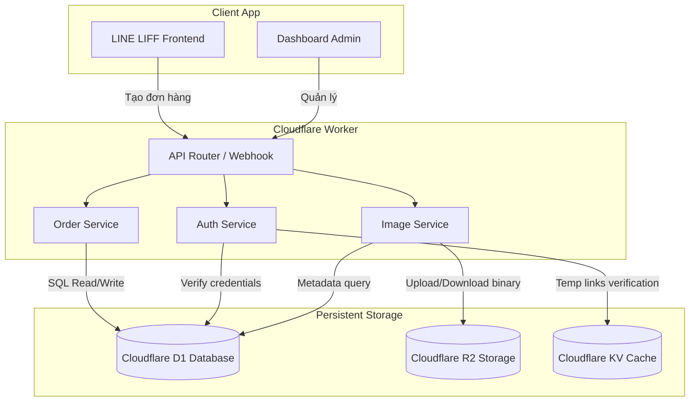

# PDP: KV to D1 & R2 Migration for Orders, Config, and Media [Migrate/Refactor]

Tài liệu này đề xuất kế hoạch chuyển đổi các phần dữ liệu đang lưu trữ trong Cloudflare KV (`ORDER_STATE` namespace) sang Cloudflare D1 Database (và Cloudflare R2 đối với file hình ảnh). Việc chuyển đổi này nhằm giải quyết các vấn đề về tính nhất quán, khả năng truy vấn phức tạp, bảo mật dữ liệu đa hộ thuê (multi-tenancy) và tối ưu hóa hiệu năng/chi phí.

---

## 1. Executive Summary & Objectives

### Problem Statement (Vấn đề hiện tại)
Mặc dù Cloudflare KV hoạt động hiệu quả cho việc đọc dữ liệu ít thay đổi, thiết kế hiện tại của hệ thống đang lạm dụng KV cho các dữ liệu động và dữ liệu quan hệ, gây ra các hạn chế sau:
1. **Thiếu cô lập đa hộ thuê của Đơn hàng (Global Orders Scope):** Các khóa đơn hàng (`order:${orderKey}`) và danh sách/index đơn hàng (`order_index:latest`, `order_view:cache`) đang được lưu trữ toàn cục mà không có tiền tố `tenant_id`. Điều này dẫn đến nguy cơ xung đột mã đơn hàng giữa các cửa hàng khác nhau và gây rò rỉ chéo dữ liệu đơn hàng giữa các tenants.
2. **Nhất quán yếu (Eventual Consistency):** Khi đơn hàng được tạo hoặc cập nhật trạng thái, KV mất từ 5-15 giây để đồng bộ trên toàn cầu. Dashboard Admin hoặc bot LINE có thể đọc phải dữ liệu cũ (stale data), gây lệch trạng thái đơn hàng.
3. **Giới hạn hiệu năng và chi phí khi tải danh sách (N+1 Query on KV):** API lấy danh sách đơn hàng `/api/orders` phải đọc danh sách key từ `order_index:latest`, sau đó thực hiện hàng loạt truy vấn song song `env.ORDER_STATE.get(...)` cho tối đa 200 đơn hàng. Quá trình này tạo ra độ trễ cao (High latency) và làm tăng số lượng KV Read Operations rất nhanh.
4. **Lưu trữ dữ liệu lớn trong KV:** Hình ảnh đang được chuyển thành chuỗi base64 và lưu trực tiếp vào KV (`tenant:${tenantId}:image:${name}`). Điều này làm tăng kích thước bộ nhớ đệm KV, không tối ưu cho CDN caching và gây tốn chi phí KV Operations.

### Goals (Mục tiêu thiết kế)
* **Cô lập Tenant tuyệt đối:** Mọi thông tin đơn hàng, cấu hình và tệp tin hình ảnh phải được phân vùng rõ ràng theo `tenant_id`.
* **Tính nhất quán mạnh (Strong Consistency):** Chuyển toàn bộ dữ liệu giao dịch (Đơn hàng, Trạng thái) sang D1 Database để đảm bảo dữ liệu ghi xong có thể đọc được ngay lập tức.
* **Tối ưu hóa tìm kiếm & báo cáo:** Hỗ trợ truy vấn SQL linh hoạt (lọc theo khoảng thời gian, theo trạng thái, theo khách hàng) phục vụ cho tính năng báo cáo/thống kê doanh thu sau này.
* **Chuẩn hóa lưu trữ đa phương tiện:** Di chuyển dữ liệu ảnh nhị phân từ KV sang **Cloudflare R2 Object Storage**, chỉ giữ lại đường dẫn và metadata trong D1.
* **Duy trì độ trễ thấp:** Tận dụng tối đa D1 indexes để đảm bảo thời gian truy vấn danh sách đơn hàng luôn dưới 50ms.

---

## 2. Context & Current Architecture

Hiện trạng các file mã nguồn đang sử dụng KV:
* [orders.ts](file:///Users/duccao/Documents/benmi-order/benmi-worker-official/src/modules/orders.ts): Sử dụng KV lưu thông tin đơn hàng (`order:${orderKey}`), chỉ mục (`order_index:latest`), và bộ nhớ đệm view (`order_view:cache`).
* [config.ts](file:///Users/duccao/Documents/benmi-order/benmi-worker-official/src/modules/config.ts): Đọc ghi cấu hình hoạt động thông qua `tenant:${tenantId}:config`.
* [auth.ts](file:///Users/duccao/Documents/benmi-order/benmi-worker-official/src/modules/auth.ts): Đọc ghi mật khẩu qua `tenant:${tenantId}:password` và link đăng nhập tạm thời qua `templink:${tenantId}:${token}`.
* [image.ts](file:///Users/duccao/Documents/benmi-order/benmi-worker-official/src/modules/image.ts): Lưu base64 dataUri của ảnh trực tiếp vào KV.

---

## 3. Proposed Architecture

### 3.1. Phân bổ lưu trữ mới (Storage Mapping)

| Tài nguyên hiện tại | Lưu trữ cũ (KV) | Đề xuất mới | Lý do thay đổi |
| :--- | :--- | :--- | :--- |
| **Đơn hàng (`order:${orderKey}`)** | KV JSON string | D1 Table `orders` | Nhất quán mạnh, cho phép lọc, tìm kiếm và phân quyền theo `tenant_id`. |
| **Chỉ mục & Cache Đơn hàng** | `order_index:latest`, `order_view:cache` | Loại bỏ (Query trực tiếp bằng SQL) | Không cần duy trì cơ chế cache thủ công phức tạp và dễ bị lệch pha. |
| **Cấu hình (`tenant:${tenantId}:config`)** | KV JSON string | D1 Table `tenant_configs` hoặc thêm cột vào `tenants` | Nhất quán, dễ dàng thiết lập giá trị mặc định và xác thực schema. |
| **Mật khẩu (`tenant:${tenantId}:password`)** | KV plain text | Cột `password_hash` trong D1 Table `tenants` | Nâng cao bảo mật bằng cách mã hóa băm mật khẩu (bcrypt/scrypt) thay vì lưu plain text. |
| **Giao dịch chờ (`pending:${userId}`)** | KV (Fallback) | D1 Table `pending_actions` | Đã có bảng D1, loại bỏ hoàn toàn mã fallback KV để tối giản code. |
| **Danh mục ảnh (`image_list`)** | KV JSON array | D1 Table `tenant_images` | Quản lý danh mục hình ảnh tập trung và có cấu trúc. |
| **Dữ liệu ảnh (`image:${name}`)** | KV Base64 string | **Cloudflare R2** + CDN URL | KV/D1 không phù hợp lưu file lớn. R2 tối ưu chi phí, hiệu năng và hỗ trợ CDN cache tốt hơn. |
| **Link tạm thời (`templink:...`)** | KV với TTL | Giữ nguyên tại KV (hoặc D1 với TTL logic) | Thích hợp giữ ở KV do tính chất ngắn hạn (session) và cơ chế tự động xóa qua TTL rất hiệu quả. |

### 3.2. Sơ đồ tương tác hệ thống (System Diagram)



### 3.3. Thiết kế Schema cơ sở dữ liệu D1 bổ sung

Chúng ta sẽ tạo các migrations mới để định nghĩa các bảng này trong SQLite/D1:

```sql
-- 1. Bổ sung cấu hình và thông tin mật khẩu vào bảng tenants
ALTER TABLE tenants ADD COLUMN password_hash TEXT DEFAULT NULL;
ALTER TABLE tenants ADD COLUMN liff_id TEXT DEFAULT NULL;
ALTER TABLE tenants ADD COLUMN operating_hours TEXT DEFAULT NULL; -- Lưu cấu trúc JSON hoạt động

-- 2. Bảng Đơn hàng (Orders)
CREATE TABLE orders (
    key TEXT PRIMARY KEY,
    tenant_id TEXT NOT NULL,
    user_id TEXT,                     -- LINE User ID của khách hàng
    customer_name TEXT NOT NULL,      -- Tên khách hàng
    pickup_time TEXT NOT NULL,        -- Giờ hẹn lấy bánh
    status TEXT NOT NULL DEFAULT 'NEW', -- NEW, ACCEPTED, DONE, PICKED_UP, REJECTED
    total_amount REAL NOT NULL CHECK(total_amount >= 0),
    order_content TEXT NOT NULL,      -- Chi tiết món ăn (chuỗi text hoặc cấu trúc JSON)
    reason TEXT DEFAULT '',           -- Lý do thay đổi / hủy đơn từ cửa hàng
    note TEXT DEFAULT '',             -- Ghi chú của khách hàng / Ghi chú giờ đề xuất
    created_at DATETIME DEFAULT CURRENT_TIMESTAMP,
    updated_at DATETIME DEFAULT CURRENT_TIMESTAMP,
    FOREIGN KEY (tenant_id) REFERENCES tenants(id) ON DELETE CASCADE
);

-- Chỉ mục tối ưu truy vấn đơn hàng
CREATE INDEX idx_orders_tenant_created ON orders(tenant_id, created_at DESC);
CREATE INDEX idx_orders_tenant_status ON orders(tenant_id, status);
CREATE INDEX idx_orders_user ON orders(user_id);

-- 3. Bảng Metadata hình ảnh (Tenant Images)
CREATE TABLE tenant_images (
    id TEXT PRIMARY KEY, -- Hash hoặc UUID
    tenant_id TEXT NOT NULL,
    name TEXT NOT NULL,
    file_size INTEGER DEFAULT 0,
    content_type TEXT DEFAULT 'image/jpeg',
    r2_key TEXT NOT NULL,              -- Đường dẫn file lưu trong R2
    created_at DATETIME DEFAULT CURRENT_TIMESTAMP,
    FOREIGN KEY (tenant_id) REFERENCES tenants(id) ON DELETE CASCADE,
    UNIQUE(tenant_id, name)
);

CREATE INDEX idx_images_tenant ON tenant_images(tenant_id);
```

---

## 4. Migration & Rollout Strategy (Chiến lược di chuyển dữ liệu)

Để đảm bảo các cửa hàng đang hoạt động không bị gián đoạn dịch vụ, việc di chuyển dữ liệu và mã nguồn cần tuân theo quy trình kiểm soát chặt chẽ.

### Giai đoạn 1: Chuẩn bị hạ tầng & Triển khai Schema
1. **Tạo Bucket R2**: Khởi tạo R2 bucket mới tên `benmi-images-production` (và bản test/dev tương ứng). Cấu hình liên kết R2 vào `wrangler.jsonc`.
2. **Chạy Migrations**: Áp dụng các thay đổi Schema D1 lên môi trường dev, test và production.

### Giai đoạn 2: Mã nguồn Chế độ kép (Dual-Read/Write) cho Đơn hàng
Nhằm đảm bảo không mất mát bất cứ đơn hàng nào đang trong luồng xử lý:
1. **Ghi (Write)**: Khi tạo đơn hàng mới hoặc cập nhật trạng thái đơn, hệ thống sẽ ghi đồng thời vào cả KV (`order:${key}`) và D1 (`orders` table).
2. **Đọc (Read)**: Khi lấy chi tiết đơn hàng hoặc danh sách đơn hàng:
   - Hệ thống cố gắng đọc từ D1 trước.
   - Nếu D1 không có dữ liệu (đơn hàng cũ được tạo trước khi deploy), hệ thống sẽ đọc ngược lại từ KV như một phương án dự phòng (fallback).
3. **Thử nghiệm**: Theo dõi log của hệ thống để xác nhận tính chính xác của dữ liệu ghi song song.

### Giai đoạn 3: Chạy script Backfill dữ liệu lịch sử
1. Viết một script/Worker endpoint tạm thời để quét toàn bộ các đơn hàng hiện có trong KV thông qua API `env.ORDER_STATE.list({ prefix: "order:" })`.
2. Đọc từng đơn hàng từ KV, phân tích dữ liệu, và chèn (`INSERT OR IGNORE`) vào bảng `orders` của D1.
3. Di chuyển các cấu hình (`tenant:*:config`), ảnh nhị phân trong KV chuyển đổi thành file gửi lên R2 bucket, và lưu metadata vào bảng `tenant_images`.
4. Di chuyển mật khẩu admin hiện tại vào cột `password_hash` của bảng `tenants` (sử dụng thuật toán băm mật khẩu bảo mật).

### Giai đoạn 4: Chuyển đổi hoàn toàn (Cutover) & Thu hồi KV
1. Thay đổi hoàn toàn logic đọc/ghi đơn hàng, cấu hình và ảnh chỉ hướng về D1 và R2.
2. Xóa các mã nguồn xử lý dự phòng (fallback) để mã nguồn sạch và tối ưu.
3. Giải phóng dung lượng lưu trữ trên KV (xóa các khóa đã chuyển đổi) để tránh phát sinh chi phí duy trì dữ liệu rác.

---

## 5. Alternatives Considered & Trade-offs

### Phương án A: Lưu trữ đơn hàng dạng cột JSON thô trong D1
* **Thiết kế**: Tạo bảng `orders` với chỉ 3 cột: `key` (PRIMARY KEY), `tenant_id`, và `data` (TEXT - chứa toàn bộ JSON của đơn hàng).
* **Ưu điểm**: Triển khai cực kỳ nhanh, không cần bóc tách các trường dữ liệu riêng biệt (`customer_name`, `total_amount`), giữ nguyên khả năng tương thích ngược hoàn hảo với kiểu dữ liệu `Order` hiện tại.
* **Nhược điểm**: Khó tạo index để truy vấn nhanh theo các trường cụ thể (ví dụ: lọc đơn hàng có tổng tiền > 500k), không thể thực hiện các câu lệnh thống kê SQL phức tạp (`SUM(total_amount)`).
* **Lựa chọn**: Đề xuất phương án trung hòa: Thiết kế bảng `orders` với các cột truy vấn chính (`total_amount`, `status`, `pickup_time`, `customer_name`) để tối ưu hóa lọc và index, đồng thời lưu các dữ liệu không cố định khác trong trường `order_content` hoặc `note`.

### Phương án B: Giữ nguyên hình ảnh trong KV thay vì R2
* **Ưu điểm**: Không cần tạo và quản lý thêm R2 Bucket, code xử lý ảnh giữ nguyên.
* **Nhược điểm**: KV giới hạn kích thước giá trị 25MB và tốc độ ghi giới hạn hơn. Việc đọc ghi dữ liệu nhị phân base64 liên tục trên KV rất tốn chi phí Operations và làm giảm tốc độ phản hồi do không thể tận dụng tối đa cơ chế CDN Edge Caching nguyên bản của R2.
* **Lựa chọn**: Chuyển đổi sang R2 là giải pháp lâu dài tốt nhất cho bài toán SaaS khi số lượng cửa hàng và hình ảnh thực đơn tăng lên.

---

## 6. Cross-Cutting Concerns

### Security & Compliance
* **Mật khẩu an toàn**: Khi chuyển mật khẩu từ KV sang D1, bắt buộc phải mã hóa băm (hash + salt) thay vì lưu plain text. Sử dụng thư viện mã hóa thích hợp tương thích với môi trường Cloudflare Worker (như Web Crypto API).
* **Phân quyền Đơn hàng**: Kiểm tra nghiêm ngặt `tenant_id` của phiên đăng nhập trước khi thực thi các câu lệnh SQL `SELECT` hoặc `UPDATE` đơn hàng. Tránh hoàn toàn việc sử dụng các truy vấn không có mệnh đề `WHERE tenant_id = ?`.

### Performance & Caching
* **Tận dụng D1 Indexes**: Việc tạo index hợp lý trên các trường `tenant_id`, `status` và `created_at` sẽ giúp các API lấy danh sách đơn hàng mới nhất chạy tức thì (latency < 20ms).
* **R2 Cache Control**: Cấu hình header `Cache-Control: public, max-age=31536000` cho các hình ảnh tải từ R2 để Cloudflare CDN tự động lưu cache tại các PoP gần người dùng nhất, giảm thiểu lượt truy cập trực tiếp vào R2 Bucket.

---

## 7. Sổ cái trạng thái nhiệm vụ (Task Completion Ledger)

Dưới đây là danh sách các nhiệm vụ được phân chia theo từng **Cụm tính năng (Feature Cluster)** độc lập để bạn có thể thực hiện, kiểm thử, di chuyển dữ liệu (backfill) và bàn giao (cutover) từng phần một mà không cần gộp chung tất cả các tính năng cùng lúc:

| Task | Cụm tính năng | Mô tả ngắn | Trạng thái | Hướng dẫn chi tiết |
| :--- | :--- | :--- | :---: | :--- |
| **Cụm A** | Auth & Config | Di chuyển cấu hình tenant, băm mật khẩu bảo mật sang D1 và cutover độc lập | `[ ]` | [feature_a_auth_config.md](file:///Users/duccao/Documents/benmi-order/docs/proposals/kv_to_d1_migration/tasks/feature_a_auth_config.md) |
| **Cụm B** | Media & Images | Di chuyển ảnh Base64 từ KV sang R2 nhị phân, lưu metadata sang D1 | `[ ]` | [feature_b_images_r2.md](file:///Users/duccao/Documents/benmi-order/docs/proposals/kv_to_d1_migration/tasks/feature_b_images_r2.md) |
| **Cụm C** | Orders | Tạo bảng orders, di chuyển dữ liệu (backfill) và chuyển đổi trực tiếp (direct switch-out) | `[x]` | [feature_c_orders.md](file:///Users/duccao/Documents/benmi-order/docs/proposals/kv_to_d1_migration/tasks/feature_c_orders.md) |

---

## 8. Verification & Test Plan

### Kiểm thử tự động (Automated Verification)
* Viết unit tests giả lập (Mocking D1 & R2) để kiểm thử luồng tạo đơn hàng, cập nhật đơn hàng và phân quyền đa hộ thuê (Verify tenant isolation).

### Kiểm thử thủ công (Manual Verification)
1. **Tạo đơn hàng mới và truy vấn trực tiếp từ D1**:
   ```bash
   # Gửi yêu cầu tạo đơn hàng
   curl -X POST -H "Content-Type: application/json" -d '{"customer":"Nguyễn Văn A","total":120,"content":"1 Bánh mì thịt + 1 Cà phê"}' "https://<worker-url>/api/create?tenant_id=benmi"
   ```
   * Xác nhận bản ghi xuất hiện ngay lập tức trong bảng `orders` của D1.
2. **Kiểm tra độ cô lập Tenant**:
   * Truy vấn API lấy danh sách đơn hàng với `tenant_id=benmi` và `tenant_id=other_shop`. Xác nhận không có sự rò rỉ đơn hàng chéo giữa các tenants.
