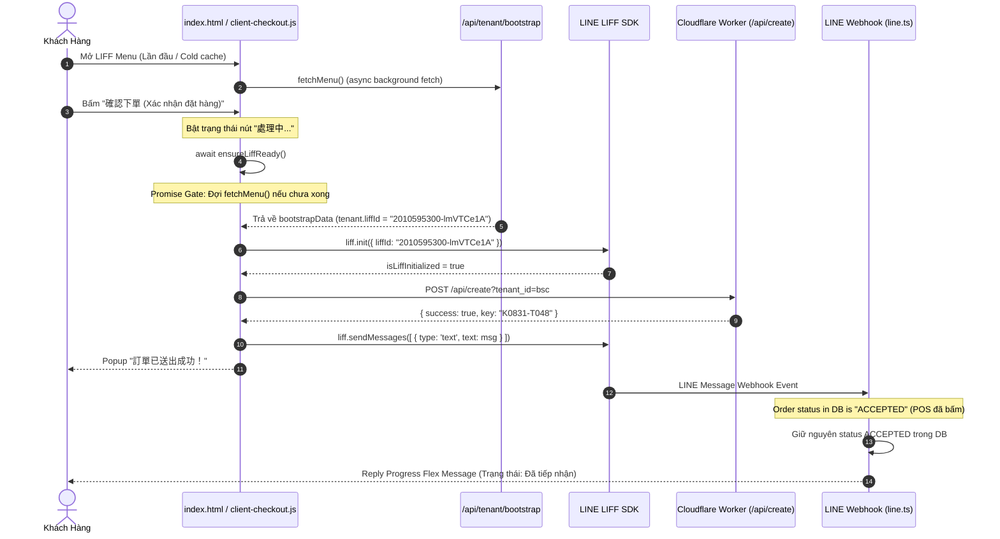

# PDP: Multi-Tenant LIFF Initialization Lifecycle & Webhook Progress Synchronization Fix

**Author**: Principal Engineer  
**Status**: Proposed / Review Ready  
**Date**: 2026-08-31  
**Target Systems**: Client Menu App (`index.html`, `js/client-checkout.js`), Backend Worker (`benmi-worker-official/src/modules/line.ts`)

---

## 1. Executive Summary & Objectives

### 1.1 Problem Statement
On 2026-08-31, store merchants (specifically `bsc` / 干城鹹水雞) reported that when first-time customers add the store on LINE and place an order:
1. The order arrives at the POS dashboard successfully via `POST /api/create`, but **no order confirmation message or progress Flex Message appears in the customer's LINE chat**.
2. Investigation revealed two compounding root causes:
   - **Client-Side Mismatch Race Condition**: On a cold visit (no `localStorage` cache), `ensureLiffReady()` in `index.html` failed to wait deterministically for the bootstrap payload, falling back to Benmi's default `liffId` (`2009560906-c5taZfiY`) instead of the tenant's actual `liffId` (`2010595300-lmVTCe1A`). When `liff.init()` executed with a mismatched LIFF ID inside BSC's LINE in-app webview, the LINE LIFF SDK threw a silent mismatch error, disabling `liff.sendMessages()` for the rest of the session.
   - **Server-Side Webhook Race Condition**: When POS staff accept an incoming order rapidly (e.g. status changed from `NEW` to `ACCEPTED` in < 7 seconds, as observed with customer Fundak), the subsequent LINE webhook event triggered by `liff.sendMessages()` found `existingOrder.status !== 'NEW'` in [line.ts: L1707](file:///Users/duccao/Documents/benmi-order/benmi-worker-official/src/modules/line.ts#L1707) and exited immediately (`continue`), abandoning the customer's Progress Flex confirmation card.

### 1.2 Goals (In-Scope)
- **100% Zero-Hardcoding Multi-Tenant LIFF Resolution**: `ensureLiffReady()` must dynamically resolve the tenant's exact `liffId` from bootstrap data without hardcoding any tenant registry in `index.html`.
- **Deterministic Singleton Async Gate**: When a customer clicks "Confirm Order" (`submitOrder()`), the client must guarantee that bootstrap data is resolved and `liff.init({ liffId })` completes before dispatching order payloads.
- **Graceful Timeout & Cart Protection**: If network connectivity is degraded, the client will enforce a 10–12s timeout ceiling, show a clear user prompt, and unlock the submit button while preserving 100% of the shopping cart.
- **Race-Condition-Free Webhook Progress Delivery**: When the LINE webhook receives the order message from a client, it must send the Progress Flex card (reflecting the current order status: `NEW`, `ACCEPTED`, `DONE`, etc.) without overwriting DB states.

### 1.3 Non-Goals (Out-of-Scope)
- Modifying POS order status transitions or POS sound alerts.
- Changing LINE rich menu configurations or LINE Messaging API token credentials in D1.
- Using paid push messages (`pushLineMessage`) for normal mobile LIFF orders (to preserve 100% free reply quota).

---

## 2. Context & Current Architecture

The ordering flow operates across three interacting layers:

```mermaid
graph TD
    User[Khách Hàng - LINE LIFF] -->|1. Tap Menu Link| Index[index.html / ensureLiffReady]
    Index -->|2. GET /api/tenant/bootstrap| BootstrapAPI[Worker: bootstrap.ts]
    BootstrapAPI -->|D1 / KV Cache| TenantConfig[(tenant_config)]
    Index -->|3. liff.init({ liffId })| LiffSDK[LINE LIFF SDK]
    Index -->|4. POST /api/create| CreateAPI[Worker: orders.ts]
    CreateAPI -->|Atomic Key Generation| D1[(D1 Database: orders)]
    Index -->|5. liff.sendMessages(msg)| LineChat[LINE 1-on-1 Chat]
    LineChat -->|6. Webhook Event| LineWebhook[Worker: line.ts]
    LineWebhook -->|7. Reply Progress Flex| LineChat
```

### Current Bottlenecks:
1. **[index.html: L1569](file:///Users/duccao/Documents/benmi-order/index.html#L1569)**:
   ```javascript
   const defaultLiffId = isDevEnv ? "2011224566-kLLdMjkq" : (isStagingEnv ? "2009555608-DMioljsI" : "2009560906-c5taZfiY");
   if (!liffId) liffId = defaultLiffId; // FATAL: Overrides non-Benmi tenants with Benmi's LIFF ID!
   ```
2. **[benmi-worker-official/src/modules/line.ts: L1707](file:///Users/duccao/Documents/benmi-order/benmi-worker-official/src/modules/line.ts#L1707)**:
   ```typescript
   if (existingOrder.status !== "NEW") {
       console.log(`[${brandName}] Order ${orderKey} already processed... Skipping webhook re-creation.`);
       continue; // FATAL: Skips sending replyLineFlexMessage!
   }
   ```

---

## 3. Proposed Architecture

### 3.1 Bulletproof Dynamic LIFF Resolution Gate



### 3.2 Key Technical Specifications

#### A. `ensureLiffReady()` Dynamic Resolution Gate (`index.html`)
- **Eliminate Static Default Fallback**: If `tenantId !== 'benmi'`, never fallback to Benmi's LIFF ID.
- **Promise Reusability & Error Reset**: If `liff.init()` fails, reset `liffInitPromise = null` so subsequent checkout attempts can re-attempt initialization without getting stuck.
- **Resolution Order**:
  1. In-memory `storeConfig.liffId` / `bootstrapData.tenant.liffId`.
  2. `localStorage.getItem('tenant_bootstrap_' + tenantId)`.
  3. URL search parameters (`liffClientId` / `liff_id`).
  4. Active await on `window.menuPromise` / `fetchMenu()`.
  5. Default fallback **only if `tenantId === 'benmi'`**.

#### B. Resilient Webhook Message Handler (`benmi-worker-official/src/modules/line.ts`)
- When `userText.includes("訂單編號：") && userText.includes("📦 訂單內容：")`:
  - Check if `existingOrder` exists in D1.
  - If `existingOrder.status !== 'NEW'`:
    - **Do NOT overwrite status in D1**.
    - Clean up `pending_actions` and `draftKey`.
    - **Proceed to send `buildProgressFlexMessage`** with `existingOrder` and current `queueAhead` count via `replyToken`.

---

## 4. Migration & Rollout Strategy

### 4.1 Zero-Downtime Hotfix Deployment
1. **Step 1: Backend Deployment**:
   - Update `line.ts` webhook handler to deliver Progress Flex messages for already-processed orders.
   - Deploy backend worker: `npx wrangler deploy`.
   - *Impact*: Immediate zero-downtime fix for server-side race conditions.
2. **Step 2: Frontend Asset Version Bump**:
   - Update `index.html` and `js/client-checkout.js` with version hashes (e.g. `?v=20260831_liff_resilience_1`).
   - Push to repository. Cloudflare Pages auto-deploys frontend assets.
   - *Impact*: Eliminates stale browser caches on client mobile devices.

### 4.2 Rollback Plan
- **Backend**: `git revert` backend commit & `npx wrangler deploy`.
- **Frontend**: `git revert` frontend commit & git push.

---

## 5. Alternatives Considered & Trade-offs

| Alternative | Description | Pros | Cons | Decision |
| :--- | :--- | :--- | :--- | :--- |
| **Alternative A: Hardcode `TENANT_LIFF_IDS` Map in `index.html`** | Embed dictionary of tenant IDs to LIFF IDs in HTML. | Zero latency on cold load. | **Violates Rule 2.A (Zero Hardcoding)**; requires code deploy for every new tenant. | **REJECTED** |
| **Alternative B: Always Push Flex Message from Server on `/api/create`** | Server unconditionally sends Push Flex for both Mobile and Desktop. | Guarantees message delivery regardless of client state. | **Consumes Push Message Quota**; causes duplicate messages when `liff.sendMessages` succeeds. | **REJECTED** |
| **Proposed: Dynamic LIFF Gate + Resilient Webhook Reply** | Wait for dynamic bootstrap `liffId` + Webhook reply on any order status. | **100% Schema-driven, 0 Push Quota wasted, Zero duplicate messages**. | Requires ~200-400ms background bootstrap resolution on first cold load. | **SELECTED (Optimal)** |

---

## 6. Step-by-Step Execution Plan

- [ ] **Phase 1: Backend Webhook Fix (`benmi-worker-official/src/modules/line.ts`)**
  - Modify `handleLineWebhook` around L1707: when `existingOrder.status !== 'NEW'`, execute `replyLineFlexMessage` before `continue`.
  - Validate TypeScript compilation (`npx tsc --noEmit`).
- [ ] **Phase 2: Frontend LIFF Gate Fix (`index.html`)**
  - Refactor `ensureLiffReady()` to resolve tenant `liffId` dynamically from bootstrap.
  - Remove indiscriminate `defaultLiffId` fallback for non-benmi tenants.
  - Reset `liffInitPromise` on error to allow clean retries.
- [ ] **Phase 3: Client Checkout Robustness (`js/client-checkout.js`)**
  - Increase submit timeout to 12s.
  - Ensure submit button properly re-enables and preserves cart on any caught network exceptions.
- [ ] **Phase 4: Deployment & Live Verification**
  - Deploy worker to production.
  - Test live order flow on store `bsc` via LINE LIFF.

---

## 7. Verification & Test Plan

### Automated Verification
```bash
# Verify Worker TypeScript type check
cd benmi-worker-official && npx tsc --noEmit
```

### Manual Verification Matrix
1. **Cold-Start LIFF Initialization Test**:
   - Clear browser cache / open BSC LIFF menu URL directly in private tab.
   - Verify console logs: `[LIFF] Initialized successfully for tenant [bsc] with ID: 2010595300-lmVTCe1A`.
   - Verify NO `LIFF ID mismatch error` occurs.
2. **Fast-Accept Race Condition Webhook Test**:
   - Place an order on BSC via mobile LINE.
   - Immediately accept the order on POS (`ACCEPTED`).
   - Verify the customer receives the Progress Flex Message in LINE chat with status "已接單 / 製作中".
3. **Desktop Fallback Verification**:
   - Place order from Desktop browser.
   - Verify Desktop Push Flex Message continues to work as expected.
