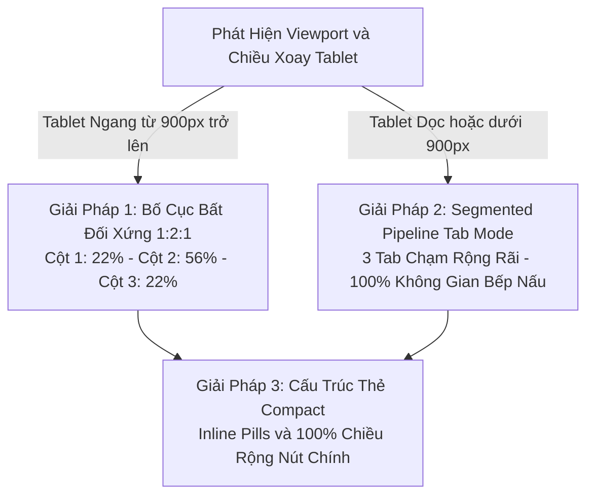

# PDP: Adaptive Compact KDS & Real-Time Live Orders Architecture

- **Trạng thái**: Proposed / Revised Architecture Review
- **Tác giả**: Principal UI/UX & System Architect
- **Dự án**: Benmi Multi-Tenant Order Platform
- **Tài liệu**: `docs/proposals/live_orders_kds_redesign/pdp_ui_ux_design.md`
- **Mục tiêu**: Thiết kế hệ thống **KDS Thích Ứng Màn Hình Hẹp (Adaptive Compact KDS - Kitchen Display & Expediter System)** cho tab **"Trực tiếp" (Live Orders)** trên POS Dashboard (`orders.html`). Giải quyết triệt để vấn đề "bóp nghẹt chiều ngang" và "thẻ kéo dài vô tận" trên các dòng máy tính bảng quầy ăn F&B thực tế (Sunmi D2/T2 mini, iPad mini, Galaxy Tab 8–10 inch, tablet đặt dọc 768px–1024px).

---

## 1. Phân Tích Thực Địa & Các Điểm Gãy Của KDS 3 Cột Tĩnh

### A. Giả Định Sai Lầm Khi Áp Dụng Lý Thuyết KDS Desktop Vào Quán Ăn Vừa & Nhỏ
Nhiều hệ thống KDS lớn tại Mỹ (như Toast, Square KDS) được thiết kế cho màn hình treo tường chuyên dụng cỡ lớn (21–24 inch widescreen, 1920x1080). Tuy nhiên, trên thực tế tại thị trường F&B vừa và nhỏ (quán gà muối 鹹水雞, tiệm bánh mì, trà sữa, quầy ăn đêm):
- Không gian quầy cực kỳ chật hẹp, quầy thu ngân kiêm bàn chế biến.
- Thiết bị phổ biến nhất là **Tablet 8–10 inch** (iPad Mini, Galaxy Tab A/Active, Sunmi D2/T2 mini).
- Độ phân giải CSS hiệu dụng (Viewport Width) rất hạn chế: chỉ từ **768px đến 1024px** (nếu đặt ngang) hoặc chỉ **600px đến 800px** (nếu đặt dọc).

### B. Ba Điểm Gãy (Fatal Bottlenecks) Khi Ép 3 Cột Bằng Nhau (33% - 33% - 33%)

```
┌────────────────────────┬────────────────────────┬────────────────────────┐
│   CỘT 1: CHỜ DUYỆT     │    CỘT 2: BẾP NẤU      │    CỘT 3: CHỜ GIAO     │
│       (~300px)         │        (~300px)        │        (~300px)        │
│ [Thao tác 5 giây]      │ [Bếp nấu cần diện tích]│ [Đã xong, chỉ cần mã]  │
│  => LÃNG PHÍ 33% DIỆN  │ => BỊ BÓP NGHẸT, GÃY   │ => LÃNG PHÍ 33% DIỆN   │
│     TÍCH MÀN HÌNH      │    CHỮ, BẤM NHẦM NÚT   │    TÍCH MÀN HÌNH       │
└────────────────────────┴────────────────────────┴────────────────────────┘
```

1. **Chiều Ngang Bị Bóp Nghẹt (Column Cramping & Fat-Finger Risk)**:
   - Với tablet ngang 1024px (trừ viền còn ~980px), chia 3 cột đều nhau khiến mỗi cột chỉ còn **310px - 320px**. Nếu đặt tablet dọc (768px), mỗi cột chỉ còn **~240px**.
   - Tại bề rộng 240px–310px, việc nhồi nhét: Checkbox 36px + Tên món dài + Giá tiền + Tùy chọn khẩu vị làm phát sinh hiện tượng **gãy dòng hàng loạt**.
   - Các nút bấm kép ở chân thẻ như `[ 🖨️ In Tem ] [ ✓ LÀM XONG ]` bị ép sát nhau. Nhân viên thao tác bằng một ngón tay, tay ướt hoặc đeo găng tay nilon sẽ **rất dễ bấm nhầm (Fat-finger problem)**.

2. **Thẻ Bị Kéo Dài Vô Tận Theo Chiều Dọc (Vertical Ballooning)**:
   - Khi nhồi nhét Header + Countdown pill + Warning strip khẩu vị + Micro-checklist từng món kèm các dòng thụt lề `↳` + Ghi chú + Footer nút bấm, chiều cao mỗi thẻ tăng vọt lên **350px – 450px**.
   - Màn hình tablet (chiều cao 600px – 768px) chỉ hiển thị được **vỏn vẹn 1 đến 1.5 thẻ mỗi cột**.
   - Hậu quả: Nhân viên liên tục phải cuộn lên/xuống giữa 3 cột độc lập để tìm đơn, làm tăng thao tác tay và gây ức chế thần kinh trong giờ cao điểm.

3. **Lãng Phí Diện Tích Nghiêm Trọng Tại Cột 1 và Cột 3**:
   - **Cột 1 (Cần tiếp nhận - `NEW`)**: Vòng đời đơn ở đây chỉ tồn tại 5–15 giây. Nhân viên chỉ cần nhìn lướt mã đơn, số lượng món và bấm "Nhận". Không cần diện tích rộng.
   - **Cột 3 (Sẵn sàng / Chờ lấy - `DONE`)**: Món đã chế biến xong và đóng túi. Thu ngân chỉ cần thấy Mã đơn thật to (20px) và Tên khách để gọi trả hàng. Không cần checklist món hay chi tiết gia vị.
   - **Cột 2 (Bếp nấu - `ACCEPTED`)**: Nơi đầu bếp cần thao tác liên tục, đọc rõ từng món, kiểm tra từng khẩu vị đặc biệt và tick checklist lại bị ép nghẹt chỉ với 33% diện tích.

---

## 2. Kiến Trúc Cải Tiến: "Adaptive Compact KDS"

Để bảo đảm hoạt động hoàn hảo trên mọi kích thước màn hình từ tablet nhỏ 8 inch đến tablet 12 inch và PC, hệ thống áp dụng bộ 3 giải pháp công thái học:



---

### Giải Pháp 1: Bố Cục Bất Đối Xứng 1:2:1 (Asymmetric Flex Layout cho Tablet Ngang $\ge 900$px)

Thay vì chia đều 3 cột tĩnh, hệ thống phân bổ tỷ lệ động theo đúng trọng số vận hành thực tế:

```
┌──────────────┬──────────────────────────────────────────┬──────────────┐
│  TIẾP NHẬN   │            BẾP ĐANG CHẾ BIẾN             │   CHỜ GIAO   │
│    (22%)     │                  (56%)                   │    (22%)     │
│ [Dạng Mini]  │   [Thẻ Chi Tiết Món + Checklist Rộng Rãi]│ [Dạng Mini]  │
├──────────────┼──────────────────────────────────────────┼──────────────┤
│ ┌──────────┐ │ ┌──────────────────────────────────────┐ │ ┌──────────┐ │
│ │#K0826    │ │ │#K0823 · Bàn 2             ⏱️ Còn 8p   │ │ │#K0819    │ │
│ │Anh Tuấn  │ │ │👤 Chị Lan · 0912***456     (12:30 Hẹn)│ │ │Chị Mai   │ │
│ │2 món     │ │ ├──────────────────────────────────────┤ │ │3 món·$210│ │
│ │12:45 Hẹn │ │ │🧂 KHẨU VỊ: 特調胡椒 · 正常 · 小辣     │ │ │MÃ LỚN:   │ │
│ ├──────────┤ │ ├──────────────────────────────────────┤ │ │   K0819  │ │
│ │[  NHẬN ] │ │ │[x] 1x Gà muối (Chặt miếng) [Không hành]│ │ ├──────────┤ │
│ └──────────┘ │ │[ ] 2x Trứng cút ngũ vị        [Ít muối]│ │ │[ ĐÃ GIAO]│ │
│              │ │💬 "Cho thêm đũa và tương ớt"           │ │ └──────────┘ │
│              │ ├──────────────────────────────────────┤ │              │
│              │ │[       ✓ CHUẨN BỊ XONG (44px)       ]│ │              │
│              │ └──────────────────────────────────────┘ │              │
└──────────────┴──────────────────────────────────────────┴──────────────┘
```

1. **Cột 1: Cần Tiếp Nhận (22% bề rộng, ~210px - 230px)**:
   - Dạng **Compact Drawer / Queue**.
   - Thẻ siêu tinh gọn: Chỉ hiển thị Mã đơn, Tên khách, Số lượng món, Giờ hẹn và nút `TIẾP NHẬN` to rõ.
   - Thao tác 1 chạm duyệt ngay lập tức, đẩy đơn sang Cột 2.
2. **Cột 2: Bếp Đang Chế Biến (56% bề rộng, ~520px - 580px)**:
   - **Trọng tâm của toàn bộ màn hình**: Chiếm hơn một nửa diện tích hiển thị.
   - Thẻ đơn hàng mở rộng tối đa: Checkbox chạm 36px, tên món to 16px, tùy chọn khẩu vị nổi bật, văn bản không bao giờ bị gãy dòng.
   - Bếp có thể quan sát 2–3 thẻ chi tiết cùng lúc mà không cần căng mắt đọc chữ nhét.
3. **Cột 3: Chờ Giao & Thu Ngân (22% bề rộng, ~210px - 230px)**:
   - Dạng **Compact Pickup Queue**.
   - Nhấn mạnh số hiệu đơn hàng: Mã đơn hiển thị font Monospace kích thước **20px Bold** để thu ngân đọc nhanh khi khách bước đến quầy.
   - Nút hành động duy nhất: `ĐÃ GIAO` (hoặc `THANH TOÁN`).

---

### Giải Pháp 2: Segmented Pipeline Mode (Cho Tablet Nhỏ $< 900$px hoặc Tablet Xoay Dọc)

Khi hệ thống phát hiện màn hình có chiều ngang $< 900$px (hoặc nhân viên xoay dọc máy tính bảng 768x1024):
- Tự động chuyển từ dạng 3 cột sang **Pipeline Tab Trượt Công Thái Học (Single-Station Focus)**.
- Đỉnh màn hình bố trí 3 Tab cảm ứng cực lớn:

```
+----------------------------------------------------------------------------------------------------+
| [  🔔 CẦN DUYỆT (2)  ]   |   [  🍳 ĐANG NẤU (5) ★  ]   |   [  🛍️ CHỜ GIAO (3)  ]                    |
+----------------------------------------------------------------------------------------------------+
| 🔪 TỔNG HỢP NGUYÊN LIỆU ĐANG NẤU (5 đơn): [ 🍗 Gà: 4 ] [ 🥒 Dưa: 6 ] [ 🥚 Trứng: 10 ]              |
+----------------------------------------------------------------------------------------------------+
|  TRẠM ĐANG NẤU CHIẾM TRỌN 100% KHÔNG GIAN MÀN HÌNH (RỘNG 768px):                                   |
|                                                                                                    |
| ┌────────────────────────────────────────────────────────────────────────────────────────────────┐ │
| │ #K0823 · Bàn 2                                                    ⏱️ Còn 8 phút (12:30 Hẹn lấy)│ │
| │ 👤 Chị Lan · 0912***456                                              [ Mang đi ] [ In Tem 🖨️ ] │ │
| ├────────────────────────────────────────────────────────────────────────────────────────────────┤ │
| │ 🧂 KHẨU VỊ: 特調胡椒 · 正常 · 小辣                                                             │ │
| ├────────────────────────────────────────────────────────────────────────────────────────────────┤ │
| │ [x] 1x Gà muối nửa con (xé phay)  [Tag: Không hành] [Tag: Chặt miếng]                      $180│ │
| │ [ ] 2x Trứng cút ngũ vị            [Tag: Ít muối]                                            $60│ │
| ├────────────────────────────────────────────────────────────────────────────────────────────────┤ │
| │ 💬 Ghi chú: "Cho thêm đũa và tương ớt"                                                         │ │
| ├────────────────────────────────────────────────────────────────────────────────────────────────┤ │
| │ [                               ✓ CHUẨN BỊ XONG (Chiều cao 48px)                             ] │ │
| └────────────────────────────────────────────────────────────────────────────────────────────────┘ │
+----------------------------------------------------------------------------------------------------+
```

- **Lợi ích vận hành**:
  - **Tập trung 100% diện tích (Single-Station Focus)**: Đầu bếp dành trọn vẹn bề rộng 768px cho trạm nấu, thẻ to rõ ràng, chữ sắc nét, đọc cực nhanh từ khoảng cách 1 mét.
  - **Chuyển trạm bằng 1 chạm hoặc quẹt ngang (Swipe gesture)**: Dễ dàng chuyển giữa `Đang nấu` và `Chờ lấy`.
  - **Cảnh báo không xâm lấn (Non-intrusive Alerts)**: Khi có đơn mới nổ vào Cột 1, Tab `[ 🔔 Cần duyệt ]` sẽ **nhấp nháy viền đỏ cam và rung chuông nhẹ**, thông báo cho nhân viên biết mà không làm gián đoạn màn hình đang nấu của bếp.

---

### Giải Pháp 3: Cấu Trúc Thẻ Rút Gọn (Compact Card Anatomy)

Để triệt tiêu hiện tượng thẻ bị phình dài theo chiều dọc (Vertical Ballooning) và nguy cơ bấm nhầm (Fat-finger):

```
┌─────────────────────────────────────────────────────────────────────────┐
│ [Takeaway Pill]  #K0826-GXEQ                ⏱️ Còn 8p   [ 🖨️ In Tem ]    │ <- Icon in thu nhỏ góc trên
│ 👤 Chị Lan · 0912***456                    (12:30 Hẹn)                  │
├─────────────────────────────────────────────────────────────────────────┤
│ 🧂 KHẨU VỊ: 特調胡椒 · 正常 · 小辣                                       │ <- Dòng vị nổi bật
├─────────────────────────────────────────────────────────────────────────┤
│ [x] 1x Gà muối nửa con    [Không hành] [Chặt miếng]                $180 │ <- Tùy biến dạng inline pills
│ [ ] 2x Trứng cút ngũ vị   [Ít muối]                                 $60 │    (Không xuống dòng ↳)
├─────────────────────────────────────────────────────────────────────────┤
│ 💬 "Cho em xin thêm đũa và tương ớt"                                    │ <- Ghi chú (nếu có)
├─────────────────────────────────────────────────────────────────────────┤
│ [                     ✓ CHUẨN BỊ XONG (100% Đáy Thẻ)                  ] │ <- 1 nút bấm duy nhất chiếm 100%
└─────────────────────────────────────────────────────────────────────────┘
```

1. **Gom Dòng Tùy Biến Thành Inline Pills (Triệt Tiêu Thụt Lề `↳`)**:
   - Trước đây: Mỗi tùy chọn xuống 1 dòng riêng kèm ký tự `↳`, đơn 3 món có thể mất tới 8–10 dòng text.
   - Thiết kế mới: Tùy biến ngắn được gói gọn thành các **Tag Badge nhỏ (`inline pills`)** nằm ngay bên cạnh hoặc ngay dưới tên món. Thẻ đơn co lại gọn gàng, giảm 40% chiều cao thừa.
2. **Duy Nhất 1 Nút Hành Động Chiếm 100% Chiều Rộng Đáy Thẻ**:
   - Mặt đáy thẻ chỉ chứa **DUY NHẤT 1 nút bấm lớn** (`44px - 48px`), bo góc chuẩn, trải dài từ cạnh trái sang cạnh phải.
   - Loại bỏ hoàn toàn bố cục chia đôi `[ In Tem ] [ Xong ]`. Nguy cơ bấm nhầm giảm về 0%.
3. **Đưa Thao Tác Phụ Thành Icon Tinh Gọn Trên Header**:
   - Nút `In lại tem` hoặc `In bill` chuyển thành icon SVG vector nét mảnh nằm gọn ở góc phải Header thẻ. 
   - Đầu bếp chỉ cần quan tâm nút to nhất dưới đáy: **NẤU XONG BẤM 1 CHẠM**.

---

## 3. Bảng So Sánh Hai Hướng Tiếp Cận

| Tiêu Chí So Sánh | KDS 3 Cột Tĩnh Cố Định (Lý Thuyết) | Adaptive Compact KDS (Đề Xuất Mới) |
| :--- | :--- | :--- |
| **Phù hợp thiết bị** | Màn hình PC / Desktop lớn ($\ge 21$ inch ngang). | **Tối ưu 100% tablet 8–10 inch, Sunmi, iPad Mini**. |
| **Bề rộng cột Bếp nấu** | Bị ép nghẹt (~240px – 310px), dễ gãy chữ. | **Rộng rãi (~480px – 580px)** hoặc **100% màn hình**. |
| **Chiều cao thẻ đơn** | Kéo dài 350px – 450px do thụt lề nhiều dòng. | **Thu gọn 200px – 260px** nhờ gom Inline Pills. |
| **Số thẻ nhìn thấy cùng lúc** | Chỉ 1 – 1.5 thẻ mỗi cột (phải cuộn liên tục). | **3 – 4 thẻ hiển thị cùng lúc** trên 1 khung nhìn. |
| **Nguy cơ bấm nhầm nút** | Cao (Do chia đôi 2 nút bấm ở đáy thẻ hẹp). | **Triệt tiêu về 0%** (Nút chính chiếm 100% đáy thẻ). |
| **Khi đặt tablet dọc** | 3 cột vỡ nát layout, chữ chồng lấn. | **Tự chuyển sang Segmented Pipeline Tabs mượt mà**. |
| **Công thái học thao tác** | Mất tập trung do mắt phải đảo đều 3 cột hẹp. | **Tập trung cao độ vào trạm bếp đang nấu**. |

---

## 4. Thanh Gom Món Bếp (Mise en place Aggregator)

Nguyên lý gom món chuẩn bếp chuyên nghiệp được tích hợp tinh gọn ngay dưới thanh lọc:

```
┌────────────────────────────────────────────────────────────────────────────────────────┐
│ 🔪 TỔNG HỢP NGUYÊN LIỆU ĐANG NẤU (3 đơn):                                              │
│ [ 🍗 Gà muối: 3 phần ]  [ 🥒 Dưa chuột: 4 ]  [ 🥚 Trứng cút: 6 ]  [ 鸭 Tiết vịt: 2 ]    │
└────────────────────────────────────────────────────────────────────────────────────────┘
```

- **Logic tính toán thời gian thực**:
  - Quét toàn bộ danh sách đơn hàng đang ở Trạm 2 (`ACCEPTED`).
  - Sử dụng `PrinterService.parseOrderItems(order)` bóc tách danh sách món và số lượng.
  - Tổng hợp thành bảng đếm `Map<ItemName, TotalQuantity>`.
  - Render thanh cuộn ngang nén (Horizontal Chip Bar) hiển thị các món có số lượng nhiều nhất.
- **Giá trị thực tế**: Đầu bếp nhìn lên thanh gom món: thấy cần 4 phần dưa chuột $\rightarrow$ chuẩn bị 1 lần cho cả 3 đơn, tiết kiệm 50% thời gian chế biến.

---

## 5. Bản Đồ Khẩn Cấp Thị Giác (Temporal Visual Urgency Spectrum)

Đồng hồ đếm ngược động (Dynamic Countdown Ticker) tự động cập nhật mỗi 30 giây mà không reload trang:

| Mức Độ Khẩn Cấp | Thời Gian Còn Lại | Màu Sắc Nhận Diện | Hiệu Ứng Trực Quan |
| :--- | :--- | :--- | :--- |
| **Bình thường (Calm)** | $> 10$ phút | Xanh lục nhạt (`#ecfdf5` / `#047857`) | Viền mỏng thanh lịch |
| **Cần chú ý (Warning)** | $5 - 10$ phút | Vàng hổ phách (`#fffbeb` / `#b45309`) | Viền đậm 1.5px |
| **Gấp / Sắp trễ (Urgent)** | $< 5$ phút | Cam đậm (`#fff7ed` / `#c2410c`) | Viền cam 2px, nhãn in đậm |
| **Quá hạn (Overdue / Late)** | Đã quá giờ hẹn ($< 0$p) | Đỏ thẫm (`#fef2f2` / `#b91c1c`) | **Viền đỏ nhấp nháy nhịp tim (Pulse)** |

---

## 6. Chiến Lược Responsive & Quy Chuẩn Multi-Tenant

### A. Breakpoint Cụ Thể Trong `orders.css`
```css
/* 1. Màn hình Tablet lớn và Desktop ngang (>= 900px) */
@media (min-width: 900px) and (orientation: landscape) {
  .live-split-kds {
    display: flex;
    gap: 12px;
  }
  .kds-col-pending { flex: 0 0 22%; max-width: 22%; }
  .kds-col-cooking { flex: 1 1 56%; }
  .kds-col-ready   { flex: 0 0 22%; max-width: 22%; }
  .kds-segmented-tabs { display: none; }
}

/* 2. Màn hình Tablet nhỏ, Tablet dọc hoặc Mobile (< 900px hoặc Portrait) */
@media (max-width: 899px), (orientation: portrait) {
  .kds-segmented-tabs { display: flex; }
  .live-split-kds { display: block; }
  .kds-col { display: none; width: 100%; }
  .kds-col.active-station { display: block; }
}
```

### B. Tuân Thủ Nghiêm Ngặt Nguyên Tắc Multi-Tenant (Không Hardcode)
- **Chuẩn I18N**: Khai báo đầy đủ key trong cả `I18N["zh-TW"]` và `I18N["vi"]`:
  - `kdsStationPending`: "待處理" / "CẦN TIẾP NHẬN"
  - `kdsStationCooking`: "製作中" / "ĐANG CHẾ BIẾN"
  - `kdsStationReady`: "待取餐" / "CHỜ BÀN GIAO"
  - `kdsBatchSummary`: "備料總攬" / "TỔNG HỢP NGUYÊN LIỆU"
  - `kdsActionAccept`: "接單" / "TIẾP NHẬN"
  - `kdsActionDone`: "準備好了" / "LÀM XONG"
  - `kdsActionHandover`: "已取餐" / "ĐÃ GIAO"
- **Không hardcode tên quán**: Tất cả dữ liệu món ăn, khẩu vị đọc động từ `tenant_config` và `order_content`.

---

## 7. Kế Hoạch Triển Khai Từng Bước (Implementation Roadmap)

### Giai Đoạn 1: Cấu Trúc CSS Grid Thích Ứng & Design Tokens
- [ ] Bổ sung CSS class `.live-split-kds`, `.kds-col-pending`, `.kds-col-cooking`, `.kds-col-ready` vào `css/orders.css`.
- [ ] Bổ sung cơ chế Tab Segmented `.kds-segmented-tabs` cho chế độ màn hình dọc / hẹp.
- [ ] Khai báo Design Tokens cho các dải màu cảnh báo khẩn cấp (Xanh, Vàng, Cam, Đỏ pulse).

### Giai Đoạn 2: Render Thẻ Đơn Hàng Dạng Compact & Micro-Checklist
- [ ] Cập nhật hàm render thẻ trong `js/orders-live.js`:
  - Trạm 1: Thẻ mini tinh gọn với nút `TIẾP NHẬN` 100% chiều rộng.
  - Trạm 2: Thẻ đầy đủ với Micro-checklist chạm trực tiếp, tùy chọn hiển thị dạng Inline Pills, nút `LÀM XONG` 100% chiều rộng.
  - Trạm 3: Thẻ trả hàng với Mã đơn 20px Monospace to rõ, nút `ĐÃ GIAO` 100% chiều rộng.
- [ ] Chuyển nút in tem/in bill thành icon vector ở góc Header thẻ.

### Giai Đoạn 3: Tích Hợp Thanh Gom Món (Mise en place) & Ticker Thời Gian
- [ ] Xây dựng module `computeKitchenMiseEnPlace(orders)` tính tổng số lượng món đang nấu.
- [ ] Render thanh chip cuộn ngang ở đỉnh danh sách trạm nấu.
- [ ] Khởi tạo ticker `setInterval` 30s tự động cập nhật countdown và đổi màu cảnh báo.

### Giai Đoạn 4: Kiểm Thử Thực Địa Trên Thiết Bị Thực Tế
- [ ] Giả lập và kiểm thử trên viewport 768x1024 (iPad dọc), 1024x768 (iPad ngang), và 800x1280 (Sunmi / Android POS tablet).
- [ ] Kiểm tra khả năng bấm ngón tay trên nút 44px–48px, xác nhận không còn hiện tượng chạm nhầm.
- [ ] Chạy `npm run check` bảo đảm 0 lỗi cú pháp và không xung đột biến toàn cục.

---

## 8. Kết Luận Kiến Trúc (Architectural Sign-off)

Bản thiết kế hiệu chỉnh **Adaptive Compact KDS** khắc phục triệt để các sai lầm của mô hình KDS desktop truyền thống khi áp dụng vào môi trường quầy ăn F&B thực tế:
1. **Ưu tiên triệt để cho Trạm Nấu (56% diện tích hoặc 100% diện tích khi xoay dọc)** giúp đầu bếp thao tác thoải mái, không bị gãy dòng, không vỡ layout.
2. **Nút bấm 100% chiều rộng đáy thẻ** giải quyết dứt điểm vấn đề chạm nhầm ngón tay (Fat-finger).
3. **Thẻ thu gọn với Inline Pills** giúp hiển thị được 3–4 đơn cùng lúc, loại bỏ 70% thao tác cuộn màn hình thừa thãi.
4. **Hỗ trợ mượt mà cả 2 chiều xoay ngang và dọc** trên mọi thiết bị POS quầy từ 8 inch đến 12 inch.
