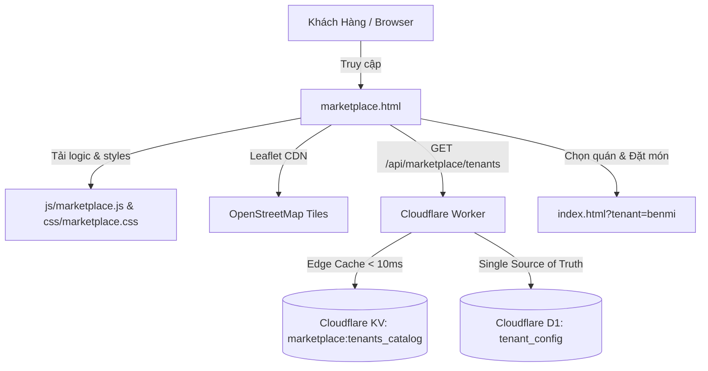

# PDP: Multi-Tenant Marketplace & Interactive Map Discovery Platform [New]

| Status | Proposed |
| :--- | :--- |
| **Author** | Principal AI Engineer |
| **Target Release** | `v2026.09.Marketplace` |
| **Affected Subsystems** | Frontend (`marketplace.html`, `css/marketplace.css`, `js/marketplace.js`), Backend Worker (`benmi-worker-official`), D1 Database (`tenant_config`), KV Edge Cache |

---

## 1. Executive Summary & Objectives

### 1.1 Problem Statement
Currently, Benmi Order is a multi-tenant platform where customers access individual store menus only via direct links (e.g. `index.html?tenant=benmi`) or store-specific LINE LIFF bots. There is no unified discovery hub where customers can browse nearby restaurants, discover dining options across different cuisines, or visually locate stores on an interactive map.

### 1.2 Goals (In-Scope)
1. **Unified Marketplace Hub (`marketplace.html`)**:
   - A fast, modern portal allowing customers to explore all active stores on the platform.
   - Dual-view interface: Responsive **List / Grid View** and synchronized **Interactive Map View**.
2. **Interactive Map Engine (Leaflet.js + OpenStreetMap)**:
   - 100% Free, lightweight (<40KB), zero third-party API keys or billing overhead.
   - Custom SVG store pins color-coded with tenant branding, showing live Open/Closed status.
   - Interactive popups with direct navigation to store ordering.
3. **GPS Geolocation & Distance Calculation**:
   - Client-side GPS "Tìm quán gần tôi / 尋找附近店家" using the Haversine formula to compute exact distance (e.g. `1.2 km`) and sort nearest stores first.
   - Quick Region/City filter pills (Tất cả, Tân Bắc / 新北, Thổ Thành / 土城, Tân Trang / 新莊, Đài Trung / 台中...).
4. **Zero-Latency Tenant Discovery API**:
   - `GET /api/marketplace/tenants`: Edge-cached endpoint returning public tenant metadata (`brand_name`, `logo_url`, `brand_color`, `store_address`, `latitude`, `longitude`, `operating_hours`, `categories_summary`, `is_active`).
   - KV Edge cache key: `marketplace:tenants_catalog` with TTL and instant invalidation on tenant update.
5. **Multi-Language (I18N)**: Full dual language support (**繁體中文 `zh-TW`** and **Tiếng Việt `vi`**).
6. **Strict Architectural Rules**: Zero hardcoded tenant IDs, commercial-safe Lucide SVG iconography only, 100% responsive for Mobile, Tablet, and Desktop.

### 1.3 Non-Goals (Out-of-Scope)
- Cross-tenant multi-cart ordering (ordering from multiple stores in a single checkout transaction). Each store checkout remains isolated under its respective `index.html?tenant=<id>`.
- Paid promotional sponsored bidding / ad placement algorithms (reserved for future enterprise tiers).

---

## 2. System Architecture & Component Interaction



---

## 3. Database Schema & Data Modeling

### 3.1 D1 Migration: Add Coordinates to `tenant_config`
Migration file: `benmi-worker-official/migrations/0007_add_coordinates_to_tenant_config.sql`:

```sql
-- Migration 0007: Add latitude and longitude to tenant_config
ALTER TABLE tenant_config ADD COLUMN latitude REAL;
ALTER TABLE tenant_config ADD COLUMN longitude REAL;
ALTER TABLE tenant_config ADD COLUMN cuisine_type TEXT DEFAULT 'vietnamese';
ALTER TABLE tenant_config ADD COLUMN is_marketplace_visible INTEGER DEFAULT 1;

CREATE INDEX IF NOT EXISTS idx_tenant_marketplace ON tenant_config(is_active, is_marketplace_visible);

-- Seed initial GPS coordinates for existing tenants
UPDATE tenant_config SET latitude = 24.970220, longitude = 121.442880, cuisine_type = 'vietnamese' WHERE tenant_id = 'benmi';
UPDATE tenant_config SET latitude = 24.985630, longitude = 121.464710, cuisine_type = 'street_food' WHERE tenant_id = 'jidangaodashu';
UPDATE tenant_config SET latitude = 24.975410, longitude = 121.543590, cuisine_type = 'street_food' WHERE tenant_id = 'zhadantongxue';
UPDATE tenant_config SET latitude = 25.025340, longitude = 121.465130, cuisine_type = 'taiwanese' WHERE tenant_id = 'weiweibao';
UPDATE tenant_config SET latitude = 24.150490, longitude = 120.633910, cuisine_type = 'taiwanese' WHERE tenant_id = 'bsc';
UPDATE tenant_config SET latitude = 25.011850, longitude = 121.428760, cuisine_type = 'vietnamese' WHERE tenant_id = '52kaoroufan';
UPDATE tenant_config SET latitude = 25.021670, longitude = 121.422340, cuisine_type = 'vietnamese' WHERE tenant_id = 'xiaolan';
UPDATE tenant_config SET latitude = 25.023810, longitude = 121.421950, cuisine_type = 'vietnamese' WHERE tenant_id = 'thuyngason';
UPDATE tenant_config SET latitude = 24.150490, longitude = 120.633910, cuisine_type = 'taiwanese' WHERE tenant_id = 'blab_demo';
```

---

## 4. Backend API Design

### 4.1 `GET /api/marketplace/tenants`
Returns all active, marketplace-visible restaurants with their public metadata.

**Response Schema (`200 OK`)**:
```json
{
  "success": true,
  "data": [
    {
      "tenantId": "benmi",
      "brandName": "Benmi 越式法國麵包",
      "brandColor": "#00b900",
      "logoUrl": "/api/image?tenant_id=benmi&name=logo.png",
      "storeAddress": "新北市土城區中央路二段135號",
      "latitude": 24.970220,
      "longitude": 121.442880,
      "operatingHours": "11:00-21:00（一到五），7:30-21:00（六日）",
      "cuisineType": "vietnamese",
      "isOpen": true,
      "deliveryPolicy": "滿 2,000 元免運...",
      "allowDineIn": false,
      "allowScheduledPickup": true
    }
  ]
}
```

---

## 5. Frontend Architecture & UI/UX Design

### 5.1 Directory & File Layout
- **`marketplace.html`**: Entry point with semantic HTML5 markup, responsive viewport, SEO tags, and OpenStreetMap/Leaflet integration.
- **`css/marketplace.css`**: Vanilla CSS adhering to modern aesthetics (glassmorphism header, responsive split-screen desktop, fluid mobile cards, smooth view-transition effects).
- **`js/marketplace.js`**: Core client logic:
  - Language switcher (`zh-TW` / `vi`).
  - Search filter (by restaurant name, address, cuisine).
  - Region quick filter pills (Tất cả, Thổ Thành, Tân Trang, Bản Kiều, Đài Trung...).
  - GPS Geolocation & Haversine distance computation.
  - Leaflet Map Controller: Custom branded markers, cluster support, interactive popups, synchronization between list card hover/click and map marker focus.
  - Store Preview Modal before navigating to `index.html?tenant=<id>`.

---

## 6. Verification & Automated Quality Assurance

1. **Static Scope Linter (`npm run check`)**:
   - `scripts/check-frontend.js` will automatically parse `marketplace.html`, validate all script tags, and assert 0 variable scope collisions.
2. **Browser Compatibility & Smoke Testing**:
   - Validate on Mobile (375px), Tablet (768px), and Desktop (1440px).
   - Test GPS permission granted vs. permission denied fallback.
   - Verify all marker clicks and modal actions smoothly redirect to `index.html?tenant=<id>`.

---

## 7. Step-by-Step Execution Plan

- [ ] **Phase 1**: Database Migration (`0007_add_coordinates_to_tenant_config.sql`) applied to `blab-db-dev`, `blab-db-test`, and `blab-db-production`.
- [ ] **Phase 2**: Worker Backend API `GET /api/marketplace/tenants` with KV Edge Caching and cache invalidation.
- [ ] **Phase 3**: Frontend Implementation (`marketplace.html`, `css/marketplace.css`, `js/marketplace.js`).
- [ ] **Phase 4**: Automated Static Check (`npm run check`) & Cross-Browser Smoke Verification.
- [ ] **Phase 5**: Multi-Environment Deployment (Dev -> Staging -> Production).
