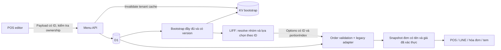

# PDP: Menu Compatibility & Customization Hardening — Fix

Ngày: 2026-09-27. Trạng thái: kế hoạch triển khai, chưa thực thi.

## 1. Mục tiêu và phạm vi

Khắc phục các lỗi trong thiết kế menu hợp nhất: tùy chỉnh theo món, tùy chỉnh danh mục, tùy chỉnh toàn đơn và combo. Bảo toàn menu của tenant đang hoạt động; POS và LIFF phải đồng nhất về lựa chọn, giá, tồn kho và thông tin trên đơn.

Thành công khi: không cập nhật chéo tenant; không mất cấu hình khi tải thiếu; phụ thu đúng từng phần; lựa chọn bắt buộc/min/max đúng; món trong combo nhận đầy đủ tùy chỉnh; kiểm thử tenant cũ và mới đều qua.

Không thuộc phạm vi: viết lại toàn bộ menu, đổi framework, chuyển toàn bộ dữ liệu cũ sang bảng mới, combo lồng nhau, thay hệ thống khuyến mãi, sửa các tài liệu người dùng đã xóa, tự triển khai production. Không tuyên bố đã QA thiết bị thật chỉ dựa trên VM.

## 2. Bối cảnh và bằng chứng

Nguồn hiện tại:

- `benmi-worker-official/src/modules/menu.ts`: lưu menu, modifier, trạng thái tồn kho.
- `benmi-worker-official/src/modules/bootstrap.ts`: dựng catalog, modifier và combo; KV cache.
- `benmi-worker-official/src/modules/bundle-rules.ts`: xác thực món thành phần và giá combo.
- `benmi-worker-official/src/modules/orders.ts`: tạo đơn, thêm món, chỉnh sửa đơn.
- `js/orders-menu.js`: POS chỉnh menu; `js/orders-bundle-wizard.js`: cấu hình combo.
- `js/client-core.js`, `js/client-customizations.js`, `js/client-bundle.js`, `js/bundle-builder-v2.js`, `js/client-cart.js`, `js/client-checkout.js`: LIFF.
- `benmi-worker-official/migrations/0061_unified_bundle_and_customization_schema.sql`: schema mới.

Review đã tái hiện cục bộ: cập nhật chéo tenant bằng ID nhóm, phụ thu riêng theo món trả về 0, nhóm multiple bắt buộc bị từ chối dù đã chọn. Các phát hiện khác được truy vết từ code, cần test tái hiện trước khi sửa. Chưa kiểm tra trạng thái migration production và chưa QA iPad/LINE thật.

## 3. Kiến trúc đề xuất

Giữ schema hiện tại và bổ sung adapter chuẩn hóa ở ranh giới đọc/ghi. Tùy chỉnh riêng theo món **cộng với** tùy chỉnh danh mục. Tùy chỉnh toàn đơn là domain riêng, không kế thừa xuống từng món. Không đổi sang cơ chế item override category trong đợt sửa này.

Thiết kế chi tiết, hợp đồng payload, từng bước và test nằm trong [spec thực thi](/Users/duccao/Documents/benmi-order/docs/specs/menu-compatibility-hardening.md). Spec này là nguồn thực thi duy nhất; không tự biến nội dung đề xuất cũ thành yêu cầu bổ sung.

## 4. Migration, rollout và rollback

1. Test local với schema cũ cộng migration 0061. Không sửa migration đã phát hành.
2. Chuẩn bị backend chấp nhận payload cũ và mới trước frontend mới.
3. Khi được yêu cầu triển khai: xác minh migrations trên đúng môi trường; áp dụng migration cần thiết trước backend, rồi frontend.
4. Version bootstrap cache để response cũ không giả làm dữ liệu đầy đủ; không xóa hàng loạt KV của các tenant.
5. QA dev → staging với ba nhóm fixture: tenant cũ, tenant cũ thêm tính năng mới, tenant mới.
6. Chỉ phát hành production trong tác vụ triển khai được người dùng giao. Chuẩn bị bản frontend/backend đã xác minh tương thích, không rollback schema bằng DROP.
7. Nếu sai giá, mất tùy chỉnh hoặc lỗi tạo đơn mới xuất hiện: dừng rollout, đưa frontend về bản tương thích đã kiểm chứng; giữ backend tương thích hai payload nếu an toàn. Không rollback về bản còn lỗi cập nhật chéo tenant. Đơn đã lưu dùng snapshot, không tính lại theo menu hiện tại.

## 5. Phương án và đánh đổi

| Phương án | Lợi ích | Hạn chế | Quyết định |
|---|---|---|---|
| Chỉ thêm option riêng theo món vào map giá theo tên | Ít code | Vẫn sai khi trùng tên, không giải quyết checkbox/validator | Không chọn |
| Chuẩn hóa ID, giữ adapter cũ và schema hiện tại | Kiểm chứng từng bước, giữ menu cũ | Cần cập nhật xuyên suốt luồng lựa chọn và snapshot | Chọn |
| Viết lại menu và migrate toàn bộ tenant | Model thống nhất | Phạm vi lớn, rủi ro cao, khó rollback | Hoãn |

## 6. Các yêu cầu xuyên suốt

- Ownership phải kiểm tra item, group và option; mọi write có ràng buộc tenant. UUID chỉ giảm va chạm, không thay authorization.
- Không tin giá, tên, group membership do client gửi. Backend resolve bằng ID trong tenant, snapshot tên/giá tại lúc đặt.
- Không log PIN, token, danh tính khách hoặc toàn bộ request. Log mã lỗi, tenant, ID đối tượng cần chẩn đoán, loại thao tác.
- Không thêm truy vấn DB cho mỗi món/portion; tải theo tenant và tập ID rồi lập map.
- Không nhân bản nhóm modifier vào mọi eligible item nếu có thể dùng map theo item ID. Đo kích thước bootstrap trước/sau; không cam kết con số độ trễ khi chưa đo.
- POS đủ vi và zh-TW, touch target tối thiểu 48px. Frontend đổi JS/CSS phải bump cache-buster trong HTML tương ứng.

## 7. Kế hoạch thực thi

Thực hiện tuần tự T0 → T1 → T2 → T3 → T4 → T5 → T6 → T7 → T8 trong spec. Không làm song song các bước cùng thay đổi hợp đồng lựa chọn. Mỗi bước có phạm vi file, test chứng minh lỗi, tiêu chí hoàn thành và checkpoint để chuyển model.

## 8. Xác minh

Spec chứa bộ fixture, ma trận hồi quy, lệnh kiểm tra và kịch bản QA. Kết quả test cũ đang fail phải được phân loại: fixture lỗi thời, assertion lỗi thời hay lỗi sản phẩm. Không skip test hoặc đổi expected chỉ để có màu xanh.
