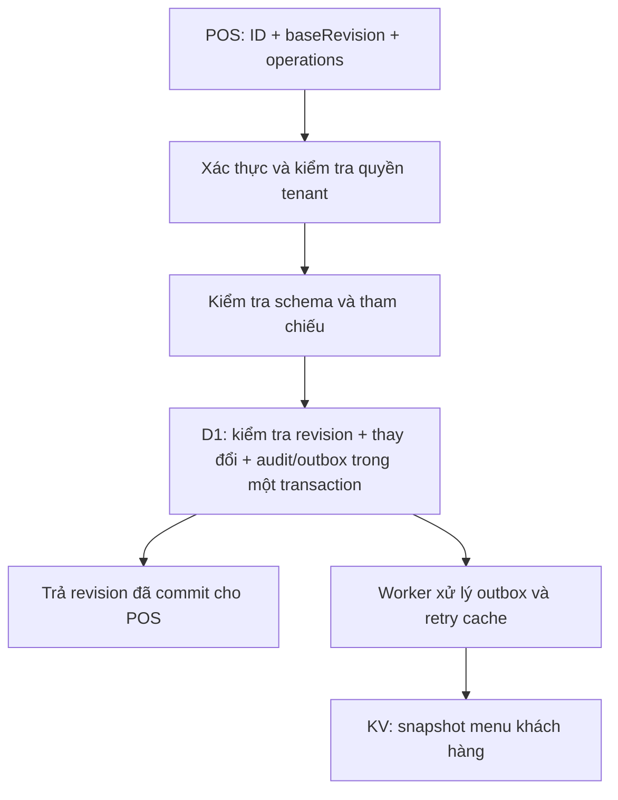

# PDP: Menu Write Integrity [Replace]

## 1. Executive Summary & Objectives

Đánh giá ngày 2026-09-10: giữ Workers + D1 làm nguồn dữ liệu chuẩn và KV phục vụ đọc menu khách hàng. Thay hợp đồng ghi menu dựa trên tên bằng thao tác theo ID, có kiểm tra quyền, phiên bản và transaction. Bản sửa batch hiện tại là hotfix cần thiết, chưa giải quyết các vấn đề này.

Mục tiêu: không mất cập nhật đồng thời; đổi tên không đổi ID; thao tác lỗi không ghi một phần; mọi thao tác chỉ tác động tenant được cấp quyền; cache lỗi không làm kết quả commit trở nên mơ hồ.

Ngoài phạm vi: viết lại toàn bộ POS, đổi nhà cung cấp database, cộng tác chỉnh sửa thời gian thực. Đây là đề xuất, chưa triển khai API/schema mới.

## 2. Context & Current Architecture

- `js/orders-menu.js:48`: đọc bootstrap; giữ slug danh mục nhưng bỏ ID món.
- `js/orders-menu.js:572`: gửi toàn bộ menu dưới dạng object theo slug/tên món. Hai món cùng tên trong một danh mục ghi đè nhau trong object.
- `benmi-worker-official/src/modules/menu.ts:233`: đối chiếu theo category ID + tên, sinh ID từ chuỗi và xóa những bản ghi vắng mặt trong payload.
- Đổi tên món có thể tạo bản ghi mới rồi xóa bản ghi cũ, mất description/out_of_stock_until; ảnh cũng đang tra theo tên trong bootstrap. Bổ sung itemIdMap theo ID chưa có tác dụng vì lookup vẫn dùng category ID + tên.
- Hai phiên POS đọc cùng menu, lần lượt lưu toàn bộ sẽ ghi đè thay đổi của nhau. Transaction không thay thế kiểm tra phiên bản.
- Payload không được kiểm tra schema đầy đủ; giá không hợp lệ có thể bị bỏ qua rồi món cũ bị coi là cần xóa. `{}` hiện là yêu cầu xóa toàn bộ.
- `src/index.ts:69` gọi updateMenu trực tiếp; resolveTenantContext không xác thực người dùng. Trong mã được kiểm tra chưa có kiểm tra session/quyền cho route này. Chưa xác minh lớp bảo vệ bên ngoài production.
- Sau D1 commit, lỗi xóa menu cache trả lỗi chung; lỗi invalidation bootstrap bị nuốt. Request đọc cũ còn có thể ghi cache sau invalidation.

Đề xuất cũ trong `docs/proposals/menu_proposal/PROPOSAL.md` đã chọn đúng D1 và upsert để giữ trạng thái, nhưng dùng tên làm danh tính chỉ giữ được trạng thái khi tên không đổi.

## 3. Proposed Architecture

### Hợp đồng dữ liệu

- Giữ ID hiện hữu; món/danh mục mới dùng ID độc lập với tên/slug. Không cần đổi tất cả ID cũ sang UUID.
- GET `/api/menu/editor` có xác thực, đọc D1 nhất quán và trả revision, categories/items với ID và các trường editor quản lý. Không dùng dữ liệu fallback để dựng bản ghi đầy đủ cho editor.
- POST `/api/menu/changes` nhận `{baseRevision, requestId, operations}`. Ví dụ operation: `{type: "updateItem", id: "existing-id", changes: {name: "Tên mới", price: 60}}`.
- Create, update, delete, reorder là thao tác rõ ràng. Vắng mặt trong payload không đồng nghĩa xóa. Không cho update sửa tenant_id; kiểm tra ownership cả item, category đích và modifier.
- Trường không thuộc thao tác giữ nguyên: đổi tên/giá không reset stock, ảnh, mô tả. Chuyển ảnh sang tham chiếu item ID với adapter đọc ảnh cũ trong giai đoạn chuyển đổi.
- Validate toàn bộ trước ghi: giá hữu hạn, không âm, tên hợp lệ, loại category hợp lệ, ID trùng, quan hệ category/modifier và kích thước request. Quy định rõ có cho phép trùng tên, không để cấu trúc object quyết định ngầm.

### Transaction và xung đột

- Thêm revision theo tenant và bảng ghi requestId/kết quả để retry cùng request không áp dụng lần hai. Thêm audit/outbox cùng transaction khi menu thay đổi.
- Kiểm tra `baseRevision` và mọi mutation phải nằm trong cùng transaction. Không SELECT revision rồi mới batch không điều kiện. UPDATE revision trả 0 rows cũng không tự làm D1 rollback: triển khai guard SQL có kiểm chứng, bảo đảm revision sai thì không mutation nào chạy và trả 409.
- Một batch chứa toàn bộ thay đổi; chia tham số trong từng câu SQL. Giới hạn kích thước changeset dựa trên giới hạn D1; import cực lớn cần cơ chế staging/publish riêng nếu thực sự cần.
- Hai request cùng revision: tối đa một request thành công; request còn lại nhận 409 và POS giữ bản nháp để người dùng đối chiếu.
- Response thành công gồm revision và ID mới/các giá trị đã chuẩn hóa. Session/role phía server quyết định tenant được ghi; query parameter chỉ chọn tenant, không cấp quyền.

### Cache và kết quả lưu

- D1 commit là kết quả lưu. Trả kết quả đã commit cho POS; lỗi cache có trạng thái/log riêng, retry từ outbox bền vững. Không chỉ dùng tác vụ nền có thể mất khi request kết thúc.
- Editor cần đọc lại nhất quán từ D1; nếu bật read replication phải dùng session/bookmark hoặc đường đọc primary phù hợp.
- KV chỉ dành cho read model chấp nhận độ trễ. Có thể dùng snapshot key theo revision để tránh ghi đè snapshot mới bằng nội dung cũ; con trỏ revision lưu ở KV vẫn eventual consistent, không bảo đảm mới nhất.
- Quy định độ trễ xuất bản khách hàng chấp nhận được; endpoint tạo đơn phải kiểm tra lại dữ liệu giá/trạng thái có thẩm quyền. Nếu cần menu luôn mới ngay, đường đọc đó phải dùng nguồn nhất quán hơn KV.

## 4. Migration & Rollout Strategy

1. Giữ hotfix một batch. Thêm validation và kiểm tra quyền cùng tích hợp session POS; không vô hiệu hóa POS bằng cách thay backend auth riêng lẻ.
2. Migration bổ sung revision/request log/outbox; giữ nguyên ID và trường hiện có. Snapshot dữ liệu trước chuyển đổi.
3. Ra editor API mới và frontend giữ ID. Canary theo feature config, không hardcode tên tenant.
4. Tất cả writer còn hoạt động phải tham gia revision. Với tenant đã chuyển, chặn legacy write bằng yêu cầu tải lại/nâng cấp; không để hai giao thức ghi song song không kiểm soát.
5. Đối chiếu menu, modifier, ảnh, stock và dữ liệu không có trong editor trước khi mở rộng.

Rollback: tắt ghi editor mới và giữ đọc hoạt động khi lỗi integrity/auth xuất hiện. Không mở lại writer legacy có thể ghi đè revision. Giữ migration bổ sung; chỉ khôi phục snapshot có đối chiếu để tránh mất thay đổi hợp lệ sau rollout.

## 5. Alternatives Considered & Trade-offs

| Phương án | Ưu điểm | Hạn chế |
|---|---|---|
| Full snapshot + ID + revision | Ít thay đổi UI, phù hợp menu nhỏ | Cần schema đầy đủ và xác nhận replacement; omission vẫn nguy hiểm |
| Changeset + ID + revision (chọn) | Xóa rõ ràng, giữ trường không sửa, giảm số câu ghi | Cần frontend theo dõi thao tác và xử lý xung đột |
| Durable Object mỗi tenant | Có thể tuần tự hóa writer | Thêm vận hành, không tự sửa ID/auth/validation hoặc stale draft |

Không cần sharding hay Durable Object chỉ vì mục tiêu hàng nghìn tenant. Đo tải thực tế trước khi thêm thành phần.

## 6. Cross-Cutting Concerns

- Auth: session có hạn, quyền ghi theo tenant, chống CSRF nếu dùng cookie, rate limit. Không coi CORS hay màn hình nhập mật khẩu là authorization.
- Quan sát: requestId, tenantId, revision trước/sau, số thao tác, thời gian commit, conflict/validation/auth failures, tuổi outbox; không log mật khẩu hay toàn payload.
- Hiệu năng: ghi theo changeset, index tenant/ID phù hợp, giới hạn request, đo latency và query count. Các giá trị nghiệp vụ đọc từ cấu hình/schema.

## 7. Step-by-Step Execution Plan

- [ ] PR 1: validation + session/tenant authorization và tích hợp POS.
- [ ] PR 2: schema revision/idempotency/outbox + API changeset với transaction guard.
- [ ] PR 3: editor giữ ID, theo dõi thao tác, hiển thị conflict và kết quả chuẩn hóa.
- [ ] PR 4: cache retry, adapter ảnh, khóa legacy writer, rollout và quan sát.

## 8. Verification & Test Plan

- Đổi tên/chuyển danh mục giữ ID, ảnh, mô tả, trạng thái hết hàng.
- Hai writer cùng baseRevision: một thành công, một 409; không mất cập nhật.
- Tenant A không sửa/xóa hoặc liên kết ID của tenant B; request không session bị từ chối.
- Payload thiếu/sai, tên trùng theo chính sách, giá null/âm/không hữu hạn: không ghi một phần.
- 120+ món, xóa hơn 100 món, menu trống có chủ ý, lỗi SQL cuối batch: kiểm tra rollback và giới hạn bind.
- Retry requestId sau mất response trả kết quả cũ, không tạo món trùng.
- KV lỗi sau commit vẫn xác định được kết quả D1; outbox retry và race giữa đọc cũ/lưu mới.
- Integration trên D1 staging trước production; SQLite mô phỏng hiện tại chưa chứng minh hết hành vi D1 thực tế. Chạy typecheck/backend và `npm run check` khi thay frontend.

## References

- [D1 batch transactions](https://developers.cloudflare.com/d1/worker-api/d1-database/#batch)
- [D1 limits](https://developers.cloudflare.com/d1/platform/limits/): giới hạn tham số áp dụng mỗi câu SQL.
- [KV consistency](https://developers.cloudflare.com/kv/concepts/how-kv-works/): KV không bảo đảm đọc ngay thấy thay đổi, kể cả tại nơi ghi.
