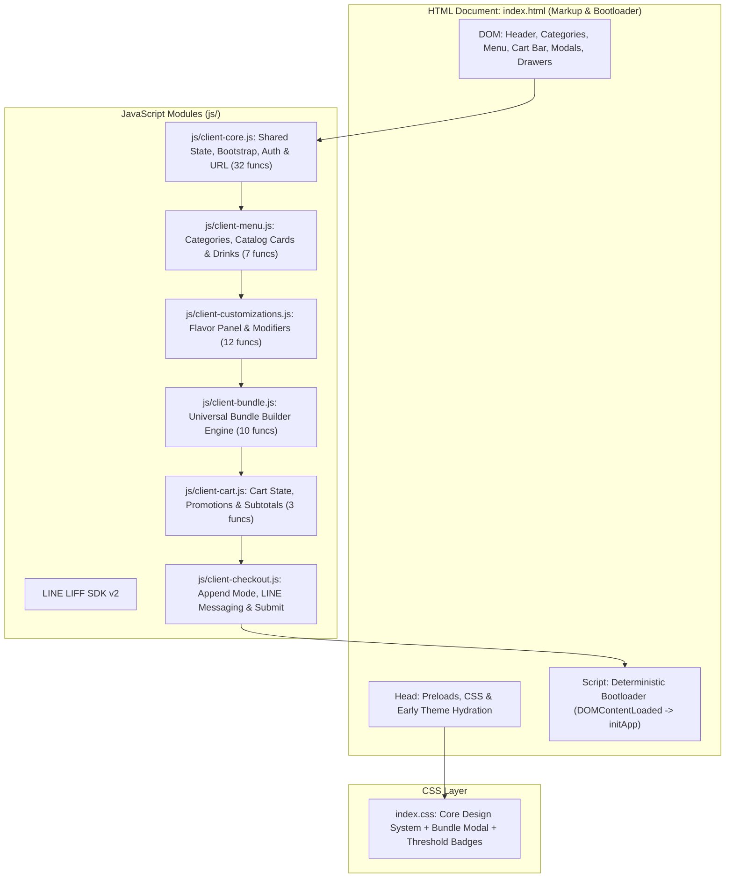
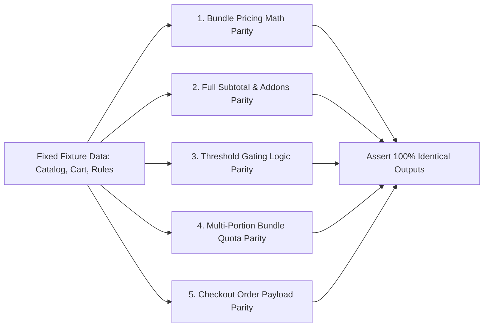
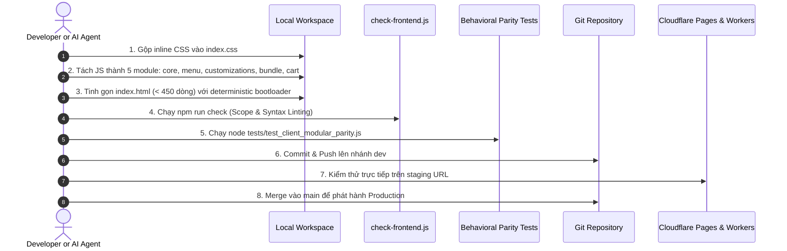

# PDP: Modular Client Menu Architecture (Refactoring Monolithic `index.html`)

| Status | Proposed (Revised with Critical Technical Safeguards) |
| :--- | :--- |
| **Author** | Principal AI Agent & Pair Programming Partner |
| **Target Date** | 2026-09-13 |
| **Scope** | Client Customer Ordering App (`index.html`, `index.css`, `js/client-*.js`) |
| **Primary Constraint** | **Zero Regressions**: 100% functional, visual, stateful, and behavioral parity with current production |

---

## 1. Executive Summary & Objectives

### 1.1 Problem Statement
The customer-facing menu application currently centers around a monolithic [`index.html`](file:///Users/duccao/Documents/benmi-order/index.html) spanning **3,707 lines** and **192 KB**. 

An audit of the file reveals significant architectural entanglement:
- **~576 lines of inline CSS** in `<style id="bundle-builder-styles">` and `<style id="threshold-customization-styles">` that bypass [`index.css`](file:///Users/duccao/Documents/benmi-order/index.css).
- **~2,547 lines of inline JavaScript** (lines 1,136 to 3,682) containing **64 functions** handling core bootstrap, category navigation, catalog rendering, bundle builders, modifier popups, reactive price calculators, and desktop auth guards.
- **~1,414 lines of separate JavaScript** in [`js/client-checkout.js`](file:///Users/duccao/Documents/benmi-order/js/client-checkout.js) tightly coupled with global state declared in the inline script.

This monolith creates substantial technical debt:
1. **Merge Conflicts**: Multiple developers or agents touching bundles, menu rendering, or checkout inevitably edit the same 3,700-line file.
2. **Cognitive Overload**: Navigating between markup, styles, and scripts requires endless scrolling.
3. **Browser Caching Inefficiencies**: Any 1-character bugfix in JavaScript forces mobile users to re-download the entire 192KB HTML document instead of leveraging HTTP 304 / cache hits on modular scripts.

### 1.2 Objectives & Key Results (In-Scope)
- [x] **Zero Regressions (P0 Constraint)**: Absolutely zero visual, interaction, calculation, or business logic drift across all tenants (`benmi`, `dapinglin`, `jiangjiejie`, `quanthuyhang`, `bsc`, etc.).
- [x] **85% Reduction in HTML Document Size**: Reduce `index.html` from **3,707 lines** down to **< 450 lines** of clean semantic HTML markup.
- [x] **Complete 64-Function Exact Mapping**: 100% of the 64 functions in `index.html` are mapped directly to their destination module in `js/` with zero omissions.
- [x] **Deterministic Single Bootloader**: Eliminate race conditions during cached vs. uncached boots by invoking `initApp()` only after all script tags have fully loaded.
- [x] **Shared State Consistency Guarantee**: Enforce bidirectional reference synchronization between lexical bindings and `window` properties (`cart`, `customizeData`, `comboDrinkData`, `window.bundleCartData`, `bootstrapData`, `storeConfig`).
- [x] **CSS Consolidation**: Merge all inline bundle and threshold styles into [`index.css`](file:///Users/duccao/Documents/benmi-order/index.css).
- [x] **Behavioral Parity Test Suite**: Deploy fixture-driven automated tests verifying calculation results, payload structure, and threshold gating before and after refactoring.

### 1.3 Non-Goals (Out-of-Scope)
- **No Framework Migration**: Do not rewrite into React, Vue, Next.js, or Svelte. Vanilla JavaScript + Vanilla CSS is a core design decision of this repository for instant edge delivery (< 100ms) and zero build-step overhead in LINE LIFF.
- **No UI/UX Redesign**: Visual design, font weights, padding, animations, and modal transitions remain 100% identical.
- **No Backend API Changes**: The Cloudflare Worker bootstrap endpoint (`/api/tenant/bootstrap`) and order submission endpoint (`/api/create`) remain untouched.

---

## 2. Context & Codebase Audit

### 2.1 Monolith Dissection
```
================================================================================
index.html Total Lines: 3,707
================================================================================
Lines    1 -   76 (  76 lines) : <head> Meta, Google Fonts, Preload Links, blabfood.app redirect & title
Lines   77 -  652 ( 576 lines) : Inline <style> tags (Bundle modal + Threshold badges)
Lines  653 -  742 (  90 lines) : Inline <script> (Early theme hydration & cache pre-render)
Lines  743 -  946 ( 204 lines) : HTML <body> (Header, Categories, Catalog Container)
Lines  947 -  953 (   7 lines) : Inline <script> (pickup date element helper)
Lines  954 - 1134 ( 181 lines) : HTML <body> (Drawers, Modals, Alert dialogs)
Lines 1135 - 1135 (   1 lines) : External LINE LIFF SDK (<script src=".../liff/edge/2/sdk.js">)
Lines 1136 - 3682 (2547 lines) : Monolithic Inline <script> (64 functions)
Lines 3683 - 3702 (  20 lines) : Closing HTML tags
Lines 3703 - 3707 (   5 lines) : <script src="js/client-checkout.js">
```

### 2.2 Shared State Inventory
The following shared state variables are mutated across multiple interactions:
1. `cart`: Object mapping `catSlug_itemName` to integer quantities.
2. `customizeData`: Object storing selected modifiers per cart item portion.
3. `comboDrinkData`: Object storing drink selections for combos.
4. `window.bundleCartData`: Object storing portion selections for universal bundles.
5. `bootstrapData`: Cached or fetched D1 response containing catalog, modifiers, tenant config.
6. `storeConfig`: Parsed tenant configurations (business hours, dine-in rules, theme colors).
7. `currentTenantId`: Active tenant identifier.

---

## 3. Proposed Modular Architecture

### 3.1 Structural System Diagram



---

## 4. Exact 64-Function Mapping Table

Below is the complete, 1-to-1 inventory of all **64 functions** declared in lines 1,136 to 3,682 of [`index.html`](file:///Users/duccao/Documents/benmi-order/index.html) and their destination modules:

| # | Exact Function Signature in `index.html` | Original Line | Destination Module | Specific Responsibility & Dependencies |
|---|---|---|---|---|
| 1 | `getTenantIdFromUrl()` | 1140 | `js/client-core.js` | Parses `tenant_id` from URL query parameters or `liff.state`. |
| 2 | `getTaiwanDate()` | 1290 | `js/client-core.js` | Helper computing Taiwan local time (UTC+8). |
| 3 | `formatTaiwanDateTime(d)` | 1302 | `js/client-core.js` | Formats date into `YYYY-MM-DD HH:mm`. |
| 4 | `setTodayDate(forceReset)` | 1311 | `js/client-core.js` | Sets default date in pickup time picker. |
| 5 | `updateAsapTimeDisplay()` | 1342 | `js/client-core.js` | Computes and displays ASAP pickup time text. |
| 6 | `applyPickupConfig()` | 1358 | `js/client-core.js` | Shows/hides scheduled pickup based on `allow_scheduled_pickup`. |
| 7 | `setCustomerDiningOption(opt)` | 1222 | `js/client-core.js` | Toggles takeaway vs. dine-in dining mode across header & checkout. |
| 8 | `toggleStoreHours(e)` | 1248 | `js/client-core.js` | Expands/collapses weekly business hours accordion. |
| 9 | `renderStoreOperatingHours()` | 1256 | `js/client-core.js` | Renders weekly business hours table from tenant config. |
| 10 | `applyTenantTheme(tenant)` | 1280 | `js/client-core.js` | Sets CSS color variables and brand logo. |
| 11 | `isStoreOpen(twTime)` | 3476 | `js/client-core.js` | Evaluates if store is currently within operating shifts. |
| 12 | `checkStoreStatus()` | 3507 | `js/client-core.js` | Updates store status badge and pause/busy warning banners. |
| 13 | `fetchWaitingCounter()` | 3654 | `js/client-core.js` | Polls active orders waiting count from `/api/orders/waiting-count`. |
| 14 | `customAlert(msg, callback)` | 1442 | `js/client-core.js` | Shows custom styled modal alert dialog. |
| 15 | `closeCustomAlert()` | 1458 | `js/client-core.js` | Closes custom styled modal alert dialog. |
| 16 | `closeAndExitLiff()` | 1464 | `js/client-core.js` | Exits in-app browser via `liff.closeWindow()`. |
| 17 | `openImageLightbox(src)` | 1475 | `js/client-core.js` | Opens enlarged photo lightbox for menu items. |
| 18 | `closeImageLightbox()` | 1482 | `js/client-core.js` | Closes enlarged photo lightbox. |
| 19 | `openDesktopQrModal()` | 1494 | `js/client-core.js` | Opens mobile QR code modal on desktop PC. |
| 20 | `closeDesktopQrModal()` | 1500 | `js/client-core.js` | Closes mobile QR code modal. |
| 21 | `parseCartKey(key)` | 2200 | `js/client-core.js` | Parses `catSlug_itemName` into `{ catSlug, origName, itemName }`. |
| 22 | `resolveCatalogItem(key)` | 2210 | `js/client-core.js` | Resolves item metadata, sizing tags, and bundle rules from `bootstrapData`. |
| 23 | `getCleanLiffRedirectUri()` | 2280 | `js/client-core.js` | Strips OAuth code/state query parameters for LINE login redirect. |
| 24 | `ensureLiffReady()` | 2319 | `js/client-core.js` | Initializes LINE LIFF SDK (`liff.init`). |
| 25 | `isDesktopOutsideLiff()` | 2415 | `js/client-core.js` | Detects desktop browser environment outside LINE app. |
| 26 | `checkDesktopAuthGuard()` | 2429 | `js/client-core.js` | Intercepts cart additions on PC if user is not authenticated. |
| 27 | `openDesktopLoginModal()` | 2445 | `js/client-core.js` | Opens desktop LINE login prompt. |
| 28 | `closeDesktopLoginModal()` | 2450 | `js/client-core.js` | Closes desktop LINE login prompt. |
| 29 | `triggerDesktopLineLogin()` | 2455 | `js/client-core.js` | Initiates LINE OAuth login redirect on PC. |
| 30 | `updateDesktopAuthUI()` | 2482 | `js/client-core.js` | Renders customer profile name/avatar in desktop header. |
| 31 | `fetchMenu()` | 1184 | `js/client-core.js` | Fetches D1 catalog bootstrap payload via `/api/tenant/bootstrap`. |
| 32 | `initApp()` | 3559 | `js/client-core.js` | Coordinates bootstrap loading, theme application, and catalog render. |
| 33 | `scrollToSec(id)` | 1412 | `js/client-menu.js` | Smoothly scrolls to target category section. |
| 34 | `updateActiveNavOnScroll()` | 1424 | `js/client-menu.js` | ScrollSpy updating active sticky tab indicator during scroll. |
| 35 | `renderDynamicCatalog()` | 1506 | `js/client-menu.js` | Renders category sections and item card grid from `bootstrapData`. |
| 36 | `createDynamicItemCard(catSlug, item)` | 1968 | `js/client-menu.js` | Constructs item card DOM (title, description, price, badges, photo). |
| 37 | `getDynamicItemFooterHTML(catSlug, itemName, price, isOos)` | 2099 | `js/client-menu.js` | Renders stepper (+/-) or combo bundle button. |
| 38 | `updateDynamicStockAndPrices()` | 2185 | `js/client-menu.js` | Updates out-of-stock badges and pricing without full re-render. |
| 39 | `renderComboDrinksInline(origName, qty)` | 3248 | `js/client-menu.js` | Renders inline dropdown for combo beverage selections. |
| 40 | `calculateCurrentFoodSubtotal()` | 1585 | `js/client-customizations.js` | Computes current food merchandise subtotal for threshold checks. |
| 41 | `updateCustomizationThresholdUI()` | 1600 | `js/client-customizations.js` | Disables options below minimum subtotal and renders warning badges. |
| 42 | `validateCustomizationThresholds()` | 1675 | `js/client-customizations.js` | Authoritative validation of threshold rules prior to order checkout. |
| 43 | `renderCustomizationsPanel(container, list)` | 1785 | `js/client-customizations.js` | Renders global flavor/seasoning options panel. |
| 44 | `handleCustomizationChange(event)` | 1888 | `js/client-customizations.js` | Handles radio/checkbox changes and triggers subtotal refresh. |
| 45 | `toggleFlavorSubOptions()` | 1916 | `js/client-customizations.js` | Toggles nested secondary option groups (e.g. spicy levels). |
| 46 | `getCategoryModifiers(catSlug)` | 3290 | `js/client-customizations.js` | Resolves applied modifier groups for a given category. |
| 47 | `toggleCustomize(category, origName)` | 3302 | `js/client-customizations.js` | Opens portion-by-portion item modifier bottom sheet (Portion 1, 2...). |
| 48 | `selectSingleModifier(...)` | 3419 | `js/client-customizations.js` | Handles radio modifier selection for a specific portion. |
| 49 | `toggleMultipleModifier(...)` | 3432 | `js/client-customizations.js` | Handles checkbox modifier toggling for a specific portion. |
| 50 | `saveCustomNote(...)` | 3449 | `js/client-customizations.js` | Saves portion-specific customer note. |
| 51 | `closePopup()` | 3455 | `js/client-customizations.js` | Closes item modifier bottom sheet. |
| 52 | `openBundleBuilderModal(...)` | 2543 | `js/client-bundle.js` | Opens bundle builder bottom sheet for combo side dish selection. |
| 53 | `closeBundleBuilderModal()` | 2598 | `js/client-bundle.js` | Closes bundle builder modal. |
| 54 | `renderBundleCategoryTabs(group)` | 2604 | `js/client-bundle.js` | Renders category filter tabs (`蔬菜類`, `滷味類`, `內臟類`, `招牌菜`). |
| 55 | `setBundleCategoryFilter(catId, btnEl)` | 2633 | `js/client-bundle.js` | Filters eligible items list by category tab in bundle modal. |
| 56 | `handleBundleCardClick(itemId)` | 2640 | `js/client-bundle.js` | Quick-tap item card to increment selection quantity. |
| 57 | `renderBundleItemsList()` | 2653 | `js/client-bundle.js` | Renders scrollable list of eligible side dishes with quota steppers. |
| 58 | `changeBundleItemQty(itemId, delta)` | 2716 | `js/client-bundle.js` | Increments or decrements side dish item selection quantity. |
| 59 | `updateBundleModalState()` | 2740 | `js/client-bundle.js` | Updates quota progress bar, badges, and confirm button state. |
| 60 | `confirmBundleSelection()` | 2779 | `js/client-bundle.js` | Commits selections into `window.bundleCartData` and closes modal. |
| 61 | `checkAllBundlesComplete()` | 2839 | `js/client-bundle.js` | Validates that all portions of combo bundles in cart have selections. |
| 62 | `updateQty(category, origName, change)` | 2880 | `js/client-cart.js` | Increments/decrements cart item; opens bundle modal if combo item. |
| 63 | `calculateCategoryBundleSubtotal(rule, items)` | 2931 | `js/client-cart.js` | Computes promotional bundle pricing (e.g. 3 items for $100). |
| 64 | `updateTotal()` | 2971 | `js/client-cart.js` | Aggregates full cart pricing, promotional discounts, and updates UI. |

---

## 5. Architectural Solutions for Critical Technical Concerns

### 5.1 Deterministic Single Bootloader (Eliminating Cached vs. Uncached Race Conditions)

#### The Problem:
In the monolithic `index.html`, `initApp()` was called at the bottom of the script. If `client-core.js` is loaded first and calls `initApp()` immediately, and cached data exists in `localStorage`, `initApp()` executes synchronous rendering calls (`renderDynamicCatalog()`, `updateTotal()`) **before** `client-menu.js`, `client-customizations.js`, or `client-cart.js` are downloaded and parsed by the browser, triggering fatal `ReferenceError` crashes.

#### The Solution:
`initApp()` in `js/client-core.js` will **only define the function** and register the promise. The actual boot call will be triggered by a single deterministic bootloader at the very bottom of `index.html`, after all 6 script tags:

```html
<!-- Final Script: Single Deterministic Entry Point -->
<script>
    (function bootClientApp() {
        if (document.readyState === 'loading') {
            document.addEventListener('DOMContentLoaded', function() {
                if (typeof window.initApp === 'function') window.initApp();
            });
        } else {
            if (typeof window.initApp === 'function') window.initApp();
        }
    })();
</script>
```

**Parity Guarantee**:
- **Uncached visit**: Skeleton renders -> all 6 scripts parse -> `initApp()` fires -> async `fetchMenu()` resolves -> `renderDynamicCatalog()` executes.
- **Cached visit**: Early head script hydrates theme -> all 6 scripts parse -> `initApp()` reads `localStorage` -> synchronously calls `renderDynamicCatalog()` and `updateTotal()` with 100% of dependencies defined.

---

### 5.2 Shared State Consistency (Bidirectional Reference Synchronization)

#### The Problem:
In JavaScript, `window.cart = cart` creates an initial alias. If `cart` is later reassigned (e.g., during cart restoration `cart = parsed.cart` or cart clearance in checkout `cart = {}`), the lexical variable `cart` and property `window.cart` become desynchronized, causing checkout or menu to read stale cart states.

#### The Solution:
We establish a canonical state declaration in `js/client-core.js` using top-level `var` bindings, which are guaranteed in browser non-module scripts to be identical to properties on `window`:

```javascript
// js/client-core.js - Canonical Shared State Declarations
var cart = window.cart || {};
window.cart = cart;

var customizeData = window.customizeData || {};
window.customizeData = customizeData;

var comboDrinkData = window.comboDrinkData || {};
window.comboDrinkData = comboDrinkData;

var bundleCartData = window.bundleCartData || {};
window.bundleCartData = bundleCartData;

var bootstrapData = window.bootstrapData || null;
window.bootstrapData = bootstrapData;

var storeConfig = window.storeConfig || null;
window.storeConfig = storeConfig;

var currentTenantId = window.currentTenantId || '';
window.currentTenantId = currentTenantId;
```

Furthermore, all reassignments across all modules (`client-cart.js`, `client-core.js`, `client-checkout.js`) are updated to mutate the existing object or assign both:
```javascript
// Reassignment pattern across all modules:
cart = parsed.cart || {};
window.cart = cart;

customizeData = parsed.customizeData || {};
window.customizeData = customizeData;

window.bundleCartData = parsed.bundleCartData || {};
```

In `client-checkout.js`:
```javascript
// Clearing cart after successful order:
cart = {};
window.cart = cart;
customizeData = {};
window.customizeData = customizeData;
window.bundleCartData = {};
```

---

### 5.3 Behavioral & Stateful Parity Test Suite (Proof of Zero Regressions)

#### The Problem:
Merely testing that functions exist and have matching signatures does not guarantee that mathematical calculations, combo choices, threshold validations, or checkout payloads remain identical.

#### The Solution:
We deploy an automated behavioral test suite [`tests/test_client_modular_parity.js`](file:///Users/duccao/Documents/benmi-order/tests/test_client_modular_parity.js) executing before and after the refactor against fixed fixtures (`benmi`, `dapinglin`, `jiangjiejie`):



**Test Scenarios Covered**:
1. **Category Bundle Pricing Math**: Compare output of `calculateCategoryBundleSubtotal` for 1, 2, 3, 4, 7 items with rule `{ bundleQuantity: 3, bundlePrice: 100 }`. Output must match down to $1 NTD.
2. **Dynamic Subtotal & Addons**: Compare `updateTotal` calculations with a composite cart:
   - 2x Regular Dish
   - 1x Combo with 7 Side Dishes
   - 1x Drink addon
   - 1x Flavor radio price addon (+$20)
   - Must produce identical subtotal, addon total, discount amount, and final total.
3. **Threshold Customization Interception**: Test `validateCustomizationThresholds` with:
   - Subtotal $150 (below $200 threshold) -> Expect `{ valid: false, error: '...' }`
   - Subtotal $250 (above $200 threshold) -> Expect `{ valid: true }`
4. **Bundle Portion Completeness**: Test `checkAllBundlesComplete` with:
   - Incomplete portion (6/7 selected) -> Expect `{ valid: false }`
   - Complete portion (7/7 selected) -> Expect `{ valid: true }`
5. **Checkout Payload Format**: Validate that payload constructed for `/api/create` has identical structure (`bundleSelections`, `selected_options`, `pricing`).

---

## 6. Migration & Step-by-Step Rollout Strategy



### Rollback Guarantee:
- Zero database changes.
- Rollback command: `git revert HEAD && git push origin main`. Reversion deploys globally via Cloudflare Pages in < 30 seconds.

---

## 7. Execution Milestones

- [ ] **Milestone 1**: CSS Unification — move `<style id="bundle-builder-styles">` and `<style id="threshold-customization-styles">` into [`index.css`](file:///Users/duccao/Documents/benmi-order/index.css).
- [ ] **Milestone 2**: Build Behavioral Parity Test Suite [`tests/test_client_modular_parity.js`](file:///Users/duccao/Documents/benmi-order/tests/test_client_modular_parity.js) against monolithic code.
- [ ] **Milestone 3**: Extract 5 JS modules with canonical shared state and exact 64-function mapping.
- [ ] **Milestone 4**: Replace monolithic inline script in [`index.html`](file:///Users/duccao/Documents/benmi-order/index.html) with modular script tags and the deterministic bootloader.
- [ ] **Milestone 5**: Execute `npm run check` and `node tests/test_client_modular_parity.js`. Verify 100% pass.
- [ ] **Milestone 6**: Push to `dev`, verify staging, and deploy to `main`.
