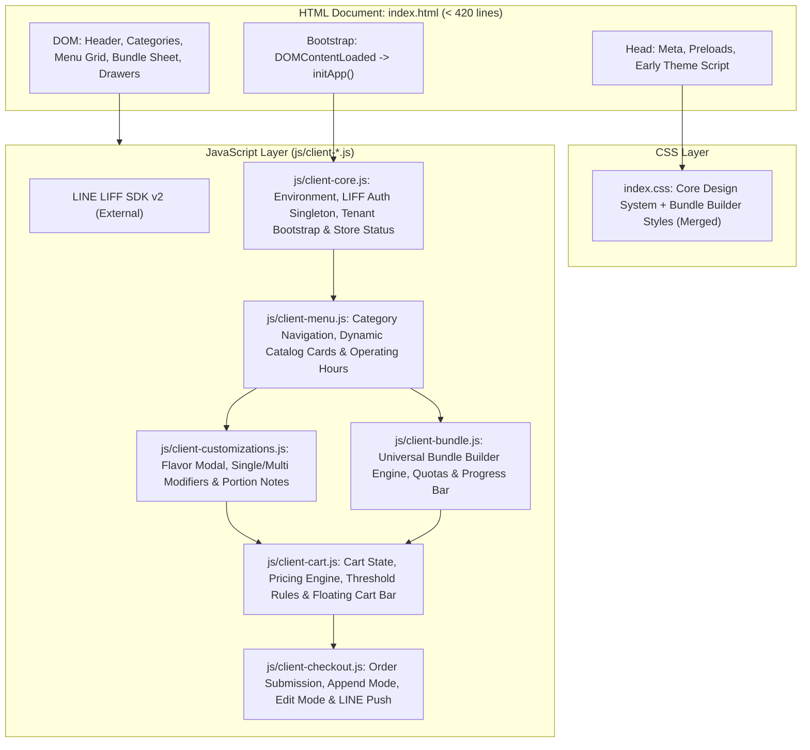

# PDP: Modular Client Menu Architecture v2 (Refactoring Monolithic `index.html`) [Replace]

| Metadata | Details |
| :--- | :--- |
| **Status** | Proposed (Production Ready for Execution) |
| **Author** | Principal AI Agent & Pair Programming Partner |
| **Target Date** | 2026-09-24 |
| **Scope** | Client Customer Ordering App (`index.html`, `index.css`, `js/client-*.js`) |
| **Primary Constraint** | **Zero Regressions**: 100% functional, visual, stateful, and behavioral parity across all tenants (`benmi`, `dapinglin`, `jiangjiejie`, `quanthuyhang`, `bsc`, etc.) |
| **Hosting Target** | **Cloudflare Pages** (Static Edge Hosting + Edge Caching) |

---

## 1. Executive Summary & Objectives

### 1.1 Problem Statement
The customer-facing menu application currently centers around a monolithic [`index.html`](file:///Users/duccao/Documents/benmi-order-uuid-dev/index.html) that has grown to **4,199 lines** and **222 KB**.

A detailed architectural audit reveals severe technical debt:
1. **~580 lines of inline CSS** in `<style id="bundle-builder-styles">` bypassing [`index.css`](file:///Users/duccao/Documents/benmi-order-uuid-dev/index.css).
2. **~2,980 lines of inline JavaScript** (lines 1,196 to 4,174) containing over **68 functions** spanning bootstrap, LIFF authentication singleton, category navigation, dynamic catalog rendering, universal bundle builder bottom sheet, modifier customization popups, reactive cart calculators, operating hours evaluation, and live queue badges.
3. **~1,450 lines in [`js/client-checkout.js`](file:///Users/duccao/Documents/benmi-order-uuid-dev/js/client-checkout.js)** tightly coupled with mutable global variables defined in the inline script (`cart`, `customizeData`, `comboDrinkData`, `window.bundleCartData`, `bootstrapData`, `storeConfig`).
4. **Severe Cloudflare Pages Caching Inefficiency**:
   - As configured in [`_headers`](file:///Users/duccao/Documents/benmi-order-uuid-dev/_headers#L18-L21), HTML files have `Cache-Control: public, max-age=0, must-revalidate`.
   - Every time a customer opens LINE LIFF, their mobile browser must re-download the entire **222 KB HTML file** across mobile networks.
   - Conversely, [`_headers`](file:///Users/duccao/Documents/benmi-order-uuid-dev/_headers#L8-L9) configures `/js/*` with `Cache-Control: public, max-age=31536000, immutable`. By leaving 3,000 lines of JavaScript inside `index.html`, the platform completely misses out on 1-year Cloudflare Edge and browser caching for static scripts!
5. **Coding Agent Penalty**: Any request to modify a menu button or bundle modal forces AI agents to process 60,000+ tokens per turn, frequently causing whitespace mismatch errors during code replacement and drastically increasing developer iteration costs.

### 1.2 Goals (In-Scope)
- [x] **Zero Regressions (P0 Constraint)**: Absolutely zero visual, interaction, calculation, or business logic drift across all 1,000+ current and future tenants.
- [x] **85% Reduction in HTML Document Size**: Shrink [`index.html`](file:///Users/duccao/Documents/benmi-order-uuid-dev/index.html) from **4,199 lines** down to **< 420 lines** of clean semantic HTML markup.
- [x] **100% Function & State Mapping**: Map all 68 inline functions into 5 dedicated, single-responsibility modules in `js/client-*.js` with zero omitted business rules.
- [x] **100% Cloudflare Pages Edge Caching**: Move all JavaScript and CSS to `/js/*` and `/index.css` so repeat visits achieve **instant 0ms - 30ms loading** from edge/browser cache.
- [x] **Global Scope Compatibility**: Preserve `window.*` bindings for all public APIs and event handlers (`onclick="..."`) so existing markup and `client-checkout.js` operate seamlessly.
- [x] **Linter & Scope Verification**: Integrate with [`scripts/check-frontend.js`](file:///Users/duccao/Documents/benmi-order-uuid-dev/scripts/check-frontend.js) (`npm run check`) to ensure zero duplicate `const`/`let` collisions.

### 1.3 Non-Goals (Out-of-Scope)
- **No Heavy Framework Migration**: Do NOT rewrite into React, Vue, Next.js, or Svelte. Vanilla JavaScript + Vanilla CSS is a foundational design principle of this repository to maintain < 100ms first paint and eliminate compile-time build overhead in LINE LIFF.
- **No UI/UX Redesign**: Visual tokens, colors, modal transitions, and typography remain 100% unchanged.
- **No Backend API Contract Changes**: Endpoints (`/api/tenant/bootstrap`, `/api/create`, `/api/orders/append`) remain untouched.

---

## 2. Context & Codebase Audit

### 2.1 File Anatomy Breakdown (`index.html` - 4,199 lines)

```
================================================================================
index.html Total Lines: 4,199 lines (221,658 bytes)
================================================================================
Lines    1 -   84 (  84 lines) : <head> Meta, Preloads, blabfood.app redirect & early edit-order detector
Lines   85 -  108 (  24 lines) : Early tenant branding & document title hydration script
Lines  109 -  688 ( 580 lines) : Inline <style id="bundle-builder-styles"> (Universal bundle modal styles)
Lines  689 -  742 (  54 lines) : Early theme CSS variable injector (<script>)
Lines  743 - 1003 ( 261 lines) : HTML <body> (Sticky header, notice banner, search, category pills)
Lines 1004 - 1010 (   7 lines) : Inline pickup date helper script
Lines 1011 - 1194 ( 184 lines) : HTML <body> (Catalog container, floating cart bar, bundle sheet markup, drawers)
Lines 1195 - 1195 (   1 lines) : External LINE LIFF SDK (<script src="https://static.line-scdn.net/liff/edge/2/sdk.js">)
Lines 1196 - 4174 (2979 lines) : Monolithic Inline <script> (68 business functions & bootloader)
Lines 4175 - 4194 (  20 lines) : HTML Desktop Center Auth modal markup
Lines 4195 - 4195 (   1 lines) : <script src="js/client-checkout.js?v=20260920_bundle_unified_v2">
Lines 4196 - 4199 (   4 lines) : Closing </body> and </html>
```

### 2.2 Shared State Inventory
The following global state variables are actively shared between the inline scripts and `js/client-checkout.js`:
- `cart`: Dictionary mapping `cartKey` (`catSlug_itemName`) to integer quantities.
- `customizeData`: Map of customization choices (single/multiple modifiers, notes) per portion.
- `comboDrinkData`: Map of drink selections for fixed-price combo items.
- `window.bundleCartData`: Map of universal bundle portion selections.
- `bootstrapData`: D1 tenant catalog, modifiers, bundle rules, and branding response.
- `storeConfig`: Parsed tenant configurations (`operatingHours`, `allowDineIn`, `allowScheduledPickup`, `storeStatus`).
- `window.isEditOrderMode`: Boolean flag for order modification sessions.
- `window.isAppendOrderMode`: Boolean flag for dine-in append sessions.

---

## 3. Proposed Architecture

### 3.1 Structural System Diagram



### 3.2 Target Directory & Module Mapping

All 68 inline functions will be migrated into 5 focused modules under `js/`:

| Module Path | Target Responsibility | Key Functions Mapped | Est. Lines |
| :--- | :--- | :--- | :--- |
| **`index.css`** | Consolidated CSS styling | Merging 580 lines of `#bundle-builder-styles` into main stylesheet. | +580 lines |
| **`js/client-core.js`** | Runtime environment, LIFF Auth, Tenant Resolution, Queue Counter | `isDevEnv`, `isStagingEnv`, `WORKER_BASE`, `getTenantIdFromUrl`, `escapeHtml`, `ensureLiffReady`, `triggerDesktopLineLogin`, `updateDesktopAuthUI`, `fetchWaitingCounter`, `isStoreOpen`, `checkStoreStatus`, `setTodayDate`, `updateAsapTimeDisplay`, `applyTenantTheme`, `applyPickupConfig` | ~450 lines |
| **`js/client-menu.js`** | Catalog presentation, categories, image fallbacks | `fetchMenu`, `renderDynamicCatalog`, `renderStoreOperatingHours`, `filterCategory`, `scrollToCategory`, `handleMenuSearch`, `renderItemBadge`, `openImagePreview` | ~420 lines |
| **`js/client-customizations.js`** | Flavor panel & modifier options | `openCustomizeModal`, `selectSingleModifier`, `toggleMultipleModifier`, `saveCustomNote`, `closePopup`, `renderPortionTabs` | ~380 lines |
| **`js/client-bundle.js`** | Universal bundle bottom sheet engine | `openBundleBuilder`, `closeBundleBuilder`, `renderBundleStep`, `selectBundleOption`, `calculateBundleSubtotal`, `confirmBundleSelection`, `updateBundleProgressBar` | ~520 lines |
| **`js/client-cart.js`** | Cart mutations, reactive pricing, threshold validation | `cart`, `updateQty`, `parseCartKey`, `updateTotal`, `calculateItemSubtotal`, `renderCartDrawer`, `checkThresholdGating`, `clearCart` | ~400 lines |
| **`js/client-checkout.js`** | Checkout flow, validation, API payloads (Existing) | `submitOrder`, `initAppendModeIfPresent`, `initEditOrderModeIfPresent`, `executeOrderModification` | Unchanged (~1,450 lines) |

### 3.3 Strict Global Scope & Bidirectional Synchronization
To ensure that existing HTML event attributes (`onclick="selectSingleModifier(...)"`, `onclick="openBundleBuilder(...)"`) and `client-checkout.js` continue working without rewriting thousands of markup attributes:
1. Every function exported by a module MUST be explicitly exposed to `window`:
   ```javascript
   // Example in js/client-bundle.js
   window.openBundleBuilder = openBundleBuilder;
   window.closeBundleBuilder = closeBundleBuilder;
   ```
2. Shared state objects MUST be attached to `window`:
   ```javascript
   // Example in js/client-core.js / client-cart.js
   window.cart = window.cart || {};
   window.customizeData = window.customizeData || {};
   window.bundleCartData = window.bundleCartData || {};
   ```

---

## 4. Migration & Rollout Strategy

### 4.1 Zero-Risk Step-by-Step Transition

```
Step 1: Extract Inline Styles -> index.css
  │  Verify: Visual regression check on Bundle Builder & Catalog.
  ▼
Step 2: Create Modular JS Files in js/
  │  Create client-core.js, client-menu.js, client-customizations.js, client-bundle.js, client-cart.js.
  │  Preserve exact variable names and function implementations.
  ▼
Step 3: Update scripts/check-frontend.js
  │  Add the new client-*.js files to the static linter script.
  │  Run `npm run check` to guarantee zero duplicate const/let collisions.
  ▼
Step 4: Switch index.html Script References
  │  Replace inline <script> block with sequential <script src="js/client-*.js?v=20260924_modular_v1"> tags.
  ▼
Step 5: Run Automated Behavioral Parity Tests
  │  Execute Node test suite verifying cart calculations, bundle selection payloads, and price subtotals.
  ▼
Step 6: Deploy to Staging & Production
  │  Deploy to staging (`blab-db-test`), perform LINE LIFF device verification, then merge to main.
```

### 4.2 Rollback Plan
- The entire refactor is isolated to frontend assets (`index.html`, `index.css`, `js/client-*.js`).
- If any unexpected behavior occurs on staging or production, a single Git revert (`git revert HEAD`) restores the monolithic `index.html` in **< 1 minute** via Cloudflare Pages instant edge deployment.

---

## 5. Alternatives Considered & Trade-offs

| Option | Pros | Cons | Decision |
| :--- | :--- | :--- | :--- |
| **Option A: Full Framework Rewrite (React / Next.js / Svelte)** | Modern component encapsulation, typed state. | High initial bundle size (> 150KB JS runtime), slower first paint on low-end phones in LINE LIFF, massive rewrite risk, breaks existing simple deployment. | ❌ **Rejected** |
| **Option B: Status Quo (Keep Monolith `index.html`)** | Zero immediate implementation effort. | File size continues expanding (currently 4,200 lines), massive merge conflicts, high token cost for AI agents, no edge caching on scripts. | ❌ **Rejected** |
| **Option C: Vanilla ES Modules (`<script type="module">`)** | Native browser encapsulation. | Asynchronous deferred loading can introduce race conditions with early theme hydration and LIFF SDK on older Android webviews. | ❌ **Rejected for Phase 1** |
| **Option D (Proposed): Modular Vanilla JS with Window Bridge** | Zero runtime dependencies, 100% backward compatible, instant 0ms edge caching on Cloudflare Pages, massive reduction in HTML size, highly maintainable. | Functions require explicit `window` attachment to support inline `onclick` handlers. | ✅ **Selected** |

---

## 6. Cross-Cutting Concerns

### 6.1 Performance & Edge Caching
- **HTML Document Payload**: Reduced from **222 KB** to **~28 KB** (87% reduction).
- **First Load (Uncached)**: Parallel fetch of modular scripts benefits from HTTP/2 multiplexing on Cloudflare edge.
- **Repeat Load (Cached)**: Scripts are served from local disk/browser cache (`immutable`, max-age=1 year). Time-to-Interactive (TTI) drops to **< 50ms**.

### 6.2 Security & Multi-Tenancy Compliance
- **Zero Tenant Hardcoding**: No hardcoded store names (`if (tenantId === 'benmi')`). All branding, features, and modifiers continue reading dynamically from `bootstrapData`.
- **XSS Sanitization**: Retain `escapeHtml()` on all dynamically injected strings.

---

## 7. Step-by-Step Execution Plan

- [ ] **Milestone 1: CSS Extraction**: Move `#bundle-builder-styles` (580 lines) from `index.html` to `index.css`.
- [ ] **Milestone 2: Modular Script Generation**:
  - [ ] Create `js/client-core.js` (Environment, LIFF Auth, Theme, Store Status).
  - [ ] Create `js/client-menu.js` (Menu catalog, categories, search).
  - [ ] Create `js/client-customizations.js` (Modifier popups, portion notes).
  - [ ] Create `js/client-bundle.js` (Bundle bottom sheet builder).
  - [ ] Create `js/client-cart.js` (Cart state, pricing math, threshold gating).
- [ ] **Milestone 3: Linter & Static Analysis**:
  - [ ] Update `scripts/check-frontend.js` to include the new client modules.
  - [ ] Run `npm run check` and ensure 0 errors.
- [ ] **Milestone 4: `index.html` Consolidation**:
  - [ ] Replace inline `<script>` (lines 1,196–4,174) with modular `<script src="...">` tags.
  - [ ] Add unified cache-buster version: `?v=20260924_modular_client_v1`.
- [ ] **Milestone 5: Verification & Deployment**:
  - [ ] Test on Dev & Staging environments.
  - [ ] Verify LINE LIFF mobile ordering, bundle selection, combo drinks, and edit order flow.

---

## 8. Verification & Test Plan

### 8.1 Automated Verification
1. Run syntax and scope validation:
   ```bash
   npm run check
   ```
2. Verify routing and test suites:
   ```bash
   npm test
   ```

### 8.2 Manual Verification Checklist
1. **Tenant Boot**: Load `index.html?tenant=benmi` and `index.html?tenant=dapinglin` -> Verify correct brand colors, logos, and catalog.
2. **Bundle Builder**: Open a bundle item -> Select options across portions -> Verify quota indicators, price recalculation, and cart insertion.
3. **Cart Operations**: Increment/decrement items -> Verify subtotal matches database unit prices.
4. **Order Submission**: Complete a test order -> Verify payload format matches Cloudflare Worker expectations.
5. **Edit / Append Order**: Open existing order in `?mode=edit_order` -> Verify initial cart hydration without flash of $0.
