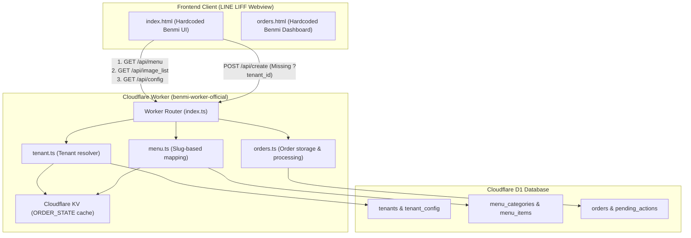
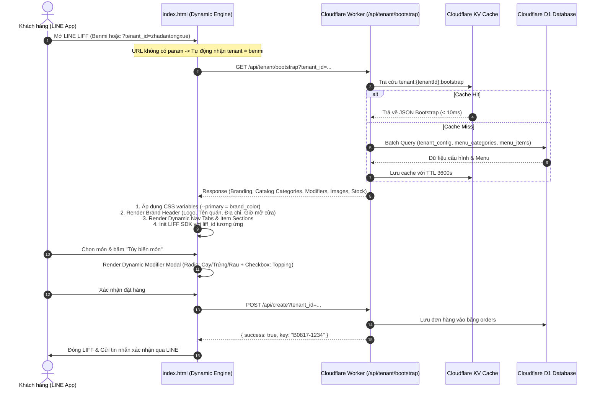
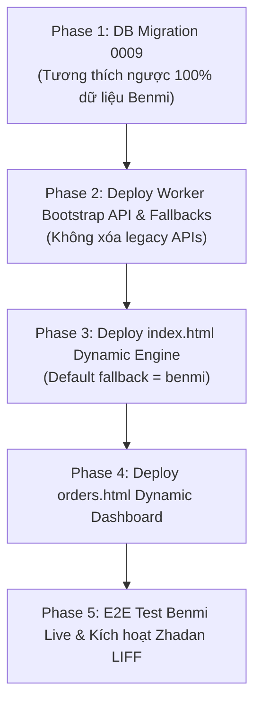

# PDP: Multi-Tenant Dynamic Frontend Architecture & Engine (Refactor & New Tenant Support)

- **Status**: Proposed (Ready for Execution)
- **Author**: Principal Engineer
- **Target Tenants**: `benmi` (Bánh mì Việt Nam - Production Live), `zhadantongxue` (炸蛋同学 招牌炸蛋葱饼), and future white-label food tenants.
- **Related Files**:
  - Backend: [`src/index.ts`](file:///Users/duc.cao/Documents/learning/benmi-order/benmi-worker-official/src/index.ts), [`src/modules/menu.ts`](file:///Users/duc.cao/Documents/learning/benmi-order/benmi-worker-official/src/modules/menu.ts), [`src/modules/tenant.ts`](file:///Users/duc.cao/Documents/learning/benmi-order/benmi-worker-official/src/modules/tenant.ts), [`src/modules/orders.ts`](file:///Users/duc.cao/Documents/learning/benmi-order/benmi-worker-official/src/modules/orders.ts)
  - Migrations: [`0001_initialize_menu_tables.sql`](file:///Users/duc.cao/Documents/learning/benmi-order/benmi-worker-official/migrations/0001_initialize_menu_tables.sql), [`0006_create_tenant_config.sql`](file:///Users/duc.cao/Documents/learning/benmi-order/benmi-worker-official/migrations/0006_create_tenant_config.sql), [`0008_add_allow_scheduled_pickup_to_tenant_config.sql`](file:///Users/duc.cao/Documents/learning/benmi-order/benmi-worker-official/migrations/0008_add_allow_scheduled_pickup_to_tenant_config.sql), [`0009_add_store_status_to_tenant_config.sql`](file:///Users/duc.cao/Documents/learning/benmi-order/benmi-worker-official/migrations/0009_add_store_status_to_tenant_config.sql), [`0010_seed_zhadan_tenants.sql`](file:///Users/duc.cao/Documents/learning/benmi-order/benmi-worker-official/migrations/0010_seed_zhadan_tenants.sql), [`0011_enhance_menu_categories_for_modifiers.sql`](file:///Users/duc.cao/Documents/learning/benmi-order/benmi-worker-official/migrations/0011_enhance_menu_categories_for_modifiers.sql)
  - Frontend: [`index.html`](file:///Users/duc.cao/Documents/learning/benmi-order/index.html), [`index.css`](file:///Users/duc.cao/Documents/learning/benmi-order/index.css), [`orders.html`](file:///Users/duc.cao/Documents/learning/benmi-order/orders.html), [`orders.css`](file:///Users/duc.cao/Documents/learning/benmi-order/orders.css)

---

## 1. Executive Summary & Objectives

### 1.1 Problem Statement
Hệ thống Cloudflare Worker backend và D1 database đã được thiết kế sẵn sàng cho kiến trúc đa hộ thuê (Multi-Tenancy) với `tenant_id` phân tách dữ liệu trong các bảng `tenants`, `tenant_config`, `menu_categories`, `menu_items`, `orders`, `pending_actions`.

Tuy nhiên, **Frontend (`index.html` và `orders.html`) hiện tại vẫn đang bị dính chặt (hardcoded) vào logic riêng của quán bánh mì Benmi**:
1. **Hardcoded Branding & UI Layout**: Tên quán ("本米"), slogan ("Bánh mì Việt Nam"), địa chỉ, giờ mở cửa, màu chủ đạo CSS được viết tĩnh trong mã HTML/CSS.
2. **Hardcoded Categories & Navigation**: Menu tabs (`sec-large`, `sec-small`, `sec-combo`, `sec-drink`) và hàm `renderMenu()` phụ thuộc cứng vào cấu trúc `menu.small`, `menu.large`, `menu.combo`, `menu.drinks`. Trong khi đó, tenant mới **Zhadan Tongxue (炸蛋同学)** có cấu trúc danh mục hoàn toàn khác: `main` (招牌炸蛋蔥餅), `snack` (點心小吃), `spicy` (加辣選項), `egg` (雞蛋選項), `lettuce` (生菜選項), `topping` (加料選項).
3. **Hardcoded Modifier / Customization UI**: Modal tùy biến món ăn (`toggleCustomize`) chỉ hỗ trợ 1 dropdown topping cố định + 4 mức cay cố định (không cay/ít/vừa/cay) + combo drinks. Không thể render các tùy chọn của Zhadan như: Độ chín trứng (流心蛋 / 熟蛋), Rau (加生菜 / 不加生菜), hay danh sách Topping thêm với 8 loại topping tính tiền độc lập.
4. **Hardcoded Admin Dashboard (`orders.html`)**: Trình chỉnh sửa menu chỉ nhận diện đúng 5 nhóm danh mục cố định của Benmi (`BENMI_CATS`).
5. **High Latency & Missing Tenant Header on Checkout**: `index.html` thực hiện 3 requests API riêng biệt khi khởi động (`/api/menu`, `/api/image_list`, `/api/config`) và hàm `submitOrder()` gửi thiếu query param `tenant_id` tới endpoint `/api/create`.

### 1.2 Goals (In-Scope)
- **100% Data-Driven Ordering UI (`index.html`)**: Toàn bộ giao diện (Brand Header, Theme Colors, Navigation Tabs, Catalog Sections, Item Cards, và Modifier Modals) tự động render động theo dữ liệu cấu hình từ backend.
- **Schema-Driven Modifier Engine**: Hỗ trợ mọi hình thái tùy chọn món của các quán khác nhau (Single-choice Radio: độ cay, độ chín trứng, rau; Multi-choice Checkbox / Counter: toppings; Combos & Add-ons) mà không cần code riêng từng quán.
- **Unified Bootstrap Endpoint (`/api/tenant/bootstrap`)**: Gộp 3 API calls khi tải trang thành 1 request duy nhất với thời gian phản hồi `< 50ms` (nhờ KV Edge Caching), tối ưu hóa trải nghiệm mở LINE LIFF trên mobile mạng 4G/5G.
- **Zero Impact on Production Benmi (Bảo đảm tuyệt đối không ảnh hưởng Benmi)**:
  - Benmi hiện đang chạy trên Production với cấu hình LINE Developers đã tạo (LIFF ID, Webhook URL `/webhook`, Rich Menu). Khi deploy lại, **không cần thay đổi bất kỳ cài đặt nào trên LINE Console của Benmi**, người dùng mở app vẫn hoạt động bình thường 100%.
  - Tự động fallback mặc định là `benmi` khi không có tham số `?tenant_id=...`.
- **Dynamic Admin Dashboard (`orders.html`)**: Trình quản trị đơn hàng và Menu Editor tự động nạp các danh mục và sản phẩm linh hoạt theo `tenant_id`.
- **Zero-Downtime Migration**: Quy trình nâng cấp mượt mà, không làm gián đoạn các phiên đặt hàng đang diễn ra.

### 1.3 Non-Goals (Out-of-Scope)
- Không đập đi viết lại Frontend sang React/Next.js bundle cồng kềnh nhằm giữ kích thước file cực nhẹ (`< 50KB`), tải tức thì bên trong LINE Webview.
- Không thay đổi kiến trúc thanh toán (vẫn giữ luồng xác nhận đơn hàng qua LINE LIFF / LINE Flex Message).

---

## 2. Context & Current Architecture



---

## 3. Production Safety Matrix for Existing Benmi Setup

Để đảm bảo tuyệt đối không làm gián đoạn hệ thống Benmi đang vận hành thực tế:

| Thành phần cấu hình | Trạng thái hiện tại của Benmi | Cơ chế bảo toàn khi Deploy mới (Zero-Touch) |
| :--- | :--- | :--- |
| **LINE Webhook URL** | Trỏ về `https://<worker-domain>/webhook` hoặc `/` | Backend `index.ts` duy trì route `/webhook` và `/` tự động map sang tenant `benmi`. **Không cần sửa URL trên LINE Console**. |
| **LIFF Endpoint URL** | `https://<frontend-domain>/index.html` (Không có `?tenant_id=...`) | Frontend `getTenantIdFromUrl()` kiểm tra: Nếu URL không có `?tenant_id`, **mặc định 100% là `benmi`**. Khách hàng bấm Rich Menu hiện tại vào thẳng menu Benmi không đổi. |
| **LIFF ID & SDK Init** | Sử dụng `LIFF_ID` của Benmi từ Worker Env / `tenant_config` | API `/api/tenant/bootstrap` khi gọi cho `benmi` trả về đúng `liffId` của Benmi. Nếu D1 trống, fallback về `env.LIFF_ID`. |
| **Cart Persistence** | `localStorage.getItem('benmi_cart_save')` | Tự động đọc và lưu key `cart_save_benmi` với migration đọc key cũ `benmi_cart_save`, không làm mất giỏ hàng đang chọn dở của khách. |
| **Legacy API Support** | Client cũ gọi `/api/menu`, `/api/config` | Backend giữ nguyên vẹn các endpoint cũ `/api/menu`, `/api/config`, `/api/image_list` phục vụ các phiên bản cache cũ. |
| **Order Notification & Sync** | Lưu vào D1 `orders`, sync Google Sheets, push LINE | Giữ nguyên toàn bộ pipeline xử lý đơn hàng và tích hợp Google Sheets của Benmi. |

---

## 4. Proposed Architecture

### 4.1 Overview: Data-Driven Dynamic Frontend Engine

Kiến trúc mới biến `index.html` và `orders.html` thành một **Dynamic Rendering Engine**:
1. **Khởi tạo (Bootstrap)**: Khi client truy cập với URL `?tenant_id=zhadantongxue` (hoặc **mặc định `benmi` khi không có query param**), client chỉ gửi 1 request `GET /api/tenant/bootstrap?tenant_id=...`.
2. **Dynamic Theming**: CSS Custom Properties (`--primary`, `--primary-dark`, `--brand-title`, v.v.) được tiêm trực tiếp từ `brand_color` của `tenant_config`.
3. **Dynamic Catalog & Tabs Rendering**: Các danh mục catalog chính (`type = 'catalog'`) tự động sinh ra Sticky Navigation bar và các Section dạng lưới tương ứng.
4. **Dynamic Modifier Engine**: Khi bấm "✏️ 客製化 / Tùy biến", hệ thống đọc danh sách modifier groups của tenant để render Modal tương ứng:
   - Nhóm `single_select` (Radio buttons / Dropdown): Độ cay (加辣 / 不加辣 / 微辣...), Độ chín trứng (流心蛋 / 熟蛋), Sinh thái rau (加生菜 / 不加生菜).
   - Nhóm `multi_select` (Checkbox với giá tiền): Topping thêm (起司 +$10, 雞蛋 +$15, 培根 +$15, 豬排 +$25...).
   - Nhóm `combo_selection` (Dropdown chọn nước / món kèm): Nước đi kèm combo.
5. **Dynamic Order Builder**: Tự động tính toán tổng tiền và format tin nhắn LINE Flex Message / text summary chính xác theo các tùy chọn đã chọn.



---

### 4.2 Detailed Database Schema Enhancements

#### Schema Migration: `0011_enhance_menu_categories_for_modifiers.sql`
```sql
-- 1. Bổ sung các cột phân loại danh mục và quy tắc tùy biến
ALTER TABLE menu_categories ADD COLUMN category_type TEXT DEFAULT 'catalog'; -- 'catalog' (mục hiển thị chính) | 'modifier' (nhóm tùy chọn món)
ALTER TABLE menu_categories ADD COLUMN selection_type TEXT DEFAULT 'single'; -- 'single' (radio/dropdown) | 'multiple' (checkbox) | 'combo_drink'
ALTER TABLE menu_categories ADD COLUMN is_required INTEGER DEFAULT 0;       -- 1: Bắt buộc chọn, 0: Tùy chọn
ALTER TABLE menu_categories ADD COLUMN min_selection INTEGER DEFAULT 0;
ALTER TABLE menu_categories ADD COLUMN max_selection INTEGER DEFAULT 1;

-- 2. Cập nhật phân loại cho Benmi (Đảm bảo hiển thị đúng 4 nhóm món chính + 1 nhóm topping)
UPDATE menu_categories SET category_type = 'catalog', name = '🍔 大麵包 (Bánh mì lớn)' WHERE slug = 'large' AND tenant_id = 'benmi';
UPDATE menu_categories SET category_type = 'catalog', name = '🥖 小麵包 (Bánh mì nhỏ)' WHERE slug = 'small' AND tenant_id = 'benmi';
UPDATE menu_categories SET category_type = 'catalog', name = '🎁 特惠套餐 (Combo)' WHERE slug = 'combo' AND tenant_id = 'benmi';
UPDATE menu_categories SET category_type = 'catalog', name = '🥤 單點飲料 (Đồ uống)' WHERE slug = 'drinks' AND tenant_id = 'benmi';
UPDATE menu_categories SET category_type = 'modifier', name = '加料選項', selection_type = 'single', is_required = 0 WHERE slug = 'topping' AND tenant_id = 'benmi';

-- 3. Cập nhật phân loại chuẩn cho Zhadantongxue
UPDATE menu_categories SET category_type = 'catalog' WHERE slug IN ('main', 'snack') AND tenant_id = 'zhadantongxue';
UPDATE menu_categories SET category_type = 'modifier', selection_type = 'single', is_required = 1, min_selection = 1, max_selection = 1 WHERE slug IN ('spicy', 'egg', 'lettuce') AND tenant_id = 'zhadantongxue';
UPDATE menu_categories SET category_type = 'modifier', selection_type = 'multiple', is_required = 0, min_selection = 0, max_selection = 10 WHERE slug = 'topping' AND tenant_id = 'zhadantongxue';
```

---

### 4.3 API Design: Unified Bootstrap Endpoint

#### Endpoint: `GET /api/tenant/bootstrap?tenant_id={tenant_id}`

Khi gọi không có param `?tenant_id=...` hoặc `?tenant_id=benmi`:
- Trả về Brand info của Benmi (`#00b900`, `Benmi 越式法國麵包`, địa chỉ Thổ Thành, v.v.).
- Trả về 4 catalog categories (`large`, `small`, `combo`, `drinks`) và modifier `topping`.
- Trả về translation map và recommended items cho Benmi.

Khi gọi `?tenant_id=zhadantongxue`:
- Trả về Brand info của 炸蛋同学 (`#f59e0b`, `炸蛋同学 招牌炸蛋葱饼`, hotline đặt hàng).
- Trả về 2 catalog categories (`main`, `snack`) và 4 modifier categories (`spicy`, `egg`, `lettuce`, `topping`).

---

## 5. Migration & Rollout Strategy (Zero-Downtime)



### 5.1 Rollout Checklist
1. **Trước khi deploy**: Không cần thay đổi bất kỳ trường cấu hình nào trên LINE Developers Console của Benmi.
2. **Khi deploy Backend**:
   - Chạy migration `0009` trên Cloudflare D1.
   - Deploy Cloudflare Worker chứa endpoint `/api/tenant/bootstrap`.
3. **Khi deploy Frontend**:
   - Cập nhật `index.html`, `index.css`, `orders.html`.
   - Kiểm tra tức thì bằng việc mở trực tiếp LIFF URL hiện tại của Benmi: Menu bánh mì, giỏ hàng, đặt hàng vẫn mượt mà không có bất kỳ sai lệch nào.
4. **Cấu hình Tenant Zhadan mới**:
   - Tạo LINE Login Channel & Messaging API Channel cho Zhadan.
   - Điền `Webhook URL`: `https://<worker-domain>/webhook/zhadantongxue`.
   - Điền `LIFF Endpoint`: `https://<frontend-domain>/index.html?tenant_id=zhadantongxue`.
   - Cập nhật `line_channel_token`, `line_channel_secret`, `liff_id` vào `tenant_config` cho Zhadan.

---

## 6. Step-by-Step Execution Plan

- [ ] **Phase 1: DB Migration & Schema Refinement**
  - Tạo file `0011_enhance_menu_categories_for_modifiers.sql`.
  - Thực thi migration trên D1 database.
- [ ] **Phase 2: Cloudflare Worker Backend Implementation**
  - Viết `src/modules/bootstrap.ts` xử lý endpoint `GET /api/tenant/bootstrap` với KV Caching.
  - Tích hợp route vào `src/index.ts`.
  - Bảo đảm fallback `benmi` hoạt động chuẩn xác trong `orders.ts`, `menu.ts`, `tenant.ts`.
- [ ] **Phase 3: Dynamic Frontend Ordering Engine (`index.html`)**
  - Xây dựng hệ thống dynamic rendering cho Header, Nav, Categories, Cards, và Modifiers.
  - Bảo đảm fallback `benmi` khi truy cập không có tham số query.
  - Hỗ trợ translations song ngữ và dynamic theme variables.
- [ ] **Phase 4: Admin Dashboard Multi-Tenant Upgrade (`orders.html`)**
  - Tự động nạp danh mục và món ăn linh hoạt từ API bootstrap.
  - Cập nhật màu sắc thương hiệu và tên quán theo tenant.
- [ ] **Phase 5: Verification & Safety Sign-off**
  - Kiểm thử regression test 100% luồng của Benmi (Web view + LIFF view).
  - Kiểm thử luồng đặt món của Zhadantongxue (Radio + Checkbox toppings).
