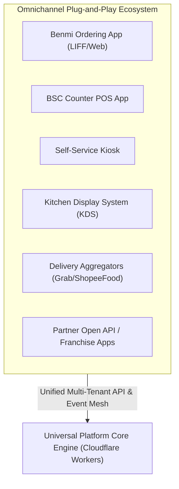
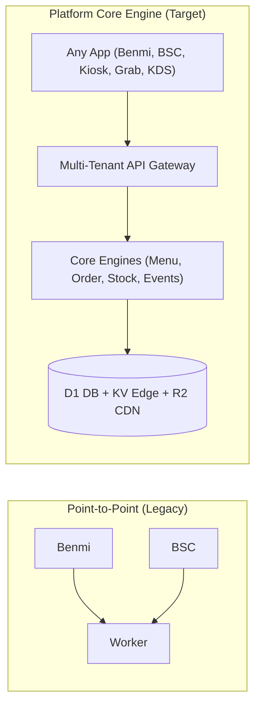
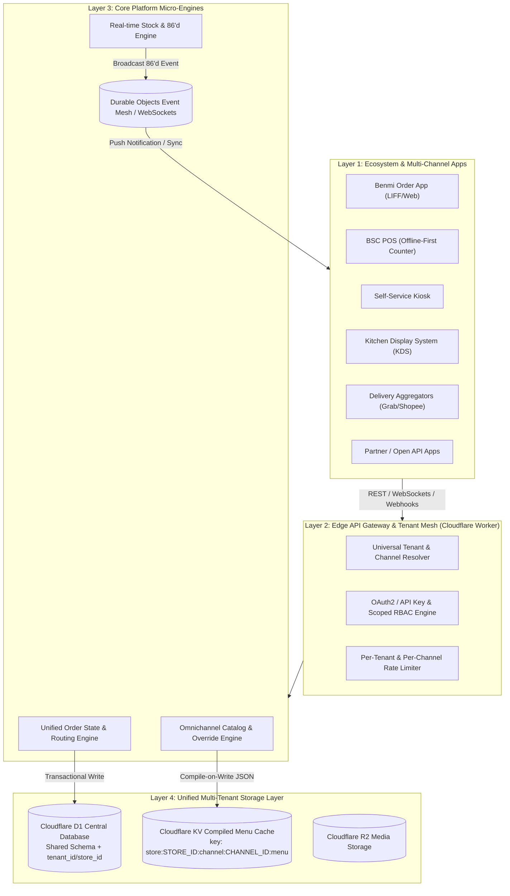
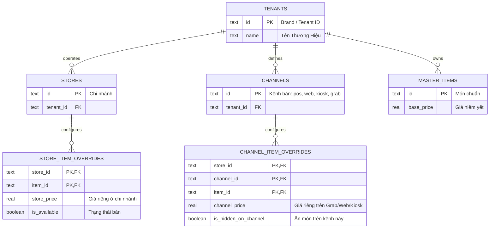
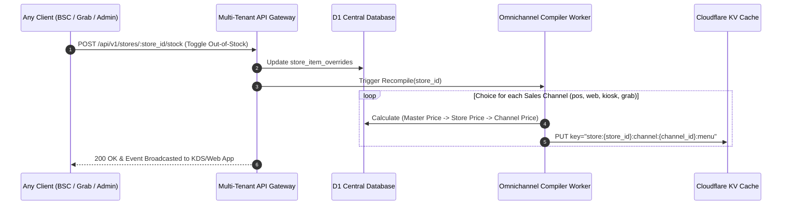

# PDP: Universal Multi-Tenant Platform Engine & Omnichannel Custom Menu Architecture

| Metric | Target |
| :--- | :--- |
| **Status** | PROPOSED (EVOLVED TO PLATFORM CORE) |
| **Author** | Principal Systems Engineer |
| **Date** | 2026-07-23 |
| **Target System** | Universal Multi-Tenant F&B Engine (Benmi, BSC POS, Kiosk, KDS, Delivery Integrations, Partner Apps) |
| **Target Stack** | Cloudflare Workers (Hono), D1 (SQLite), KV Cache, Durable Objects / Event Mesh |

---

## 1. Executive Summary & Objectives

### 1.1 Problem Statement & Platform Vision
Hệ thống không chỉ dừng lại ở hai ứng dụng riêng lẻ **Benmi Order** (Web/LINE LIFF) và **BSC POS** (Counter POS), mà đang phát triển thành một **Hệ điều hành / Nền tảng Core Multi-Tenant F&B (Platform Core)**.

Trong tương lai, nền tảng sẽ mở rộng cho vô số kênh và ứng dụng cắm vào (Plug-and-Play Ecosystem):
- **First-party Apps:** Benmi Order, BSC Counter POS, Self-Service Kiosks, Kitchen Display Systems (KDS), Table QR Ordering.
- **Third-party & Partner Integrations:** Kênh giao hàng tự động (GrabFood, ShopeeFood, Foodpanda), Hệ thống Quản trị Kho / CRM / Loyalty từ bên thứ 3, và Open API dành cho các đối tác Franchise.



Thách thức kiến trúc lớn nhất:
1. **Khả năng Scale Vô hạn cho Mọi Ứng dụng (Omnichannel Read Latency < 5ms):** Đảm bảo hàng trăm nghìn Client đọc Menu cùng lúc trên đa kênh không làm quá tải Database D1.
2. **Ma trận Custom Menu Đa Kênh (Multi-Tenant & Omnichannel Menu Matrix):** Menu kế thừa 4 cấp: **Brand Master $\rightarrow$ Store Branch $\rightarrow$ Sales Channel (POS vs Web vs GrabFood) $\rightarrow$ Real-time Availability (86'd status)**.
3. **Cô lập Hộ thuê & Định danh Ứng dụng (Tenant & Channel Isolation):** Quản lý quyền hạn (RBAC), API Keys, và Rate-Limiting theo từng Tenant và từng Channel.

### 1.2 Goals (In-Scope)
- **Omnichannel Menu Latency < 5ms:** Phản hồi Menu trên Cloudflare KV Cache theo từng `(store_id, channel_id)` mà không chạm vào Primary Database D1.
- **Matrix Override Engine:** Hỗ trợ override linh hoạt: Giá POS khác giá Web, giá GrabFood khác giá tại bàn, tự động ẩn món khi POS báo hết hàng.
- **Universal Event Mesh:** Phát sóng sự kiện thời gian thực (Real-time Event Broadcasting) tới tất cả các app (KDS nhảy đơn, POS báo hết món, App khách cập nhật menu) thông qua Durable Objects / WebSockets.
- **Multi-Tenant API Gateway:** Xử lý Auth, Tenant Isolation, Channel Resolution, và Rate Limiting tự động cho mọi app hiện tại và tương lai.

### 1.3 Non-Goals (Out-of-Scope)
- Xử lý chi tiết thuật toán định tuyến tài xế giao hàng tự viện.

---

## 2. Context & Platform Core Architecture

Chúng tôi chuyển đổi mô hình từ **Point-to-Point Coupling** (Worker phục vụ riêng Benmi/BSC) sang mô hình **Platform Core & API Gateway Engine**:



---

## 3. Proposed Architecture: Universal Platform Engine

### 3.1 4-Layer System Architecture Diagram



---

### 3.2 Omnichannel Custom Menu Matrix (Data Schema D1 SQL)

Mô hình dữ liệu ma trận 4 cấp cho Custom Menu:



#### DDL Schema Chi Tiết (D1 SQL):

```sql
-- 1. Kênh bán hàng (Sales Channels: 'pos', 'web_order', 'kiosk', 'grabfood', 'shopeefood')
CREATE TABLE IF NOT EXISTS channels (
    id TEXT PRIMARY KEY,               -- e.g. 'pos', 'web_order', 'kiosk', 'grabfood'
    tenant_id TEXT NOT NULL,
    name TEXT NOT NULL,
    description TEXT,
    created_at DATETIME DEFAULT CURRENT_TIMESTAMP,
    FOREIGN KEY (tenant_id) REFERENCES tenants(id) ON DELETE CASCADE,
    UNIQUE(tenant_id, id)
);

-- 2. Master Menu Items (Món chuẩn gốc của Thương hiệu)
CREATE TABLE IF NOT EXISTS master_items (
    id TEXT PRIMARY KEY,
    tenant_id TEXT NOT NULL,
    category_id TEXT NOT NULL,
    name TEXT NOT NULL,
    base_price REAL NOT NULL CHECK(base_price >= 0),
    description TEXT,
    image_url TEXT,
    sort_order INTEGER DEFAULT 0,
    created_at DATETIME DEFAULT CURRENT_TIMESTAMP,
    FOREIGN KEY (tenant_id) REFERENCES tenants(id) ON DELETE CASCADE
);

-- 3. Override ở Cấp Chi nhánh (Store Level Overrides)
CREATE TABLE IF NOT EXISTS store_item_overrides (
    store_id TEXT NOT NULL,
    item_id TEXT NOT NULL,
    override_price REAL,              -- NULL: Dùng base_price
    is_available BOOLEAN DEFAULT 1,   -- 0: Chi nhánh ngưng bán
    out_of_stock_until DATETIME,      -- Tạm hết hàng
    PRIMARY KEY (store_id, item_id),
    FOREIGN KEY (store_id) REFERENCES stores(id) ON DELETE CASCADE,
    FOREIGN KEY (item_id) REFERENCES master_items(id) ON DELETE CASCADE
);

-- 4. Override ở Cấp Kênh Bán Hàng (Channel Level Overrides)
CREATE TABLE IF NOT EXISTS channel_item_overrides (
    store_id TEXT NOT NULL,
    channel_id TEXT NOT NULL,
    item_id TEXT NOT NULL,
    channel_price REAL,               -- Giá trên kênh (VD: GrabFood cộng thêm 20%)
    is_hidden BOOLEAN DEFAULT 0,      -- Ẩn món này riêng trên kênh Grab/Kiosk
    PRIMARY KEY (store_id, channel_id, item_id),
    FOREIGN KEY (store_id) REFERENCES stores(id) ON DELETE CASCADE,
    FOREIGN KEY (channel_id) REFERENCES channels(id) ON DELETE CASCADE,
    FOREIGN KEY (item_id) REFERENCES master_items(id) ON DELETE CASCADE
);

-- Indexing đa kênh cho tốc độ biên dịch < 10ms
CREATE INDEX IF NOT EXISTS idx_channel_overrides ON channel_item_overrides(store_id, channel_id);
```

---

### 3.3 Multi-Channel Compile-on-Write Engine

Mỗi khi Store hoặc Admin có thao tác điều chỉnh Menu hoặc Báo hết hàng:



**JSON Payload được Biên dịch sẵn trong Cloudflare KV cho Kênh Web Order (`store:store-q1:channel:web_order:menu`):**
```json
{
  "tenant_id": "benmi-bakery",
  "store_id": "store-q1",
  "channel_id": "web_order",
  "version_hash": "b9e20f1a88",
  "updated_at": "2026-07-23T23:08:00Z",
  "categories": [
    {
      "id": "cat_bm",
      "name": "Bánh Mì",
      "items": [
        {
          "id": "item_bm_tc",
          "name": "Bánh Mì Thập Cẩm",
          "final_price": 40000,
          "is_available": true,
          "is_out_of_stock": false
        }
      ]
    }
  ]
}
```

---

## 4. Platform Security, Authentication & Scoped RBAC

Mọi ứng dụng (First-party như Benmi/BSC hay Third-party như Kiosk/Grab) kết nối vào Nền tảng đều phải thông qua **Universal Auth Engine**:

### 4.1 Token & API Key Scoping
- **First-party Apps (Benmi / BSC POS / KDS):** Sử dụng **Tenant-Scoped JWT** với các claims:
  ```json
  {
    "sub": "user_123",
    "tenant_id": "benmi-bakery",
    "store_id": "store-q1",
    "scopes": ["orders:read", "orders:write", "stock:update"]
  }
  ```
- **Third-party Apps & Open API (Kiosk / Grab Integrations):** Sử dụng **Hashed API Keys** đính kèm trong header `X-Platform-Api-Key` với scope cố định (VD: `channel:grabfood:sync`).

---

## 5. Alternatives Considered & Trade-offs

| Tiêu chí | Option A: App-Specific Backends (Benmi Worker + BSC Worker riêng) | Option B: Universal Platform Core Engine (Selected) |
| :--- | :--- | :--- |
| **Khả năng mở rộng ứng dụng mới** | Rất chậm. Mỗi app mới (Kiosk/KDS) lại phải viết backend riêng hoặc copy-paste code. | **Tức thì (Plug-and-Play).** App mới chỉ cần gọi Universal Open APIs. |
| **Tính nhất quán dữ liệu** | Dễ lệch giá và lệch đơn giữa các app khác nhau. | Dữ liệu tập trung hoàn toàn tại 1 Core Engine duy nhất. |
| **Quản trị Multi-Tenant** | Phải cấu hình hạ tầng lặp lại nhiều lần. | Quản lý Auth, Quota, Isolation tập trung tại API Gateway. |
| **Chi phí vận hành** | Cao do nhân bản nhiều Worker/DB. | **Cực thấp.** Tận dụng Cloudflare Worker & D1 chung. |

---

## 6. Step-by-Step Execution Plan

- [ ] **Phase 1: Universal Multi-Tenant API Gateway Setup**
  - [ ] Xây dựng Router phân giải `tenant_id`, `store_id`, `channel_id` từ Subdomain / Headers / API Key.
  - [ ] Cấu hình Middleware mã hoá và xác thực JWT / API Key với Scoped RBAC.

- [ ] **Phase 2: Omnichannel Custom Menu Matrix & Compiler**
  - [ ] Tạo file migration `0007_create_channels_and_matrix_overrides.sql`.
  - [ ] Xây dựng engine `OmnichannelMenuCompiler` tổng hợp Menu theo từng `(store_id, channel_id)` đưa vào KV Cache.

- [ ] **Phase 3: Universal Event Mesh (Durable Objects WebSockets)**
  - [ ] Xây dựng Durable Objects Hub để broadcast các sự kiện: `ORDER_CREATED`, `ITEM_OUT_OF_STOCK`, `ORDER_STATUS_CHANGED` tới tất cả các app đang kết nối (POS, KDS, Web App).

- [ ] **Phase 4: Ecosystem SDK & Open API Onboarding**
  - [ ] Phát hành TypeScript / REST SDK chuẩn cho Benmi, BSC POS, Kiosk và các bên thứ 3.
  - [ ] Chuyển đổi toàn bộ ứng dụng sang kết nối qua Universal Platform Core.

---

## 7. Verification & Test Plan

### 7.1 Automated Integration Verification
```typescript
// Test kiểm tra Ma trận Override Giá đa kênh
test("Omnichannel Price Matrix Calculation", async () => {
  // Master Price = 30,000 | Store Price = 35,000 | Grab Channel Price = 42,000
  const webMenu = await fetchCompiledMenu({ storeId: "q1", channelId: "web_order" });
  const grabMenu = await fetchCompiledMenu({ storeId: "q1", channelId: "grabfood" });

  expect(webMenu.items["bm_tc"].final_price).toBe(35000);
  expect(grabMenu.items["bm_tc"].final_price).toBe(42000);
});
```

### 7.2 Manual Verification Commands
```bash
# 1. Khai báo Kênh Bán Hàng mới (Ví dụ: Self-Service Kiosk)
curl -i -X POST "https://api.benmi.vn/api/v1/admin/channels" \
  -H "Authorization: Bearer <ADMIN_JWT>" \
  -d '{"id": "kiosk", "name": "Self-Service Kiosk"}'

# 2. Đọc Menu đã Biên dịch riêng cho Kênh Kiosk của Chi nhánh Q1
curl -i -X GET "https://api.benmi.vn/api/v1/public/store/store-q1/channel/kiosk/menu"
```
