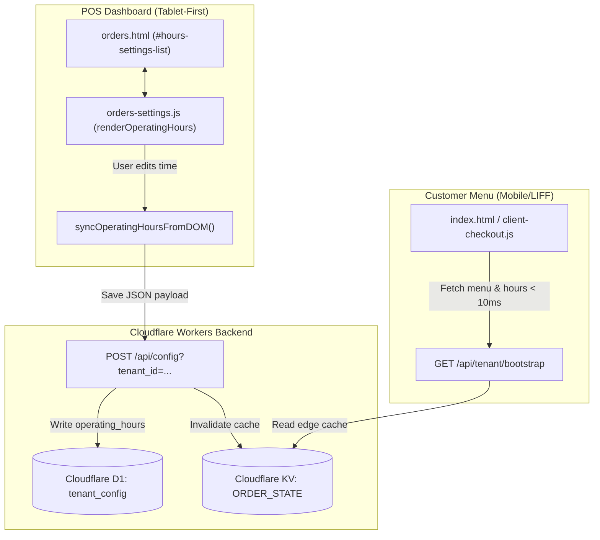

# PDP: Operating Hours Settings & Synchronization Fix

- **Status**: Proposed
- **Author**: Principal Engineer (Antigravity Agent)
- **Scope**: POS Store Settings (`orders.html`, `js/orders-settings.js`), Backend Sync (`config.ts`, `bootstrap.ts`), Multi-Tenant Edge Cache.

---

## 1. Executive Summary & Objectives

### 1.1 Problem Statement
1. Khi mở tab Cài đặt trên POS Dashboard (`orders.html`), phần **"⏰ 營業時間設定 / Cài đặt giờ mở cửa"** hoàn toàn không hiển thị danh sách ngày và các ca mở cửa đã thiết lập của quán.
2. Khi bấm lưu, hệ thống không thể đồng bộ hoặc lưu trữ đúng các ca hoạt động lên Cloudflare D1 và KV Edge Cache.

### 1.2 Root Cause Analysis (RCA)
- **DOM Container ID Mismatch**: File `orders.html` khai báo thẻ container danh sách giờ mở cửa là `<div id="hours-settings-list">`, nhưng trong `js/orders-settings.js` (dòng 331), hàm `renderOperatingHours()` lại truy vấn `document.getElementById("settings-hours-container")`.
- Vì `container === null`, `renderOperatingHours()` lập tức trả về (early exit), khiến toàn bộ giao diện cấu hình giờ mở cửa của 7 ngày trong tuần bị rỗng.
- Khi bấm **"儲存設定" (Lưu thiết lập)**, hàm `syncOperatingHoursFromDOM()` không tìm thấy các thẻ input `<input id="sh-start-${i}-${sIdx}">` để đọc dữ liệu, dẫn đến việc không thể cập nhật cấu hình giờ mở cửa.

### 1.3 Objectives (In-Scope)
1. **Sửa lỗi hiển thị & đồng bộ**: Khớp ID container giữa `orders.html` và `js/orders-settings.js` (`hours-settings-list`).
2. **Nâng cấp Tablet-First UI/UX**:
   - Thiết kế giao diện danh sách 7 ngày trong tuần với kích thước vùng chạm tối thiểu **48px**, các nút bấm to rõ cho màn hình iPad/POS tại quầy.
   - Thẻ hiển thị rõ trạng thái Mở cửa (kèm các ca `HH:mm - HH:mm`, nút `+ Thêm ca`, nút xóa `✕`) hoặc trạng thái Đóng cửa / Nghỉ (`公休` / `Đóng cửa`).
3. **Bảo toàn tính nhất quán Đa Cửa Hàng (Multi-Tenant 1,000+)**:
   - Dữ liệu lưu dưới dạng JSON chuẩn `{ "0": [...], "1": [...], ..., "6": [...] }` trong D1 `tenant_config.operating_hours`.
   - Tự động làm mới bộ nhớ đệm Edge Cache (`tenant:{tenant_id}:bootstrap` & `tenant:{tenant_id}:config_cache`) ngay khi bấm lưu.
   - Menu khách hàng (`index.html` / `client-checkout.js`) đọc trực tiếp `parsedHours` từ bootstrap và hiển thị chính xác khung giờ đặt món.

---

## 2. System Architecture & Data Flow



---

## 3. Detailed Implementation Plan

### Phase 1: Frontend POS Fix & Modernization (`orders.html` & `js/orders-settings.js`)
1. **Chuẩn hóa ID & DOM Query**:
   - Đồng bộ `document.getElementById("hours-settings-list")`.
2. **Nâng cấp UI Card 7 Ngày (Tablet-First)**:
   - Header mỗi ngày: Checkbox to (20x20px), Tên thứ (`Thứ 2` .. `Chủ nhật` / `星期一` .. `星期日`), Badge trạng thái màu xanh khi mở / màu xám nhạt kèm nhãn `公休` khi nghỉ.
   - Hàng ca hoạt động: Input thời gian dạng native `<input type="time">` chuẩn POS, nút bấm xóa ca dạng nút bo góc thân thiện (`✕`).
   - Nút `+ Thêm ca` (`+ 新增時段`): Thiết kế chuẩn nút chạm (chiều cao >= 40px, màu xanh pastel `#eff6ff` tương phản chữ xanh đậm `#2563eb`).
3. **Xử lý I18N & Fallback đa dạng**:
   - Hỗ trợ đầy đủ song ngữ `zh-TW` và `vi` cho các nhãn `btnAddShift`, `closedDay`, `openDay`, `saveOperatingHours`.

### Phase 2: Dữ Liệu & Backend Edge Invalidation (`config.ts` & `bootstrap.ts`)
1. Kiểm tra hàm `parseOperatingHours` đảm bảo parse an toàn cả dữ liệu dạng chuỗi mô tả (legacy text: `"11:00-21:00"`) và dạng mảng cấu trúc JSON (`{ "0": [{"start":"08:00","end":"21:00"}] }`).
2. Khi `updateConfig` nhận `operatingHours`, đảm bảo lưu dạng chuỗi JSON `JSON.stringify(operatingHours)` và kích hoạt lệnh xóa cache:
   ```typescript
   await env.ORDER_STATE.delete(`tenant:${tenantId}:config_cache`);
   await invalidateBootstrapCache(tenantId, env);
   ```

---

## 4. Alternatives Considered & Trade-offs

| Tiêu chí | Phương Án A (Đề Xuất - Structured 7-Day JSON) | Phương Án B (Legacy Text String) |
| :--- | :--- | :--- |
| **Độ chính xác** | 100% chính xác từng ngày, hỗ trợ nhiều ca/ngày | Dễ sai lệch khi phân tích chuỗi văn bản tự do |
| **Trải nghiệm POS** | Trực quan, chọn giờ bằng time picker cảm ứng | Phải gõ text thủ công, dễ nhầm dấu câu |
| **Độ trễ tải trang** | `< 10ms` nhờ KV Edge Caching cấu trúc | Phải parse regex thời gian thực |

---

## 5. Verification Plan

1. **Kiểm tra hiển thị**: Mở tab Cài đặt -> Danh sách 7 ngày hiển thị đầy đủ, đúng giờ đã lưu từ CSDL.
2. **Kiểm tra tương tác**:
   - Bật/tắt checkbox ngày nghỉ.
   - Thêm ca mới và chỉnh sửa giờ bắt đầu / giờ kết thúc.
   - Xóa ca.
3. **Kiểm tra lưu trữ & Cache**:
   - Bấm **"儲存設定"** -> Nhận thông báo lưu thành công.
   - Tải lại trang POS (`F5`) -> Giờ mở cửa mới hiển thị chính xác.
   - Mở trang Menu khách hàng (`index.html`) -> Khung giờ hẹn lấy món cập nhật ngay lập tức.
