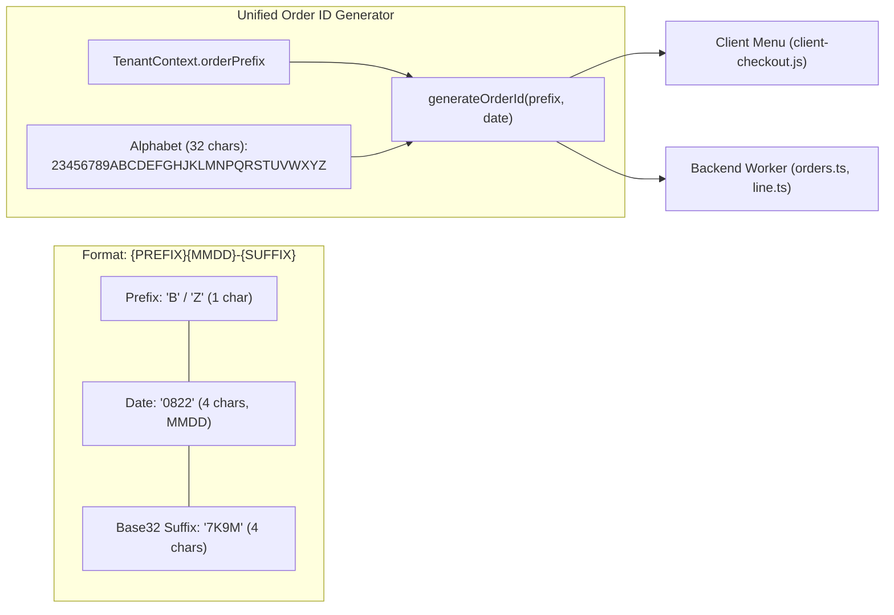

# Principal Design Proposal (PDP)
# PDP: Concise & Collision-Resistant Order ID Format Refactor [Refactor]

**Document Identifier**: `PDP-2026-ORDER-ID-001`  
**Author**: Principal Engineer  
**Status**: Proposed (Aligned via `/grill-me`)  
**Target Systems**: `js/client-checkout.js` (Client Menu LIFF), `benmi-worker-official` (`orders.ts`, `line.ts`, `tenant.ts`), `orders.html` (Counter POS)

---

## 1. Executive Summary & Objectives

### 1.1. Problem Statement
The current Order ID generation mechanism produces lengthy identifiers (e.g. `B0822-1640-345` or `B0822-2247-4056`, 14-16 characters). These long IDs create several operational friction points:
1. **Counter Usability**: Cashiers and kitchen staff struggle to quickly read and shout order codes out loud to waiting customers.
2. **Thermal Receipt Width & Mobile Screen Cramping**: On small 58mm POS thermal printers and compact mobile notifications, long IDs wrap onto multiple lines or take up excessive header space.
3. **Hardcoded Brand Prefix**: The prefix `B` is hardcoded in several backend routines, conflicting with the multi-tenant architecture where different merchants (`zhadantongxue`, `jidangaodashu`, `bsc`) need distinct branding identifiers.

### 1.2. Goals (In-Scope)
- **Compact & High-Entropy Format**: Reduce Order ID to **10 characters** (e.g. `B0822-7K9M`).
- **Human-Readable & Non-Ambiguous Character Set**: Use a customized 32-character alphanumeric alphabet (`23456789ABCDEFGHJKLMNPQRSTUVWXYZ`), explicitly eliminating ambiguous characters (`0`, `O`, `1`, `I`).
- **Zero Collision Risk**: 4-character Base32 suffix provides $32^4 = 1,048,576$ combinations per store per day.
- **Configurable Multi-Tenant Prefix**: Add `order_prefix` support in `tenant_config` with automatic fallback to `tenantId.charAt(0).toUpperCase()`.
- **Full Backwards Compatibility**: Support querying and webhook processing for all legacy Order ID formats (`B\d{4}-\d{4}-\d{4}`, `BD\d+-\d+-\d+`).

### 1.3. Non-Goals (Out-of-Scope)
- Modifying primary keys of historical orders in D1 database (past order records retain their original keys).

---

## 2. Context & Current Architecture

### 2.1. Existing ID Generators
1. **Frontend Checkout (`js/client-checkout.js#L150-L158`)**:
   ```javascript
   const prefix = isBenmiTenant ? 'B' : (getTenantIdFromUrl() === 'zhadantongxue' ? 'Z' : 'O');
   return `${prefix}${month}${day}-${hours}${mins}-${randomSeq}`; // e.g. B0822-1640-345
   ```
2. **Backend Orders Fallback (`orders.ts#L45`)**:
   ```typescript
   const orderKey = data.orderId || data.key || `B${dateStr}-${tempRandomId}`;
   ```
3. **LINE Webhook Fallback & Regex (`line.ts#L668, L708`)**:
   ```typescript
   const match = userText.match(/B\d{4}-\d{4}-\d{4}/) || userText.match(/BD\d+-\d+-\d+/);
   ```

---

## 3. Proposed Architecture & Design



### 3.1. Data Models & Database Migration

#### Migration: `migrations/0024_add_order_prefix.sql`
```sql
-- Migration: 0024_add_order_prefix.sql
-- Description: Add configurable order_prefix to tenant_config

ALTER TABLE tenant_config ADD COLUMN order_prefix TEXT DEFAULT NULL;

-- Initialize default prefixes for active tenants
UPDATE tenant_config SET order_prefix = 'B' WHERE tenant_id = 'benmi';
UPDATE tenant_config SET order_prefix = 'Z' WHERE tenant_id = 'zhadantongxue';
UPDATE tenant_config SET order_prefix = 'K' WHERE tenant_id = 'bsc';
UPDATE tenant_config SET order_prefix = 'J' WHERE tenant_id = 'jidangaodashu';
```

#### TypeScript Types: `benmi-worker-official/src/types/tenant.ts`
```typescript
export interface TenantContext {
  // ...
  orderPrefix?: string | null;
  // ...
}

export function resolveTenantOrderPrefix(ctx: TenantContext | null | undefined, tenantId: string): string {
  if (ctx?.orderPrefix && ctx.orderPrefix.trim().length > 0) {
    return ctx.orderPrefix.trim().toUpperCase();
  }
  return tenantId.charAt(0).toUpperCase() || 'O';
}
```

### 3.2. Uniform Order ID Generation Logic
```javascript
// Base32 Character Set (Excludes 0, O, 1, I)
const ORDER_ID_ALPHABET = "23456789ABCDEFGHJKLMNPQRSTUVWXYZ";

function generateOrderSuffix(length = 4) {
  let suffix = "";
  for (let i = 0; i < length; i++) {
    const idx = Math.floor(Math.random() * ORDER_ID_ALPHABET.length);
    suffix += ORDER_ID_ALPHABET[idx];
  }
  return suffix;
}

function formatNewOrderId(prefix, dateObj = new Date()) {
  const mm = String(dateObj.getMonth() + 1).padStart(2, "0");
  const dd = String(dateObj.getDate()).padStart(2, "0");
  const suffix = generateOrderSuffix(4);
  return `${prefix}${mm}${dd}-${suffix}`; // e.g. B0822-7K9M
}
```

---

## 4. Migration & Rollout Strategy

### 4.1. Backward & Forward Compatibility
1. **Dual Regex Support in LINE Parser**:
   ```typescript
   // Matches new format: B0822-7K9M, Z0822-4W2N, etc.
   // Matches legacy format: B0822-1640-345, BD0822-1640-345, etc.
   const ORDER_KEY_REGEX = /(?:[A-Z0-9]{1,4}\d{4}-[A-Z0-9]{4}|[A-Z0-9]+\d{4}-\d{4}-\d{4}|BD\d+-\d+-\d+)/i;
   ```
2. **Database Primary Key**:
   - `orders.key` is `TEXT PRIMARY KEY`, accommodating any string length without schema friction.

---

## 5. Execution Plan

### Milestone 1: Database Migration & Cloudflare Worker
- [ ] Create [`migrations/0024_add_order_prefix.sql`](file:///Users/duccao/Documents/benmi-order/benmi-worker-official/migrations/0024_add_order_prefix.sql).
- [ ] Update [`src/types/tenant.ts`](file:///Users/duccao/Documents/benmi-order/benmi-worker-official/src/types/tenant.ts) and [`src/modules/tenant.ts`](file:///Users/duccao/Documents/benmi-order/benmi-worker-official/src/modules/tenant.ts) with `orderPrefix` and `resolveTenantOrderPrefix()`.
- [ ] Update [`src/modules/bootstrap.ts`](file:///Users/duccao/Documents/benmi-order/benmi-worker-official/src/modules/bootstrap.ts) to include `orderPrefix` in `BootstrapResponse.tenant`.
- [ ] Update [`src/modules/orders.ts`](file:///Users/duccao/Documents/benmi-order/benmi-worker-official/src/modules/orders.ts) fallback ID generation with Base32 format.
- [ ] Update [`src/modules/line.ts`](file:///Users/duccao/Documents/benmi-order/benmi-worker-official/src/modules/line.ts) regex pattern matching and fallback generation.

### Milestone 2: Customer Menu Frontend
- [ ] Update [`js/client-checkout.js`](file:///Users/duccao/Documents/benmi-order/js/client-checkout.js) `generateOrderNumber()` to use `storeConfig.orderPrefix` and Base32 4-character suffix.

### Milestone 3: Staging Verification
- [ ] Apply migration `0024` on `blab-db-test`.
- [ ] Deploy worker to staging (`platform-worker-staging`).
- [ ] Commit & push frontend changes to `staging` branch.
- [ ] Submit test orders and verify ID formats across `benmi` (`B0822-XXXX`) and other tenants (`Z0822-XXXX`).

---

## 6. Verification Plan

### Automated Verification
```bash
cd benmi-worker-official && npx tsc --noEmit
```

### Manual Verification
- Test client order creation on Menu -> Confirm generated Order ID matches format (e.g. `B0822-7K9M`, 10 chars).
- Verify POS Order Tiles display clean, compact `#B0822-7K9M`.
- Test LINE progress query with `#B0822-7K9M` -> Verify webhook correctly identifies order.
