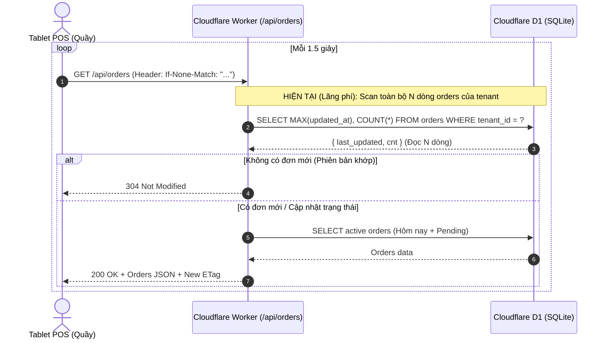
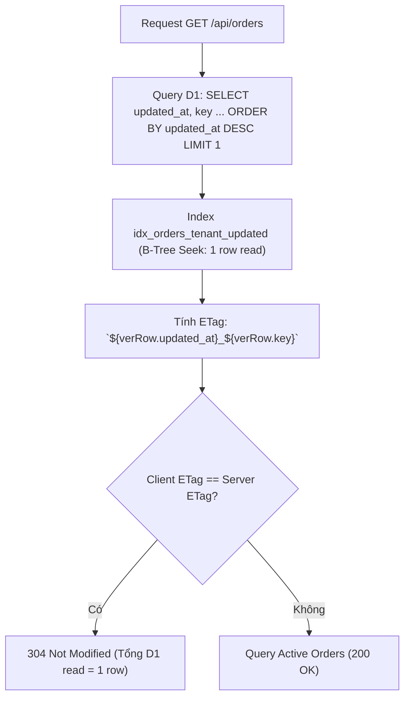

# PDP: Orders Live Query Row Read Optimization [Fix/Optimize]

## 1. Executive Summary & Objectives

### Problem Statement
Trang POS Dashboard thực hiện polling dữ liệu đơn hàng liên tục mỗi **1.5 giây** thông qua endpoint `/api/orders?tenant_id=...`.
Để tạo mã ETag nhằm trả về phản hồi `304 Not Modified`, Worker hiện đang thực hiện câu truy vấn:
```sql
SELECT MAX(updated_at) as last_updated, COUNT(*) as cnt FROM orders WHERE tenant_id = ?
```
Do có hàm tổng hợp `COUNT(*)`, SQLite/D1 buộc phải duyệt qua **toàn bộ các dòng lịch sử đơn hàng của quán** (Full Index/Table Scan) trên mỗi lần poll.
- Với 1 quán có 5,000 đơn hàng: Mỗi lần poll đọc 5,000 dòng $\rightarrow$ **~288 triệu dòng đọc (Row Reads)/ngày/quán**.
- Khi mở rộng lên 100 – 1,000 quán, số lượng Row Reads tăng theo cấp số nhân, gây lãng phí tài nguyên và chi phí Cloudflare D1.

### Goals (In-Scope)
- Giảm số lượng Row Reads của câu truy vấn kiểm tra phiên bản từ **$O(N)$ (toàn bộ lịch sử quán) về $O(1)$ (đúng 1 dòng duy nhất/lần poll)**.
- Tiết kiệm **> 99.98% số dòng đọc D1** cho endpoint `/api/orders`.
- Đảm bảo 100% độ chính xác của cơ chế ETag / `304 Not Modified` cho POS và khách hàng, không làm trễ hay mất thông báo đơn mới/cập nhật đơn.
- Zero-downtime, tương thích ngược hoàn toàn với Frontend POS hiện tại.

### Non-Goals (Out-of-Scope)
- Thay đổi chu kỳ polling 1.5s của Frontend POS (giữ nguyên trải nghiệm realtime nhạy bén cho nhân viên quầy).
- Tái cấu trúc toàn bộ schema bảng `orders`.

---

## 2. Context & Current Architecture

### Vị Trí Code Hiện Tại:
- **Backend Worker**: [`benmi-worker-official/src/modules/orders.ts:L549-L556`](file:///Users/duccao/Documents/benmi-order/benmi-worker-official/src/modules/orders.ts#L549-L556)
- **Frontend POS Polling**: [`js/orders-core.js:L351-L355`](file:///Users/duccao/Documents/benmi-order/js/orders-core.js#L351-L355) (Interval 1.5s gọi `fetchOrders`)
- **Index Hiện Có trong D1**: [`benmi-worker-official/migrations/0007_add_performance_indexes.sql`](file:///Users/duccao/Documents/benmi-order/benmi-worker-official/migrations/0007_add_performance_indexes.sql) đã có chỉ mục `idx_orders_tenant_updated ON orders(tenant_id, updated_at DESC)`.



---

## 3. Proposed Architecture

### Tối Ưu Hóa Query Kiểm Tra Phiên Bản ($O(1)$ Row Read)

Thay thế câu lệnh tổng hợp `COUNT(*)` bằng truy vấn lấy dòng mới nhất dựa trên Index `idx_orders_tenant_updated(tenant_id, updated_at DESC)`:

```sql
SELECT updated_at, key FROM orders WHERE tenant_id = ? ORDER BY updated_at DESC LIMIT 1
```



### Tại sao truy vấn này tối ưu và an toàn tuyệt đối?
1. **Chỉ đọc đúng 1 dòng trong B-Tree Index**: D1 định vị nhánh `tenant_id = ?` và đọc ngay phần tử đầu tiên của cây chỉ mục (đã được sắp xếp `updated_at DESC`), sau đó dừng lại ngay lập tức nhờ `LIMIT 1`.
2. **Đảm bảo tính toàn vẹn ETag**:
   - Khi có đơn mới tạo $\rightarrow$ Dòng mới nhất có `created_at` = `updated_at` lớn nhất và `key` mới $\rightarrow$ ETag thay đổi $\rightarrow$ Client tải đơn mới ngay.
   - Khi cập nhật đơn (Nhận đơn, Hoàn tất, Hủy đơn, Đổi giờ) $\rightarrow$ Câu lệnh UPDATE luôn gán `updated_at = CURRENT_TIMESTAMP` $\rightarrow$ Dòng vừa sửa nhảy lên đầu danh sách $\rightarrow$ ETag thay đổi $\rightarrow$ Client tải cập nhật ngay.
   - Khi append món vào đơn (Multi-round) $\rightarrow$ `updated_at = CURRENT_TIMESTAMP` $\rightarrow$ ETag thay đổi $\rightarrow$ Chuông báo món gọi thêm vang lên ngay.

---

## 4. Bảng So Sánh Hiệu Năng & Chi Phí (Performance & Cost Analysis)

| Tiêu Chí | Thiết Kế Cũ (Hiện Tại) | Thiết Kế Mới (Tối Ưu $O(1)$) | Mức Độ Cải Thiện |
| :--- | :--- | :--- | :--- |
| **Độ phức tạp** | $O(N)$ (Quét toàn bộ $N$ đơn hàng của quán) | $O(1)$ (Chỉ đọc đúng 1 dòng đầu của Index) | **Nhanh gấp $N$ lần** |
| **Row Reads / 1 lần poll (Quán có 5,000 đơn)** | 5,000 rows | **1 row** | **Giảm 99.98%** |
| **Row Reads / Ngày / 1 màn hình POS** | ~288,000,000 rows | **~57,600 rows** | **Tiết kiệm 287.9 triệu reads/ngày** |
| **Row Reads / Ngày / 1,000 Quán POS** | ~288 TỶ rows/ngày | **~57.6 TRIỆU rows/ngày** | **Khả thi trên hạ tầng Cloudflare D1** |
| **Thời gian phản hồi 304 Not Modified** | ~15 - 35ms | **< 3 - 6ms** | **Phản hồi tức thì** |

---

## 5. Alternatives Considered & Trade-offs

### Phương Án A: Lưu State Version trên Cloudflare KV (`ORDER_STATE`)
- **Mô tả**: Mỗi khi có đơn mới / đổi trạng thái, Worker ghi thêm 1 key `tenant:{tenant_id}:orders_version` vào KV. Polling đọc KV (0 D1 read khi 304).
- **Lý do không chọn**:
  - Cloudflare KV có độ trễ truyền dữ liệu toàn cầu (Eventual Consistency ~ 1-3s). Trong môi trường POS quầy cần đồng bộ tức thì (< 100ms), SQLite D1 là nguồn sự thật duy nhất và đảm bảo tính nhất quán (Strong Consistency) tuyệt đối.
  - Tăng độ phức tạp vì phải đảm bảo tất cả các điểm ghi (API, LINE Webhook, Cron) đều phải cập nhật KV.

### Phương Án B: Sửa Query thành Single-Row D1 Read (ĐÃ CHỌN)
- **Ưu điểm**:
  - Không cần sửa cấu trúc bảng (Zero Migration).
  - Sử dụng ngay Index `idx_orders_tenant_updated` đã có sẵn trong D1.
  - Đạt tính nhất quán 100% ACID của SQLite, không bị lệch trạng thái giữa nhiều POS.
  - Code tinh gọn, an toàn, dễ bảo trì.

---

## 6. Chi Tiết Thực Hiện (Implementation Diff)

Trong file [`benmi-worker-official/src/modules/orders.ts`](file:///Users/duccao/Documents/benmi-order/benmi-worker-official/src/modules/orders.ts):

```typescript
export async function getOrders(request: Request, env: Env): Promise<Response> {
  const tenantId = getTenantId(request);

  if (!env.DB) return jsonWithETag([], "0");

  try {
    // 1. Tính toán ETag version tức thì dựa trên Index D1 (Tối ưu O(1) - Chỉ đọc đúng 1 dòng)
    const verRow = await env.DB.prepare(
      "SELECT updated_at, key FROM orders WHERE tenant_id = ? ORDER BY updated_at DESC LIMIT 1"
    ).bind(tenantId).first<{ updated_at: string | null; key: string | null }>();

    const lastUpdated = verRow?.updated_at || "0";
    const lastKey = verRow?.key || "empty";
    const currentVersion = `${lastUpdated}_${lastKey}`;

    // 2. Client gửi Header "If-None-Match" -> So sánh với D1 version
    const clientETag = request.headers.get("if-none-match")?.replace(/^W\//, '').replace(/"/g, '');
    if (clientETag && clientETag === currentVersion) {
      return new Response(null, {
        status: 304,
        headers: {
          "Cache-Control": "no-cache, no-store, must-revalidate",
          "ETag": `"${currentVersion}"`,
          ...corsHeaders(),
        },
      });
    }

    // 3. Live Query: Lấy các đơn active + đơn hôm nay (UTC+8)
    const nowTw = new Date(Date.now() + 8 * 3600000);
    const todayTwStr = `${nowTw.getUTCFullYear()}-${String(nowTw.getUTCMonth() + 1).padStart(2, "0")}-${String(nowTw.getUTCDate()).padStart(2, "0")}`;
    const startOfTodayUTC = new Date(new Date(`${todayTwStr}T00:00:00+08:00`).getTime()).toISOString().replace("T", " ").replace(/\.\d+Z$/, "");

    const { results } = await env.DB.prepare(
      `SELECT key, customer_name, pickup_time, status, total_amount, order_content, reason, note, dining_option, table_number, round_count, last_appended_at, created_at 
       FROM orders 
       WHERE tenant_id = ? 
         AND (status IN ('NEW', 'ACCEPTED', 'WAITING_CUSTOMER_CHANGE', 'WAITING_CUSTOMER_REJECT', 'DONE') 
              OR created_at >= ?)
       ORDER BY created_at DESC LIMIT 500`
    ).bind(tenantId, startOfTodayUTC).all<any>();

    const orders = mapOrderRows(results || []);
    return jsonWithETag(orders, currentVersion);
  } catch (e: any) {
    console.error("[getOrders] D1 error:", e);
    return json({ error: "Failed to fetch orders", details: e.message }, 500);
  }
}
```

---

## 7. Execution & Verification Plan

### Execution Steps:
1. Sửa hàm `getOrders` trong `benmi-worker-official/src/modules/orders.ts`.
2. Kiểm tra TypeScript build: `npx tsc --noEmit`.
3. Deploy lên môi trường Staging: `npx wrangler deploy --env test`.
4. Kiểm thử luồng:
   - Gọi `GET /api/orders?tenant_id=benmi` lần 1 $\rightarrow$ Trả về `200 OK` kèm `ETag: "2026-08-..._BM-..."`.
   - Gọi `GET /api/orders?tenant_id=benmi` lần 2 (với header `If-None-Match`) $\rightarrow$ Trả về `304 Not Modified` ngay lập tức.
   - Thử cập nhật trạng thái 1 đơn hàng $\rightarrow$ Gọi lại lần 3 $\rightarrow$ Trả về `200 OK` với dữ liệu mới.
5. Deploy lên môi trường Production: `npx wrangler deploy` và merge vào `main`.
