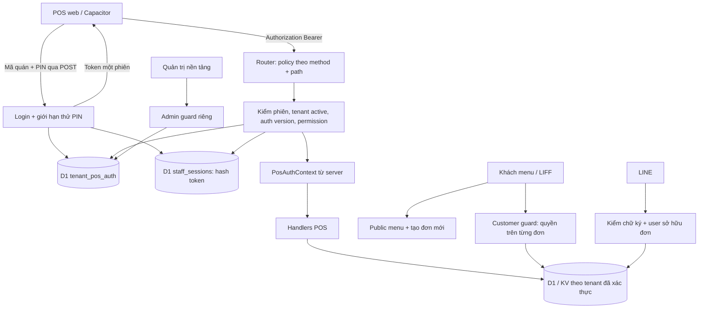

# PDP: Xác thực và phân quyền server cho API POS [New/Replace/Fix]

Ngày: 2026-09-23. Trạng thái: đề xuất triển khai, chưa thay đổi ứng dụng hoặc deploy.
Baseline khảo sát: commit `8d580a9`. Phạm vi người dùng đã chọn: **một PIN chung mỗi quán; bản đầu cách ly quyền theo tenant, chưa tạo tài khoản nhân viên hoặc các vai trò Chủ quán / Quản lý / Thu ngân.**

## 1. Executive Summary & Objectives

### 1.1. Vấn đề đã xác nhận

POS hiện gọi API với tenant do client chọn. `/api/auth` kiểm PIN rồi trả `ok`, nhưng API nghiệp vụ không yêu cầu bằng chứng đăng nhập. Người không đăng nhập có thể đọc danh sách đơn quán B và gửi lệnh đổi trạng thái đơn B chỉ bằng cách khai `tenant_id=B`.

Đã tái hiện cục bộ qua entrypoint Worker thật, D1 Miniflare và dữ liệu giả: GET đơn B không có token trả 200; cập nhật đơn B dưới tenant A trả 404; đổi query sang B trả 200 và đơn chuyển sang DONE. Bộ kiểm thử identity hiện có cũng chạy thành công 17 checks. Đây là bằng chứng trên mã nguồn hiện tại, chưa xác minh phiên bản đang chạy production.

### 1.2. Quyết định đề xuất

- Đăng nhập bằng mã quán + PIN chung, cấp **opaque bearer token** ngẫu nhiên cho từng phiên thiết bị.
- D1 lưu hash token, tenant, thời hạn và phiên bản thông tin xác thực. Mỗi API POS kiểm phiên trên server trước khi đọc/ghi.
- Tenant của phiên là nguồn quyết định quyền. Query/header/body chỉ có thể xác nhận cùng tenant, không thể chuyển tenant.
- Một permission set `tenant_pos` cho mọi phiên PIN hợp lệ của quán. Phân biệt quyền của POS quán, khách hàng và quản trị nền tảng ngay từ bản đầu.
- Tận dụng bảng `staff_sessions` đã có trong migration 0057; bổ sung bảng quản lý PIN và migration nâng cấp phiên.
- Đổi PIN/khóa quán/thu hồi phiên có hiệu lực ở lần kiểm quyền kế tiếp; không dùng KV làm nguồn quyết định quyền.

### 1.3. Mục tiêu và tiêu chí hoàn thành

| Mục tiêu | Tiêu chí nghiệm thu |
|---|---|
| Chặn truy cập ẩn danh vào API POS | Mọi route POS và alias có test 401 khi thiếu/sai/hết hạn token |
| Cách ly quán | Token A không đọc/ghi tài nguyên B qua query, header, body, order ID, item ID hoặc tên ảnh |
| Không có đường cập nhật đơn bỏ qua kiểm quyền | API khách có kiểm quyền trên từng đơn; webhook xác minh chữ ký và chủ sở hữu |
| Thu hồi rõ ràng | Phiên bị revoke, auth version cũ hoặc quán inactive bị từ chối ở request được kiểm quyền sau khi giao dịch thu hồi commit |
| UX phù hợp quầy | Nhập PIN khi bắt đầu phiên; thao tác trong phiên không hỏi lại; web và Capacitor cùng hành vi |
| Đo được hiệu năng | Mục tiêu thử nghiệm: p95 phần kiểm phiên thêm ≤100 ms và p95 đăng nhập ≤2 giây tại vùng phục vụ; phải đo, chưa phải cam kết |
| Mở rộng ≥1.000 tenants | Test 1.000 quán × 2 thiết bị; không hardcode tenant hoặc dùng namespace xác thực toàn cục |

### 1.4. Giới hạn chủ động

Chưa làm tài khoản từng nhân viên, RBAC nhân sự, SSO/MFA, offline authorization hoặc refresh token dài hạn. Với một PIN chung, mọi người biết PIN có cùng quyền quản lý POS của quán; audit xác định phiên/thiết bị, không xác định chắc chắn cá nhân. Phân quyền nền tảng vẫn riêng: PIN quán không được đổi gói tính năng, tích hợp bí mật hoặc trạng thái kích hoạt tenant.

## 2. Context & Current Architecture

### 2.1. Bản đồ mã nguồn

| Thành phần | Hiện trạng và hệ quả |
|---|---|
| [Router Worker](/Users/duccao/Documents/benmi-order/benmi-worker-official/src/index.ts:50) | Resolve tenant từ request rồi gọi handler; không có guard POS |
| [Trích tenant](/Users/duccao/Documents/benmi-order/benmi-worker-official/src/modules/menu.ts:19) | Ưu tiên query rồi header, có fallback mặc định; không dùng helper này để cấp quyền POS |
| [Auth hiện tại](/Users/duccao/Documents/benmi-order/benmi-worker-official/src/modules/auth.ts:7) | PIN plaintext trong KV/default config, có default chung, nhận PIN qua GET; chưa phát token |
| [Kích hoạt POS](/Users/duccao/Documents/benmi-order/js/orders-modals.js:755) | Web bỏ qua modal; sau đăng nhập chỉ lưu tenant trong localStorage |
| [Đọc đơn](/Users/duccao/Documents/benmi-order/js/orders-core.js:719) | Chỉ gửi tenant và ETag; polling mỗi 1,5 giây |
| [Cập nhật đơn](/Users/duccao/Documents/benmi-order/js/orders-live.js:1210) | Gửi body key/status và query tenant, không token |
| [Cập nhật config](/Users/duccao/Documents/benmi-order/benmi-worker-official/src/modules/config.ts:87) | Nhận cả `features`; cần allowlist field phía server |
| [Schema phiên có sẵn](/Users/duccao/Documents/benmi-order/benmi-worker-official/migrations/0057_create_staff_ordering_and_tables.sql:50) | `staff_sessions` có token_hash, tenant, expires/revoked; chưa tìm thấy caller trong runtime hiện tại |
| [LINE webhook](/Users/duccao/Documents/benmi-order/benmi-worker-official/src/modules/line.ts:436) | Đọc JSON trực tiếp; chưa thấy kiểm `x-line-signature` trong entrypoint/handler; có nhánh cập nhật đơn |
| [API sửa đơn khách](/Users/duccao/Documents/benmi-order/benmi-worker-official/src/modules/orders.ts:1580) | Edit-context/modify/append lọc tenant nhưng chưa xác thực chủ sở hữu trên server |
| [Admin](/Users/duccao/Documents/benmi-order/benmi-worker-official/src/modules/admin.ts:6) | Có X-Admin-Key nhưng có fallback secret trong source; phải loại bỏ trước khi dùng cho cấp/reset PIN |
| [Cấu hình môi trường](/Users/duccao/Documents/benmi-order/benmi-worker-official/wrangler.jsonc) | D1 dev/test/prod khác nhau; KV dev và test đang trùng namespace; tách trước migration thông tin xác thực |
| [Capacitor](/Users/duccao/Documents/benmi-order/apps/android-pos/capacitor.config.ts) | Có cả remote web và bundled local; API khác origin; còn bật cleartext/mixed content |

Các PDP cũ về KV→D1 là ý tưởng trước đây, không phải bằng chứng đã triển khai. Đặc biệt không áp dụng gợi ý SHA-256 đơn thuần để băm PIN trong tài liệu cũ.

### 2.2. Ràng buộc kỹ thuật

- SQL tenant-scoped vẫn cần giữ. Xác thực phiên không thay thế điều kiện `WHERE tenant_id = ?`.
- Dữ liệu công khai phục vụ menu/LIFF phải tiếp tục hoạt động; không đặt guard POS lên mọi `/api/*`.
- Một shared PIN chỉ chứng minh quyền của quán. Device label và `is_desktop` do client khai báo không chứng minh danh tính hoặc quyền.
- KV có eventual consistency, không thích hợp cho quyết định thu hồi cần thấy dữ liệu mới. Dùng KV cho bootstrap/menu như hiện tại, không cache quyền cho phép POS. [Cloudflare KV](https://developers.cloudflare.com/kv/concepts/how-kv-works/)
- D1 auth read phải tới primary. Nếu dùng Sessions API, query kiểm quyền là query đầu tiên của `withSession('first-primary')`; không tạo một session unconstrained rồi đọc quyền từ replica. [Cloudflare D1](https://developers.cloudflare.com/d1/best-practices/read-replication/)

## 3. Proposed Architecture

### 3.1. Ranh giới quyền



### 3.2. Middleware và hợp đồng nội bộ

Tạo `src/auth/pos-session.ts`, `pin-credentials.ts`, `route-policy.ts`, `tenant-scope.ts` và `types/auth.ts`. Router khai báo policy rõ cho từng method/path và alias. Route chưa được khai báo không được tự động public; route không tồn tại trả 404, method không hỗ trợ trả 405.

```ts
type PosAuthContext = Readonly<{
  kind: 'tenant_pos';
  tenantId: string;
  sessionId: string;          // ID công khai của phiên, khác bearer token
  authVersion: number;
  permissions: readonly PosPermission[];
}>;
```

Chuỗi xử lý bắt buộc: match route → kiểm định dạng Authorization → tra phiên và quán → kiểm tenant selectors → kiểm permission → validate payload → gọi nghiệp vụ. Lỗi xác thực không được gây DB write, invalidation, LINE notification hoặc Google Sheets sync. Login là ngoại lệ: body tenant là tên quán muốn đăng nhập, quyền chỉ có sau khi PIN đúng.

Handlers POS nhận `PosAuthContext` bắt buộc; bỏ `tenantCtx? || getTenantId(request)` khỏi đường cấp quyền. `TenantContext` hiện tại chỉ cung cấp branding/tích hợp, không được dùng thay cho principal xác thực. Service nghiệp vụ dùng chung cần caller context phân biệt POS, customer, webhook; không để helper xuất khẩu nhận một tenant string tùy ý trở thành HTTP bypass.

Tenant selectors: tất cả giá trị xuất hiện trong `tenant_id`, `tenant`, `X-Tenant-ID`, body và route tenant tường minh phải đồng nhất với phiên. Không lấy giá trị đầu tiên rồi bỏ qua các giá trị khác; query trùng/lẫn tenant trả 400. Selector khác phiên trả 403 trước lookup tài nguyên. Không có selector thì lấy từ phiên. Không suy tenant từ hostname Worker/Pages chung; custom domain tenant chỉ áp dụng nếu có mapping domain đã xác minh trên server.

Phiên A truy cập ID thuộc B dưới context A trả 404 để không xác nhận tài nguyên B tồn tại. Các UPDATE/DELETE/UPSERT và truy vấn bảng con luôn gắn tenant từ context. Kiểm `meta.changes` khi mutation kỳ vọng đúng một hàng; không trả thành công hoặc gửi thông báo khi không ghi được.

### 3.3. Route và permission matrix bản đầu

Mọi phiên PIN có cùng permission set nghiệp vụ trong quán. Permission names là ranh giới kỹ thuật giúp mở rộng sau này; chưa có giao diện quản lý role.

| Method / route hiện tại hoặc mới | Policy cuối cùng | Ghi chú |
|---|---|---|
| POST `/api/pos/auth/login` | Public login, rate limit | Tenant bắt buộc, kiểm PIN |
| GET `/api/pos/auth/session` | Phiên hợp lệ | Trả tenant, expiresAt, sessionId, permissions |
| POST `/api/pos/auth/logout` | Phiên hiện tại | Revoke; token đã revoke/hết hạn có thể trả 204 idempotent |
| POST `/api/pos/auth/pin` | `auth:manage` + PIN hiện tại | Tăng auth_version, revoke toàn bộ phiên |
| GET `/api/pos/auth/sessions` | `auth:manage` | Metadata thiết bị, không trả token/hash |
| DELETE `/api/pos/auth/sessions/:id` | `auth:manage` | Tra theo tenant + sessionId |
| POST `/api/pos/auth/revoke-all` | `auth:manage` + PIN hiện tại | Tăng auth_version; gồm phiên đang gọi |
| GET `/api/orders`, `/history-summary`, `/by-date`, `/history-all` dưới `/api/orders` | `orders:read` | Bao gồm mọi alias tìm thấy khi triển khai |
| POST `/api/update` | `orders:update` | Status enum và transition allowlist, không nhận status tùy ý |
| GET `/api/reports/items-analytics` | `reports:read` | Thông tin doanh thu không public |
| POST `/api/menu`, `/api/menu/stock-status` | `menu:write` | Validate tenant của category/item/modifier ID |
| POST `/api/config` | `settings:write` | Chỉ field cho cửa hàng, không feature entitlements |
| POST/DELETE `/api/image` | `media:write` | KV key tạo từ tenant phiên + tên đã validate |
| GET/HEAD `/api/image`, GET `/api/image_list` | Public catalog projection | Chỉ media công khai; không thêm ảnh/tệp riêng tư vào route này |
| GET `/api/menu`, `/api/config`, `/api/bootstrap`, `/api/tenant/bootstrap`, `/api/marketplace`, `/api/marketplace/tenants` | Public projection | Allowlist response, không secret/PIN/token/auth config |
| GET `/api/orders/waiting-count` | Public aggregate | Giữ nếu khách cần số hàng đợi; không trả ID/PII |
| POST `/api/create` | Public customer create | Chỉ tạo đơn mới; giá tính server; không cập nhật đơn qua key/uuid giả mạo |
| POST `/api/append`, `/api/orders/append`, `/api/modify`, `/api/orders/modify` | Customer order guard hoặc POS session | Cùng service nhưng quyền khác nhau; mục 3.9 |
| GET `/api/order/edit-context`, `/api/orders/edit-context` | Customer order guard hoặc `orders:read` | Không public chỉ vì biết order key |
| `/webhook/:tenantId`, legacy `/webhook`, POST `/` | LINE signature + customer ownership | Mapping legacy cấu hình tường minh, không bypass chữ ký |
| `/api/admin/*` | Platform admin guard | Secret bắt buộc; PIN POS không được truy cập |
| GET `/api/health` | Public minimal | Không cấu hình hoặc lỗi nội bộ |
| OPTIONS | CORS preflight | Không đọc/ghi nghiệp vụ |
| GET `/api/auth`, `/api/auth/templink` | Retire: 410 sau cutover | Không nhận PIN/token trong URL |
| POST `/api/auth`, `/api/auth/change`, `/api/auth/templink` | Adapter có thời hạn hoặc 410 | Không duy trì bộ kiểm PIN plaintext song song |

`settings:write` chỉ cho các field đã xác định: operatingHours, allowScheduledPickup, allowDineIn trong entitlement hiện có, storeStatus, announcement, logoUrl, storeAddress. `features`, is_active, PIN/hash, channel secrets, provider keys, liffId và cấu hình tích hợp thuộc platform policy; request POS chứa chúng trả 403 `FIELD_NOT_ALLOWED`, không âm thầm ghi một phần. UI bỏ phần điều khiển tương ứng hoặc giải thích cần quản trị nền tảng.

### 3.4. Schema và dữ liệu

Schema đích dưới đây là thiết kế; số migration chọn tiếp theo trên nhánh triển khai, không sửa migration 0057 đã tồn tại.

```sql
CREATE TABLE tenant_pos_auth (
  tenant_id TEXT PRIMARY KEY REFERENCES tenant_config(tenant_id),
  pin_hash TEXT,                       -- encoding có algorithm, salt, cost/version
  credential_state TEXT NOT NULL CHECK (credential_state IN ('needs_enrollment','active','disabled')),
  auth_version INTEGER NOT NULL DEFAULT 1 CHECK (auth_version >= 1),
  enforcement_mode TEXT NOT NULL DEFAULT 'enforce'
    CHECK (enforcement_mode IN ('shadow','enforce')),
  session_ttl_seconds INTEGER NOT NULL DEFAULT 43200
    CHECK (session_ttl_seconds BETWEEN 3600 AND 86400),
  pin_updated_at TEXT,
  created_at TEXT NOT NULL DEFAULT (datetime('now')),
  updated_at TEXT NOT NULL DEFAULT (datetime('now')),
  CHECK (credential_state != 'active' OR pin_hash IS NOT NULL)
);

-- Dạng đích của staff_sessions; migration phải nâng cấp bảng 0057.
CREATE TABLE staff_sessions (
  token_hash TEXT PRIMARY KEY,
  session_id TEXT NOT NULL UNIQUE,
  tenant_id TEXT NOT NULL REFERENCES tenant_pos_auth(tenant_id),
  environment TEXT NOT NULL,
  auth_version INTEGER NOT NULL,
  device_label TEXT,
  created_at TEXT NOT NULL DEFAULT (datetime('now')),
  expires_at TEXT NOT NULL,
  revoked_at TEXT,
  revoked_reason TEXT
);
CREATE INDEX idx_staff_sessions_tenant_expiry ON staff_sessions(tenant_id, expires_at);
CREATE INDEX idx_staff_sessions_expiry ON staff_sessions(expires_at);

CREATE TABLE pos_auth_rate_buckets (
  bucket_key TEXT NOT NULL,             -- HMAC môi trường + tenant/IP, không lưu IP thô
  window_start INTEGER NOT NULL,
  attempts INTEGER NOT NULL,
  expires_at INTEGER NOT NULL,
  PRIMARY KEY(bucket_key, window_start)
);
CREATE INDEX idx_pos_auth_rate_expiry ON pos_auth_rate_buckets(expires_at);

CREATE TABLE pos_auth_enrollments (
  token_hash TEXT PRIMARY KEY,
  tenant_id TEXT NOT NULL REFERENCES tenant_pos_auth(tenant_id),
  expected_auth_version INTEGER NOT NULL,
  expires_at TEXT NOT NULL,
  consumed_at TEXT,
  created_at TEXT NOT NULL DEFAULT (datetime('now'))
);
CREATE INDEX idx_pos_auth_enrollment_tenant ON pos_auth_enrollments(tenant_id, expires_at);

CREATE TABLE pos_security_audit (
  id TEXT PRIMARY KEY,
  tenant_id TEXT NOT NULL REFERENCES tenant_config(tenant_id),
  session_id TEXT,
  action TEXT NOT NULL,
  target_type TEXT,
  target_id TEXT,
  request_id TEXT NOT NULL,
  outcome TEXT NOT NULL,
  created_at TEXT NOT NULL DEFAULT (datetime('now'))
);
CREATE INDEX idx_pos_audit_tenant_time ON pos_security_audit(tenant_id, created_at);
```

Không cần cột role/user_id cho bản đầu. Thiết kế tách credential, session, enrollment, rate bucket và audit để không trộn vào `tenant_config.features` hoặc bảng đơn. Nếu thêm người dùng sau này, bổ sung principal/membership bằng migration riêng.

Nâng cấp `staff_sessions`: kiểm schema và dữ liệu thật của từng môi trường trước. Không giả định 0057 đã apply. Kiểm tra FK/triggers/caller bên ngoài repo; dùng migration create-copy-rename có kiểm chứng hoặc bảng thay thế trong một bước cutover. Phiên kiểu cũ không được tự nâng thành phiên hợp lệ: revoke và yêu cầu đăng nhập lại. Lưu metadata cần audit theo retention, không cần giữ token cũ hoạt động. Schema mới có FK chặn orphan tenant. Dry-run trên snapshot ẩn danh, kiểm `foreign_key_check`, số hàng và version migrations trước deploy.

Toàn bộ timestamp auth dùng UTC cùng định dạng; expiry so với đồng hồ server. Dọn theo batch các bucket hết hạn, enrollment đã dùng/hết hạn và session cũ; kiểm expiry tại truy vấn, không dựa vào cron. Đề xuất retention metadata phiên 30 ngày và audit 90 ngày, điều chỉnh bằng chính sách nền tảng.

### 3.5. PIN, login và chống đoán

PIN mới đề xuất 8–12 chữ số, giữ nguyên số 0 đầu, không ép thành number; chặn các giá trị mặc định/phổ biến và dãy lặp đơn giản. Giới hạn body login 4 KiB, tenant slug tối đa 64 ký tự và deviceLabel 80 ký tự. PIN hiện có không đạt chuẩn chuyển sang enrollment; không tự khóa ngay khi deploy schema, chỉ enforce sau chuẩn bị quán.

PIN lưu bằng KDF có salt ngẫu nhiên riêng. Khuyến nghị Argon2id qua thư viện WASM được kiểm tra, profile khởi điểm 19 MiB / 2 iterations / parallelism 1; PR-0 phải kiểm thư viện, license, dependency, memory/CPU và khả năng chạy Workers đúng compatibility date. Đây là một release gate. Nếu không đạt, chọn lại KDF bằng ADR có benchmark; không tự hạ về SHA-256 hoặc cost yếu để pass. PBKDF2-HMAC-SHA256 chỉ là phương án thay thế nếu runtime chạy được work factor thích hợp đã kiểm chứng, không suy từ việc Web Crypto liệt kê hỗ trợ API. [OWASP Password Storage](https://cheatsheetseries.owasp.org/cheatsheets/Password_Storage_Cheat_Sheet.html)

Token ngẫu nhiên 32 bytes từ `crypto.getRandomValues`, base64url. SHA-256 dùng cho **token entropy cao**, không cho PIN. Token hash gồm domain separator và environment để không trộn dev/test/prod. Response không cache; không log body login, Authorization, PIN, token, pin_hash hoặc token_hash. [OWASP Session Management](https://cheatsheetseries.owasp.org/cheatsheets/Session_Management_Cheat_Sheet.html)

Login không tồn tại/sai PIN/inactive dùng chung 401 `INVALID_CREDENTIALS`; giới hạn tốc độ trước KDF và có dummy verify cho trường hợp phù hợp để giảm rò thông tin. Error public không lộ cấu hình. Session chỉ được insert có điều kiện tenant vẫn active và auth_version vẫn bằng version vừa verify; nếu PIN đổi đồng thời thì không cấp phiên từ PIN cũ.

Hai lớp rate limit: edge giới hạn burst theo IP, rồi D1 atomic counter cho tenant+IP và tenant tổng. Giá trị khởi điểm cần tune: 5 lần/phút cho tenant+IP; 50 lần/15 phút cho tenant tổng. Tính cả lần thành công để hạn chế KDF abuse; 429 + Retry-After và backoff trên UI. Tránh lockout vĩnh viễn, không revoke phiên hợp lệ vì người lạ thử PIN. Unknown tenant chỉ dùng bucket IP hữu hạn, không tạo tenant/bucket tùy ý vô hạn. D1 dùng conditional UPSERT/RETURNING để kiểm giới hạn và tăng trong một statement; không read rồi increment bằng hai request. Test race nhiều region mô phỏng và dọn expiry. Edge limiter mang tính permissive nên không là bảo đảm duy nhất. [Cloudflare Rate Limiting](https://developers.cloudflare.com/workers/runtime-apis/bindings/rate-limit/)

### 3.6. API contract và vòng đời phiên

```http
POST /api/pos/auth/login
Content-Type: application/json

{"tenantId":"demo-a","pin":"<PIN quán>","deviceLabel":"Quầy 1"}
```

```json
{
  "tokenType": "Bearer",
  "accessToken": "<chỉ trả lúc cấp phiên>",
  "sessionId": "<uuid>",
  "tenantId": "demo-a",
  "expiresAt": "<UTC ISO-8601>",
  "permissions": ["orders:read", "orders:update", "reports:read", "menu:write", "settings:write", "media:write", "auth:manage"]
}
```

Response 200 có `Cache-Control: no-store`. `/api/pos/auth/session` trả cùng metadata nhưng không token. Các route POS nhận `Authorization: Bearer <token>`; cấm truyền token qua URL.

Query guard join `staff_sessions`, `tenant_pos_auth`, `tenant_config`: token hash đúng, environment đúng, chưa hết hạn/revoke, auth_version bằng nhau, credential active, tenant `is_active=1`. Chỉ một query indexed cho quyết định. Không lấy is_active hay version từ config cache cũ. Auth DB lỗi trả 503 `AUTH_UNAVAILABLE`, tuyệt đối không cho qua. Token thiếu/sai/hết hạn trả 401; session đúng nhưng tenant mismatch/không có permission trả 403.

TTL mặc định 12 giờ cố định, cấu hình nền tảng cho phép 1–24 giờ. Không gia hạn theo polling, không refresh token trong bản đầu. UI báo trước 10 phút; hết hạn đăng nhập lại. Mất mạng không làm token hết hạn sớm nhưng không cấp quyền ghi offline. Request đã qua kiểm quyền trước một lần revoke có thể đang thực thi; cam kết thu hồi áp dụng cho lần kiểm quyền sau commit. Nếu cần chặn cả mutation đang chờ, thêm version predicate tại mutation với transaction, không tuyên bố có sẵn.

Đổi PIN: POST `/api/pos/auth/pin` body `{currentPin,newPin}` + phiên hợp lệ. Kiểm PIN hiện tại có rate limit; transaction conditional theo version cập nhật hash, tăng auth_version, ghi audit; từ đó mọi phiên cũ hết quyền, gồm phiên gọi. Trả `{reauthenticationRequired:true}` rồi UI đăng nhập lại. Hai đổi PIN cạnh tranh chỉ một thành công, còn lại 409/401. Không làm mới session âm thầm.

Revoke một phiên dùng sessionId + tenant từ principal; không nhận tenant cần revoke từ body. Revoke toàn bộ tăng auth_version. Người biết PIN mới vẫn có thể đăng nhập lại sau logout/revoke; thiết bị mất an toàn cần đổi PIN nếu PIN cũng bị lộ. Đổi PIN với một PIN chung ảnh hưởng mọi quầy, UI phải thông báo rõ trước thao tác.

### 3.7. Tích hợp frontend và lưu phiên

Tạo `js/orders-auth.js` quản lý trạng thái `signed_out → signing_in → active → expired` và `js/orders-api.js` làm wrapper cho mọi request POS. Không monkey-patch global fetch hoặc gắn token vào URL tùy ý; wrapper chỉ gửi tới Worker origin cấu hình của môi trường, không gửi token sang LINE, Google Sheets hoặc URL từ payload.

- Khởi tạo auth trước polling/render dữ liệu đơn. Web bỏ hotfix skip-login; Capacitor dùng cùng flow. Nhập mã quán chỉ xác định nơi đăng nhập.
- Web: lưu token trong sessionStorage theo environment+API origin, giữ trong memory khi đang chạy; localStorage chỉ giữ tenant/deviceLabel để điền form. Đóng phiên trình duyệt có thể cần đăng nhập lại; TTL vẫn do server quyết định.
- Capacitor: phiên 12 giờ lưu bằng adapter secure storage có Android Keystore, không dùng Preferences/plain localStorage để lưu lâu dài. PR-0 chọn và kiểm plugin; nếu không có adapter đạt yêu cầu, bản đầu dùng memory/sessionStorage và ghi rõ restart app cần nhập PIN. Secure storage không chống được script độc hại đang chạy trong WebView; cần kiểm XSS/CSP cùng lúc.
- 401: dừng polling, khóa thao tác, xóa token, hiện một modal đăng nhập duy nhất. Không loop refresh hoặc tự replay mutation; đơn có thể đã ghi nếu trước đó mất response. Sau login tải lại trạng thái rồi người dùng xác nhận thao tác tiếp.
- 403: hiện lỗi quyền/tenant, không chuyển tenant tự động, không logout mọi phiên khác. 503/network: giữ phiên và retry đọc với backoff; không đưa về login sai nguyên nhân.
- Chuyển quán: revoke phiên hiện tại nếu online, xóa dữ liệu đơn/ETag/localOverrides/cache quán cũ; đăng nhập PIN quán mới. Offline vẫn xóa token local và báo phiên server chỉ hết hạn/revoke được khi online.
- Tab/component async giữ generation ID để bỏ response cũ khi logout/chuyển quán. Không cho response A về trễ render trong quán B.
- Polling hiện 1,5 giây: chỉ chạy khi authenticated, không chồng request; hạ tần suất khi tab ẩn, giữ yêu cầu vận hành của màn hình KDS/quầy. Revalidate session sau resume thiết bị trước mutation.
- Toàn bộ label/lỗi/expiry có `zh-TW` và `vi`, nút ≥48px, không emoji. Bump cache-buster trong orders.html; nếu đổi luồng khách, bump index.html và asset liên quan. Chạy `npm run check`.

### 3.8. Platform admin và API public

PIN quán không có quyền đổi tenant khác, `is_active`, `features`, provider credentials hoặc tenant credentials qua admin API. Loại bỏ secret fallback trong `verifyAdminAuth`; thiếu ADMIN_API_KEY phải fail closed. Binding secret từng môi trường phải tồn tại trước deploy. Kiểm thêm consumer `/Users/duccao/Documents/blab-admin` trong PR-0 để giữ hợp đồng quản trị, không giả định repo đó đã được khảo sát đầy đủ.

Tất cả public config/bootstrap dùng response schema whitelist; không serialize nguyên TenantContext, vốn đang có password mặc định và provider secrets. `POST /api/create` chỉ insert mới hoặc trả lại idempotent result đã kiểm chứng, không cho client ép nguồn `staff`, status đã thanh toán hay quyền bằng `is_desktop`. ID request idempotency không được coi là quyền sở hữu đơn cũ và không được trả credential của đơn khác khi client đoán uuid.

### 3.9. Đóng các đường ghi đơn song song — điều kiện hoàn tất bảo mật

Đây là các PR phụ thuộc vì dữ liệu đơn dùng chung. Không thể nghiệm thu “người ngoài không sửa đơn của quán khác” nếu chỉ bảo vệ `/api/update`.

**Khách hàng:** lựa chọn đường được xác minh: (a) server kiểm LINE ID/access token, đối chiếu channel đúng tenant và user_id đúng đơn; hoặc (b) order capability ngẫu nhiên chỉ cho một đơn của khách web. Không tin user_id, `is_desktop`, order key, số bàn hoặc LIFF ID client gửi làm bằng chứng quyền. LINE hướng dẫn gửi token lên server và kiểm với LINE, thay vì tin profile client. [LINE LIFF](https://developers.line.biz/en/docs/liff/using-user-profile/)

Thiết kế bổ sung cho PR này: bảng `customer_order_grants(token_hash PK, tenant_id, order_key, permissions_json, expires_at, revoked_at, created_at)` với FK composite `(tenant_id,order_key)` tới `orders(tenant_id,key)` sau khi tạo UNIQUE index tương ứng. Grant dùng domain separator riêng, không được dùng làm POS bearer. Chỉ cấp tại tạo đơn mới hoặc sau chứng minh ownership LINE. Giới hạn quyền `read_edit_context`, `append`, `modify`; modify chỉ khi đúng trạng thái chờ khách, append chỉ trước khóa đơn. Đề xuất TTL tối đa 24 giờ hoặc khi đơn kết thúc, dùng điều kiện nào đến trước; đơn hẹn xa cần xác minh lại LINE hoặc nhận grant mới qua kênh đã xác minh. Client gửi grant qua header riêng, không qua URL.

Idempotency tạo đơn cần handshake/recovery có proof do client giữ từ trước hoặc verification LINE để retry không mất grant; không lưu token grant plaintext để trả tùy ý theo UUID. Đơn tồn tại trước cutover được nhận grant sau xác minh LINE hoặc POS xác nhận; không có proof thì POS hỗ trợ sửa/gọi thêm, không mở public backdoor. Cấu hình thêm mapping LINE Login channel cho tenant/provider đã xác minh nếu dùng token LINE; không suy channel từ LIFF ID. Legacy link chỉ có key phải đổi flow: link mở UI rồi xác minh quyền trước đọc đơn.

**Webhook:** đọc nguyên bytes, kiểm HMAC-SHA256 với channel secret đúng tenant qua `x-line-signature` rồi mới parse JSON; thiếu/sai chữ ký trả 401 và không side effect. Thiếu secret là lỗi cấu hình fail closed; quán phải được provision trước enforcement. Chữ ký đúng vẫn phải kiểm `source.userId` sở hữu đơn và tenant. LINE read/progress cũng kiểm ownership. Deduplicate theo `(tenant_id, webhookEventId)` bằng bảng/constraint D1; retry không lặp ghi hoặc thông báo. Legacy webhook path phải có mapping cấu hình sang tenant với secret tương ứng. [LINE signature verification](https://developers.line.biz/en/docs/messaging-api/verify-webhook-signature/)

Chỉ khi hai nhóm này pass mới đóng toàn bộ finding cập nhật đơn trái phép. Có thể phát hành guard POS sớm để giảm rủi ro, nhưng ticket phụ thuộc vẫn được theo dõi là còn mở.

## 4. Migration & Rollout Strategy

### 4.1. Enrollment và PIN cũ

1. Inventory read-only: tenant active, có PIN tùy chỉnh hay chỉ default, schema staff_sessions, phiên đang dùng nếu có, consumer auth/templink, origin web/APK, tình trạng LINE secret. Chỉ xuất counts/status; không xuất PIN hoặc secret vào báo cáo.
2. Tách KV dev/staging và thêm `AUTH_ENVIRONMENT` đúng mỗi Worker. Auth D1 riêng theo môi trường; secret/rate key khác nhau. Quyết định dữ liệu legacy của dev bằng manifest tin cậy, không clone credential production.
3. Script quản trị được xác thực đọc PIN cũ và băm vào tenant_pos_auth. Những credential yếu/default/shared-known chuyển `needs_enrollment`. Không cấp session POS dựa trên PIN mặc định chung, kể cả để “đổi lần đầu”.
4. Chủ quán chưa có credential đạt chuẩn được nền tảng xác minh qua kênh vận hành, cấp enrollment token ngẫu nhiên dùng một lần, TTL 30 phút. Endpoint POST `/api/pos/auth/enroll` nhận `{tenantId,enrollmentToken,newPin}`; token hash + expiry + expected_auth_version và consume atomically, đồng thời set PIN/hash và tăng version. Gửi token ngoài băng là việc vận hành, không tạo endpoint public để tự nhận token theo tenantId.
5. KDF chạy trước transaction; bước ghi phải conditional và all-or-nothing để hai request không cùng consume grant. Test rollback/race. Không phát session từ enrollment; hoàn tất rồi login bình thường.
6. Sau backfill từng quán, login chỉ đọc D1; không fallback về KV nếu D1 lỗi hoặc PIN D1 sai. Xóa plaintext trong KV/default_password và config cache cũ theo giai đoạn, bỏ defaultPassword khỏi TenantContext. Backup cũ còn plaintext phải có kiểm soát truy cập và retention.

### 4.2. Thứ tự phát hành

| Bước | Hoạt động | Điều kiện đi tiếp |
|---|---|---|
| Dev | Migration additive, auth API, route guard, test fixtures | Ma trận negative tests và typecheck pass |
| Staging | Web/APK/client khách mới, enrollment demo, LINE test channel | Flow thực tế pass, schema upgrade/rollback rehearsal pass |
| Production chuẩn bị | Migrations + auth API mới + frontend mới; giữ hành vi cũ chỉ trong cửa sổ chuyển tiếp đã ấn định | Quán pilot có PIN/session mới, chỉ số client sẵn sàng |
| Pilot theo tenant | Guard enforce cho tenant được cấu hình trong policy rollout | Kiểm đọc/ghi/cross-tenant, trải qua trọn ca quầy |
| Mở rộng | Enforce 10% → 50% → 100% tenant đã chuẩn bị | Không phát hiện leak, lỗi vận hành dưới ngưỡng mục 6 |
| Chốt | Default enforce toàn hệ thống, retire compatibility/templink và cleanup plaintext | Mọi quán active đã enrollment; ngoại lệ có chủ sở hữu và hạn xử lý |

Canary dùng `tenant_pos_auth.enforcement_mode` trong D1 do platform điều khiển, không theo query/header/client version và không hardcode tên quán. Record mới mặc định enforce; thiếu record cũng fail closed. Chỉ script migration tin cậy đặt shadow cho quán đang chuyển tiếp và ghi audit. Biến môi trường `POS_AUTH_ENFORCEMENT=global_enforce` sau cutover ghi đè toàn bộ record shadow; chế độ trước đó là `per_tenant`, không có global allow-all. Không cache cờ quyết định cho phép theo KV.

`shadow` chỉ để đo request sẽ bị chặn, không được gọi là đã bảo vệ. Tenant đã enforce không tự hạ về shadow khi thiếu token hoặc đổi tenantId. Request đã gửi Authorization thì luôn xác minh và từ chối token sai, không fallback thành anonymous legacy. Khi caller có token A mà khai B, luôn chặn dù B chưa enforce. Không random rollout từng request vì sẽ cho attacker thử đến khi vào phiên bản mở.

Không thể bảo đảm APK cũ không có token tiếp tục ghi sau enforcement. Hỗ trợ bằng bản web mới, cập nhật APK hoặc yêu cầu reload/login; không giữ anonymous fallback cho phiên bản cũ. Mục tiêu tránh downtime backend bằng expand→migrate→enforce, chấp nhận một lần đăng nhập lại có thông báo cho người vận hành.

### 4.3. Rollback an toàn

Rollback frontend về bản gần nhất **có hỗ trợ token**, backend về bản **vẫn có guard**; giữ schema và PIN hash đã migrate. Không restore credential cũ, không hạ auth_version hoặc bật lại anonymous writes. Chặn rollback production về commit trước auth bằng deployment checklist.

Trigger dừng rollout: bất kỳ cross-tenant success; error auth 5xx >1% trong 5 phút khi đủ mẫu; valid-login failure ngoài sai PIN >1%; p95 auth >200 ms kéo dài 10 phút; hai quầy pilot không hoàn tất nghiệp vụ cơ bản. Nếu auth DB lỗi, trả 503 và hiển thị trạng thái vận hành; xử lý qua cơ chế quản trị đã xác thực, không bỏ guard. Quán chưa ready giữ rollout pending trong thời hạn công bố, rủi ro phần legacy phải được ghi nhận rõ.

## 5. Alternatives Considered & Trade-offs

| Phương án | Ưu điểm | Nhược điểm | Quyết định |
|---|---|---|---|
| Opaque bearer + D1 | Thu hồi rõ, hợp API khác origin/web/APK, ít cơ chế ký/refresh | Một auth read/request, token JS phải chống XSS | Chọn v1 |
| HttpOnly cookie + cùng origin/BFF | JS không đọc được cookie, web thuận tiện | Phải thiết kế lại origin/proxy/CSRF và native compatibility | Hướng nâng cấp khi chuẩn hóa domain |
| JWT tự xác minh | Giảm lookup phiên | Revoke/đổi PIN tức thời cần denylist/version lookup, tăng độ phức tạp | Chưa chọn |
| Gửi PIN ở mọi request | Triển khai nhanh | Phát tán credential lâu dài, KDF mỗi poll, không revoke từng thiết bị | Loại |
| Session trong KV | Read edge nhanh | Thu hồi có thể đọc cache cũ, khó cam kết chặn ngay | Loại cho quyết định quyền |
| Tài khoản nhân viên + roles | Audit theo người, quyền chi tiết | Vượt lựa chọn scope hiện tại | Để giai đoạn sau |
| Chỉ thêm tenant WHERE hoặc khóa giao diện | Ít thay đổi | Người gọi vẫn tự chọn quán/API trực tiếp | Không giải quyết finding |

## 6. Cross-Cutting Concerns

### 6.1. Security và failure modes

- Bearer token không gửi tự động như cookie; chỉ nhận qua header và JSON content type đúng. CORS dùng allowlist origin từ cấu hình, `Vary: Origin`, không coi Origin là xác thực. Native origin, Pages preview và local phải khai báo theo môi trường; thiếu Origin vẫn phải có token hợp lệ. Không bật credentials cookies trong v1.
- Response POS dùng `Cache-Control: private, no-store`; ETag vẫn có thể dùng conditional request nhưng guard phải chạy **trước** trả 304. Không Cache API/CDN cache dữ liệu POS bằng URL chung. Tenant B không dùng ETag A để nhận data hoặc 304 trái phép.
- Sửa error handler tổng không trả stack và chi tiết SQL/secret. Return stable code + requestId; log nội bộ được redact.
- Kiểm XSS tại nơi render customer_name, note, menu/config động, deviceLabel; dùng textContent/escaping phù hợp. CSP và dependency review áp dụng cho trang giữ token. Production Capacitor tắt cleartext/mixed content sau kiểm printer integration; local HTTP đặc thù phải đánh giá và giới hạn riêng, không cho toàn WebView quyền tải script tùy ý.
- `features` là entitlement có thẩm quyền từ nền tảng; check cả permission lẫn feature entitlement. Không để PIN quán tự bật feature bằng config write.
- Session thief có quyền tới lúc hết hạn/revoke. PIN chung không phân biệt nhân viên; thông báo này phải có trong vận hành bàn giao thiết bị.
- Fail closed khi DB/secret/auth schema lỗi; không dùng dữ liệu cache cũ để cho phép mutation. DB mất kết nối khác 401; UI không gây bão login.

### 6.2. Observability và audit

Log có cấu trúc: requestId, route policy ID, method, auth outcome, reason code, sessionId, tenantId đã xác thực, thời gian auth/handler, environment và build version. Tenant tự khai trong request không được gắn nhầm thành actor đã xác thực. Redact URL query của route auth cũ trước mọi log và ngừng GET PIN sớm.

Audit bền cho enrollment, login thành công, đổi PIN, revoke, mutation nhạy cảm và thay đổi cấu hình quyền; không ghi nội dung đơn/PIN/token. PIN change/revoke ghi audit cùng transaction. Audit mutation quan trọng nên cùng D1 batch với mutation; với KV media write ghi intent/outcome và có reconciliation nếu crash. Auth deny đọc nhiều lần chỉ là metric/log lấy mẫu, không tạo D1 audit row mỗi poll.

Metrics: login success/invalid/rate_limited, auth 401/403/503, tenant_mismatch, revoked/expired rejection, active sessions, client readiness trước cutover, p95/p99 auth và rows_read/written. Dashboard tổng hợp theo môi trường; drill-down tenant có quyền quản trị, không tạo nhãn token/PII cardinality cao. Alert khi spike mismatch, credential guessing hoặc error vượt ngưỡng rollout.

### 6.3. Hiệu năng và quy mô

Polling hiện tại: 1.000 quán × 2 thiết bị ÷ 1,5 giây ≈ 1.333 requests/giây nếu mọi thiết bị online. Mỗi request thêm một indexed auth read; 12 giờ tương đương khoảng 57,6 triệu lượt kiểm phiên. Đây là mô hình tải giả định để benchmark/ước chi phí, không khẳng định D1 hiện tại chịu được tải đó.

Không cập nhật last_seen mỗi poll. KDF chỉ chạy login/đổi PIN/enrollment; rate limit trước KDF. Query session dùng PK token_hash và joins indexed; không list toàn bộ phiên. Đo baseline và delta p95/p99, D1 queue/overload/rows_read và CPU KDF trên staging với tải tăng dần. DB bindings do Workers quản lý, không tạo pool TCP.

Nếu load gate không đạt: giảm polling khi tab không dùng/chồng request, tối ưu query, rồi đánh giá auth DB tách riêng hoặc phân vùng D1 theo tenant. Không tăng throughput bằng cache “session hợp lệ” có độ trễ revoke ngoài hợp đồng. Kiến trúc ≥1.000 tenants cần số liệu capacity trước khi tuyên bố ready.

## 7. Step-by-Step Execution Plan

Ước lượng là engineering days cho một người làm tập trung, chưa gồm thời gian quán cập nhật thiết bị/provision PIN. Tổng sơ bộ 15–25 ngày cho POS core và đóng các đường bypass; cập nhật sau PR-0. Thứ tự ưu tiên guard POS sớm; không gộp mọi thay đổi vào một PR lớn. Các PR là đơn vị chia việc đề xuất, không yêu cầu mở PR hoặc deploy ngay trong bước lập kế hoạch.

| PR | Công việc và file chính | Phụ thuộc / Definition of Done | Ước lượng |
|---|---|---|---|
| PR-0 | Inventory tất cả routes/consumers kể cả blab-admin, migrations từng env; spike KDF/secure storage; origin matrix, session TTL, plaintext/default audit | Chốt ADR crypto + storage, proof attack regression fixture, danh sách tenant cần enrollment và phương án rollback | 1–2 ngày |
| PR-1 | Migration tenant_pos_auth, staff_sessions, rate buckets, enrollment, audit; Env/auth config; tách KV dev/test; admin secret fail closed | Upgrade trên snapshot pass; môi trường cô lập; không orphan FK; secrets provision | 2–3 ngày |
| PR-2 | Login/session/logout/change PIN/revoke/enrollment; KDF; primary read; atomic throttle/version check; cleanup | Race/expiry/revocation/enrollment tests pass, không plaintext fallback | 2–3 ngày |
| PR-3 | Route policy + PosAuthContext; bọc orders/reports/menu/config/image; schema payload, status transitions, tenant-bound SQL, field allowlist | Mọi POS route/alias có negative test; no side effects trước auth; guard trước ETag | 2–3 ngày |
| PR-4 | orders-auth.js/orders-api.js; sửa mọi POS fetch; bỏ web skip-login; auth before polling; switch/logout/expiry; session device UI | Web/Android remote/bundled dùng được, vi/zh-TW + 48px, cache-busters và frontend check pass | 2–3 ngày |
| PR-5 | Quyền customer edit/append/modify và create retry; LINE token/grant; signed webhook + ownership + dedup; client-checkout.js | Các đường thay thế không bypass được; đơn cũ có flow hỗ trợ, khách không cần PIN POS | 3–5 ngày |
| PR-6 | Backfill/enrollment tooling, audit/dashboard, load test, rehearsal rollout/rollback, retire auth/templink cũ và plaintext | Pilot trọn ca, vận hành ký checklist; 100% protected routes enforce, tương thích client đã chuẩn bị | 3–6 ngày |

Chuỗi chính: PR-0 → PR-1 → PR-2 → PR-3 → PR-4 → PR-6. PR-5 triển khai sau nền tảng kiểm quyền, là điều kiện cuối của PR-6. Mỗi PR có scope dữ liệu giả/local trước, không dùng production để tái hiện sửa đơn trái quyền.

- [ ] Phase 1: Inventory, ADR, schema, bindings và enrollment plan.
- [ ] Phase 2: Auth service, tenant guard, API policy và DB invariants.
- [ ] Phase 3: POS web/APK cùng login flow; khách/webhook có quyền riêng.
- [ ] Phase 4: Regression, load, pilot, enforce toàn bộ, retire credential cũ.

## 8. Verification & Test Plan

### 8.1. Automated tests bắt buộc

Dùng Miniflare D1 và Worker entrypoint thật như cách đã tái hiện; không chỉ mock guard để kiểm hàm. Fixture ít nhất tenant A/B, active/inactive, hai phiên A, một B, order/menu/image riêng. Intercept LINE/Sheets/KV writes để assert không có side effect khi bị chặn.

| Nhóm | Case tối thiểu |
|---|---|
| Login | Đúng PIN, sai PIN, unknown/inactive, leading zero, body lớn, PIN default, token entropy/format, không credential trong log/response |
| Phiên | Thiếu/sai token, boundary expiry, revoked, sai environment, auth_version cũ, DB lỗi →503; token customer không dùng cho POS |
| Tenant | Token A + query B/header B/body B; query trùng; không selector; key/UUID B dưới A; sửa category/item/modifier B; sessionId B; ảnh cùng tên A/B |
| Route coverage | Table-driven mọi method/path/alias; route mới thiếu policy làm test fail; HEAD/OPTIONS không bypass; URL encoding/trailing slash thống nhất |
| Permission | POS không gọi admin, đổi features/integration/is_active; payload chứa field cấm từ chối toàn bộ |
| SQL / side effect | Không write/no KV delete/no LINE/no Sheets khi 401/403/404; UPSERT collision tenant; meta.changes=0 không thông báo thành công |
| Race | Login đang verify rồi đổi PIN; hai đổi PIN; revoke lúc poll; 20 login đồng thời vượt bucket; hai consume enrollment token; rollback transaction không consume nửa chừng |
| Cache | 304 vẫn kiểm auth, ETag A không dùng cho B; config cache active cũ không vượt tenant disabled; không cache response POS public |
| Frontend | 10 request cùng 401 chỉ một modal; token không rời Worker origin; logout/chuyển quán khi request cũ về trễ; offline/503 không xóa nhầm phiên; không replay mutation |
| Khách / LINE | Chủ đơn đúng/sai, token sai channel/hết hạn, grant sai đơn/tenant/quyền, create uuid retry không lộ grant; raw webhook sửa byte/sai secret/không signature; signed event sai user; replay dedup |
| Migration | Trước/sau 0057, session cũ vô hiệu, PIN yếu cần enrollment, plaintext không fallback, revoke all version đơn điệu, FK sạch |
| Capacity | 1.000 tenants/2 thiết bị, polling 1,5 giây, auth DB tải cao; login burst đo KDF memory/CPU; thông báo kết quả p95/p99 thực tế |

Lệnh có sẵn sau khi triển khai:

```sh
npm run check
npm run test:order-identity
npm run test:menu-safety
cd benmi-worker-official
npx tsc --noEmit
```

Thêm scripts `test:pos-auth`, `test:pos-route-policy`, `test:customer-order-auth` trong PR tương ứng. Bộ order identity cũ gọi trực tiếp handler cần truyền authenticated fixture context sau refactor; không sửa expected behavior thành cho phép request HTTP không token. Test kiểm identity và test kiểm authorization phải cùng tồn tại.

### 8.2. Manual verification trên dev/staging

Tạo quán fixture A/B và PIN thử qua công cụ quản trị. Dùng biến `POS_API_BASE` trỏ **dev/staging**, không production. Các biến TOKEN_A/ORDER_B lấy từ fixture/test session; không ghi token vào báo cáo hoặc shell history chia sẻ.

```sh
# Trước đăng nhập: phải 401.
curl -i "$POS_API_BASE/api/orders?tenant_id=fixture-a"

# Login: nội dung file test cục bộ là {tenantId,pin,deviceLabel}; chmod 600, xóa sau test.
curl -sS "$POS_API_BASE/api/pos/auth/login" \
  -H 'Content-Type: application/json' --data-binary @/tmp/pos-login-fixture.json

# Token A đọc A: 200; A đọc B: 403.
curl -i "$POS_API_BASE/api/orders?tenant_id=fixture-a" -H "Authorization: Bearer $TOKEN_A"
curl -i "$POS_API_BASE/api/orders?tenant_id=fixture-b" -H "Authorization: Bearer $TOKEN_A"

# File body có {key: ORDER_B, status: DONE}; dưới tenant A phải 404, DB B giữ nguyên.
curl -i "$POS_API_BASE/api/update?tenant_id=fixture-a" \
  -H "Authorization: Bearer $TOKEN_A" -H 'Content-Type: application/json' \
  --data-binary @/tmp/pos-update-other-tenant.json

# Logout và sử dụng lại token: 204 rồi 401.
curl -i -X POST "$POS_API_BASE/api/pos/auth/logout" -H "Authorization: Bearer $TOKEN_A"
curl -i "$POS_API_BASE/api/orders?tenant_id=fixture-a" -H "Authorization: Bearer $TOKEN_A"
```

UI checklist: Chrome/iPad web login; Android remote và bundled login/restart/resume; hai quầy cùng quán hoạt động; đổi PIN ở quầy 1 làm cả hai quầy login lại; vào URL quán B khi có phiên A không hiện đơn B; menu khách vẫn tải và tạo đơn; khách thật sửa/gọi thêm đúng đơn; webhook test thật xác minh chữ ký; auth outage hiển thị lỗi kết nối và không spam PIN.

### 8.3. Release gates và bằng chứng bàn giao

- [ ] Route manifest đầy đủ, 100% private routes có auth/tenant negative tests và alias coverage.
- [ ] Có kết quả test entrypoint tái hiện tấn công cũ chuyển từ 200 thành 401/403, DB và side effects không đổi.
- [ ] Session của quán khác/môi trường khác không hoạt động; đổi PIN và deactivate quán vô hiệu phiên cũ.
- [ ] PIN default/plaintext/GET PIN/templink legacy không còn tạo được quyền POS.
- [ ] Client khách/webhook không còn đường sửa đơn chỉ bằng key và tenant tự khai.
- [ ] Feature entitlements/admin credentials không chỉnh được bằng shared PIN quán.
- [ ] Backfill/enrollment có dry-run, kết quả KDF/capacity đo được, origin matrix và APK version đã ghi nhận.
- [ ] Rollback vẫn giữ enforcement; operator biết cách reset PIN/quản lý phiên bằng kênh quản trị đã xác thực.

PDP này hoàn tất phần thiết kế. Bước triển khai đầu tiên là PR-0 để đóng các quyết định runtime và chuẩn bị regression fixtures; schema/API/frontend chỉ thay đổi khi bắt đầu công việc phát triển được giao.
