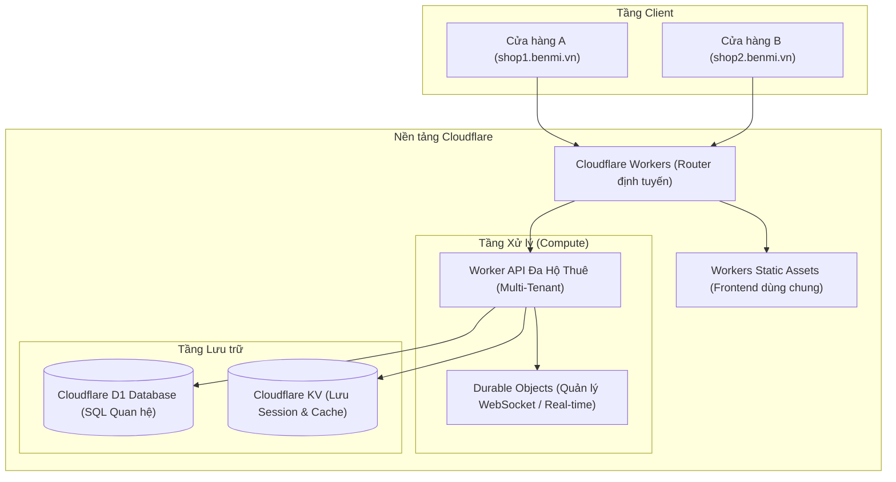

# PDP: Đề xuất Chuyển đổi và Tối ưu hóa Benmi sang mô hình SaaS Đa Hộ Thuê (Multi-Tenant SaaS)

Tài liệu này đề xuất kiến trúc kỹ thuật, chiến lược và lộ trình chuyển đổi hệ thống đặt hàng **Benmi Order** từ một ứng dụng đơn lẻ (LINE LIFF) thành nền tảng SaaS đa hộ thuê (multi-tenant) có khả năng mở rộng dễ dàng, phục vụ các cửa hàng bán lẻ nhỏ lẻ.

---

## 1. Tóm tắt dự án & Mục tiêu

### Vấn đề hiện tại
Kiến trúc hiện tại của Benmi được thiết kế cho một cửa hàng đơn nhất. Các cấu hình quan trọng (như `LIFF_ID`, API endpoints, mật khẩu dashboard) đang được hardcode hoặc cấu hình dạng biến môi trường toàn cục. Các API ghi (write APIs) chưa được bảo mật, và toàn bộ dữ liệu lưu trên Cloudflare KV - một database dạng Key-Value có tính nhất quán cuối cùng (eventual consistency), thiếu khả năng giao dịch (transaction) và truy vấn quan hệ phức tạp.

Để thương mại hóa sản phẩm này thành một nền tảng SaaS cho phép các chủ cửa hàng có thể đăng ký, tạo menu riêng, kết nối kênh LINE/Zalo của họ và quản lý đơn hàng, chúng ta cần tái cấu trúc hệ thống để hỗ trợ đa hộ thuê (multi-tenancy), bảo mật cao và tối ưu cơ sở dữ liệu.

### Mục tiêu chiến lược (Trong phạm vi 12 tháng)
*   **Quy mô Pilot:** Phục vụ dưới 10 cửa hàng chạy thử nghiệm (onboard thủ công ở giai đoạn đầu).
*   **Đội ngũ thực hiện:** 1 Solo Developer lập trình full-time.
*   **Đa hộ thuê (Multi-Tenancy):** Cho phép một bản triển khai (deploy) duy nhất của Cloudflare Worker và Frontend phục vụ nhiều cửa hàng độc lập.
*   **Kiến trúc thời gian thực (Real-time):** Thay thế cơ chế polling 5 giây hiện tại bằng WebSocket kết hợp Cloudflare Durable Objects.
*   **Bảo mật nghiêm ngặt:** Bảo vệ toàn bộ API dành cho staff/admin, xác thực chữ ký webhook từ LINE/Zalo và cô lập dữ liệu giữa các cửa hàng ở tầng cơ sở dữ liệu.
*   **Mở rộng cơ sở dữ liệu:** Di chuyển dữ liệu đơn hàng từ KV sang Cloudflare D1 (SQL quan hệ) kết hợp sử dụng KV làm cache layer cho hot-data (menu, cấu hình shop).

### Ngoài phạm vi (Đưa vào Backlog)
*   Hệ thống tự đăng ký và thanh toán tự động (Self-service signup & Stripe/MoMo Payment).
*   Tính năng custom domain riêng cho từng tenant (sử dụng subdomain mặc định dạng `*.benmi.vn`).
*   Hệ thống báo cáo phân tích nâng cao (BI & Analytics Dashboard).

---

## 2. Bối cảnh & Kiến trúc hiện tại
Hiện tại, Benmi hoạt động theo mô hình phẳng:
*   **Giao diện (Frontend):** Gồm [index.html](file:///Users/duccao/Documents/index.html) (trang đặt món cho khách) và [orders.html](file:///Users/duccao/Documents/orders.html) (dashboard nhận đơn của nhân viên) kết nối trực tiếp đến một URL API cố định.
*   **Backend:** Một Cloudflare Worker duy nhất [worker.js](file:///Users/duccao/Documents/benmi-worker-official/src/worker.js) dài 1040 dòng xử lý tất cả các request một cách toàn cục (routing, auth, logic, webhooks).
*   **Lưu trữ (Storage):** Sử dụng Cloudflare KV (`ORDER_STATE`) với các key không có tiền tố phân biệt cửa hàng (ví dụ: `menu:latest`, `store_config`), dẫn đến việc không thể lưu trữ chung nhiều cửa hàng trên một KV mà không bị đè dữ liệu.

---

## 3. Kiến trúc SaaS Mục tiêu

Chúng tôi đề xuất mô hình **Định tuyến Subdomain động (Dynamic Subdomain Routing)** kết hợp với mô hình lưu trữ **Lai ghép (Hybrid) giữa Cloudflare D1 (Source of Truth) và Cloudflare KV (Cache & Hot Data)**.

### Các khái niệm kỹ thuật cốt lõi
1.  **Nhận diện Tenant qua Host Header:**
    Cloudflare Worker sẽ chặn các request gửi đến và kiểm tra header `Host` (ví dụ: `shop1.benmi.vn`). Nó sẽ trích xuất subdomain (`shop1`) làm `Tenant ID` để tải cấu hình của riêng cửa hàng đó.
2.  **Lưu trữ lai ghép (Hybrid Storage):**
    *   **Cloudflare D1:** Lưu trữ dữ liệu cấu trúc có tính toàn vẹn cao (Bảng `tenants`, `users`, `products`, `orders`, `order_items`). Mọi bảng đều có cột `tenant_id`.
    *   **Cloudflare KV:** Lưu session đăng nhập của nhân viên, lưu cache menu tĩnh của từng tenant để giảm tải lượt truy vấn (read queries) vào D1.
3.  **Real-time Push qua Durable Objects:**
    Dashboard nhân viên [orders.html](file:///Users/duccao/Documents/orders.html) sẽ kết nối thông qua WebSocket trực tiếp tới một **Durable Object (DO)** được gán theo `Tenant ID`. Khi có đơn hàng mới từ Webhook, Worker sẽ báo cho DO gửi thông báo real-time qua WebSocket về Dashboard ngay lập tức.
4.  **Thiết lập Kênh Chat theo Shop:**
    Mỗi shop nhập cấu hình `LINE_CHANNEL_TOKEN`, `LIFF_ID` hoặc cấu hình Zalo OA của riêng họ thông qua Dashboard. Worker sẽ lưu cấu hình này trong DB theo `tenant_id` và dùng nó để gọi API gửi tin nhắn tương ứng.

---

## 4. Lộ trình tối ưu & Phát triển tính năng (12 Tháng)

---

### Giai đoạn 1: Nền tảng & Bảo mật (Tháng 1-3)
*Tập trung dọn dẹp mã nguồn, chuẩn bị môi trường phát triển TypeScript và gia cố bảo mật cơ bản.*

#### Nhiệm vụ 1.0: Chuyển đổi sang TypeScript và Tách Module
*   **Lợi ích kỹ thuật:** TypeScript giúp solo developer phát hiện lỗi kiểu dữ liệu sớm khi compile. Việc chia nhỏ file monolithic [worker.js](file:///Users/duccao/Documents/benmi-order/benmi-worker-official/src/worker.js) (1000+ dòng) giúp mã nguồn dễ đọc, dễ viết test.
*   **Lợi ích kinh doanh:** Tăng tốc độ phát triển các giai đoạn sau do cấu trúc code rõ ràng và ít lỗi vặt.
*   **Các bước thực hiện:**
    1.  Chuyển dự án sang TypeScript (`wrangler.jsonc` hỗ trợ mặc định).
    2.  Tách file thành các module: `router.ts`, `auth.ts`, `orders.ts`, `menu.ts`, `messaging/`.

#### Nhiệm vụ 1.1: Gia cố xác thực Dashboard (Auth & Mật khẩu)
*   **Lợi ích kỹ thuật:** Bảo vệ các API ghi thông qua cơ chế phân quyền cơ bản.
*   **Lợi ích kinh doanh:** Đảm bảo dữ liệu kinh doanh của cửa hàng không bị giả mạo.
*   **Các bước thực hiện:**
    1.  Giữ nguyên cơ chế mật khẩu và tạo `templink` tạm thời hiện tại (tránh phức tạp hóa bằng JWT).
    2.  Sử dụng Web Crypto API để hash mật khẩu (không lưu plaintext mật khẩu).
    3.  Tạo middleware kiểm tra tính hợp lệ của `templink` trên mọi route ghi của dashboard.

#### Nhiệm vụ 1.2: Xác thực chữ ký Webhook
*   **Lợi ích kỹ thuật:** Đảm bảo request gửi đến webhook thực sự đến từ máy chủ LINE/Zalo.
*   **Lợi ích kinh doanh:** Loại bỏ đơn hàng giả mạo hoặc spam phá hoại hoạt động của cửa hàng.
*   **Các bước thực hiện:**
    1.  Lấy mã chữ ký từ header của webhook request.
    2.  Sử dụng Web Crypto API tính toán mã HMAC-SHA256 của body request bằng Channel Secret của shop tương ứng.
    3.  So sánh chữ ký và từ chối request nếu không trùng khớp.

#### Nhiệm vụ 1.3: Đưa Secret ra khỏi mã nguồn
*   **Lợi ích kỹ thuật:** Tránh việc vô tình đẩy API keys/token lên git.
*   **Các bước thực hiện:**
    1.  Xóa bỏ các chuỗi token, sheet URL hardcode.
    2.  Chuyển sang cơ chế Cloudflare Secrets bằng lệnh `wrangler secret put`.

---

### Giai đoạn 2: Đa hộ thuê & Thời gian thực (Tháng 4-8)
*Tái cấu trúc hạ tầng lưu trữ và thiết lập luồng thông tin real-time.*

#### Nhiệm vụ 2.1: Phân tách dữ liệu KV bằng tiền tố (Prefixing)
*   **Lợi ích kỹ thuật:** Cho phép chạy thử nghiệm nhiều shop trên cùng một namespace KV mà không bị ghi đè dữ liệu.
*   **Các bước thực hiện:**
    1.  Cập nhật router để trích xuất `Tenant ID`.
    2.  Sửa tất cả các hàm gọi KV để chèn thêm tiền tố `tenant:${tenantId}:` vào trước key.

#### Nhiệm vụ 2.2: Định tuyến Subdomain động & Static Assets
*   **Lợi ích kỹ thuật:** Dùng chung một phiên bản frontend tĩnh chạy trên Cloudflare Workers Static Assets.
*   **Lợi ích kinh doanh:** Shop truy cập qua link subdomain riêng (ví dụ: `banhmi-co-ba.benmi.vn`).
*   **Các bước thực hiện:**
    1.  Deploy các file giao diện lên Static Assets.
    2.  Viết middleware lọc hostname để tìm ra subdomain (`tenant_id`).
    3.  Lấy thông tin cấu hình (logo, theme, menu) chèn động vào trang giao diện trước khi trả về.

#### Nhiệm vụ 2.3: Di chuyển cơ sở dữ liệu sang Cloudflare D1 (SQL)
*   **Lợi ích kỹ thuật:** Lưu trữ đơn hàng có cấu trúc, an toàn giao dịch (transaction) và tối ưu hóa truy vấn.
*   **Lợi ích kinh doanh:** Tránh lỗi ghi đè đồng thời đơn hàng và cho phép tra cứu lịch sử đơn hàng tốt hơn.
*   **Các bước thực hiện:**
    1.  Thiết kế schema SQL cho D1 với cột `tenant_id` ở mọi bảng.
    2.  Triển khai Shadow Write (ghi song song KV + D1), đối chiếu dữ liệu tự động.
    3.  Sau khi ổn định, chuyển hoàn toàn logic đọc sang D1.

#### Nhiệm vụ 2.4: Durable Objects & WebSocket cho Dashboard Real-time
*   **Lợi ích kỹ thuật:** Loại bỏ hoàn toàn cơ chế polling 5 giây, tiết kiệm CPU và tài nguyên mạng cho Worker.
*   **Lợi ích kinh doanh:** Đơn hàng mới lập tức hiển thị trên màn hình của nhân viên mà không có độ trễ, giúp chuẩn bị món ăn nhanh hơn.
*   **Các bước thực hiện:**
    1.  Tạo một Class Durable Object làm cổng kết nối WebSocket theo từng `tenant_id`.
    2.  Dashboard nhân viên sẽ thiết lập kết nối WebSocket tới DO này.
    3.  Khi có đơn hàng mới từ Webhook, Worker gọi DO để phát (broadcast) thông tin tới toàn bộ kết nối WebSocket đang hoạt động.

---

### Giai đoạn 3: Hoàn thiện MVP SaaS (Tháng 9-12)
*Tập trung vào quy trình onboarding và tích hợp đa kênh.*

#### Nhiệm vụ 3.1: Quy trình thiết lập shop thủ công & Cấu hình kênh Chat
*   **Lợi ích kỹ thuật & Kinh doanh:** Không tốn nguồn lực làm trang đăng ký tự động và cổng thanh toán trong giai đoạn đầu. Thay vào đó, onboarding thủ công bằng seed script và hỗ trợ cấu hình kênh chat (LINE/Zalo) trực tiếp trên giao diện quản trị của từng shop.
*   **Các bước thực hiện:**
    1.  Viết migration/seed script để tạo nhanh tenant mới trực tiếp trong database D1.
    2.  Xây dựng trang cấu hình đơn giản trên dashboard để shop tự điền token và webhook URL của LINE/Zalo của họ.

#### Nhiệm vụ 3.2: Bộ chuyển đổi tin nhắn đa kênh (LINE & Zalo Adapter)
*   **Lợi ích kỹ thuật:** Module hóa phần gửi tin nhắn để dễ bảo trì.
*   **Lợi ích kinh doanh:** Tiếp cận được cả khách hàng dùng LINE và Zalo.
*   **Các bước thực hiện:**
    1.  Tạo lớp trừu tượng `MessagingAdapter`.
    2.  Viết các adapter cụ thể cho `LineAdapter` và `ZaloAdapter`.
    3.  Tải động adapter phù hợp dựa trên cài đặt kênh chat của shop nhận đơn.

---

## 5. Các giải pháp thay thế & Đánh giá đánh đổi

### Giải pháp A: Triển khai mỗi shop là một Worker độc lập (Tenant-per-Worker)
*   **Ưu điểm:** Cách biệt dữ liệu tuyệt đối.
*   **Nhược điểm:** Khó bảo trì. Cập nhật tính năng yêu cầu deploy lại hàng trăm Worker. Bị giới hạn số lượng Worker tối đa của Cloudflare.
*   **Đánh giá:** Loại bỏ vì không thể mở rộng về mặt vận hành.

### Giải pháp B: Chuyển sang Server Node.js/Go truyền thống trên AWS/GCP
*   **Ưu điểm:** Sử dụng hệ sinh thái backend và kết nối DB truyền thống.
*   **Nhược điểm:** Chi phí vận hành cao, mất lợi thế cold-start bằng 0 và phân tán địa lý của Cloudflare.
*   **Đánh giá:** Loại bỏ trong giai đoạn pilot. D1 + KV là quá đủ và cực kỳ rẻ.

---

## 6. Chiến lược kiểm thử & Triển khai (Rollout Strategy)

Chúng ta áp dụng mô hình **Strangler Fig Pattern** để chuyển dịch dữ liệu:
1.  **Chạy thử:** Dựng Worker đa hộ thuê trên subdomain `saas-test.benmi.vn`.
2.  **Ghi song song:** Worker chính ghi đồng thời vào KV cũ và D1 mới.
3.  **Canary:** Chuyển đổi 1 cửa hàng thực tế sang chạy hoàn toàn trên D1.
4.  **Hoàn tất:** Di chuyển tất cả cửa hàng còn lại và dừng ghi lên KV cũ.

---

## 7. Backlog (Sau 12 tháng)

*   [ ] Thiết lập đăng ký tài khoản tự động (Self-service Signup Portal).
*   [ ] Tích hợp cổng thanh toán tự động Momo/Stripe để thu phí thuê bao.
*   [ ] Hỗ trợ cấu hình tên miền riêng (Custom Domain) cho mỗi shop.
*   [ ] Xây dựng hệ thống báo cáo phân tích chuyên sâu (BI & Analytics Dashboard).
