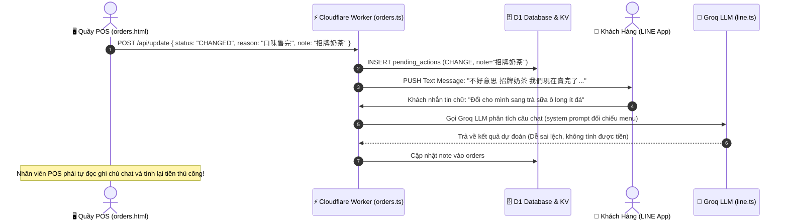
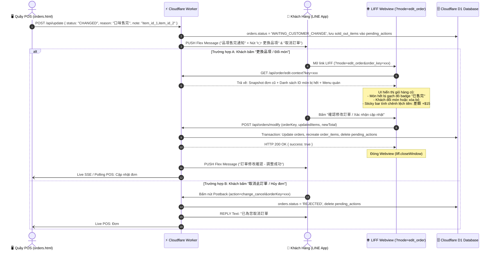

# PDP: Sold-Out Item Interactive Order Modification Flow (Báo Hết Món & Tự Đổi Món Trực Quan)

**Document Status**: Proposed  
**Author**: Principal Engineer & UI/UX Pro Max Agent  
**Date**: 2026-09-17  
**Target Environments**: Dev (`blab-db-dev`), Staging (`blab-db-test`), Production (`blab-db-production`)  
**Applicable Tenants**: 1,000+ Multi-Tenant Platform (Zero Hardcoding)

---

## 1. Executive Summary & Objectives

### 1.1 Problem Statement
Trong quy trình vận hành F&B thực tế tại các quán ăn/nhà hàng trên nền tảng **Benmi Multi-Tenant Order Platform**:
1. **Hiện trạng khi quán hết món**: Khi quán tạm hết một hoặc nhiều món mà khách đã đặt, nhân viên quầy trên màn hình POS (`orders.html` / `orders-modals.js`) tích chọn các món hết (`口味售完` / `賣完了`) và bấm xác nhận `CHANGED`.
2. **Cơ chế xử lý hiện tại (Legacy Flow)**:
   - Backend Cloudflare Worker (`benmi-worker-official/src/modules/orders.ts` L995) đẩy một tin nhắn văn bản thuần túy (Plain Text) qua LINE Push API:  
     `"不好意思 [Tên món] 我們現在賣完了，請問可以幫您換別的嗎？"`.
   - Trạng thái đơn chuyển thành `WAITING_CUSTOMER_CHANGE` và ghi nhận một bản ghi vào bảng `pending_actions`.
   - Khách hàng phải gõ câu trả lời bằng chữ trong phòng chat LINE OA.
   - Webhook của Worker (`line.ts` L2150–L2280) phải gọi LLM AI (Groq) để cố gắng "đọc hiểu" câu chat tự do của khách xem khách muốn đổi sang món gì.
3. **Các điểm nghẽn nghiêm trọng (Architectural & UX Bottlenecks)**:
   - **Lệch giá tiền (`Price Mismatch`)**: Nếu món khách chọn đổi có giá chênh lệch (đắt hơn hoặc rẻ hơn món cũ), hệ thống chat văn bản hoàn toàn bất lực trong việc tính toán lại `total_amount`, cập nhật lại hóa đơn và đối soát thanh toán.
   - **Mất tùy biến món (`Lost Modifiers / Customizations`)**: Món mới thường đi kèm các nhóm tùy chọn bắt buộc (độ ngọt, lượng đá, topping, độ cay...). Khách gõ text không thể khai báo đầy đủ các nhánh modifier phức tạp.
   - **Ảo giác AI & Tốn kém chi phí**: Khách gõ tắt, gõ sai chính tả, hoặc đòi đổi món không có trong thực đơn quán $\rightarrow$ AI phán đoán sai, phát sinh vòng lặp hỏi đáp nhiều lượt, gây tốn quota token LLM.
   - **Tỷ lệ bỏ đơn (Cart Abandonment) cao**: Khách hàng cảm thấy phiền phức và mất thời gian khi phải nhắn tin qua lại, dẫn đến việc bỏ ngang đơn hàng.

### 1.2 Goals (In-Scope)
- **Chuẩn hóa Thông báo Hết món qua LINE Flex Message**: Thay thế hoàn toàn tin nhắn text nghèo nàn bằng thẻ Flex Message trang nhã, màu sắc cảnh báo dịu mắt (`#D97706`), nêu rõ danh sách món bị hết kèm 2 nút bấm tương tác:
  - Nút chính (Primary CTA): **"👉 前往更換品項 / Đổi món khác"** (Mở trực tiếp LIFF Webview ở chế độ chỉnh sửa đơn).
  - Nút phụ (Secondary CTA): **"直接取消訂單 / Hủy đơn này"** (Postback một chạm hủy đơn ngay lập tức nếu khách không muốn đổi).
- **Trải nghiệm Chỉnh sửa Đơn trực quan (Webview Edit Mode - `ui-ux-pro-max`)**:
  - Không bắt khách đặt lại từ đầu: Giữ nguyên giỏ hàng cũ, visual highlight món bị hết bằng viền đỏ/badge `已售完`.
  - Cung cấp thao tác 1-chạm: Đổi món cùng loại hoặc Xóa bỏ món đó khỏi đơn.
  - Tự động đồng bộ cây Modifiers của món mới và tính toán chênh lệch giá tiền thời gian thực (`+$10` hoặc `-$20`).
- **Xử lý Hậu kỳ & Đồng bộ POS thời gian thực**:
  - Triển khai API `POST /api/orders/modify` để cập nhật nguyên tử (Atomic Update) vào bảng `orders`, `order_items`, xóa `pending_actions`, tính lại tổng tiền.
  - Kích hoạt thông báo Live trên màn hình POS của quầy kèm badge nhận diện: **`[已更換品項 / Đã đổi món]`** để nhân viên nhận đơn làm tiếp mà không cần sửa tay.
  - Gửi thẻ Flex Message xác nhận đơn đã cập nhật thành công về LINE của khách.
- **Tuân thủ chuẩn 1,000+ Multi-Tenant**: 100% cấu hình, tiền tệ, nhãn ngôn ngữ (`zh-TW` / `vi`) và token LINE được phân giải động theo `tenantCtx`.

### 1.3 Non-Goals (Out-of-Scope)
- Không áp dụng thanh toán Online Gateway tức thời (LINE Pay / Credit Card refund) trong pha này. Mọi chênh lệch giá tiền sẽ được thanh toán hoặc khấu trừ trực tiếp khi lấy món tại quầy (COD / Tại quầy).
- Không tự động thay thế món ngẫu nhiên bằng AI khi chưa có sự xác nhận của khách.

---

## 2. Context & Current Architecture

### 2.1 Luồng Hiện Tại (Legacy Flow - Text Chat & AI)



---

## 3. Proposed Architecture

### 3.1 Luồng Kiến Trúc Mới (Proposed Interactive Edit Flow)



---

### 3.2 Chi Tiết Giao Diện & Trải Nghiệm (UI/UX Specification - `ui-ux-pro-max`)

#### A. Thiết Kế Thẻ LINE Flex Message (`createSoldOutFlexBubble`)
- **Màu sắc & Phân cấp thị giác**:
  - Banner Header: Màu cam hổ phách `#D97706` (biểu thị trạng thái cần xử lý nhẹ nhàng, không dùng đỏ gay gắt gây hoảng sợ).
  - Typography: Mã đơn in đậm `#0F172A`, tên các món hết được highlight trong khối bo góc xám nhạt `#F8FAFC` với ký hiệu gạch chéo đỏ `✕`.
- **Hành động tương tác (Buttons)**:
  - **Nút 1 (Primary Button)**: Chiều cao `sm`, màu `#D97706`.  
    - Nhãn: `👉 前往更換品項 / Đổi món khác`  
    - Action: `type: "uri"`, URL: `https://liff.line.me/${liffId}?tenant_id=${tenantId}&mode=edit_order&order_key=${orderKey}`.
  - **Nút 2 (Secondary Button)**: Chiều cao `sm`, style `secondary`.  
    - Nhãn: `直接取消訂單 / Hủy đơn này`  
    - Action: `type: "postback"`, data: `action=change_cancel&orderKey=${orderKey}`, displayText: `取消訂單`.

```json
{
  "type": "bubble",
  "size": "kilo",
  "body": {
    "type": "box",
    "layout": "vertical",
    "paddingAll": "20px",
    "spacing": "md",
    "contents": [
      {
        "type": "box",
        "layout": "horizontal",
        "contents": [
          { "type": "text", "text": "訂單品項售完通知", "size": "xs", "weight": "bold", "color": "#D97706", "flex": 0 },
          { "type": "text", "text": "#BD0917-0012", "size": "sm", "weight": "bold", "color": "#0F172A", "align": "end", "flex": 1 }
        ]
      },
      { "type": "text", "text": "部分餐點目前已售完", "weight": "bold", "size": "lg", "color": "#0F172A" },
      {
        "type": "box",
        "layout": "vertical",
        "backgroundColor": "#FEF3C7",
        "cornerRadius": "md",
        "paddingAll": "12px",
        "contents": [
          { "type": "text", "text": "售製品項：招牌越南奶茶、牛肉法國麵包", "size": "sm", "color": "#B45309", "weight": "bold", "wrap": true }
        ]
      },
      { "type": "text", "text": "店家已為您保留其餘餐點。請點選下方按鈕更換品項或確認調整，謝謝您！", "size": "xs", "color": "#64748B", "wrap": true }
    ]
  },
  "footer": {
    "type": "box",
    "layout": "vertical",
    "paddingAll": "16px",
    "spacing": "sm",
    "contents": [
      {
        "type": "button",
        "style": "primary",
        "color": "#D97706",
        "height": "sm",
        "action": { "type": "uri", "label": "👉 前往更換品項", "uri": "https://liff.line.me/..." }
      },
      {
        "type": "button",
        "style": "secondary",
        "height": "sm",
        "action": { "type": "postback", "label": "直接取消訂單", "data": "action=change_cancel&orderKey=..." }
      }
    ]
  }
}
```

---

#### B. Giao Diện Webview Chỉnh Sửa Đơn Hàng (`mode=edit_order`)

Theo tiêu chuẩn **Mobile-First (LIFF In-App Webview)**:

```
┌────────────────────────────────────────────────────────┐
│  ← 修改訂單內容 (#BD0917-0012)                 [ ✕ ]  │
├────────────────────────────────────────────────────────┤
│  ⚠️ 部分餐點已售完，請更換或移除後確認訂單             │
│  (Nền vàng nhạt #FEF3C7, viền vàng #FDE68A, text nâu) │
├────────────────────────────────────────────────────────┤
│  原訂單餐點內容 (Món trong đơn):                        │
│                                                        │
│  ┌──────────────────────────────────────────────────┐  │
│  │ ✕ 招牌越南奶茶 x1                         $65    │  │  <-- Món hết hàng:
│  │   [ 標籤: 已售完 ] (Badge đỏ)                    │  │      Border đỏ đứt nét
│  │   ---------------------------------------------- │  │      Background xám mờ
│  │   [ 🔄 更換為其他飲料 ]       [ 🗑️ 移除此項 ]    │  │  <-- 2 nút thao tác nhanh
│  └──────────────────────────────────────────────────┘  │
│                                                        │
│  ┌──────────────────────────────────────────────────┐  │
│  │ ✓ 經典燒肉法國麵包 x2                    $170    │  │  <-- Món bình thường:
│  │   ↳ 小辣, 正常香菜                               │  │      Giữ nguyên
│  │   [ - ]  2  [ + ]                      [ 修改 ]  │  │
│  └──────────────────────────────────────────────────┘  │
│                                                        │
│  + 點選此處瀏覽菜單加點其他美味餐點...                 │
├────────────────────────────────────────────────────────┤
│  [Sticky Bottom Bar]                                   │
│  原金額: $235   →   新總計: $250 (差額: +$15)          │
│  [            確認修改並送出訂單 ($250)              ] │  <-- Disabled nếu còn món hết
└────────────────────────────────────────────────────────┘
```

1. **Hiển thị Món Hết Hàng**:
   - Thẻ món đổi sang nền xám nhạt kèm viền đỏ nhạt, badge đỏ chữ trắng `已售完 / Tạm hết`.
   - Cung cấp 2 nút bấm to rõ (kích thước tối thiểu 44px theo `ui-design-principles.md`):
     - `[ 🔄 更換品項 / Đổi món ]`: Tự động cuộn trang xuống danh mục tương ứng trên Menu để khách chọn món thay thế nhanh chóng.
     - `[ 🗑️ 移除此項 / Xóa món ]`: Loại bỏ món khỏi giỏ hàng chỉ với 1 chạm.
2. **Khóa nút Submit (Validation Invariant)**:
   - Nút `確認修改並送出訂單` sẽ bị **Disable (Mờ đi và không bấm được)** nếu:
     - Trong giỏ hàng vẫn còn tồn tại món có nhãn `已售完`.
     - Toàn bộ giỏ hàng bị xóa sạch (rỗng).
3. **Thanh tính chênh lệch giá (Sticky Price Delta Bar)**:
   - Cố định ở đáy màn hình điện thoại (Safe area insets).
   - Hiển thị rõ: *Giá trị ban đầu $\rightarrow$ Tổng tiền mới (Chênh lệch: $\pm\Delta$)*.

---

### 3.3 Thiết Kế Dữ Liệu & API Contracts

#### A. Database Changes (`benmi-worker-official/migrations/0049_add_sold_out_order_modification.sql`)
Hệ thống tận dụng bảng `orders`, `order_items` và `pending_actions` hiện có mà không phá vỡ schema:
- Trong bảng `orders`: Bổ sung giá trị trạng thái `MODIFIED` (nếu cần phân biệt) hoặc chuyển về `NEW` kèm cờ `is_modified = 1`.
- Cột `note` trong `pending_actions` sẽ lưu trữ JSON có cấu trúc khi POS báo hết món:
  ```json
  {
    "type": "ITEMS_SOLD_OUT",
    "soldOutItems": ["招牌越南奶茶", "牛肉法國麵包"],
    "timestamp": 1726588800000
  }
  ```

#### B. API Endpoints Mới

##### 1. `GET /api/order/edit-context`
Lấy toàn bộ dữ liệu đơn hàng và danh sách món hết hàng phục vụ hiển thị màn hình sửa đơn:
- **Query**: `?key={orderKey}`
- **Headers**: `Authorization: Bearer <LINE_TOKEN>` hoặc kiểm tra `userId` khớp với `orders.user_id`.
- **Response**:
  ```json
  {
    "success": true,
    "order": {
      "key": "uuid-xxx",
      "displayKey": "BD0917-0012",
      "status": "WAITING_CUSTOMER_CHANGE",
      "diningOption": "takeaway",
      "pickupTime": "12:30",
      "originalTotal": 235,
      "items": [
        {
          "id": 101,
          "itemId": "drink_milktea_01",
          "itemName": "招牌越南奶茶",
          "categoryName": "飲料",
          "unitPrice": 65,
          "quantity": 1,
          "subtotal": 65,
          "isSoldOut": true,
          "selectedOptions": []
        },
        {
          "id": 102,
          "itemId": "banhmi_bbq_01",
          "itemName": "經典燒肉法國麵包",
          "categoryName": "法國麵包",
          "unitPrice": 85,
          "quantity": 2,
          "subtotal": 170,
          "isSoldOut": false,
          "selectedOptions": [{ "group": "辣度", "choice": "小辣", "price": 0 }]
        }
      ]
    },
    "soldOutItemNames": ["招牌越南奶茶"]
  }
  ```

##### 2. `POST /api/orders/modify`
Thực thi lưu đơn đã chỉnh sửa một cách nguyên tử (Atomic Database Transaction):
- **Request Body**:
  ```json
  {
    "orderKey": "uuid-xxx",
    "updatedItems": [
      {
        "itemId": "drink_lemon_tea",
        "itemName": "越式青檸茶",
        "categoryName": "飲料",
        "quantity": 1,
        "unitPrice": 55,
        "subtotal": 55,
        "selectedOptions": [{ "group": "冰塊", "choice": "微冰", "price": 0 }]
      },
      {
        "itemId": "banhmi_bbq_01",
        "itemName": "經典燒肉法國麵包",
        "categoryName": "法國麵包",
        "quantity": 2,
        "unitPrice": 85,
        "subtotal": 170,
        "selectedOptions": [{ "group": "辣度", "choice": "小辣", "price": 0 }]
      }
    ],
    "newTotal": 225,
    "clientNote": "Đã đổi trà đào sang trà chanh"
  }
  ```
- **Xử lý phía Server**:
  1. Kiểm tra trạng thái đơn: Bắt buộc `orders.status === 'WAITING_CUSTOMER_CHANGE'`. Nếu đơn đã bị hủy hoặc hoàn tất thì từ chối HTTP 409 Conflict.
  2. Tính toán lại tổng tiền từ CSDL Menu D1 để chống gian lận giá từ client.
  3. Mở D1 Transaction / Batch:
     - `UPDATE orders SET status = 'NEW', total_amount = ?, order_content = ?, note = ?, updated_at = CURRENT_TIMESTAMP WHERE key = ?`
     - `DELETE FROM order_items WHERE order_key = ?`
     - `INSERT INTO order_items (...) VALUES (...)` cho các món mới.
     - `DELETE FROM pending_actions WHERE order_key = ?`
  4. Gửi Flex Message xác nhận đơn đã cập nhật thành công về LINE của khách (`createOrderModifiedConfirmationFlexBubble`).
  5. Đồng bộ Google Sheets ngầm qua `ctx.waitUntil()`.

---

## 4. Migration & Rollout Strategy

Để đảm bảo tính liên tục của hệ thống đang chạy phục vụ khách:

1. **Giai đoạn 1 (Backward Compatible Backend)**:
   - Triển khai API `GET /api/order/edit-context` và `POST /api/orders/modify`.
   - Giữ nguyên luồng chat cũ làm fallback nếu khách dùng app LINE phiên bản cũ không mở được Webview.
2. **Giai đoạn 2 (Frontend Feature Flag / Safe Rollout)**:
   - Cập nhật hàm `createSoldOutFlexBubble` trên Worker.
   - Thêm cờ cấu hình quán `features.interactive_order_modification = true`. Nếu bật, hệ thống sẽ đẩy Flex Message có nút sửa đơn; nếu tắt, fallback về luồng text cũ.
3. **Giai đoạn 3 (POS Live Alert Update)**:
   - Cập nhật `orders-list.js` để hiển thị badge `[已更換品項 / Đã sửa đơn]` màu xanh lục khi đơn nhảy từ `WAITING_CUSTOMER_CHANGE` về `NEW`.
4. **Kế hoạch Rollback (Rollback Plan)**:
   - Nếu phát hiện lỗi trên LIFF, chỉ cần tắt cờ `features.interactive_order_modification` trên Cloudflare D1 mà không cần redeploy toàn bộ backend.

---

## 5. Alternatives Considered & Trade-offs

| Phương án | Ưu điểm | Nhược điểm | Đánh giá |
| :--- | :--- | :--- | :--- |
| **Phương án A: Giữ nguyên Chat Text + Groq AI** | Không cần viết thêm UI mới. | Sai sót giá tiền, mất modifier, tốn token AI, trải nghiệm gõ chữ tệ. | ❌ **Loại bỏ (Deprecated)** |
| **Phương án B: Bắt khách hủy đơn rồi đặt lại từ đầu** | Code backend cực kỳ đơn giản. | Tỷ lệ mất khách cực cao (>70%), khách bực mình vì phải chọn lại từ đầu toàn bộ món. | ❌ **Loại bỏ** |
| **Phương án C (Được chọn): Flex Message + Webview Edit Mode** | - Chính xác 100% về tiền và modifier.<br/>- Trải nghiệm 1-chạm mượt mà.<br/>- Không tốn chi phí token AI.<br/>- Chuẩn công nghiệp (Grab/Shopee). | Cần phát triển thêm mode `edit_order` trên frontend và 2 endpoint API backend. | ✅ **LỰA CHỌN TỐI ƯU NHẤT** |

---

## 6. Cross-Cutting Concerns

1. **Bảo mật & Xác thực (Security & Integrity)**:
   - Xác thực quyền sửa đơn: Khách chỉ được sửa đơn nếu `order.user_id` khớp với danh tính LINE Webview (`userId`), hoặc token hợp lệ.
   - Tính toán giá tiền Server-side: Client chỉ gửi danh sách món và tùy chọn, server tự nhân đơn giá từ D1 database để tránh can thiệp giá từ DevTools.
2. **Ngăn chặn Race Condition**:
   - Nếu khách đang mở Webview sửa món nhưng quầy POS đã bấm hủy đơn trước, khi submit `POST /api/orders/modify`, server sẽ trả về mã lỗi `409 Order Already Cancelled` kèm popup thông báo rõ ràng cho khách.
3. **Tuân thủ Cache-Busting & UI Guidelines**:
   - Tăng version `?v=YYYYMMDD_order_edit_v1` trong `index.html` và `orders.html` theo quy tắc bắt buộc của repository ([frontend-cache-busting.md](file:///.agents/rules/frontend-cache-busting.md)).
   - Icon trên giao diện Webview tuân thủ chuẩn vector SVG thương mại tự do nét mảnh (Heroicons/Lucide), không dùng emoji trẻ con ([ui-design-principles.md](file:///.agents/rules/ui-design-principles.md)).

---

## 7. Step-by-Step Execution Plan

- [ ] **Phase 1: Database & Backend Core API**
  - [ ] Migration D1 cập nhật metadata cho `pending_actions` và cột `is_modified` trong `orders`.
  - [ ] Xây dựng endpoint `GET /api/order/edit-context` trong `benmi-worker-official/src/modules/orders.ts`.
  - [ ] Xây dựng endpoint `POST /api/orders/modify` với cơ chế tính lại giá và transaction cập nhật.
- [ ] **Phase 2: LINE Flex Message Templates**
  - [ ] Xây dựng hàm `createSoldOutFlexBubble()` trong `line.ts` với nút bấm mở LIFF edit mode.
  - [ ] Xây dựng hàm `createOrderModifiedConfirmationFlexBubble()` xác nhận cập nhật thành công.
  - [ ] Sửa nhánh `口味售完` / `賣完了` trong `updateOrderStatus()` ([`orders.ts: L995`](file:///Users/duccao/Documents/benmi-order/benmi-worker-official/src/modules/orders.ts#L995)) để gọi Push Flex Message.
- [ ] **Phase 3: Frontend Client Webview (`index.html` & `client-checkout.js`)**
  - [ ] Xử lý logic query parameter `?mode=edit_order&order_key=...`.
  - [ ] Tích hợp API load đơn cũ và prefill giỏ hàng.
  - [ ] Thiết kế UI thẻ món hết hàng với 2 nút `[Đổi món]` và `[Xóa món]`.
  - [ ] Xây dựng thanh Sticky Price Delta dưới đáy màn hình.
  - [ ] Tăng cache-buster version `?v=...` trong `index.html`.
- [ ] **Phase 4: POS Dashboard Visual Enhancement (`orders.html` & `orders-list.js`)**
  - [ ] Hiển thị badge `[已更換品項 / Đã đổi món]` nổi bật khi đơn được khách cập nhật.
  - [ ] Kích hoạt âm thanh thông báo đơn đã sửa để nhân viên làm món.
  - [ ] Tăng cache-buster version trong `orders.html`.
- [ ] **Phase 5: Kiểm thử End-to-End & Release**
  - [ ] Chạy `npm run check` kiểm tra cú pháp và biến toàn cục.
  - [ ] Test trên môi trường Dev (`blab-db-dev`) $\rightarrow$ Staging (`blab-db-test`) $\rightarrow$ Production.

---

## 8. Verification & Test Plan

### 8.1 Automated Verification
- Chạy kiểm tra biến toàn cục và syntax frontend:
  ```bash
  npm run check
  ```
- Chạy test case mô phỏng luồng cập nhật đơn:
  ```bash
  cd benmi-worker-official && npm run test
  ```

### 8.2 Manual Verification Checklist
1. **POS báo hết món**: Vào `orders.html`, chọn một đơn mới, bấm `Đổi món`, chọn tab `Món hết`, tích chọn 1 món và bấm xác nhận $\rightarrow$ Kiểm tra LINE khách nhận được thẻ Flex màu cam `createSoldOutFlexBubble`.
2. **Khách bấm hủy đơn**: Bấm nút `直接取消訂單` trên thẻ Flex $\rightarrow$ Kiểm tra đơn chuyển sang `REJECTED` trên POS, phòng chat nhận được tin text thông báo hủy.
3. **Khách bấm sửa món**: Bấm nút `👉 前往更換品項` trên thẻ Flex $\rightarrow$ LIFF mở lên ở chế độ `mode=edit_order`:
   - Món bị hết hiển thị badge đỏ `已售完`.
   - Nút Submit bị disable nếu chưa xử lý món hết.
   - Bấm `[Đổi món]`, chọn món mới $\rightarrow$ Chênh lệch giá cập nhật đúng.
   - Bấm `[Xác nhận]` $\rightarrow$ Webview đóng lại, khách nhận thẻ Flex xác nhận sửa đơn thành công, POS nhảy chuông và đơn có badge `[Đã đổi món]`.
