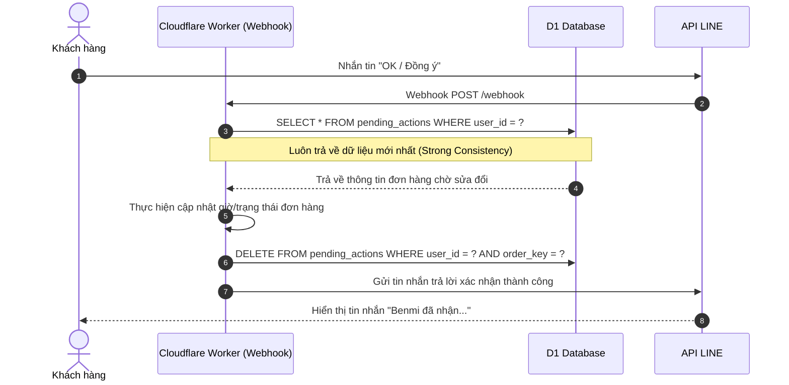

# PDP: Strong Consistency for Pending Actions via D1 [Reliability/Infrastructure]

Tài liệu này đề xuất giải pháp sửa đổi cơ chế quản lý trạng thái chờ xác nhận đơn hàng (Pending Actions) từ Cloudflare KV sang Cloudflare D1 Database để giải quyết triệt để lỗi người dùng phải nhắn tin "OK" nhiều lần mới nhận được phản hồi.

---

## 1. Executive Summary & Objectives

### Problem Statement (RCA - Nguyên nhân gốc rễ)
Khi nhân viên thao tác đổi giờ nhận hoặc hết món trên Dashboard:
1.  Hệ thống ghi trạng thái chờ vào KV (`pending:${userId}`) và gửi tin nhắn đẩy (Push Message) thông báo cho khách hàng qua LINE ngay lập tức.
2.  Khách hàng nhận được tin nhắn và phản hồi lại "OK" rất nhanh (trong vòng 2-5 giây).
3.  Yêu cầu Webhook từ LINE gửi tới Cloudflare Edge. Do tính chất **nhất quán yếu (Eventual Consistency)** của Cloudflare KV, việc đồng bộ khóa `pending:${userId}` trên mạng lưới toàn cầu của Cloudflare cần khoảng 5-15 giây.
4.  Tại thời điểm nhận webhook đầu tiên, máy chủ Cloudflare Edge đọc KV và nhận về kết quả rỗng (stale data). Hệ thống bỏ qua tin nhắn "OK" của khách hàng và im lặng.
5.  Khách hàng không nhận được phản hồi nên tiếp tục nhắn lại "OK". Khi đó, dữ liệu KV đã đồng bộ xong, bot mới nhận diện được giao dịch chờ và gửi tin xác nhận.

### Goals
*   **Không trễ phản hồi (Zero Message Dropping):** Đảm bảo phản hồi khách hàng ngay lập tức từ tin nhắn "OK/Đồng ý" đầu tiên.
*   **Tính nhất quán mạnh (Strong Consistency):** Chuyển trạng thái giao dịch chờ sang lưu trữ tập trung có tính nhất quán tức thì.

---

## 2. Proposed Architecture

### 2.1. Chuyển đổi trạng thái lưu trữ sang D1 Database

Cloudflare D1 hoạt động trên nhân SQLite và đảm bảo tính nhất quán mạnh cho các truy vấn đọc ngay sau khi ghi (Read-Your-Writes Consistency) nhờ cơ chế định tuyến ghi tập trung.

Chúng ta sẽ tạo bảng `pending_actions` trong D1:

```sql
CREATE TABLE pending_actions (
    user_id TEXT NOT NULL,
    order_key TEXT NOT NULL,
    action_type TEXT NOT NULL,      -- 'CHANGE', 'REJECT'
    question_text TEXT NOT NULL,    -- Nội dung câu hỏi bot gửi
    reason TEXT,                    -- Lý do (ví dụ: '時間需調整')
    note TEXT,                      -- Ghi chú/Thời gian đề xuất
    created_at DATETIME DEFAULT CURRENT_TIMESTAMP,
    PRIMARY KEY (user_id, order_key)
);
```

### 2.2. Quy trình xử lý Webhook cải tiến



---

## 3. Step-by-Step Execution Plan

- [ ] **Phase 1: Database Migration**
  - Tạo file migration `0003_create_pending_actions.sql` khởi tạo bảng `pending_actions`.
  - Áp dụng migration lên database Cloudflare test.
- [ ] **Phase 2: Refactor API & Webhook (Backend)**
  - Cập nhật file `orders.ts` (API `POST /api/update`): Khi staff yêu cầu đổi giờ/hủy đơn, thực hiện ghi thông tin chờ vào bảng `pending_actions` thay vì KV.
  - Cập nhật file `line.ts` (Webhook): Thay thế các lệnh đọc/ghi/xóa `pending:${userId}` bằng các câu lệnh SQL tương ứng trên bảng `pending_actions`.
- [ ] **Phase 3: Deploy & Verification**
  - Deploy lên môi trường `test`.
  - Kiểm thử mô phỏng: Đổi giờ nhận hàng trên Dashboard -> nhắn tin "OK" ngay lập tức từ LINE -> xác nhận hệ thống phản hồi thành công ngay lập tức ở tin nhắn đầu tiên.
