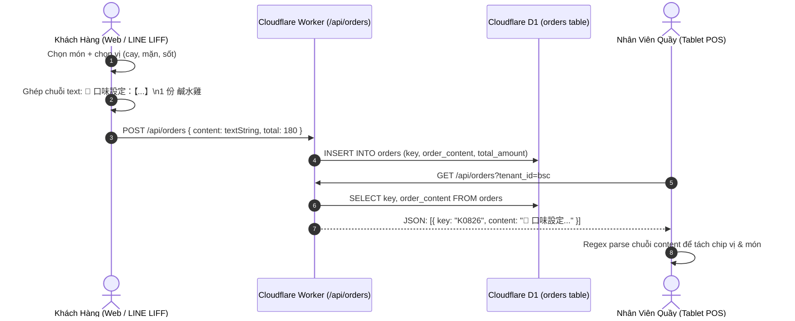
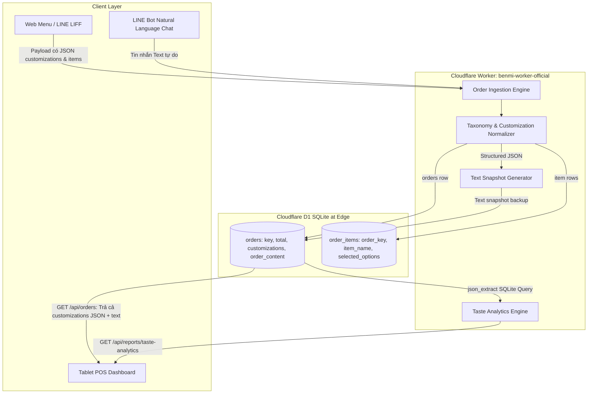
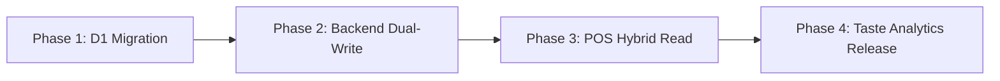

# PDP: Structured Customizations, Flavor Taxonomy & Hybrid Order Schema Architecture

- **Trạng thái**: Draft / Architecture Review
- **Tác giả**: Principal Engineer
- **Dự án**: Benmi Multi-Tenant Order Platform
- **Mục tiêu**: Chuẩn hóa mô hình lưu trữ dữ liệu tùy biến (Customizations), phân loại khẩu vị (Flavor Taxonomy) và dữ liệu phi cấu trúc (Customer Changes) từ chuỗi Text thuần sang kiến trúc Hybrid JSON Schema trên Cloudflare D1. Tối ưu hóa hiệu năng đọc của POS Dashboard, loại bỏ sự phụ thuộc vào Regex Client-side, và mở ra khả năng phân tích khẩu vị khách hàng (Taste Analytics) cho hơn 1.000+ quán F&B.

---

## 1. Executive Summary & Objectives

### A. Vấn đề Hiện Tại (Problem Statement)
Trong kiến trúc ban đầu của hệ thống Benmi, toàn bộ nội dung món ăn, ghi chú, tùy chọn khẩu vị và yêu cầu đổi món được tuần tự hóa (serialized) thành một chuỗi văn bản tự do duy nhất tại cột `orders.order_content` (VD: `🧪 口味設定：【口味選擇：特調胡椒 | 鹹度調整：正常 | 辣度選擇 (朝天椒)：不辣】\n• 配料：加蔥、加蒜\n1 份 招牌鹹水雞半隻 $180\n  ↳ 去骨`).

Mặc dù giải pháp này giúp hệ thống triển khai nhanh và tương thích với việc in ấn nhiệt qua chuỗi text thô, nó tạo ra 4 rào cản kỹ thuật lớn khi mở rộng quy mô lên hàng nghìn quán:
1. **Ràng buộc chặt chẽ với định dạng chuỗi (String Coupling)**: Nếu trang đặt món phía khách hàng (`client-checkout.js`) hoặc LINE Webhook thay đổi ký tự phân cách (ví dụ đổi `|` thành `,`, đổi emoji `🧪` thành `🧂`, đổi `口味設定` thành `Khẩu vị`), bộ parser regex phía POS có nguy cơ không nhận diện được hoặc bóc tách sai lệch.
2. **"Tắc nghẽn" Báo Cáo Phân Tích Khẩu Vị (Taste Analytics Bottleneck)**: Toàn bộ thông tin khẩu vị quan trọng của khách hàng (`Không cay`, `Ít mặn`, `Nhiều sốt`) bị "khóa" trong chuỗi văn bản. Database Cloudflare D1 không thể chạy các truy vấn SQL tổng hợp để thống kê xu hướng tiêu dùng theo thời gian thực (ví dụ: *Tỷ lệ khách ăn cay tại từng chi nhánh là bao nhiêu để dự trù nguyên liệu sốt?*).
3. **Hiệu Năng Client Phải Parse Lại Dữ Liệu Nhiều Lần**: Mỗi lần POS Dashboard tải 50 - 500 đơn hàng, trình duyệt Tablet phải dùng biểu thức chính quy (Regex) duyệt qua từng dòng của hàng trăm chuỗi text để bóc tách món, tùy biến và đợt gọi món.
4. **Khó Khăn Khi Tích Hợp Đa Kênh (Omnichannel)**: Khi nhận đơn từ các sàn bên ngoài (UberEats, Foodpanda, Grab) hoặc Kiosk tại quầy, việc phải biến đổi ngược JSON có cấu trúc thành chuỗi text để lưu vào DB rồi lại parse ngược ra ở POS là một bước xử lý dư thừa và tiềm ẩn lỗi.

### B. Mục Tiêu Thiết Kế (In-Scope Goals)
1. **Mô Hình Dữ Liệu Hybrid Hiện Đại (JSON Column Pattern)**: Bổ sung cột `customizations TEXT DEFAULT '{}'` vào bảng `orders` trong Cloudflare D1, lưu trữ JSON chuẩn hóa cho các tùy chọn khẩu vị toàn đơn, topping bổ sung, và yêu cầu đổi món.
2. **Bảo Tồn Snapshot Văn Bản (`order_content`)**: Backend Cloudflare Worker tiếp tục duy trì cột `order_content` dạng text snapshot để bảo đảm **100% tương thích ngược (Zero-Breakage)** với máy in nhiệt, hệ thống LINE Bot Flex Message và Google Sheets Sync.
3. **Cơ Chế Graceful Fallback Ở Cả 2 Đầu (Two-Way Resilient Fallback)**:
   - *Backend*: Nếu khách đặt qua API có cấu trúc -> Lưu cả JSON `customizations` và sinh chuỗi `order_content`. Nếu khách đặt qua tin nhắn văn bản tự do từ LINE Bot -> Lưu text vào `order_content` và tự động trích xuất các trường cơ bản vào `customizations`.
   - *Frontend*: POS Dashboard ưu tiên đọc object `customizations` từ API; nếu rỗng (đơn hàng cũ trong lịch sử hoặc đơn chat tự do), tự động kích hoạt bộ Parser Regex Client-side hiện có mà không phát sinh lỗi.
4. **Khai Phá API Báo Cáo Phân Tích Khẩu Vị (`GET /api/reports/taste-analytics`)**: Sử dụng các hàm JSON có sẵn của SQLite at the edge (`json_extract`, `json_tree`) để tổng hợp dữ liệu khẩu vị với độ trễ < 20ms.
5. **Chuẩn 1,000+ Multi-Tenant Scalability**: Thiết kế hoàn toàn độc lập với ID quán (zero hardcoding), mọi bảng và chỉ mục đều bắt buộc có `tenant_id`.

### C. Giới Hạn Không Thuộc Phạm Vi (Out-of-Scope)
- Không can thiệp hoặc sửa đổi dữ liệu quá khứ của các đơn hàng đã hoàn tất trước ngày chạy migration (Bảo vệ tính toàn vẹn 100% của số liệu tài chính lịch sử).

---

## 2. Context & Current Architecture

### A. Luồng Dữ Liệu Hiện Tại (Legacy Text Serialization)


### B. Điểm Yếu Kiến Trúc:
- `orders.ts` trong [benmi-worker-official](file:///Users/duccao/Documents/benmi-order/benmi-worker-official/src/modules/orders.ts#L212): Ghi trực tiếp `order_content = String(data.content || '').trim()`.
- `orders.ts` hàm `mapOrderRows()`: Chỉ trả về `content: row.order_content`.
- Mọi logic cấu trúc UI đều phải "gánh" trên vai hàm `extractFlavorSettings` và `formatContentHtml` ở [js/orders-live.js](file:///Users/duccao/Documents/benmi-order/js/orders-live.js).

---

## 3. Proposed Architecture

### A. Sơ Đồ Kiến Trúc Mới (Hybrid Schema & Structured Ingestion Architecture)



---

### B. Database Schema Design (Cloudflare D1 Migration)

Tạo file migration mới trong thư mục `benmi-worker-official/migrations/`:

```sql
-- ============================================================================
-- Migration: 0047_add_customizations_to_orders.sql
-- Description: Bổ sung trường JSON cấu trúc hóa customizations cho bảng orders
-- Author: Principal Engineer
-- ============================================================================

-- 1. Bổ sung cột customizations dạng JSON Text vào bảng orders
ALTER TABLE orders ADD COLUMN customizations TEXT DEFAULT '{}';

-- 2. Tạo chỉ mục Partial Index hỗ trợ tối ưu hóa truy vấn cho các đơn hàng có customizations
CREATE INDEX IF NOT EXISTS idx_orders_tenant_customizations 
ON orders (tenant_id, created_at DESC) 
WHERE customizations IS NOT NULL AND customizations != '{}';
```

---

### C. Chuẩn Hóa JSON Schema Cho `customizations`

Trường `customizations` trong bảng `orders` tuân thủ Schema nghiêm ngặt sau:

```typescript
export interface GlobalFlavorOption {
  key: string;       // Định danh chuẩn: 'flavor' | 'salt' | 'spicy' | 'sweetness' | 'ice'
  label: string;     // Tên hiển thị: '口味' | '鹹度' | '辣度' | 'Độ cay'
  value: string;     // Giá trị chọn: '特調胡椒' | '正常' | '不辣' | 'Ít đường'
  extraPrice?: number; // Phụ thu (nếu có)
}

export interface CustomerChangeRequest {
  timestamp: number; // Thời điểm khách yêu cầu
  text: string;      // Nội dung yêu cầu đổi món
  resolved?: boolean;// Đã được nhân viên xác nhận hay chưa
}

export interface OrderCustomizations {
  global_flavors?: GlobalFlavorOption[];      // Khẩu vị toàn đơn
  extra_ingredients?: string[];               // Topping chung (Hành, tỏi, ớt, nước mắm)
  customer_changes?: CustomerChangeRequest[]; // Yêu cầu đổi món qua chatbot
  dining_notes?: string;                      // Ghi chú đặc biệt cho phòng bếp
  meta?: {
    channel?: 'web_liff' | 'line_chat' | 'pos_manual' | 'kiosk';
    version?: string;
  };
}
```

Ví dụ payload lưu thực tế trong D1:
```json
{
  "global_flavors": [
    { "key": "flavor", "label": "口味", "value": "特調胡椒", "extraPrice": 0 },
    { "key": "salt", "label": "鹹度", "value": "正常", "extraPrice": 0 },
    { "key": "spicy", "label": "辣度", "value": "不辣", "extraPrice": 0 }
  ],
  "extra_ingredients": ["加蔥", "加蒜"],
  "customer_changes": [
    { "timestamp": 1725465600000, "text": "Đổi thành không lấy đá giúp em" }
  ],
  "meta": { "channel": "web_liff", "version": "2.0" }
}
```

---

### D. Cập Nhật API Phía Cloudflare Worker

#### 1. Ingestion (`POST /api/orders` & `POST /api/checkout`)
Khi tiếp nhận đơn hàng:
- Nếu Client gửi `data.customizations` (dạng Object): Lưu trực tiếp `JSON.stringify(data.customizations)` vào cột `customizations`.
- Nếu Client cũ chỉ gửi chuỗi `data.content`: Worker chạy bộ `normalizeFlavorString(data.content)` ở Backend để tự động tạo `customizations` JSON trước khi lưu vào D1.
- Đồng thời luôn sinh `order_content` text đầy đủ để giữ khả năng in ấn nhiệt tức thì.

#### 2. Retrieval (`GET /api/orders`)
Trong `orders.ts`:
```typescript
// benmi-worker-official/src/modules/orders.ts
function mapOrderRows(results: any[]): Order[] {
  return (results || []).map(row => {
    let parsedCustomizations: OrderCustomizations | null = null;
    if (row.customizations && typeof row.customizations === 'string' && row.customizations !== '{}') {
      try {
        parsedCustomizations = JSON.parse(row.customizations);
      } catch (e) {
        parsedCustomizations = null;
      }
    }

    return {
      key: row.key,
      customer: row.customer_name || "顧客",
      time: row.pickup_time || "",
      content: row.order_content || "",
      customizations: parsedCustomizations, // Cung cấp dữ liệu có cấu trúc cho POS
      status: row.status || "NEW",
      createdAt: parsedCreatedAt,
      total: Number(row.total_amount) || 0,
      reason: row.reason || "",
      note: row.note || "",
      diningOption: (row.dining_option as any) || 'takeaway',
      tableNumber: row.table_number || undefined,
      roundCount: Number(row.round_count) || 1,
      // ...
    };
  });
}
```

#### 3. New Endpoint: Báo Cáo Phân Tích Khẩu Vị (`GET /api/reports/taste-analytics`)
Tận dụng SQLite JSON functions trong Cloudflare D1 để thống kê siêu tốc mà không làm đầy bộ nhớ Worker:
```sql
SELECT 
    json_extract(f.value, '$.label') AS flavor_group,
    json_extract(f.value, '$.value') AS choice_value,
    COUNT(*) AS selection_count
FROM orders,
     json_each(orders.customizations, '$.global_flavors') AS f
WHERE orders.tenant_id = ?
  AND orders.status IN ('DONE', 'PICKED_UP', 'PAID')
  AND orders.created_at >= DATETIME('now', '-30 days')
GROUP BY flavor_group, choice_value
ORDER BY flavor_group, selection_count DESC;
```

---

### E. Frontend Integration: Kiến Trúc Hybrid Graceful Fallback

Tại [js/orders-live.js](file:///Users/duccao/Documents/benmi-order/js/orders-live.js):
```javascript
// Thay vì chỉ bóc tách bằng Regex, hàm formatContentHtml sẽ áp dụng kiến trúc 2 lớp:
function formatContentHtml(order) {
  const raw = String(order?.content || "");
  const orderKey = order?.key || "";

  // Lớp 1: Đọc trực tiếp từ Backend Structured JSON (Độ tin cậy 100%)
  let flavorData = null;
  if (order?.customizations?.global_flavors && Array.isArray(order.customizations.global_flavors)) {
    flavorData = {
      flavors: order.customizations.global_flavors.map(f => ({ label: f.label || "", value: f.value })),
      extraIngredients: order.customizations.extra_ingredients || []
    };
  }

  // Lớp 2: Graceful Fallback sang Regex Client Parser (Dành cho đơn cũ hoặc đơn chat tự do)
  if (!flavorData) {
    flavorData = extractFlavorSettings(raw);
  }

  // Tương tự cho yêu cầu đổi món:
  let customerChanges = null;
  if (order?.customizations?.customer_changes && Array.isArray(order.customizations.customer_changes)) {
    customerChanges = order.customizations.customer_changes.map(c => c.text);
  }
  if (!customerChanges || customerChanges.length === 0) {
    customerChanges = extractCustomerChanges(raw);
  }

  // Render ra giao diện thẻ chip (.flavor-custom-card, .customer-change-card)...
}
```

---

## 4. Migration & Rollout Strategy (Zero-Downtime Cutover)

Để bảo đảm an toàn cho các quán đang vận hành kinh doanh thực tế, việc nâng cấp sẽ thực hiện theo mô hình **Parallel Dual-Write & Shadow Reading**:



### Bước 1: Áp Dụng Migration D1 (Zero-Locking)
Lệnh `ALTER TABLE orders ADD COLUMN customizations TEXT DEFAULT '{}';` trên SQLite chỉ cập nhật schema metadata của SQLite file, thực thi trong **< 5ms**, hoàn toàn không khóa bảng hay làm gián đoạn đơn đang vào.
- Test: `npx wrangler d1 migrations apply blab-db-test --remote --env test`
- Prod: `npx wrangler d1 migrations apply blab-db-production --remote`

### Bước 2: Triển Khai Backend Dual-Write
Worker tiếp nhận đơn sẽ ghi đồng thời:
1. Ghi `customizations` dạng JSON.
2. Ghi `order_content` dạng chuỗi Text như cũ.
*Nếu quá trình serialize JSON gặp trục trặc, hệ thống catch an toàn và vẫn lưu chuỗi text bình thường để không bao giờ làm mất đơn của khách.*

### Bước 3: Cập Nhật Frontend POS Đọc Hybrid
Deploy bản cập nhật của POS. Với mọi đơn hàng mới, POS sẽ đọc trực tiếp từ JSON cấu trúc. Với mọi đơn hàng cũ trong lịch sử, POS tự động fallback sang Regex parser.

### Kế Hoạch Rollback (Rollback Trigger Criteria):
- Nếu có bất kỳ sự cố nào xảy ra với API, frontend chỉ cần bỏ qua trường `customizations` và tự động quay về đọc `order_content` text thuần túy như hiện tại. Không cần rollback database.

---

## 5. Alternatives Considered & Trade-offs

| Tiêu Chí | Phương Án Được Chọn: Hybrid JSON Column | Phương Án A: Chuẩn Hóa Quan Hệ (Bảng Riêng `order_customizations`) | Phương Án B: Giữ Nguyên Status Quo (Regex Text Thuần) |
| :--- | :--- | :--- | :--- |
| **Độ phức tạp CSDL** | **Thấp**: Chỉ thêm 1 cột JSON vào bảng `orders` | **Cao**: Phải tạo bảng mới, quản lý Foreign Key, xử lý ON DELETE CASCADE | **Không có**: Không đổi DB |
| **Chi phí đọc D1 (Read Rows)** | **Tối ưu nhất ($O(1)$)**: 1 row/đơn hàng, không cần `JOIN` | **Tốn kém ($O(N)$)**: Cần `LEFT JOIN` nhiều bảng, tăng số rows đọc trên Cloudflare D1 | **Tối ưu ($O(1)$)**: Chỉ đọc 1 bảng |
| **Khả năng Báo Cáo Phân Tích** | **Rất tốt**: Dùng `json_extract()` SQLite thống kê tức thì | **Rất tốt**: Dùng SQL quan hệ truyền thống | **Rất kém**: Không thể thống kê hoặc phải dùng regex SQL cực chậm |
| **Khả năng Mở Rộng Thêm Field Mới** | **Vô hạn**: Có thể bổ sung trường mới mà không cần chạy migration D1 | **Cứng nhắc**: Mỗi lần thêm field lại phải sửa bảng | **Kém**: Format text dễ vỡ |
| **Tương thích ngược** | **100% Hoàn Hảo**: Giữ nguyên `order_content` | **100%** | **100%** |

---

## 6. Cross-Cutting Concerns

### A. Security & Input Sanitization
- Mọi trường text trong `customizations` khi parse và render ra DOM phải đi qua bộ lọc `escapeHtml()` chống XSS.
- Giới hạn kích thước payload `customizations` tối đa **16KB** để ngăn chặn tấn công DoS payload phình to trên Cloudflare Worker.

### B. Performance & Edge Budget
- SQLite JSON function trong D1 được biên dịch native trong engine của Cloudflare, tốc độ bóc tách < 1ms cho 1.000 dòng.
- Không phát sinh thêm truy vấn mạng hay round-trip tới D1 nhờ việc đọc kèm theo row của đơn hàng trong cùng một câu `SELECT`.

---

## 7. Step-by-Step Execution Plan

- [ ] **Phase 1: Database Migration**:
  - Tạo migration `0047_add_customizations_to_orders.sql`.
  - Apply lên `blab-db-dev` và `blab-db-test`.
- [ ] **Phase 2: Worker Ingestion & API Updates**:
  - Cập nhật interface `Order` trong `benmi-worker-official/src/types.ts`.
  - Cập nhật hàm ghi `createOrder` và `appendOrder` trong `orders.ts` để lưu `customizations`.
  - Cập nhật `mapOrderRows` trong `orders.ts` để parse JSON an toàn.
  - Xây dựng endpoint `GET /api/reports/taste-analytics`.
- [ ] **Phase 3: Web Checkout & LINE Bot Upgrades**:
  - Nâng cấp `js/client-checkout.js` gửi kèm object `customizations` có cấu trúc khi gọi POST `/api/orders`.
- [ ] **Phase 4: POS Dashboard Hybrid Integration**:
  - Cập nhật `js/orders-live.js` ưu tiên đọc `order.customizations`.
  - Bổ sung biểu đồ / bảng thống kê khẩu vị trong tab Báo Cáo (`js/orders-reports.js`).
- [ ] **Phase 5: Production Deployment**:
  - Chạy `npm run check` kiểm thử tĩnh toàn diện.
  - Deploy lên nhánh `main` và apply migration production.

---

## 8. Verification & Test Plan

### A. Automated Tests
1. `npm run check` (`node scripts/check-frontend.js`): Kiểm tra cú pháp và scope không có xung đột.
2. `node tests/test_customizations_migration.js`:
   - Kiểm tra ghi đơn hàng có `customizations` vào D1.
   - Kiểm tra đơn hàng cũ không có `customizations` (null/empty) vẫn load bình thường qua Graceful Fallback.
   - Kiểm tra câu truy vấn SQLite JSON `taste-analytics`.

### B. Manual Verification
1. Đặt 1 đơn hàng mới từ `index.html` với đủ các tùy chọn (Tiêu đặc chế, Không cay, Thêm hành tỏi).
2. Kiểm tra trên POS `orders.html`: Modal chi tiết hiển thị thẻ chip khẩu vị đẹp mắt và chính xác.
3. Mở tab Báo Cáo trên POS: Xác nhận các lựa chọn khẩu vị được cộng dồn vào bảng phân tích.
4. Mở đơn hàng cũ trong lịch sử: Xác nhận đơn cũ vẫn hiển thị bình thường nhờ Fallback Regex.
