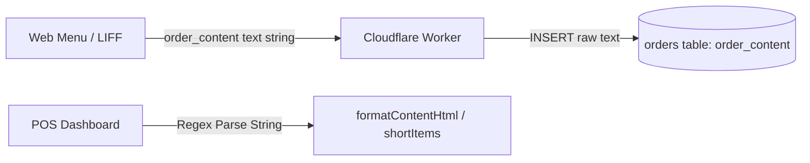
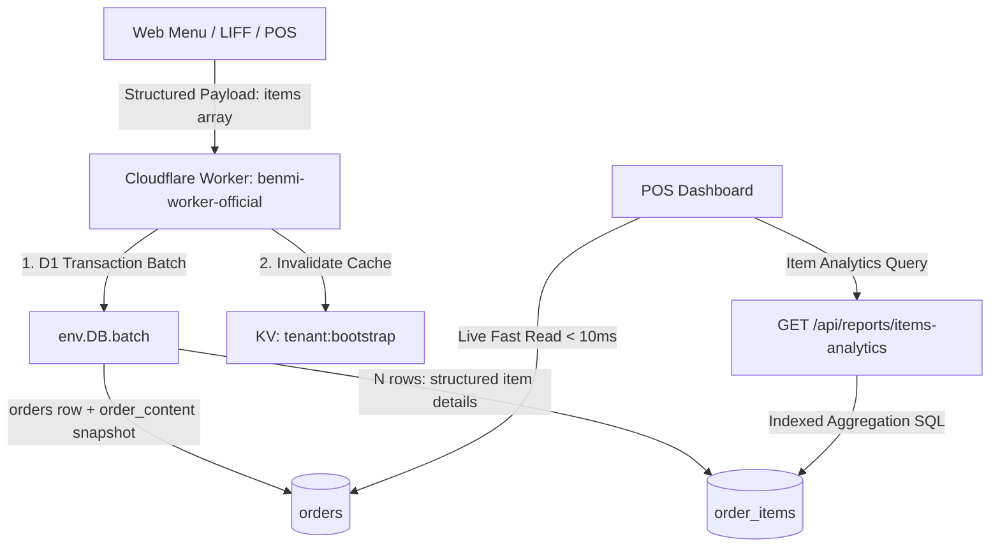

# PDP: Structured Order Items Data Architecture & Item-Level Analytics

- **Trạng thái**: Draft / Architecture Review
- **Tác giả**: Principal Engineer
- **Dự án**: Benmi Multi-Tenant Order Platform
- **Mục tiêu**: Tái cấu trúc mô hình dữ liệu đơn hàng từ Text thô (Unstructured String) sang Cấu trúc quan hệ chuẩn hóa (Normalized Relational Schema với bảng `order_items`), cung cấp API & Dashboard Báo cáo phân tích doanh thu chi tiết theo từng món/topping cho hơn 1.000+ quán.

---

## 1. Executive Summary & Objectives

### A. Vấn đề Hiện Tại (Problem Statement)
Hiện tại, bảng `orders` trong Cloudflare D1 đang lưu nội dung món ăn dưới dạng một chuỗi văn bản tự do tại cột `order_content` (VD: `"1x Bánh mì đặc biệt\n- Cay vừa\n[第 2 輪 加點]..."`).
Mặc dù giải pháp này giúp khởi tạo nhanh và tải nhẹ trên Edge, nó mang lại các hạn chế kỹ thuật lớn khi hệ thống mở rộng:
1. **Không thể phân tích dữ liệu món (No Item-Level Analytics)**: Không thể chạy SQL thống kê: Món nào bán chạy nhất? Tỷ lệ chọn topping nào cao nhất? Doanh thu từng danh mục trong tháng là bao nhiêu?
2. **Xử lý chuỗi mong manh (Fragile String Parsing)**: POS và các module giao diện phải dùng Regex để đếm số món, tách đợt gọi món (`formatContentHtml`, `shortItems`), dễ phát sinh lỗi khi format text có thay đổi nhỏ.
3. **Khó tích hợp thiết bị phần cứng POS & In Bếp (KDS / Thermal Printers)**: Máy in hóa đơn chuyên nghiệp và màn hình bếp cần payload JSON có cấu trúc để định tuyến in theo từng trạm.

### B. Mục tiêu Thiết kế (In-Scope Goals)
1. **Mô hình Dữ liệu Hybrid Chuẩn Hóa**: Thêm bảng `order_items` liên kết với `orders` qua `order_key` và `tenant_id`, lưu trữ đầy đủ `item_id`, `item_name`, `quantity`, `unit_price`, `subtotal`, `selected_options` (JSON), `round_number`.
2. **Ghi Dữ Liệu Nguyên Tử (Atomic Write Path)**: Sử dụng `env.DB.batch()` để đảm bảo toàn vẹn giao dịch giữa bảng `orders` và `order_items`.
3. **Bảo tồn Text Snapshot (`order_content`)**: Tự động sinh snapshot text trong backend để đảm bảo **tương thích ngược 100%** với toàn bộ hệ thống POS, LINE bot webhook và Google Sheets sync hiện tại.
4. **Báo cáo Doanh Thu Món Trực Quan (Item Sales Analytics Dashboard)**: Xây dựng API `GET /api/reports/items-analytics` và giao diện POS thống kê:
   - Top món bán chạy nhất theo số lượng & doanh thu.
   - Thống kê chi tiết theo đợt thời gian (Hôm nay, 7 ngày, 30 ngày, tùy chọn).
   - Tỷ lệ đóng góp doanh thu của từng danh mục và topping.
5. **Đảm bảo Chuẩn Đa Quán (1,000+ Multi-Tenant Scalability)**: Không hardcode bất kỳ logic nào theo quán; mọi truy vấn đều có index `(tenant_id, created_at)` tối ưu $O(1)$.

### C. Giới hạn Không Thuộc Phạm Vi (Non-Goals)
- Không can thiệp/ghi đè lại dữ liệu văn bản của các đơn hàng cũ trước ngày triển khai (đảm bảo Zero-risk cho dữ liệu tài chính lịch sử).

---

## 2. Context & Current Architecture

### Sơ Đồ Luồng Hiện Tại (Legacy String Flow)


### Hạn Chế:
- CSDL chỉ biết tổng tiền `total_amount` và chuỗi text `order_content`.
- Không thể chạy các hàm tổng hợp SQL (`SUM`, `COUNT`, `AVG`, `GROUP BY item_name`).

---

## 3. Proposed Architecture

### A. Sơ Đồ Kiến Trúc Mới (Hybrid Relational & Snapshot Architecture)


---

### B. Database Schema Design (Cloudflare D1 Migration)

Tạo bảng `order_items` mới với chỉ mục hiệu năng cao:

```sql
-- Migration: 0011_create_order_items.sql

CREATE TABLE IF NOT EXISTS order_items (
    id INTEGER PRIMARY KEY AUTOINCREMENT,
    tenant_id TEXT NOT NULL,
    order_key TEXT NOT NULL,
    round_number INTEGER NOT NULL DEFAULT 1,
    item_id TEXT,                          -- ID sản phẩm trong menu_items (nếu có)
    item_name TEXT NOT NULL,               -- Tên món hiển thị
    category_name TEXT,                    -- Tên danh mục (VD: Bánh mì, Nước)
    quantity INTEGER NOT NULL DEFAULT 1,   -- Số lượng đặt
    unit_price REAL NOT NULL DEFAULT 0,    -- Đơn giá món
    subtotal REAL NOT NULL DEFAULT 0,      -- Thành tiền = (đơn giá + toppings) * số lượng
    selected_options TEXT,                 -- JSON mảng các tùy biến/topping: [{"group":"Độ cay","choice":"Cay vừa","price":0}]
    notes TEXT,                            -- Ghi chú riêng cho món
    created_at DATETIME NOT NULL DEFAULT CURRENT_TIMESTAMP,
    FOREIGN KEY (order_key) REFERENCES orders(key) ON DELETE CASCADE
);

-- Index tối ưu truy vấn báo cáo theo quán và thời gian
CREATE INDEX IF NOT EXISTS idx_order_items_tenant_created 
ON order_items (tenant_id, created_at);

-- Index tối ưu truy vấn chi tiết các món trong một đơn hàng
CREATE INDEX IF NOT EXISTS idx_order_items_order_key 
ON order_items (order_key);

-- Index tối ưu thống kê doanh số theo món
CREATE INDEX IF NOT EXISTS idx_order_items_tenant_item 
ON order_items (tenant_id, item_name);
```

---

### C. Data Ingestion & Write Path (Worker Backend)

#### 1. Payload Nhận Đơn Mới (`POST /api/create`):
```json
{
  "orderId": "B0823-XYZ",
  "customer": "Nguyễn Văn A",
  "time": "18:30",
  "diningOption": "dine_in",
  "tableNumber": "3",
  "total": 160,
  "items": [
    {
      "itemId": "item_123",
      "name": "Bánh mì đặc biệt",
      "category": "Bánh mì",
      "quantity": 2,
      "price": 65,
      "subtotal": 130,
      "options": [
        { "group": "Độ cay", "choice": "Cay vừa", "price": 0 },
        { "group": "Thêm", "choice": "Thịt x2", "price": 15 }
      ],
      "note": "Cắt đôi"
    },
    {
      "itemId": "item_456",
      "name": "Trà chanh mật ong",
      "category": "Đồ uống",
      "quantity": 1,
      "price": 30,
      "subtotal": 30,
      "options": [
        { "group": "Đá", "choice": "Ít đá", "price": 0 }
      ]
    }
  ]
}
```

#### 2. Xử Lý Ghi Dữ Liệu Transaction:
```typescript
// Trong orders.ts:
const batchStatements = [
  // 1. Ghi bảng orders chính (kèm auto-generated order_content snapshot)
  env.DB.prepare(
    `INSERT INTO orders (key, tenant_id, customer_name, pickup_time, status, total_amount, order_content, dining_option, table_number, round_count, created_at, updated_at)
     VALUES (?, ?, ?, ?, 'NEW', ?, ?, ?, ?, 1, datetime('now'), datetime('now'))`
  ).bind(orderKey, tenantId, customer, cleanTime, total, snapshotText, diningOption, tableNumber),
  
  // 2. Ghi từng món vào order_items
  ...items.map(item => env.DB.prepare(
    `INSERT INTO order_items (tenant_id, order_key, round_number, item_id, item_name, category_name, quantity, unit_price, subtotal, selected_options, notes, created_at)
     VALUES (?, ?, 1, ?, ?, ?, ?, ?, ?, ?, ?, datetime('now'))`
  ).bind(
    tenantId, orderKey, item.itemId || null, item.name, item.category || null,
    item.quantity, item.price, item.subtotal, JSON.stringify(item.options || []), item.note || ""
  ))
];

await env.DB.batch(batchStatements);
```

---

### D. Analytics API & Aggregation Engine

Tạo endpoint chuyên dụng: `GET /api/reports/items-analytics?tenant_id=...&range=today|7d|30d|custom`

#### SQL Aggregation Engine:
```sql
SELECT 
    oi.item_name,
    oi.category_name,
    SUM(oi.quantity) AS total_quantity,
    SUM(oi.subtotal) AS total_sales,
    COUNT(DISTINCT oi.order_key) AS order_appearances
FROM order_items oi
JOIN orders o ON oi.order_key = o.key
WHERE oi.tenant_id = ?
  AND o.status IN ('DONE', 'PICKED_UP', 'PAID') -- Chỉ tính đơn thành công
  AND oi.created_at >= ?
GROUP BY oi.item_name
ORDER BY total_quantity DESC;
```

---

### E. Giao Diện POS Dashboard (UI/UX)

1. **Tab / Nút "Báo Cáo Món" (Product Analytics)** trên thanh Header của POS.
2. **Các thẻ chỉ số KPI nhanh**:
   - 🏆 **Top 1 Bán chạy nhất**: [Tên món] (Số lượng bán + Doanh thu).
   - 📦 **Tổng số lượng món đã làm**: [Tổng số phần].
   - 💰 **Doanh thu trung bình mỗi món**: [$ / món].
3. **Bảng dữ liệu chi tiết (Table/Cards)**:
   - Cột: Tên món | Danh mục | Số lượng | Doanh thu | Tỷ trọng (Progress Bar).
   - Bộ lọc thời gian: Hôm nay | 7 ngày qua | 30 ngày qua.
   - Hỗ trợ đa ngôn ngữ đầy đủ (`zh-TW` & `vi`).

---

## 4. Migration & Rollout Strategy (Zero-Risk & Zero-Downtime)

1. **Phase 1 (Database Migration)**: Chạy migration tạo bảng `order_items` và các index trên D1. Không ảnh hưởng đến bảng `orders` đang chạy.
2. **Phase 2 (Dual Ingestion & Snapshot Generation)**: Worker backend hỗ trợ nhận cả payload cũ (chỉ text) và payload mới (có `items`). Nếu có `items`, worker tự động ghi vào `order_items` và tạo `order_content`. Nếu không có `items` (đơn qua LINE bot chat thô), worker ghi `orders` như bình thường.
3. **Phase 3 (Client Checkout Integration)**: Nâng cấp `client-checkout.js` gửi kèm mảng `items` có cấu trúc đầy đủ khi đặt hàng và khi gọi thêm đợt mới.
4. **Phase 4 (POS Analytics UI Deployment)**: Bật module giao diện Báo cáo món trên `orders.html`.

---

## 5. Alternatives Considered & Trade-Offs

| Tiêu Chí | Phương Án Hiện Tại (Pure Text) | Phương Án JSON Blob trong `orders` | **Phương Án Đề Xuất (Hybrid Relational: `order_items` + Snapshot)** |
| :--- | :--- | :--- | :--- |
| **Tốc độ đọc đơn Live POS** | Rất nhanh (<10ms) | Rất nhanh (<10ms) | **Cực nhanh (<10ms)** (đọc qua snapshot) |
| **Khả năng báo cáo / Analytics** | ❌ Không thể | ⚠️ Chậm (phải parse JSON trong SQLite) | **✅ Cực mạnh & Chuẩn SQL ($O(1)$ indexed)** |
| **Quản lý hủy món / Đổi món** | ❌ Phải sửa chuỗi text thô | ⚠️ Phức tạp | **✅ Cập nhật trực tiếp từng dòng item** |
| **Tương thích ngược hệ thống cũ** | 100% | 50% | **100%** |
| **Độ phức tạp CSDL** | Rất thấp | Thấp | **Vừa phải (Chuẩn quan hệ 1-N)** |

---

## 6. Step-by-Step Execution Plan

- [ ] **Phase 1: D1 Migration & TypeScript Types**
  - Tạo migration file `migrations/0011_create_order_items.sql`.
  - Khai báo Interface `OrderItem`, `OrderItemOption`, `ItemAnalyticsReport` trong `benmi-worker-official/src/types/`.
- [ ] **Phase 2: Backend Ingestion & Atomic Batch Execution**
  - Nâng cấp `createOrder` và `executeAppendOrderInternal` trong `orders.ts` để ghi vào `order_items`.
  - Tự động sinh snapshot `order_content` có định dạng đẹp mắt.
  - Viết module `reports.ts` xử lý API `GET /api/reports/items-analytics`.
- [ ] **Phase 3: Frontend Client Checkout Upgrade**
  - Cập nhật `js/client-checkout.js` truyền cấu trúc `items` khi bấm đặt hàng và khi bấm gọi thêm món.
- [ ] **Phase 4: POS Dashboard Analytics Integration**
  - Thêm Modal / View Báo cáo món trên `orders.html`, `js/orders-reports.js` (hoặc module tương ứng).
  - Khai báo từ điển I18N (`zh-TW` & `vi`) cho toàn bộ báo cáo món.
- [ ] **Phase 5: Staging Verification & Production Cutover**
  - Kiểm thử tự động end-to-end trên Staging API.
  - Triển khai Migration và Worker lên Production.
